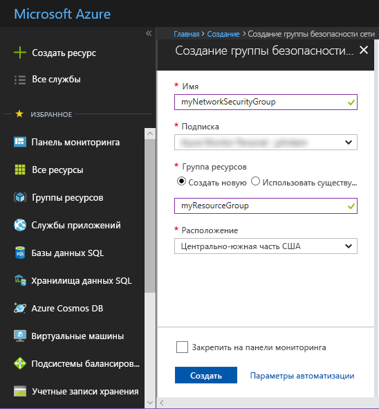
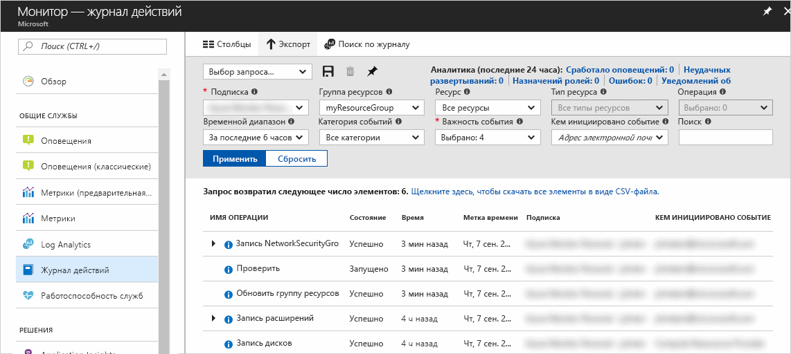
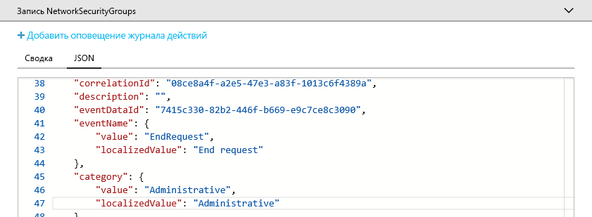
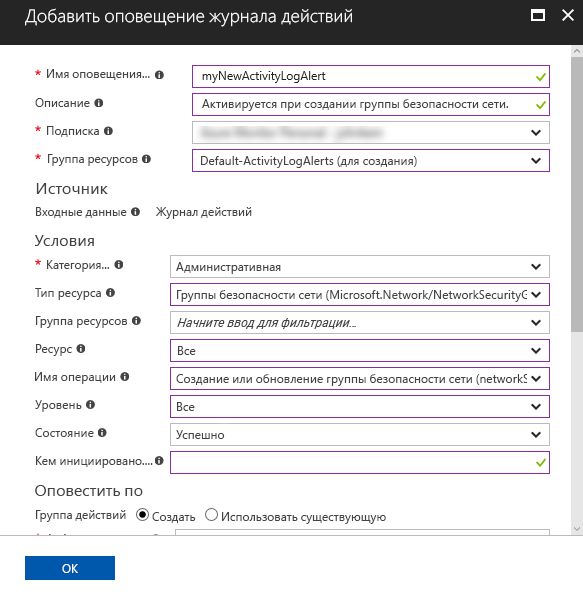
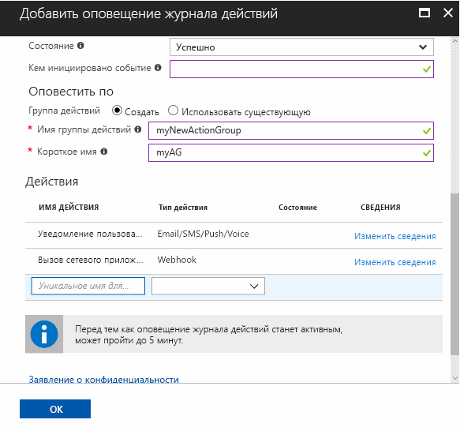

# Аудит и получение уведомлений о важных действиях в подписке Azure

**Журнал действий Azure** содержит события на уровне подписки в Azure. Он предоставляет сведения о том, *кто* создал, обновил или удалил *ресурсы*, а также *когда* это было сделано. Вы можете создать **оповещение журнала действий**, чтобы получать электронные сообщения, текстовые сообщения или уведомления веб-перехватчика при возникновении действия, которое соответствует условиям оповещений. Это краткое руководство содержит сведения о том, как создать простую группу безопасности сети, просмотреть журнал действий, чтобы разобраться в возникающих событиях, а затем создать оповещение журнала действий для получения уведомлений о создании групп безопасности сети в дальнейшем.

Если у вас еще нет подписки Azure, создайте [бесплатную](https://azure.microsoft.com/free/) учетную запись Azure, прежде чем начинать работу.

## Войдите на портал Azure.

Войдите на [портал Azure](https://portal.azure.com/).

## Создание группы безопасности сети

1. Нажмите кнопку **Создать ресурс** в верхнем левом углу окна портала Azure.

2. Выберите **Сеть**, а затем — **Группа безопасности сети**.

3. Введите myNetworkSG в качестве **имени** и создайте группу ресурсов с именем **myResourceGroup**. Нажмите кнопку **Создать** .

    

## Обзор журнала действий на портале

В журнал действий добавлено событие, описывающее процесс создания группы безопасности сети. Используйте указанные ниже инструкции для определения этого события.

1. Нажмите кнопку **Монитор** в списке навигации слева. Откроется раздел "Журнал действий". Этот раздел содержит журнал всех действий, которые пользователи выполняли с ресурсами в вашей подписке, фильтруемый несколькими свойствами, такими как **Группа ресурсов**, **Временной диапазон** и **Категория**.

2. В разделе **Журнал действий** выберите раскрывающийся список **Группа ресурсов**, а затем — **myResourceGroup**. В раскрывающемся списке **Временной диапазон** установите значение **Последний час**. Нажмите кнопку **Применить**.

    

3. Выберите событие **записи NetworkSecurityGroups** в отображаемой таблице событий.

## Обзор событий в журнале действий

Появившийся раздел содержит основные сведения о выполненной операции, включая имя, метку времени, а также сведения о пользователе или приложении, которые выполняли эту операцию.

Выберите вкладку **JSON**, чтобы просмотреть все сведения о событии. Сюда входят сведения о том, как пользователь или приложение были авторизованы для выполнения операции, сведения о категории или уровне событий, а также состоянии операции.

## Создание оповещения журнала действий

1. Выберите вкладку **Сводка**, чтобы вернуться к сводке событий.

2. В отобразившемся разделе сводки выберите **Add activity log alert** (Добавить оповещение журнала действий).

    

3. В отобразившемся разделе укажите имя и описание для оповещения журнала действий.

4. В разделе **Критерий** убедитесь, что для параметра **Категория событий** установлено значение **Административная**, для **Тип ресурса** — значение **Группы безопасности сети**, для **Имя операции** — значение **Create or Update Network Security Group** (Создать или обновить группу безопасности сети), для **Состояние** — значение **Успешно**. Все остальные поля критериев должны быть пустыми или иметь значение **Все**. Критерии определяют правила, позволяющие определить, следует ли активировать оповещение при появлении нового события в журнале событий.

    

5. В разделе **Alert via** (Оповестить по) выберите группу действий **Создать** и укажите **имя** и **краткое имя** для группы действий. Группы действий определяют набор действий, которые следует предпринять при активации оповещения (когда критерий соответствует новому событию).

6. В разделе **Действия** добавьте одно или несколько действий, указав **имя** для действия, а также **тип действия** (например, сообщения электронной почты, текстовые сообщения или уведомление веб-перехватчика) и **сведения** для этого типа действий (например, URL-адрес веб-перехватчика, адрес электронной почты или номер для текстового сообщения).

    

7. Нажмите кнопку **ОК**, чтобы сохранить оповещения журнала действий.

## Тестирование оповещений журнала действий

> [!NOTE]
> Чтобы оповещения журнала действий стали полностью активными, может потребоваться около 5 минут. Новые события, произошедшие до полной активации оповещения журнала действий, не создают уведомления.
>
>

Чтобы проверить оповещения, повторите действия из предыдущего раздела (**Создание группы безопасности сети**), однако назначьте этой группе безопасности сети другое имя и повторно используйте имеющуюся группу ресурсов. В течение нескольких минут вы получите уведомление о создании группы безопасности сети.

## Очистка ресурсов

Удалите группу ресурсов и группу безопасности сети, если они больше не нужны. Для этого введите имя созданной группы ресурсов в поле поиска в верхней части портала, а затем выберите имя группы ресурсов. В отображаемом разделе нажмите кнопку **Удалить группу ресурсов**, введите имя группы ресурсов и выберите **Удалить**.

## Дополнительная информация

В этом кратком руководстве вы выполнили операцию для создания события журнала действий, а затем создали оповещение журнала событий, чтобы получать уведомления при выполнении этой операции в будущем. Затем вы проверили оповещения, выполнив эту операцию повторно. В Azure доступны события журнала действий за последние 90 дней. Если необходимо сохранять события больше 90 дней, попробуйте архивировать данные журнала действий вместе с другими данными наблюдения.

> [!div class="nextstepaction"]
> [Archive Azure monitoring data](./../../azure-monitor/learn/tutorial-archive-data.md) (Архивирование данных мониторинга Azure)

