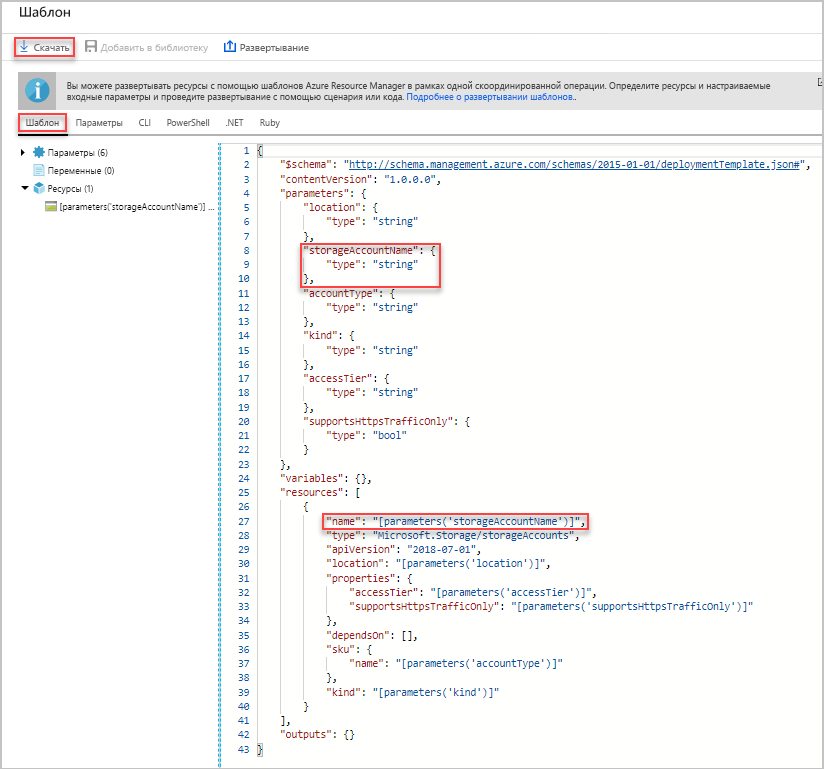
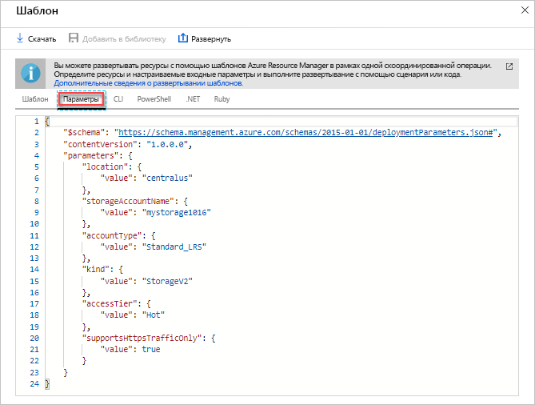
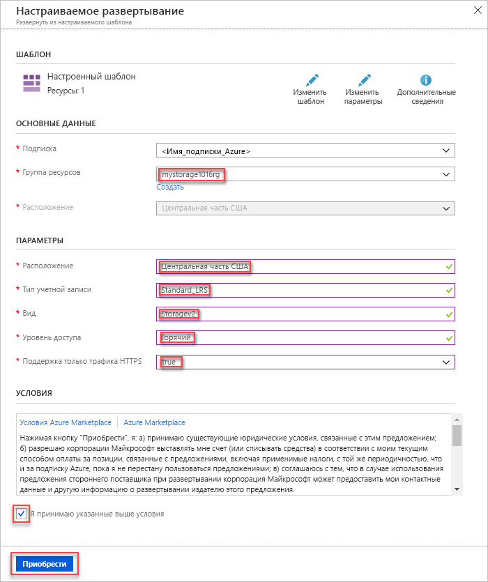
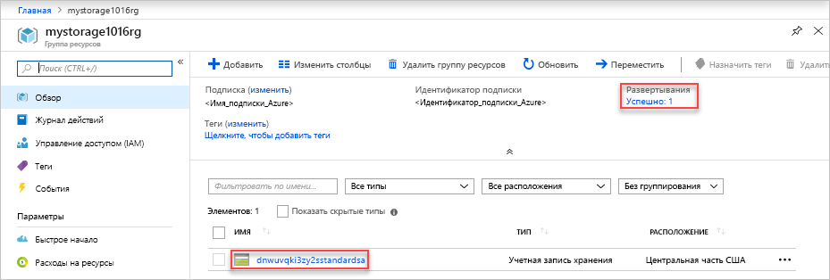

# <a name="quickstart-create-and-deploy-azure-resource-manager-templates-by-using-the-azure-portal"></a>Краткое руководство по созданию и развертыванию шаблонов Azure Resource Manager с помощью портала Azure

Здесь вы узнаете, как создать первый шаблон Azure Resource Manager, а также развернуть и изменить его с помощью портала Azure.

Шаблоны Resource Manager — это JSON-файлы, которые определяют ресурсы, необходимые для развертывания решения. Вам не всегда нужно начинать с нуля, чтобы создать шаблон. Из этого руководства вы узнаете, как создать шаблон на портале Azure. Затем вы сможете настроить и развернуть его.

В этом руководстве приведены инструкции по созданию учетной записи хранения Azure. Эту же процедуру можно использовать и для создания других ресурсов Azure.

Если у вас еще нет подписки Azure, [создайте бесплатную учетную запись Azure](https://azure.microsoft.com/free/), прежде чем начинать работу.

## <a name="generate-a-template-using-the-portal"></a>Создание шаблона с помощью портала

В этом разделе вы создадите учетную запись хранения с помощью портала Azure. Прежде чем развертывать учетную запись хранения, вы можете изучить шаблон, созданный с помощью портала, с учетом своих конфигураций. Вы можете сохранить шаблон и использовать его в будущем.

1. Войдите на [портале Azure](https://portal.azure.com).
2. Последовательно выберите **Создать ресурс** > **Хранилище** > **Учетная запись хранения — BLOB-объект, файл, таблица, очередь**.

    
3. Введите следующие сведения. На следующем шаге выберите значение**Параметры автоматизации** вместо **Создать**. Таким образом вы сможете увидеть шаблон перед развертыванием.

    - **Имя**. Укажите уникальное имя учетной записи хранения. На снимке экрана ниже это имя — *mystorage0626*.
    - **Группа ресурсов**. Создайте новую группу ресурсов Azure с именем по своему выбору. На снимке экрана ниже имя группы ресурсов — *mystorage0626rg*.

    Для остальных свойств можно использовать значения по умолчанию.

    

    > [!NOTE]
    > Перед развертыванием некоторые экспортированные шаблоны требуют изменений.

4. Щелкните **Параметры автоматизации** в нижней части экрана. Шаблон отобразится на вкладке**Шаблон** на портале:

    

    Шаблон отображается на главной панели. Это файл JSON с четырьмя элементами верхнего уровня. Дополнительные сведения см. в статье [Описание структуры и синтаксиса шаблонов Azure Resource Manager](./resource-group-authoring-templates.md).

    В элементе **Параметр** определено пять параметров. Чтобы увидеть значения, указываемые во время развертывания, щелкните вкладку **Параметры**.

    

    Это те значения, которые вы настроили в предыдущем разделе. Вы можете создать учетную запись хранения Azure, используя как шаблон, так и файлы параметров.

5. В верхней части вкладки есть три пункта меню.

    - **Загрузить**. Шаблон и файлы параметров скачиваются на локальный компьютер.
    - **Add to library** (Добавить в библиотеку). Шаблон добавляется в библиотеку для повторного использования в будущем.
    - **Развернуть**. Учетная запись хранения Azure развертывается на портале Azure.

    В этом руководстве рассматривается использование параметра **Add to library** (Добавить в библиотеку).

6. Щелкните **Add to library** (Добавить в библиотеку).
7. Введите **имя** и **описание**, а затем нажмите кнопку **Сохранить**.

> [!NOTE]
> Функция библиотеки шаблонов предоставляется в предварительной версии. Большинство пользователей предпочитают сохранять свои шаблоны на локальном компьютере или в общедоступном хранилище, таком как Github.  

## <a name="edit-and-deploy-the-template"></a>Редактирование и развертывание шаблона

В этом разделе вы откроете сохраненный шаблон из библиотеки шаблонов, отредактируете его на портале и развернете измененный шаблон. Чтобы изменить более сложный шаблон, рекомендуем использовать [Visual Studio Code](./resource-manager-quickstart-create-templates-use-visual-studio-code.md) с более широкими возможностями редактирования.

В Azure требуется, чтобы каждая служба Azure имела уникальное имя. Развертывание завершится сбоем, если ввести имя учетной записи хранения, которое уже существует. Чтобы избежать этого, используйте для создания уникального имени учетной записи хранения вызов функции шаблона (uniquestring()).

1. На портале Azure в меню слева выберите **Все службы**, потом в поле фильтра введите **шаблон**, а затем щелкните **Шаблоны (ПРЕДВАРИТЕЛЬНАЯ ВЕРСИЯ)**.

    
2. Выберите шаблон, сохраненный в предыдущем разделе. Имя, которое используется на снимке экрана, — *mystorage0626*.
3. Щелкните **Изменить**, а затем выберите **Шаблон добавлен**.

    

4. Добавьте элемент **переменные**, а затем — одну переменную, как показано на следующем снимке экрана:

    ```json
    "variables": {
        "storageAccountName": "[concat(uniquestring(resourceGroup().id), 'standardsa')]"
    },
    ```
    

    Здесь используются две функции: *concat()* и *uniqueString()*. Функция uniqueString() позволяет создать уникальное имя для ресурса.

5. Удалите параметр **name**, выделенный на предыдущем снимке экрана.
6. Обновите элемент name ресурса **Microsoft.Storage/storageAccounts**, чтобы использовать новую заданную переменную вместо параметра:

    ```json
    "name": "[variables('storageAccountName')]",
    ```

    Окончательная версия шаблона должна выглядеть так:

    ```json
    {
        "$schema": "https://schema.management.azure.com/schemas/2015-01-01/deploymentTemplate.json#",
        "contentVersion": "1.0.0.0",
        "parameters": {
            "location": {
                "type": "string"
            },
            "accountType": {
                "type": "string"
            },
            "kind": {
                "type": "string"
            },
            "httpsTrafficOnlyEnabled": {
                "type": "bool"
            }
        },
        "variables": {
            "storageAccountName": "[concat(uniquestring(resourceGroup().id), 'standardsa')]"
        },
        "resources": [
            {
                "apiVersion": "2018-02-01",
                "name": "[variables('storageAccountName')]",
                "location": "[parameters('location')]",
                "type": "Microsoft.Storage/storageAccounts",
                "sku": {
                    "name": "[parameters('accountType')]"
                },
                "kind": "[parameters('kind')]",
                "properties": {
                    "supportsHttpsTrafficOnly": "[parameters('httpsTrafficOnlyEnabled')]",
                    "encryption": {
                        "services": {
                            "blob": {
                                "enabled": true
                            },
                            "file": {
                                "enabled": true
                            }
                        },
                        "keySource": "Microsoft.Storage"
                    }
                },
                "dependsOn": []
            }
        ]
    }
    ```
7. Щелкните **ОК**,а затем нажмите кнопку **Сохранить**, чтобы сохранить изменения.
8. Выберите **Развернуть**.
9. Введите следующие значения.

    - **Подписка**. Выберите подписку Azure.
    - **Группа ресурсов**. Укажите уникальное имя для группы ресурсов.
    - **Расположение**. Выберите расположение группы ресурсов.
    - **Расположение**. Выберите расположение учетной записи хранения.  Вы можете выбрать то же расположение, которое используется для группы ресурсов.
    - **Тип учетной записи**. Для этого краткого руководства введите **Standard_LRS**.
    - **Вид**. Для этого краткого руководства введите **Хранилище**.
    - **Https Traffic Only Enabled** (Включен только трафик HTTPS).  Для этого краткого руководства выберите **false**.
    - Выберите **Я принимаю указанные выше условия**.

    Ниже приведен снимок экрана с примером развертывания.

    

10. Щелкните **Приобрести**.
11. Чтобы просмотреть состояние развертывания, щелкните значок колокольчика (уведомления) в верхней части экрана.

    

12. Выберите **Перейти к группе ресурсов** в области уведомлений. Появится приблизительно такой экран:

    

    Вы увидите, что развертывание выполнено успешно и что в группе ресурсов есть только одна учетная запись хранения. Имя учетной записи хранения — это уникальная строка, созданная с помощью шаблона. Дополнительные сведения об использовании учетных записей хранения Azure см. в руководстве по [отправке, скачиванию и составлению списка больших двоичных объектов с помощью портала Azure](../storage/blobs/storage-quickstart-blobs-portal.md).

## <a name="clean-up-resources"></a>Очистка ресурсов

Если ресурсы Azure больше не нужны, их можно удалить. Для этого необходимо удалить группу ресурсов.

1. На портале Azure в меню слева выберите **Группа ресурсов**.
2. В поле **Фильтровать по имени** введите имя группы ресурсов.
3. Выберите имя группы ресурсов.  В группе ресурсов должна быть учетная запись хранения.
4. В главном меню выберите **Удалить группу ресурсов**.

## <a name="next-steps"></a>Дополнительная информация

Из этого руководства вы узнали, как создавать и развертывать шаблоны на портале Azure. В этом кратком руководстве используется простой шаблон с одним ресурсом Azure. Если шаблон является сложным, для его разработки удобнее использовать Visual Studio Code или Visual Studio.

> [!div class="nextstepaction"]
> [Руководство по созданию шаблонов с помощью Visual Studio Code](./resource-manager-quickstart-create-templates-use-visual-studio-code.md)
