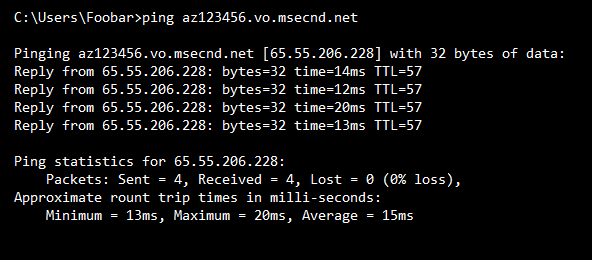
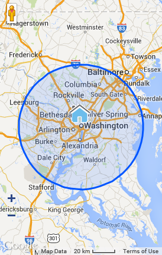
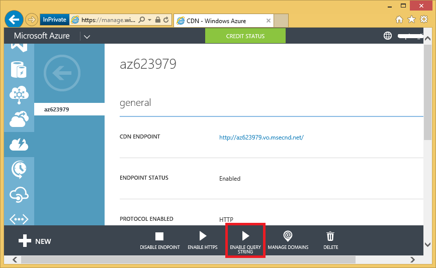
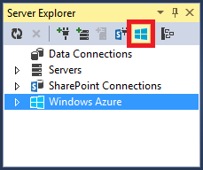
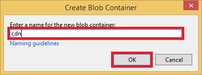
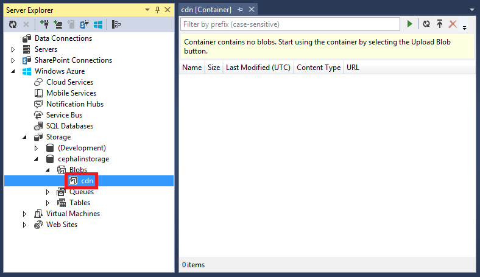
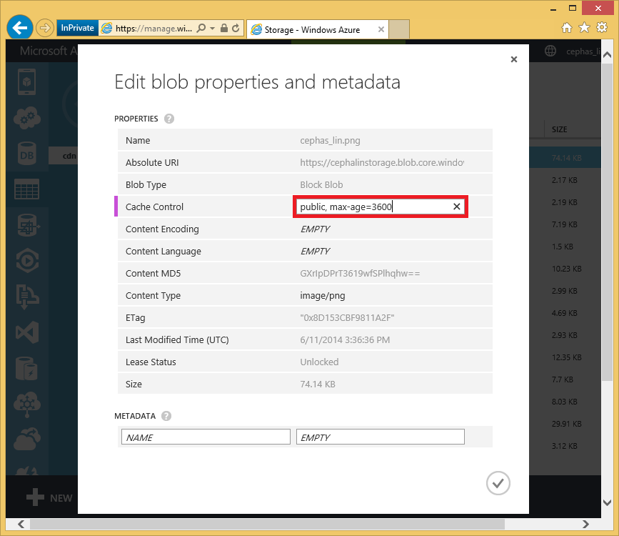

<properties 
	pageTitle="Использование содержимого из CDN Azure в своем веб-приложении" 
	description="В этом учебнике объясняется, как использовать содержимое из CDN для повышения производительности веб-приложения." 
	services="cdn" 
	documentationCenter=".net" 
	authors="cephalin" 
	manager="wpickett" 
	editor="tysonn"/>

<tags 
	ms.service="cdn" 
	ms.workload="web" 
	ms.tgt_pltfrm="na" 
	ms.devlang="dotnet" 
	ms.topic="article" 
	ms.date="02/20/2015" 
	ms.author="cephalin"/>

# Обслуживание содержимого из CDN Azure в вашем веб-приложении #

В этом учебнике показано, как воспользоваться преимуществами Azure CDN для расширения охвата и повышения эффективности своего веб-приложения. Azure CDN поможет увеличить производительность веб-приложения в следующих случаях:

- наличие большого количества ссылок на статическое или полудинамическое содержимое на страницах;
- доступ к приложению осуществляется в глобальном масштабе;
- желание выгрузить трафик с веб-сервера;
- желание сократить количество одновременных клиентских подключений к веб-серверу (этот вопрос активно обсуждается в блоге по [объединению и минификации](http://www.asp.net/mvc/tutorials/mvc-4/bundling-and-minification)); 
- желание увеличить время загрузки и обновления страниц.

## О чем вы узнаете? ##

В этом учебнике рассматриваются следующие темы.

-	[Обслуживание статического содержимого из конечной точки CDN Azure](#deploy)
-	[Автоматизация отправки содержимого из приложения ASP.NET в конечную точку CDN](#upload)
-	[Настройка кэша CDN для отражения требуемого обновления содержимого](#update)
-	[Быстрое обслуживание нового содержимого с помощью строк запросов](#query)

## Необходимые условия ##

Для работы с этим учебником необходимо выполнить следующие условия.

-	Активная [учетная запись Microsoft Azure](/account/). Можно подписаться для получения пробной учетной записи.
-	Visual Studio 2013 с [пакетом SDK для Azure](http://go.microsoft.com/fwlink/p/?linkid=323510&clcid=0x409) для графического пользовательского интерфейса управления большими двоичными объектами.
-	Наличие [Azure PowerShell](http://go.microsoft.com/?linkid=9811175&clcid=0x409) (используется в разделе [Автоматизация отправки содержимого из приложения ASP.NET в конечную точку CDN](#upload)).

> [AZURE.NOTE] Для работы с этим учебником требуется учетная запись Azure.
> + Вы можете [открыть учетную запись Azure бесплатно](/pricing/free-trial/?WT.mc_id=A261C142F) - вы получаете кредиты, которые можно использовать для опробования платных служб Azure, и даже после израсходования кредитов вы сохраняете учетную запись и возможность использовать бесплатные службы Azure, такие как веб-сайты.
> + Вы имеете возможность [активировать преимущества подписчика MSDN](/pricing/member-offers/msdn-benefits-details/) - ваша подписка MSDN каждый месяц приносит вам кредиты, которые можно использовать для оплаты за службы Azure.

## Обслуживание статического содержимого из конечной точки CDN Azure ##

В этом разделе содержится информация о создании конечной точки CDN и ее использовании для обслуживания статического содержимого. Для этого необходимо выполнить следующие основные действия.

1. Создание учетной записи хранения
2. Создание конечной точки CDN, связанной с учетной записью хранения
3. Создание контейнера BLOB-объектов в учетной записи хранения
4. Отправка содержимого в контейнер BLOB-объектов
5. Ссылка на отправленное содержимое с помощью URL-адреса CDN

Рассмотрим их подробнее. Чтобы начать использовать CDN Azure, выполните следующие действия.

1. Чтобы создать конечную точку CDN, войдите на [портал управления Azure](http://manage.windowsazure.com/). 
1. Создайте учетную запись хранения, последовательно выбрав **Создать > Службы данных > Хранилище > Быстрое создание**. Укажите URL-адрес, расположение и нажмите кнопку **Создать учетную запись хранения**. 

	

	>[AZURE.NOTE] Обратите внимание, что в качестве региона выбрана Восточная Азия, так как тестирование CDN из Северной Америки было бы весьма затруднительно.

2. После перевода новой учетной записи хранения в состояние **В сети** создайте конечную точку CDN, привязанную к учетной записи хранения. Последовательно выберите **Создать > Службы приложений > CDN > Быстрое создание**. Выберите созданную учетную запись хранения и нажмите кнопку **Создать**.

	

	>[AZURE.NOTE] После того как будет создана CDN, на портале Azure отобразится ее URL-адрес и связанный исходный домен. Полное распространение конфигурации конечной точки CDN во все расположения узлов может занять некоторое время.  

3. Убедитесь, что конечная точка CDN находится в оперативном режиме, отправив ей команду ping. Если распространение конечной точки CDN не произошло, появится сообщение, аналогичное приведенному ниже.

	

	Подождите час и повторите тестирование. После того, как распространение конечной точки CDN на узлы будет завершено, она должна ответить на ping-запросы.

	

4. На этом этапе уже можно увидеть, какой узел CDN был определен конечной точкой CDN в качестве ближайшего. Этот настольный компьютер получил ответ с IP-адреса **93.184.215.201**. Если его ввести на сайте [www.ip-address.org](http://www.ip-address.org), станет ясно, что сервер находится в Вашингтоне.

	

	Список всех расположений узлов CDN см. в разделе [Расположение узлов сети доставки содержимого Azure (CDN)](http://msdn.microsoft.com/library/azure/gg680302.aspx).

3. На портале Azure откройте вкладку **CDN** и щелкните имя только что созданной конечной точки CDN.

	

3. Щелкните **Включить поддержку строк запроса**, чтобы включить поддержку строк запроса в кэше CDN Azure. После этого те же самые ссылки, доступ к которым осуществляется с помощью разных строк запроса, будут кэшироваться как отдельные записи.

	

	>[AZURE.NOTE] Несмотря на то, что включение поддержки строк запроса является необязательной процедурой на этом этапе, возможно, вы захотите выполнить ее как можно раньше (для удобства), так как распространение любого изменения на остальные узлы занимает определенное время, а вы не хотите засорять кэш CDN содержимым без поддержки строк запроса (обновление содержимого CDN будет рассматриваться позже). Сведения об использовании этих преимуществ см. в разделе [Быстрое обслуживание нового содержимого с помощью строк запросов](#query).

6. В Visual Studio 2013, в обозревателе серверов, нажмите кнопку **Подключение к Windows Azure**.

	

7.  Следуйте указаниям по входу в учетную запись Azure. 
8.  Выполнив вход, последовательно выберите **Windows Azure > Хранилище > ваша учетная запись**. Правой кнопкой мыши щелкните **BLOB**-объект, а затем выберите пункт **Создать контейнер BLOB-объектов**.

	

8.	Укажите имя контейнера BLOB-объектов, а затем нажмите кнопку **ОК**.

	

9.	В обозревателе серверов дважды щелкните созданный контейнер BLOB-объектов, чтобы выполнить действия по управлению. На центральной панели появится интерфейс управления.

	

10.	Нажмите кнопку **Отправить BLOB-объект**, чтобы отправить используемые веб-страницами образы, скрипты или таблицы стилей в контейнер BLOB-объектов. Процесс отправки будет отображаться в **журнале изменений Windows Azure**. Переданные BLOB-объекты появятся в представлении контейнера. 

	

11.	Теперь к отправленным BLOB-объектам можно предоставить общий доступ. В обозревателе серверов щелкните контейнер правой кнопкой мыши и выберите пункт **Свойства**. Задайте для свойства **Общий доступ на чтение** значение **BLOB-объект**.

	

12.	Протестируйте общий доступ к BLOB-объектам, перейдя по URL-адресу одного из BLOB-объектов в браузере. Например, можно протестировать первый образ в списке отправленного содержимого с помощью `http://cephalinstorage.blob.core.windows.net/cdn/cephas_lin.png`.

	Обратите внимание, что при этом не используется HTTPS-адрес, указанный в интерфейсе управления BLOB-объектами в Visual Studio. С помощью HTTP выполняется проверка общего доступа к содержимому, что является требованием для Azure CDN.

13.	Если BLOB-объект отображается в браузере надлежащим образом, замените URL-адрес с `http://<yourStorageAccountName>.blob.core.windows.net` на URL-адрес Azure CDN. В приведенном примере для тестирования первого образа в конечной точке CDN используется `http://az623979.vo.msecnd.net/cdn/cephas_lin.png`.

	>[AZURE.NOTE] URL-адрес конечной точки CDN можно найти на портале управления Azure, на вкладке CDN.

	Если сравнить эффективность прямого доступа к BLOB-объекту и доступа CDN, можно увидеть, что использование Azure CDN способствует повышению производительности. Ниже приводится снимок экрана со средствами разработки, открывающимися в Internet Explorer 11 при нажатии клавиши F12, для доступа к образу по URL-адресу BLOB-объекта

	

	и для доступа к тому же образу по URL-адресу CDN 

	

 	Обратите внимание на цифры для значения времени **Запрос**, которые означают время до получения первого байта или время, затраченное на отправку запроса и получение первого ответа от сервера. Время доступа к BLOB-объекту, размещенному в Восточной Азии, составляет 266 мс, поскольку чтобы только добраться до сервера запросу приходится пересекать весь Тихий океан. Однако время доступа к Azure CDN сокращено до 16 мс, что означает практически **20-кратное увеличение производительности**!
	
15.	Теперь нужно просто воспользоваться новой ссылкой на веб-странице. Например, можно добавить следующий тег образа:

		

Из этого раздела вы узнали, как создать конечную точку CDN, отправить в нее содержимое и перейти к содержимому CDN с любой веб-страницы.

## Автоматизация отправки содержимого из приложения ASP.NET в конечную точку CDN ##

Чтобы без труда отправлять все статическое содержимое из приложения ASP.NET в конечную точку или развертывать веб-приложение с помощью непрерывной доставки (пример см. в разделе [Непрерывная доставка для облачных служб в Azure](cloud-services-dotnet-continuous-delivery.md)), можно воспользоваться Azure PowerShell и автоматизировать синхронизацию последних файлов содержимого с BLOB-объектами Azure при каждом развертывании веб-приложения. Например, можно выполнить скрипт из раздела [Отправка файлов содержимого из приложения ASP.NET в BLOB-объекты Azure](http://gallery.technet.microsoft.com/scriptcenter/Upload-Content-Files-from-41c2142a), чтобы отправить все файлы содержимого в приложение ASP.NET. Использование скрипта

4. Из меню **Пуск** запустите **Microsoft Azure PowerShell**.
5. В окне Azure PowerShell запустите `Get-AzurePublishSettingsFile`, чтобы скачать файл параметров публикации для учетной записи Azure.
6. После загрузки файла параметров публикации выполните 

		Import-AzurePublishSettingsFile "<путь_к_скачанному_файлу>"

	>[AZURE.NOTE] Импортированный файл параметров публикации будет выступать в качестве учетной записи Azure по умолчанию, используемой для всех сеансов Azure PowerShell. Это значит, что приведенные выше действия нужно выполнить только один раз.
	
1. Скачайте скрипт со [страницы скачивания](http://gallery.technet.microsoft.com/scriptcenter/Upload-Content-Files-from-41c2142a). Сохраните его в папке проекта приложения ASP.NET.
2. Щелкните скачанный скрипт правой кнопкой мыши и выберите пункт **Свойства**.
3. Щелкните **Разблокировать**.
4. Откройте PowerShell и запустите следующий файл:

		cd <папка_проекта>
		.\UploadContentToAzureBlobs.ps1 -StorageAccount "<имя_вашей_учетной_записи_хранения>" -StorageContainer "<имя_вашего_контейнера>"

Этот скрипт отправит все файлы из папок \Content и \Scripts в указанную учетную запись хранения и контейнер. Это дает следующие преимущества:

-	автоматическая репликация файловой структуры проекта Visual Studio;
-	автоматическое создание контейнеров BLOB-объектов;
-	многократное использование одной и той же учетной записи хранения Azure и конечной точки CDN для нескольких веб-приложений, находящихся в отдельных контейнерах BLOB-объектов;
-	простое обновление Azure CDN новым содержимым. Дополнительные сведения об обновлении содержимого см. в разделе [Настройка кэша CDN для отражения требуемого обновления содержимого](#update).

Для параметра -StorageContainer рекомендуется использовать имя веб-приложения или имя проекта Visual Studio. Ранее в качестве имени контейнера использовалось общее название "CDN". А за счет применения имени веб-приложения связанное содержимое можно упорядочивать в том же легко идентифицируемом контейнере.

Отправленное содержимое можно связать с любым объектом в папке \Content и \Scripts в коде HTML, например в файлах CSHTML, с помощью `http://<yourCDNName>.vo.msecnd.net/<containerName>`. Ниже приведен пример использования в представлении Razor. 

	

Пример интеграции скриптов PowerShell в конфигурацию непрерывной доставки см. в разделе [Непрерывная доставка для облачных служб в Azure](cloud-services-dotnet-continuous-delivery.md). 

## Настройка кэша CDN для отражения требуемого обновления содержимого ##

Предположим, что после отправки статических файлов из веб-приложения в контейнер BLOB-объектов вы вносите изменение в один из файлов проекта и снова отправляете его в контейнер BLOB-объектов. Вы можете подумать, что он будет автоматически обновлен в конечной точке, однако будете озадачены тем, что при переходе по URL-адресу к содержимому обновление не отражается. 

На самом деле CDN действительно автоматически обновляется из хранилища BLOB-объектов, но при этом к содержимому применяется 7-дневное правило кэширования по умолчанию. Это значит, что как только узел CDN получает содержимое из хранилища BLOB-объектов, оно обновляется только по истечении срока действия в кэше.

Хорошо, что срок действия кэша можно настроить. Как и большинство браузеров, Azure CDN учитывает срок действия, указанный в заголовке Cache-Control содержимого. Чтобы задать настраиваемое значение заголовка Cache-Control, перейдите в контейнер BLOB-объектов на портале Azure и измените свойства BLOB-объекта. На приведенном ниже снимке экрана для срока действия кэша установлен 1 час (3600 секунд). 

Задать все заголовки Cache-Control всех BLOB-объектов можно с помощью скрипта PowerShell. Найдите следующий фрагмент кода для скрипта в разделе [Автоматизация отправки содержимого из приложения ASP.NET в конечную точку CDN](#upload):

    Set-AzureStorageBlobContent `
        -Container $StorageContainer `
        -Context $context `
        -File $file.FullName `
        -Blob $blobFileName `
        -Properties @{ContentType=$contentType} `
        -Force

и измените его следующим образом:  

    Set-AzureStorageBlobContent `
        -Container $StorageContainer `
        -Context $context `
        -File $file.FullName `
        -Blob $blobFileName `
        -Properties @{ContentType=$contentType; CacheControl="public, max-age=3600"} `
        -Force

Возможно, вам все-таки придется дождаться окончания 7-дневного срока действия кэшированного содержимого в конечной точке Azure CDN, прежде чем будет получено новое содержимое с новым заголовком Cache-Control. Это ясно показывает, что настраиваемые значения кэширования не действуют для немедленного применения обновлений содержимого, например обновлений JavaScript или CSS. Но эту проблему можно обойти путем переименования файлов или изменения их версий с помощью строк запроса. Дополнительные сведения см. в разделе [Быстрое обслуживание нового содержимого с помощью строк запросов](#query).

Конечно, иногда кэширование уместно и полезно. Например, у вас есть содержимое, которое не требует частого обновления (например, игры предстоящего Чемпионата мира могут обновляться каждые 3 часа), но использует достаточный объем глобального трафика, который нужно выгрузить с вашего веб-сервера В таком случае рекомендуется обратиться к кэшированию Azure CDN.

## Быстрое обслуживание нового содержимого с помощью строк запросов ##

В Azure CDN можно включить поддержку строк запросов, чтобы содержимое по URL-адресам с определенными строками запросов кэшировалось отдельно. Эта функция эффективна в случае, если требуется немедленно отправить определенные обновления содержимого в клиентские браузеры, а не ждать истечения срока действия кэшированного содержимого CDN. Предположим, что выполняется публикация веб-станицы с номером версии в URL-адресе.  
<pre class="prettyprint">
&lt;link href=&quot;http://az623979.vo.msecnd.net/MyMvcApp/Content/bootstrap.css<mark>?v=3.0.0</mark>&quot; rel=&quot;stylesheet&quot;/&gt;
</pre>

Когда я публикую обновление CSS и использую другой номер версии в URL-адресе CSS:  
<pre class="prettyprint">
&lt;link href=&quot;http://az623979.vo.msecnd.net/MyMvcApp/Content/bootstrap.css<mark>?v=3.1.1</mark>&quot; rel=&quot;stylesheet&quot;/&gt;
</pre>

В конечной точке CDN с включенной поддержкой строк запросов два URL-адреса являются уникальными, и к веб-серверу будет отправлен новый запрос для получения нового *bootstrap.css*. В конечной точке CDN без включенной поддержки строк запросов два URL-адреса будут одинаковыми, и точка просто обслужит кэшированное содержимое *bootstrap.css*. 

Затем нужно сделать так, чтобы номер версии обновлялся автоматически. В Visual Studio с этим все просто. В файле CSHTML, где будет использоваться указанная выше ссылка, можно указать номер версии на основе номера сборки.  
<pre class="prettyprint">
@{
    <mark>var cdnVersion = System.Reflection.Assembly.GetAssembly(
        typeof(MyMvcApp.Controllers.HomeController))
        .GetName().Version.ToString();</mark>
}

...

&lt;link href=&quot;http://az623979.vo.msecnd.net/MyMvcApp/Content/bootstrap.css<mark>?v=@cdnVersion</mark>&quot; rel=&quot;stylesheet&quot;/&gt;
</pre>

Если номер сборки меняется в ходе каждого цикла публикации, каждый раз при публикации веб-приложению присваивается уникальный номер версии, который сохраняется до следующего цикла публикации. Или можно настроить Visual Studio для автоматического увеличения номера версии сборки при каждом создании веб-приложения. Для этого нужно открыть *Properties\AssemblyInfo.cs* в проекте Visual Studio и применить "*" в `AssemblyVersion`. Например:

	[assembly: AssemblyVersion("1.0.0.*")]

## А как же объединенные в пакет сценарии и таблицы стилей в ASP.NET? ##

Работая с [веб-сайтами Azure](/services/websites/) и [облачными службами Azure](/services/cloud-services/), вы получаете лучшую интеграцию Azure CDN благодаря [объединению и минификации ASP.NET](http://www.asp.net/mvc/tutorials/mvc-4/bundling-and-minification). 

Интеграция Azure CDN с веб-сайтами Azure или облачными службами Azure предоставляет следующие преимущества:

- Интеграция развертывания содержимого (изображений, скриптов и таблиц стилей) в процесс [непрерывного развертывания](web-sites-publish-source-control.md) веб-сайта Azure.
- Простое обновление пакетов NuGet, обслуживаемых CDN, например версий на основе jQuery или Bootstrap. 
- Управление веб-приложениями и содержимым, обслуживаемым CDN, из одного интерфейса Visual Studio.

Связанные учебники:
- [Интеграция веб-сайта Azure с Azure CDN](cdn-websites-with-cdn.md)
- [Интеграция облачной службы с Azure CDN](cdn-cloud-service-with-cdn.md)

Без интеграции с веб-сайтами Azure или облачными службами Azure использовать Azure CDN для пакетов сценариев можно со следующими разъяснениями:

- Необходимо вручную отправить связывающие скрипты в хранилище BLOB-объектов. Программное решение доступно на сайте [stackoverflow](http://stackoverflow.com/a/13736433).
- В файлах CSHTML следует преобразовать теги script и CSS для использования Azure CDN. Например:

		@Html.Raw(Styles.Render("~/Content/css").ToString().Insert(0, "http://<имя_CDN>.vo.msecnd.net"))

# Дополнительные сведения #
- [Общие сведения о сети доставки содержимого (CDN) Azure](http://msdn.microsoft.com/library/azure/ff919703.aspx)
- [Интеграция веб-сайта Azure с Azure CDN](cdn-websites-with-cdn.md)
- [Интеграция облачной службы с Azure CDN](cdn-cloud-service-with-cdn.md)
- [Сопоставление содержимого сети доставки содержимого (CDN) с личным доменом](http://msdn.microsoft.com/library/azure/gg680307.aspx)
- [Использование CDN для Azure](cdn-how-to-use.md)

<!--HONumber=49-->