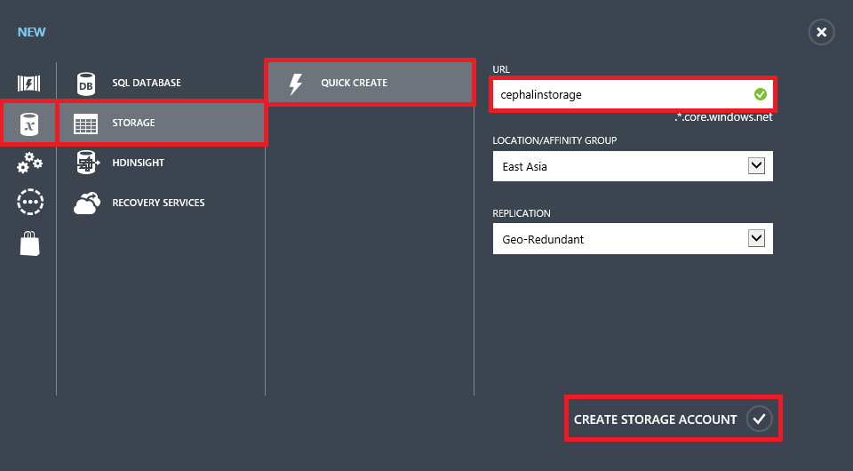
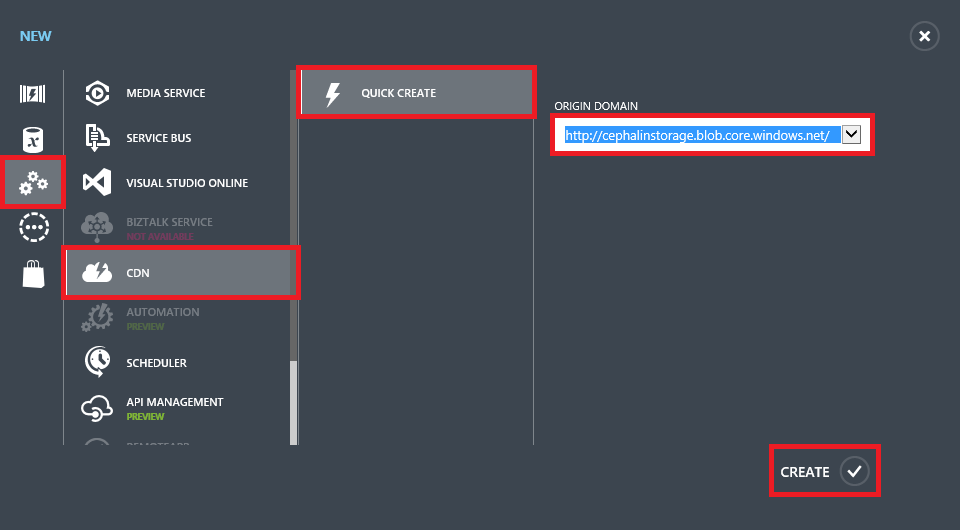
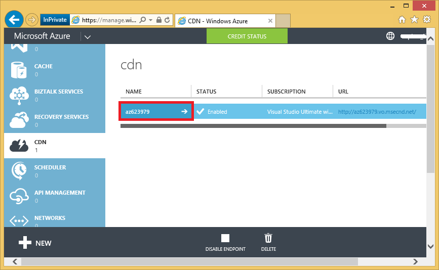
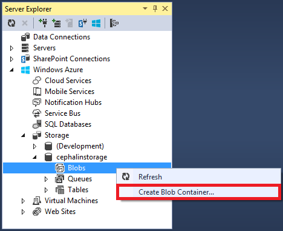
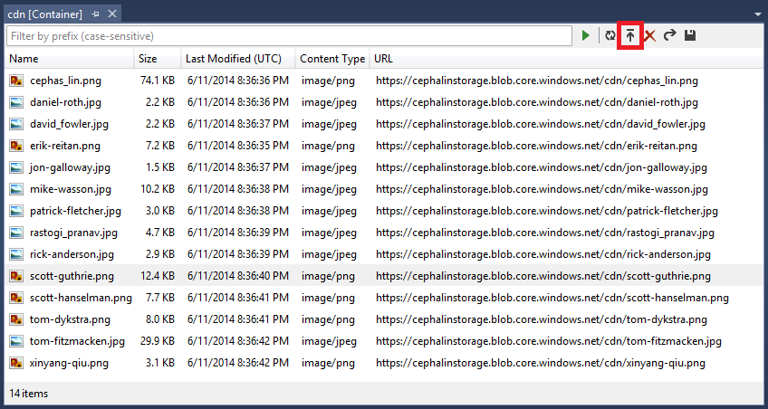
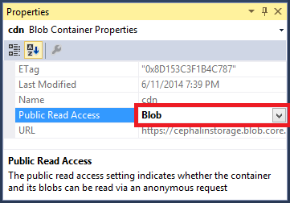

<properties urlDisplayName="Use Content from a CDN in Your Web Application" pageTitle="Использование содержимого из CDN Azure в своем веб-приложении" metaKeywords="Azure tutorial, Azure web app tutorial, ASP.NET, CDN" description="В этом учебнике объясняется, как использовать содержимое из CDN для повышения производительности веб-приложения." metaCanonical="" services="cdn" documentationCenter=".NET" title="Use Content from a CDN in Your Web Application" authors="cephalin" solutions="" manager="wpickett" editor="tysonn" />

<tags ms.service="cdn" ms.workload="web" ms.tgt_pltfrm="na" ms.devlang="dotnet" ms.topic="article" ms.date="10/02/2014" ms.author="cephalin" />

# Обслуживание содержимого из CDN Azure в вашем веб-приложении #

В этом учебнике показано, как воспользоваться преимуществами Azure CDN для расширения охвата и повышения эффективности своего веб-приложения. Azure CDN поможет увеличить производительность веб-приложения в следующих случаях:

- наличие большого количества ссылок на статическое или полудинамическое содержимое на страницах;
- доступ к приложению осуществляется в глобальном масштабе;
- желание выгрузить трафик с веб-сервера;
- желание сократить количество одновременных клиентских подключений к веб-серверу (этот вопрос активно обсуждается в блоге [Bundling and Minification](http://www.asp.net/mvc/tutorials/mvc-4/bundling-and-minification)) );
- желание увеличить время загрузки и обновления страниц.

## Новые знания ##

В этом учебнике рассматриваются следующие темы.

-	[Обслуживание статического содержимого из конечной точки CDN Azure](#deploy)
-	[Автоматизация отправки содержимого из приложения ASP.NET в конечную точку CDN](#upload)
-	[Настройка кэша CDN для отражения требуемого обновления содержимого](#update)
-	[Быстрое обслуживание нового содержимого с помощью строк запросов](#query)

## Необходимые условия ##

Для работы с этим учебником необходимо выполнить следующие условия.

-	Активная учетная запись [Microsoft Azure](http://azure.microsoft.com/ru-ru/account/). Можно подписаться для получения пробной учетной записи.
-	Visual Studio 2013 с [пакетом SDK для Azure](http://go.microsoft.com/fwlink/p/?linkid=323510&clcid=0x409) для графического пользовательского интерфейса управления большими двоичными объектами.
Наличие -	[Azure PowerShell](http://go.microsoft.com/?linkid=9811175&clcid=0x409) (используется в разделе [Автоматизация отправки содержимого из приложения ASP.NET в конечную точку CDN](#upload)).

  
  <h5>Для работы с этим учебником требуется учетная запись Azure.</h5>
  <ul>
    <li>Вы можете <a href="http://azure.microsoft.com/ru-ru/pricing/free-trial/?WT.mc_id=A261C142F">открыть учетную запись Azure бесплатно</a> - вы получаете кредиты, которые можно использовать для опробования платных служб Azure, и даже после израсходования кредитов вы сохраняете учетную запись и возможность использовать бесплатные службы Azure, например веб-сайты.</li>
    <li>Вы имеете возможность <a href="http://azure.microsoft.com/ru-ru/pricing/member-offers/msdn-benefits-details/?WT.mc_id=A261C142F">активировать преимущества подписчика MSDN</a> - ваша подписка MSDN каждый месяц приносит вам кредиты, которые можно использовать для оплаты служб Azure.</li>
  <ul>

## Обслуживание статического содержимого из конечной точки CDN Azure ##

В этом разделе содержится информация о создании конечной точки CDN и ее использовании для обслуживания статического содержимого. Для этого необходимо выполнить следующие основные действия:

1. Создание учетной записи хранения
2. Создание конечной точки CDN, связанной с учетной записью хранения
3. Создание контейнера BLOB-объектов в учетной записи хранения
4. Отправка содержимого в контейнер BLOB-объектов
5. Ссылка на отправленное содержимое с помощью URL-адреса CDN

Рассмотрим их подробнее. Вот что нужно сделать, чтобы начать использовать Azure CDN:

1. Чтобы создать конечную точку CDN, войдите на [портал управления Azure](http://manage.windowsazure.com/). 
1. Создайте учетную запись хранения, последовательно выбрав **Создать -> Службы данных -> Хранилище -> Быстрое создание**. Укажите URL-адрес и расположение, затем нажмите кнопку **Создать учетную запись хранения**. 

	

	>[WACOM.NOTE] Обратите внимание, что в качестве региона выбрана Восточная Азия, так как тестирование CDN из Северной Америки было бы весьма затруднительно.

2. После перевода новой учетной записи хранения в состояние **В сети** создайте конечную точку CDN, привязанную к учетной записи хранения. Последовательно выберите **Создать > Службы приложений > CDN > Быстрое создание**. Выберите созданную учетную запись хранения и нажмите кнопку **Создать**.

	

	>[WACOM.NOTE] После того, как будет создана CDN, на портале Azure отобразится ее URL-адрес и связанный исходный домен. Однако полное распространение конфигурации конечной точки CDN во все расположения узлов может занять некоторое время.  

3. Убедитесь, что конечная точка CDN находится в оперативном режиме, проверив связь с ней. Если распространение конечной точки CDN на все узлы не произошло, появится сообщение, аналогичное приведенному ниже.

	

	Подождите час и повторите тестирование. После того, как распространение конечной точки CDN на узлы будет завершено, она должна ответить на запросы проверки связи.

	

4. На этом этапе уже можно увидеть, какой узел CDN был определен конечной точкой CDN в качестве ближайшего. Этот настольный компьютер получил ответ с IP-адреса **93.184.215.201**. Если его ввести на сайте [www.ip-address.org](http://www.ip-address.org), станет ясно, что сервер находится в Вашингтоне, округ Колумбия.

	

	Список всех местоположений узлов CDN см. в разделе [Расположение узлов сети доставки содержимого Azure (CDN)](http://msdn.microsoft.com/ru-ru/library/azure/gg680302.aspx).

3. На портале Azure откройте вкладку **CDN** и щелкните имя только что созданной конечной точки CDN.

	

3. Щелкните **Включить поддержку строк запросов**, чтобы включать строки запроса в кэш Azure CDN. После этого те же самые ссылки, доступ к которым осуществляется с помощью разных строк запроса, будут кэшироваться как отдельные записи.

	

	>[WACOM.NOTE] Несмотря на то, что включение поддержки строк запроса является необязательной процедурой на этом этапе, возможно, вы захотите выполнить ее как можно раньше (для удобства), так как распространение любого изменения на остальные узлы занимает определенное время, а вы не хотите засорять кэш CDN содержимым без поддержки строк запроса (обновление содержания CDN будет рассматриваться позже). Информацию об использовании этих преимуществ см. в разделе [Быстрое обслуживание нового содержимого с помощью строк запросов](#query).

6. В Visual Studio 2013 в обозревателе сервера нажмите кнопку **Подключение к Windows Azure**.

	

7.  Следуйте указаниям по входу в учетную запись Azure. 
8.  Выполнив вход, последовательно выберите **Windows Azure -> Хранилище -> ваша учетная_запись**. Правой кнопкой мыши щелкните **Blob** (Большой двоичный объект), а затем выберите **Create Blob Container** (Создать контейнер больших двоичных объектов).

	

8.	Укажите имя контейнера больших двоичных объектов, а затем нажмите кнопку **ОК**.

	

9.	В обозревателе сервера дважды щелкните созданный контейнер больших двоичных объектов, чтобы перейти к управлению им. На центральной панели появится интерфейс управления.

	

10.	Нажмите кнопку **Upload Blob** (Отправить большой двоичный объект), чтобы отправить используемые веб-страницами изображения, сценарии или таблицы стилей в контейнер больших двоичных объектов. Процесс отправки будет отображаться в **журнале действий Microsoft Azure**. Переданные большие двоичные объекты появятся в представлении контейнера. 

	

11.	Теперь к переданным большим двоичным объектам можно предоставить общий доступ. В обозревателе серверов щелкните контейнер правой кнопкой мыши и выберите пункт **Свойства**. Задайте для свойства **Public Read Access** (Общий доступ на чтение) значение **Blob** (Большой двоичный объект).

	

12.	Протестируйте общий доступ к своим большим двоичным объектам, перейдя по URL-адресу одного из них в браузере. Например, я могу проверить первое изображение в переданном списке с помощью `http://cephalinstorage.blob.core.windows.net/cdn/cephas_lin.png`.

	Обратите внимание, что при этом не используется HTTPS-адрес, указанный в интерфейсе управления большими двоичными объектами в Visual Studio. С помощью HTTP вы проверяете, общедоступно ли содержимое, что обязательно для Azure CDN.

13.	Если большой двоичный объект правильно отображается в браузере, измените URL-адрес с `http://<ваша_учетная_запись_хранения>.blob.core.windows.net` на URL-адрес Azure CDN. В моем случае, чтобы проверить первое изображение в конечной точке CDN, я воспользуюсь `http://az623979.vo.msecnd.net/cdn/cephas_lin.png`.

	>[WACOM.NOTE] URL-адрес конечной точки CDN можно найти на портале управления Azure, на вкладке CDN.

	Если сравнить эффективность прямого доступа к большому двоичному объекту и доступа CDN, можно увидеть, что использование Azure CDN способствует повышению производительности. Ниже приведен снимок экрана с инструментами разработки, открывающимися в Internet Explorer 11 при нажатии клавиши F12, для доступа к изображению по URL-адресу большого двоичного объекта:

	

	и для доступа к тому же образу по URL-адресу CDN 

	

 	Обратите внимание на цифры значения времени **Запрос**, которые означают время до получения первого байта или время, затраченное на отправку запроса и получение первого ответа от сервера. Время доступа к BLOB-объекту, размещенному в Восточной Азии, составляет 266 мс, поскольку чтобы только добраться до сервера запросу приходится пересекать весь Тихий океан. Однако время доступа к Azure CDN уменьшено до 16 мс, что означает практически **20-кратное увеличение производительности**!
	
15.	Теперь нужно просто воспользоваться новой ссылкой на веб-странице. Например, я могу добавить следующий тег изображения:

		

Из этого раздела вы узнали, как создать конечную точку CDN, отправить в нее содержимое и перейти к содержимому CDN с любой веб-страницы.

## Автоматизация отправки содержимого из приложения ASP.NET в конечную точку CDN ##

Чтобы без труда отправлять все статическое содержимое из приложения ASP.NET в конечную точку или развертывать веб-приложение с помощью непрерывной доставки (пример см. в разделе [Непрерывная доставка для облачных служб в Azure](http://azure.microsoft.com/ru-ru/documentation/articles/cloud-services-dotnet-continuous-delivery/)), можно воспользоваться Azure PowerShell и автоматизировать синхронизацию последних файлов содержимого с большими двоичными объектами Azure при каждом развертывании веб-приложения. Например, можно выполнить скрипт из раздела [Отправка файлов содержимого из приложения ASP.NET в BLOB-объекты Azure](http://gallery.technet.microsoft.com/scriptcenter/Upload-Content-Files-from-41c2142a), чтобы отправить все файлы содержимого в приложение ASP.NET. Вот как можно использовать этот сценарий:

4.  В меню **Пуск** выберите **Windows Azure PowerShell**.
5. В окне Azure PowerShell выполните `Get-AzurePublishSettingsFile`, чтобы скачать файл параметров публикации для своей учетной записи Azure.
6. После загрузки файла параметров публикации выполните 

		Import-AzurePublishSettingsFile "<yourDownloadedFilePath>"

	>[WACOM.NOTE] Импортированный файл параметров публикации будет выступать в качестве учетной записи Azure по умолчанию, используемой для всех сеансов Azure PowerShell. Это значит, что приведенные выше действия нужно выполнить только один раз.
	
1. Скачайте сценарий на [странице скачивания] ((http://gallery.technet.microsoft.com/scriptcenter/Upload-Content-Files-from-41c2142a)). Сохраните этот файл в папке проекта приложения ASP.NET.
2. Щелкните загруженный сценарий правой кнопкой мыши и выберите **Свойства**.
3. Щелкните **Разблокировать**.
4. Откройте PowerShell и запустите следующий файл:

		cd <ProjectFolder>
		.\UploadContentToAzureBlobs.ps1 -StorageAccount "<yourStorageAccountName>" -StorageContainer "<yourContainerName>"

Этот сценарий передаст все файлы из папок *\Content* и *\Scripts* в указанную учетную запись хранения и контейнер. Это дает следующие преимущества:

-	автоматическая репликация файловой структуры проекта Visual Studio;
-	автоматическое создание контейнеров BLOB-объектов;
-	многократное использование одной и той же учетной записи хранения Azure и конечной точки CDN для нескольких веб-приложений, находящихся в отдельных контейнерах BLOB-объектов;
-	Простое обновление Azure CDN новым содержимым. Дополнительную информацию об обновлении содержимого см. в разделе [Настройка кэша CDN для отражения требуемого обновления содержимого](#update).

Для параметра `-StorageContainer` рекомендуется использовать имя своего веб-приложения или имя проекта Visual Studio. Ранее в качестве имени контейнера использовалось общее название "cdn". А за счет применения имени веб-приложения связанное содержимое вы можете упорядочивать в том же легко идентифицируемом контейнере.

Отправленное содержимое можно связать с любым объектом в папке *\Content* и *\Scripts* в коде HTML, например в CSHTML-файлах, с помощью `http://<имя_CDN>.vo.msecnd.net/<имя_контейнера>`. Ниже приведен пример использования в представлении Razor: 

	

Пример интеграции сценариев PowerShell в конфигурацию непрерывной доставки см. в разделе [Непрерывная доставка для облачных служб в Azure](http://azure.microsoft.com/ru-ru/documentation/articles/cloud-services-dotnet-continuous-delivery/). 

## Настройка кэша CDN для отражения требуемого обновления содержимого ##

Предположим, что после отправки статических файлов из веб-приложения в контейнер больших двоичных объектов вы вносите изменение в один из файлов проекта и снова отправляете его в контейнер больших двоичных объектов. Вы можете подумать, что он будет автоматически обновлен в конечной точке CDN, однако будете озадачены тем, что при переходе по URL-адресу CDN к содержимому обновление не отражается. 

На самом деле CDN действительно автоматически обновляется из хранилища больших двоичных объектов, но при этом к содержимому применяется 7-дневное правило кэширования по умолчанию. Это значит, что как только узел CDN получает содержимое из хранилища больших двоичных объектов, оно обновляется только по истечении срока действия в кэше.

Хорошо, что срок действия кэша можно настроить. Как и большинство браузеров, Azure CDN учитывает срок действия, указанный в заголовке Cache-Control содержимого. Чтобы задать настраиваемое значение заголовка Cache-Control, перейдите в контейнер BLOB-объектов на портале Azure и измените свойства BLOB-объекта. На приведенном ниже снимке экрана установлен срок действия кэша в 1 час (3600 секунд). 

Задать все заголовки Cache-Control всех больших двоичных объектов можно с помощью сценария PowerShell. Для сценария из раздела [Автоматизация отправки содержимого из приложения ASP.NET в конечную точку CDN](#upload) найдите следующий фрагмент кода:

    Set-AzureStorageBlobContent `
        -Container $StorageContainer `
        -Context $context `
        -File $file.FullName `
        -Blob $blobFileName `
        -Properties @{ContentType=$contentType} `
        -Force

и измените его следующим образом:  

    Set-AzureStorageBlobContent `
        -Container $StorageContainer `
        -Context $context `
        -File $file.FullName `
        -Blob $blobFileName `
        -Properties @{ContentType=$contentType; CacheControl="public, max-age=3600"} `
        -Force

Возможно, вам все-таки придется дождаться окончания срока действия кэшированного содержимого в конечной точке Azure CDN, прежде чем будет получено новое содержимое с новым заголовком Cache-Control. Это ясно показывает, что настраиваемые значения кэширования не действуют для немедленного применения обновлений содержимого, например обновлений JavaScript или CSS. Но эту проблему можно обойти путем переименования файлов или изменения их версий с помощью строк запроса. Дополнительную информацию см. в разделе [Быстрое обслуживание нового содержимого с помощью строк запросов](#query).

Конечно, иногда кэширование уместно и полезно. Например, у вас есть содержимое, которое не требует частого обновления (например, игры предстоящего Чемпионата мира могут обновляться каждые 3 часа), но использует достаточный объем глобального трафика, который нужно выгрузить с вашего веб-сервера В таком случае рекомендуется обратиться к кэшированию Azure CDN.

## Быстрое обслуживание нового содержимого с помощью строк запросов ##

В Azure CDN можно включить поддержку строк запросов, чтобы содержимое по URL-адресам с определенными строками запросов кэшировалось отдельно. Эта функция эффективна в случае, если требуется немедленно отправить определенные обновления содержимого в клиентские браузеры, а не ждать истечения срока действия кэшированного содержимого CDN. Предположим, что выполняется публикация веб-станицы с номером версии в URL-адресе.  
<pre class="prettyprint">
<link href=&quot;http://az623979.vo.msecnd.net/MyMvcApp/Content/bootstrap.css<mark>?v=3.0.0</mark>&quot; rel=&quot;stylesheet&quot;/>
</pre>

Когда я публикую обновление CSS и использую другой номер версии в URL-адресе CSS:  
<pre class="prettyprint">
<link href=&quot;http://az623979.vo.msecnd.net/MyMvcApp/Content/bootstrap.css<mark>?v=3.1.1</mark>&quot; rel=&quot;stylesheet&quot;/>
</pre>

В конечной точке CDN с включенной поддержкой строк запросов два URL-адреса являются уникальными, и к веб-серверу будет отправлен новый запрос для получения нового *bootstrap.css*. В конечной точке CDN без включенной поддержки строк запросов два URL-адреса будут одинаковыми, и точка просто обслужит кэшированное содержимое *bootstrap.css*. 

Хитрость в том, чтобы сделать так, чтобы номер версии обновлялся автоматически. В Visual Studio с этим все просто. В файле CSHTML, где будет использоваться указанная выше ссылка, можно указать номер версии на основе номера сборки.  
<pre class="prettyprint">
@{
    <mark>var cdnVersion = System.Reflection.Assembly.GetAssembly(
        typeof(MyMvcApp.Controllers.HomeController))
        .GetName().Version.ToString();</mark>
}

...

<link href=&quot;http://az623979.vo.msecnd.net/MyMvcApp/Content/bootstrap.css<mark>?v=@cdnVersion</mark>&quot; rel=&quot;stylesheet&quot;/>
</pre>

Если номер сборки меняется в ходе каждого цикла публикации, каждый раз при публикации веб-приложению присваивается уникальный номер версии, который сохраняется до следующего цикла публикации. Или можно настроить Visual Studio для автоматического увеличения номера версии сборки при каждом создании веб-приложения. Для этого нужно открыть файл *Properties\AssemblyInfo.cs* в проекте Visual Studio и применить `*` в `AssemblyVersion`. Например: 

	[assembly: AssemblyVersion("1.0.0.*")]

## А как же объединенные в пакет сценарии и таблицы стилей в ASP.NET? ##

Благодаря [веб-сайтам Azure](http://azure.microsoft.com/ru-ru/services/websites/) и [облачным службам Azure](http://azure.microsoft.com/ru-ru/services/cloud-services/) обеспечивается наилучшая интеграция Azure CDN с [ объединением и минификацией ASP.NET](http://www.asp.net/mvc/tutorials/mvc-4/bundling-and-minification). 

Интеграция Azure CDN с веб-сайтами Azure или облачными службами Azure предоставляет следующие преимущества:

- Интеграция развертывания содержимого (изображений, сценариев и таблиц стилей) в процесс [непрерывного развертывания](http://azure.microsoft.com/ru-ru/documentation/articles/web-sites-publish-source-control/) веб-сайта Azure.
- Простое обновление пакетов NuGet, обслуживаемых CDN, например версий на основе jQuery или Bootstrap. 
- Управление веб-приложениями и содержимым, обслуживаемым CDN, из одного интерфейса Visual Studio.

Связанные учебники:
- [Интеграция веб-сайта Azure с Azure CDN](http://azure.microsoft.com/ru-ru/documentation/articles/cdn-websites-with-cdn/)
- [Интеграция облачной службы с Azure CDN](http://azure.microsoft.com/ru-ru/Documentation/Articles/cdn-cloud-service-with-cdn/)

Без интеграции с веб-сайтами Azure или облачными службами Azure использовать Azure CDN для пакетов сценариев можно со следующими разъяснениями:

- Вам нужно вручную отправить объединенные в пакет сценарии в хранилище больших двоичных объектов. Программное решение доступно на сайте [stackoverflow](http://stackoverflow.com/a/13736433).
- В CSHTML-файлах следует преобразовать теги script и CSS для использования Azure CDN. Например: 

		@Html.Raw(Styles.Render("~/Content/css").ToString().Insert(0, "http://<yourCDNName>.vo.msecnd.net"))

# Дополнительные сведения #
- [Общие сведения о сети доставки контента (CDN) Azure](http://msdn.microsoft.com/library/azure/ff919703.aspx)
- [Интеграция веб-сайта Azure с Azure CDN](http://azure.microsoft.com/ru-ru/documentation/articles/cdn-websites-with-cdn/)
- [Интеграция облачной службы с Azure CDN](http://azure.microsoft.com/ru-ru/Documentation/Articles/cdn-cloud-service-with-cdn/)
- [Как сопоставить содержимое сети доставки содержимого (CDN) с пользовательским доменом](http://msdn.microsoft.com/library/azure/gg680307.aspx)
- [Использование CDN для Azure](http://azure.microsoft.com/ru-ru/documentation/articles/cdn-how-to-use/)
