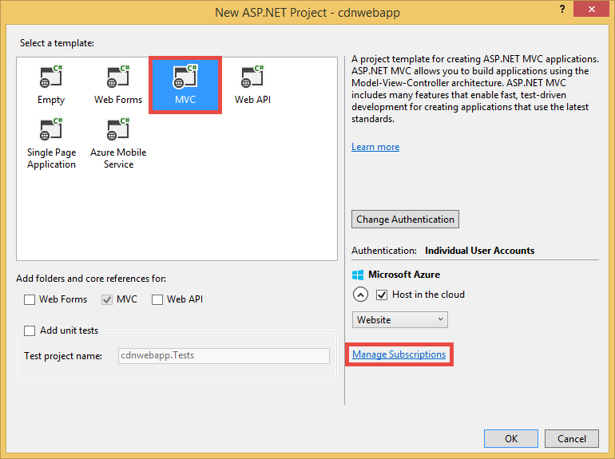
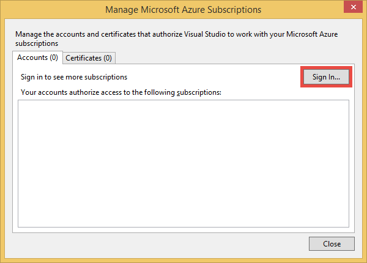
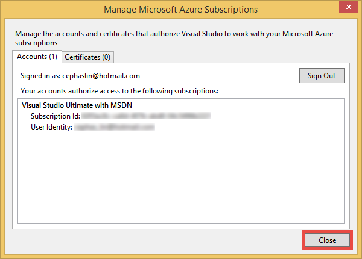
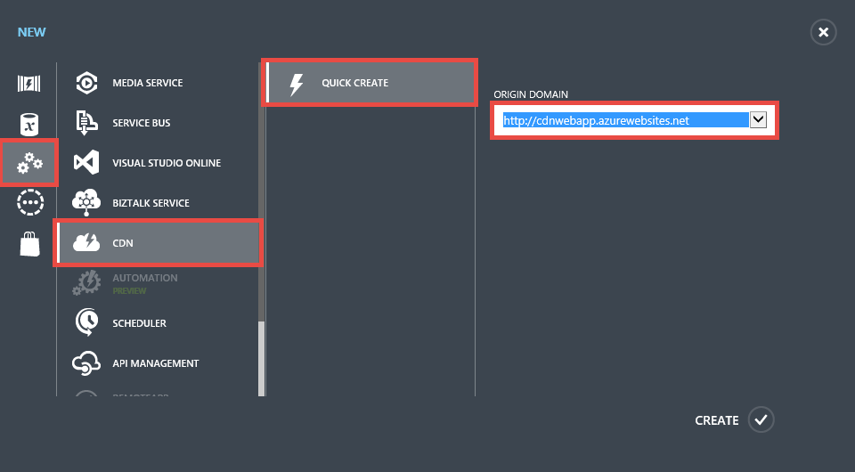
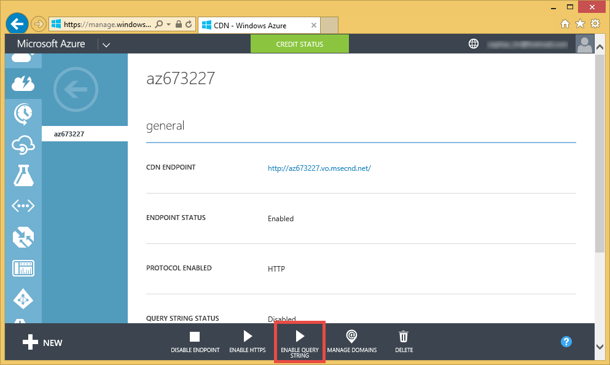

<properties 
	pageTitle="Интеграция веб-сайта Azure с Azure CDN" 
	description="В этом учебнике объясняется, как развернуть веб-сайт, который обслуживает содержимое из интегрированной конечной точки CDN Azure" 
	services="cdn, web-sites" 
	documentationCenter=".net" 
	authors="cephalin" 
	manager="wpickett" 
	editor="jimbe"/>

<tags 
	ms.service="cdn" 
	ms.workload="tbd" 
	ms.tgt_pltfrm="na" 
	ms.devlang="dotnet" 
	ms.topic="article" 
	ms.date="10/02/2014" 
	ms.author="cephalin"/>

# Интеграция веб-сайта Azure с Azure CDN #

Веб-сайты Azure могут интегрироваться с [Azure CDN](http://azure.microsoft.com/services/cdn/), добавляя возможности глобального масштабирования, присущие веб-сайтам Azure. Так ваше содержимое веб-сайта обслуживается глобально на узлах серверов рядом с клиентами (обновленный список всех текущих расположений узлов можно найти [здесь](http://msdn.microsoft.com/library/azure/gg680302.aspx)). Такая интеграция значительно повышает производительность веб-сайта Azure и существенно улучшает взаимодействие пользователя веб-сайта по всему миру. 

Интеграция веб-сайтов Azure с Azure CDN предоставляет следующие преимущества:

- Интеграция развертывания содержимого (изображений, сценариев и таблиц стилей) в процесс [непрерывного развертывания](http://azure.microsoft.com/documentation/articles/web-sites-publish-source-control/) веб-сайта Azure.
- Облегчение обновления пакетов NuGet на веб-сайте Azure, например, версий jQuery или Bootstrap. 
- Управление веб-приложениями и содержимым, обслуживаемым CDN, из одного интерфейса Visual Studio.
- Интеграция объединения и минификации ASP.NET с Azure CDN.

## Новые знания ##

Из этого учебника вы узнаете следующее:

-	[Интеграция конечной точки Azure CDN с вашим веб-сайтом Azure и обслуживание статического содержимого на веб-страницах из Azure CDN.](#deploy)
-	[Настройка параметров кэша для статического содержимого на веб-сайте Azure.](#caching)
-	[Обслуживание контента из действий контроллера посредством Azure CDN](#controller)
-	[Обслуживание объединенного в пакет и минифицированного контента посредством Azure CDN с поддержкой интерфейса отладки скриптов в Visual Studio](#bundling)
-	[Настройка резервирования скриптов и CSS, когда Azure CDN находится в автономном режиме](#fallback) 

## Что будет строиться ##

Вы будете развертывать веб-сайт Azure с помощью шаблона MVC ASP.NET по умолчанию в Visual Studio, добавлять код для обслуживания содержимого из интегрированной Azure CDN (например, изображения, результатов действий контроллера, файлов JavaScript и CSS по умолчанию), а также создавать код для настройки резервного механизма обслуживаемых пакетов на случай, когда CDN перейдет в автономный режим.

## Необходимые условия ##

Для работы с этим учебником необходимо выполнить следующие условия.

-	Активная учетная запись [Microsoft Azure](http://azure.microsoft.com/account/).
-	Visual Studio 2013 с [пакетом SDK для Azure](http://go.microsoft.com/fwlink/p/?linkid=323510&clcid=0x409).

  
  <h5>Для работы с этим учебником требуется учетная запись Azure.</h5>
  <ul>
    <li>Вы можете <a href="http://azure.microsoft.com/pricing/free-trial/?WT.mc_id=A261C142F">открыть учетную запись Azure бесплатно</a> - вы получаете кредиты, которые можно использовать для опробования платных служб Azure, и даже после израсходования кредитов вы сохраняете учетную запись и возможность использовать бесплатные службы Azure, например веб-сайты.</li>
    <li>Вы имеете возможность <a href="http://azure.microsoft.com/pricing/member-offers/msdn-benefits-details/?WT.mc_id=A261C142F">активировать преимущества подписчика MSDN</a> - ваша подписка MSDN каждый месяц приносит вам кредиты, которые можно использовать для оплаты служб Azure.</li>
  <ul>

## Развертывание веб-сайта Azure с использованием интегрированной конечной точки CDN ##

В этом разделе вы будете развертывать шаблон приложения MVC ASP.NET по умолчанию в Visual Studio 2013 на веб-сайте Azure, а интегрируете его с новой конечной точкой CDN. Следуйте приведенным далее указаниям.

1. В Visual Studio 2013 создайте новое веб-приложение ASP.NET, последовательно выбрав в строке меню **Файл -> Создать -> Проект > Интернет -> Веб-приложение ASP.NET**. Назначьте ему имя и нажмите кнопку **ОК**.

	

3. Выберите **MVC** и щелкните **Управление подписками**.

	

4. Щелкните **Войти**.

	

6. На странице входа войдите с учетной записью Майкрософт, которая использовалась для активации учетной записи Azure.
7. После входа щелкните **Закрыть**. Затем нажмите кнопку **ОК**, чтобы продолжить.

	

8. Предположим, что вы не создали веб-сайт Azure. Visual Studio может помочь создать его. В диалоговом окне **настройки веб-сайта Microsoft Azure** убедитесь, что имя вашего сайта является уникальным. Затем нажмите кнопку **ОК**.

	

9. Создав приложение ASP.NET, опубликуйте его в Azure в области действий веб-публикации, щелкнув **Опубликовать `<имя приложения>` на этом сайте**. Для завершения процесса щелкните **Опубликовать**.

	

	После завершения публикации вы увидите опубликованный веб-сайт Azure в браузере. 

1. Чтобы создать конечную точку CDN, войдите на [портал управления Azure](http://manage.windowsazure.com/). 
2. Щелкните **Создать** > **Службы приложений** > **CDN** > **Быстро создать**. Выберите **http://*<<имя_сайта>*.azurewebsites.net/** и щелкните **Создать**.

	

	>[WACOM.NOTE] После создания конечной точки CDN портал Azure покажет ее URL-адрес и исходный домен, с которым она интегрирована. Однако полное распространение конфигурации новой конечной точки CDN во все расположения узлов CDN может занять некоторое время. 

3. На портале Azure откройте вкладку **CDN** и щелкните имя только что созданной конечной точки CDN.

	

3. Щелкните **Включить поддержку строк запросов**, чтобы включать строки запроса в кэш CDN. После этого те же самые ссылки, доступ к которым осуществляется с помощью разных строк запроса, будут кэшироваться как отдельные записи.

	

	>[WACOM.NOTE] Хотя включение поддержки строки запроса в этом разделе учебника не обязательно, для удобства это можно сделать как можно раньше, так как распространение любого изменения во все узлы CDN занимает некоторое время, и нежелательно, чтобы содержание без включенных строк запроса засорял кэш CDN (обновление контента CDN будет рассматриваться позднее).

2. Теперь щелкните адрес конечной точки CDN. Если конечная точка готова, вы увидите свой веб-сайт. Если возникает ошибка **HTTP 404**, конечная точка CDN не готова. Вам нужно подождать около часа, чтобы конфигурация сети CDN распространилась на все пограничные узлы. 

	

1. Далее попытайтесь получить доступ к файлу **~/Content/bootstrap.css** в своем проекте ASP.NET. В окне браузера перейдите по адресу **http://*<<имя_cdn>*.vo.msecnd.net/Content/bootstrap.css**. В моей настройке это следующий URL-адрес:

		http://az673227.vo.msecnd.net/Content/bootstrap.css

	Он соответствует следующему исходному URL-адресу в конечной точке CDN:

		http://cdnwebapp.azurewebsites.net/Content/bootstrap.css

	При переходе по адресу **http://*<<имя_cdn>*.vo.msecnd.net/Content/bootstrap.css** будет предложено скачать файл bootstrap.css, полученный с вашего веб-сайта Azure. 

	

Аналогичным образом можно обращаться к любому общедоступному URL-адресу в **http://*<<имя_службы>*.cloudapp.net/** прямо из конечной точки CDN. Например: 

-	к JS-файлу в пути /Script;
-	к любому файлу контента в пути /Content;
-	к любому контроллеру или действию; 
-	если в конечной точке CDN включена строка запроса, то к любому URL-адресу со строкой запроса.
-	ко всему веб-сайту Azure, если все содержимое общедоступно.

Обратите внимание, что не всегда рекомендуется (или вообще не рекомендуется) обслуживать весь веб-сайт Azure через Azure CDN. Вот некоторые предупреждения:

-	Для использования этого подхода весь сайт должен быть общедоступным, поскольку Azure CDN не может обслуживать конфиденциальный контент.
-	Если по какой-либо причине, будь то плановое обслуживание или ошибка пользователя, конечная точка CDN становится автономной, то весь ваш веб-сайт становится автономным, если нельзя перенаправить клиентов на исходный URL-адрес **http://*<<имя_сайте>*.azurewebsites.net/**. 
-	Даже с настраиваемыми параметрами Cache-Control(см. раздел [Настройка параметров кэширования для статических файлов на веб-сайте Azure](#caching)) конечная точка CDN не улучшает производительность высокодинамичного содержимого. При попытке загрузить домашнюю страницу из конечной точки CDN, как показано выше, обратите внимание, что первая загрузка домашней страницы по умолчанию займет по крайней мере 5 секунд, хотя это довольно простая страница. Представьте, как бы выглядело взаимодействие с клиентом, если бы эта страница содержала динамический контент, который должен обновляться каждую минуту. Обслуживание динамического контента из конечной точки CDN требует, чтобы срок годности кэша был коротким,что приводит к частой потере кэша в конечной точке CDN. Это вредит производительности веб-сайта Azure, и смысл CDN теряется.

Альтернатива заключается в том, чтобы определить, какое содержимое должно обслуживаться из Azure CDN на индивидуальной основе на веб-сайте Azure. В отношении этого вы уже видели, как получать доступ к отдельным файлам контента из конечной точки CDN. Я покажу, как обслуживать определенное действие контроллера с помощью конечной точки CDN, в разделе [Обслуживание содержимого из действий контроллера с помощью Azure CDN](#controller).

## Настройка параметров кэширования для статических файлов на веб-сайте Azure ##

С помощью интеграции Azure CDN с веб-сайтом Azure вы можете указать, как статическое содержимое должно кэшироваться в конечной точке CDN. Для этого откройте файл *Web.config* из проекта ASP.NET (например, **cdnwebapp**) и добавьте элемент `<staticContent>` в `<system.webServer>`. Следующий XML настраивает истечение срока годности кэша через 3 дня.  
<pre class="prettyprint">
<system.webServer>
  <mark><staticContent>
    <clientCache cacheControlMode=&quot;UseMaxAge&quot; cacheControlMaxAge=&quot;3.00:00:00&quot;/>
  </staticContent></mark>
  ...
</system.webServer>
</pre>

После этого все статические файлы на веб-сайте Azure будут соблюдать то же правило в кэше CDN. Для более детального управления параметрами кэша добавьте файл *Web.config* в папку и добавьте в этом месте свои параметры. Например, добавьте файл *Web.config* в папку *\Content* и замените содержимое следующим кодом XML:

	<?xml version="1.0"?>
	<configuration>
	  <system.webServer>
	    <staticContent>
	      <clientCache cacheControlMode="UseMaxAge" cacheControlMaxAge="15.00:00:00"/>
	    </staticContent>
	  </system.webServer>
	</configuration>

Этот параметр приводит к сохранению в кэше всех статических файлов из папки *\Content* на 15 дней.

Дополнительную информацию о настройке элемента `<clientCache>` см. в разделе [Клиент кэша: <<clientCache>](http://www.iis.net/configreference/system.webserver/staticcontent/clientcache).

В разделе [Обслуживание содержимого из действий контроллера с помощью Azure CDN](#controller) я также покажу, как можно настраивать параметры кэша для результатов действий контроллера в кэше CDN.

## Обслуживание контента из действий контроллера посредством Azure CDN ##

Если веб-сайт Azure интегрируются с Azure CDN, то становится относительно просто обслуживать содержимое от действий контроллера через Azure CDN. Опять же, если вы решили обслуживать весь веб-сайт Azure через CDN, вообще не нужно это делать, так как все действия контроллера уже доступны через CDN. Однако по причинам, которые указывались в разделе [Развертывание веб-сайта Azure с использованием интегрированной конечной точки CDN](#deploy), вы можете отказаться от этого и выбрать действие контроллера, которое нужно обслуживать из сети Azure CDN. [Мартин Баллиау (Maarten Balliauw)](https://twitter.com/maartenballiauw) показывает, как это сделать на примере интересного контроллера MemeGenerator, в разделе [Уменьшение задержки в Интернете с помощью Microsoft Azure CDN](http://channel9.msdn.com/events/TechDays/Techdays-2014-the-Netherlands/Reducing-latency-on-the-web-with-the-Windows-Azure-CDN). Я просто воспроизведу это здесь.

Предположим, вы хотите создать на веб-сайте мемы на основе образа молодого Чака Норриса (фото [Алана Лайта (Alan Light)](http://www.flickr.com/photos/alan-light/218493788/)), например:

Есть простое действие `Index`, которое позволяет клиентам задавать гиперболы в образе, а затем создает мем, как только клиент поместит их в действие. Поскольку это Чак Норрис, можно ожидать, что страница станет очень популярной по всему миру. Это хороший пример обслуживания полудинамического содержимого с помощью Azure CDN. 

Чтобы настроить это действие контроллера, выполните следующие действия.

1. В папке *\Controllers* создайте новый CS-файл с именем *MemeGeneratorController.cs* и замените содержимое следующим кодом. Не забудьте заменить выделенный фрагмент путем к файлу и именем CDN.
	<pre class="prettyprint">
	using System;
	using System.Collections.Generic;
	using System.Diagnostics;
	using System.Drawing;
	using System.IO;
	using System.Net;
	using System.Web.Hosting;
	using System.Web.Mvc;
	using System.Web.UI;
	
	namespace cdnwebapp.Controllers
	{
	    public class MemeGeneratorController : Controller
	    {
	        static readonly Dictionary<string, Tuple<string ,string>> Memes = new Dictionary<string, Tuple<string, string>>();

	        public ActionResult Index()
	        {
	            return View();
	        }
	
	        [HttpPost, ActionName(&quot;Index&quot;)]
        	public ActionResult Index_Post(string top, string bottom)
	        {
	            var identifier = Guid.NewGuid().ToString();
	            if (!Memes.ContainsKey(identifier))
	            {
	                Memes.Add(identifier, new Tuple<string, string>(top, bottom));
	            }
	
	            return Content(&quot;<a href=\&quot;&quot; + Url.Action(&quot;Show&quot;, new {id = identifier}) + &quot;\&quot;>here&#39;s your meme</a>&quot;);
	        }

	        [OutputCache(VaryByParam = &quot;*&quot;, Duration = 1, Location = OutputCacheLocation.Downstream)]
	        public ActionResult Show(string id)
	        {
	            Tuple<string, string> data = null;
	            if (!Memes.TryGetValue(id, out data))
	            {
	                return new HttpStatusCodeResult(HttpStatusCode.NotFound);
	            }
	
	            if (Debugger.IsAttached) // Preserve the debug experience
	            {
	                return Redirect(string.Format(&quot;/MemeGenerator/Generate?top={0}&bottom={1}&quot;, data.Item1, data.Item2));
	            }
	            else // Get content from Azure CDN
	            {
	                return Redirect(string.Format(&quot;http://<mark><yourCDNName></mark>.vo.msecnd.net/MemeGenerator/Generate?top={0}&bottom={1}&quot;, data.Item1, data.Item2));
	            }
	        }

	        [OutputCache(VaryByParam = "*", Duration = 3600, Location = OutputCacheLocation.Downstream)]
	        public ActionResult Generate(string top, string bottom)
	        {
	            string imageFilePath = HostingEnvironment.MapPath(&quot;<mark>~/Content/chuck.bmp</mark>&quot;);
	            Bitmap bitmap = (Bitmap)Image.FromFile(imageFilePath);
	
	            using (Graphics graphics = Graphics.FromImage(bitmap))
	            {
	                SizeF size = new SizeF();
	                using (Font arialFont = FindBestFitFont(bitmap, graphics, top.ToUpperInvariant(), new Font("Arial Narrow", 100), out size))
	                {
	                    graphics.DrawString(top.ToUpperInvariant(), arialFont, Brushes.White, new PointF(((bitmap.Width - size.Width) / 2), 10f));
	                }
	                using (Font arialFont = FindBestFitFont(bitmap, graphics, bottom.ToUpperInvariant(), new Font("Arial Narrow", 100), out size))
	                {
	                    graphics.DrawString(bottom.ToUpperInvariant(), arialFont, Brushes.White, new PointF(((bitmap.Width - size.Width) / 2), bitmap.Height - 10f - arialFont.Height));
	                }
	            }
	
	            MemoryStream ms = new MemoryStream();
	            bitmap.Save(ms, System.Drawing.Imaging.ImageFormat.Png);
	            return File(ms.ToArray(), &quot;image/png&quot;);
	        }
	
	        private Font FindBestFitFont(Image i, Graphics g, String text, Font font, out SizeF size)
	        {
	            // Compute actual size, shrink if needed
	            while (true)
	            {
	                size = g.MeasureString(text, font);
	
	                // It fits, back out
	                if (size.Height < i.Height &&
	                     size.Width < i.Width) { return font; }
	
	                // Try a smaller font (90% of old size)
	                Font oldFont = font;
	                font = new Font(font.Name, (float)(font.Size * .9), font.Style);
	                oldFont.Dispose();
	            }
	        }
	    }
	}
	</pre>

2. Щелкните правой кнопкой мыши действие `Index()` по умолчанию и выберите **Добавить представление**.

	

3.  Примите параметры, показанные ниже, и нажмите кнопку **Добавить**.

	

4. Откройте новый файл *Views\MemeGenerator\Index.cshtml* и замените его содержимое следующим простым HTML для отправки гипербол:

		<h2>Meme Generator</h2>
		
		<form action="" method="post">
		    <input type="text" name="top" placeholder="Enter top text here" />
		     
		    <input type="text" name="bottom" placeholder="Enter bottom text here" />
		     
		    <input class="btn" type="submit" value="Generate meme" />
		</form>

5. Повторите публикацию на веб-сайт Azure и перейдите в браузере по адресу **http://*<<имя_службы>*.cloudapp.net/MemeGenerator/Index**. 

При отправке формы значения в `/MemeGenerator/Index` метод действия `Index_Post` возвращает ссылку на метод действия `Show` с соответствующими входным идентификатором. Если щелкнуть ссылку, появляется следующий код:  
<pre class="prettyprint">
[OutputCache(VaryByParam = &quot;*&quot;, Duration = 1, Location = OutputCacheLocation.Downstream)]
public ActionResult Show(string id)
{
    Tuple<string, string> data = null;
    if (!Memes.TryGetValue(id, out data))
    {
        return new HttpStatusCodeResult(HttpStatusCode.NotFound);
    }

    if (Debugger.IsAttached) // Preserve the debug experience
    {
        return Redirect(string.Format(&quot;/MemeGenerator/Generate?top={0}&bottom={1}&quot;, data.Item1, data.Item2));
    }
    else // Get content from Azure CDN
    {
        return Redirect(string.Format(&quot;http://<mark><yourCDNName></mark>.vo.msecnd.net/MemeGenerator/Generate?top={0}&bottom={1}&quot;, data.Item1, data.Item2));
    }
}
</pre>

Если подключен локальный отладчик, то вы получите обычный интерфейс отладки с локальным перенаправлением. Если отладчик работает на веб-сайте Azure, то перенаправление будет выполняться сюда:

	http://<yourCDNName>.vo.msecnd.net/MemeGenerator/Generate?top=<formInput>&bottom=<formInput>

Он соответствует следующему исходному URL-адресу в конечной точке CDN:

	http://<yourSiteName>.azurewebsites.net/cdn/MemeGenerator/Generate?top=<formInput>&bottom=<formInput>

После правила переопределения URL-адреса, применявшегося ранее, фактический файл, который кэшируется в конечной точке CDN, имеет следующий адрес:

	http://<yourSiteName>.azurewebsites.net/MemeGenerator/Generate?top=<formInput>&bottom=<formInput>

Затем с помощью атрибута `OutputCacheAttribute` в методе `Generate` вы можете указать, как должен кэшироваться результат действия, которое будет выполнять Azure CDN. В следующем коде задается срок действия кэша в 1 час (3600 секунд).

    [OutputCache(VaryByParam = "*", Duration = 3600, Location = OutputCacheLocation.Downstream)]

Аналогично вы можете обслуживать содержимое из любого действия контроллера на веб-сайте Azure через Azure CDN, используя нужный параметр кэширования.

В следующем разделе будет показано, как обслуживать объединенные в пакет и минифицированные скрипты и CSS посредством Azure CDN. 

## Интеграция объединения и минификации ASP.NET с Azure CDN. ##

Сценарии и таблицы стилей CSS изменяются нечасто и являются основными кандидатами для кэша Azure CDN. Обслуживание всего веб-сайта через Azure CDN - это простейший способ интегрировать объединение и минификацию с Azure CDN. А так как вы можете отказаться от такого подхода по причинам, описанным в разделе [Интеграция конечной точки Azure CDN с вашим веб-сайтом Azure и обслуживание статического содержимого на веб-страницах из Azure CDN](#deploy), я покажу, как это сделать, сохранив требуемое взаимодействие разработчика для объединения и минификации ASP.NET, в том числе:

-	Отличное взаимодействие в режиме отладки.
-	Упрощенное развертывание.
-	Немедленные обновления клиентов при обновлении версий скриптов или CSS.
-	Резервный механизм на случай сбоя конечной точки CDN.
-	Минимальное изменение кода.

В проекте ASP.NET, созданном при изучении раздела [Интеграция конечной точки Azure CDN с веб-сайтом Azure и обслуживание статического содержимого на веб-страницах из Azure CDN](#deploy), откройте *App_Start\BundleConfig.cs* и взгляните на вызовы метода `bundles.Add()`.

    public static void RegisterBundles(BundleCollection bundles)
    {
        bundles.Add(new ScriptBundle("~/bundles/jquery").Include(
                    "~/Scripts/jquery-{version}.js"));
		...
    }

Первая инструкция `bundles.Add()` добавляет пакет сценариев в виртуальный каталог `~/bundles/jquery`. Затем откройте файл *Views\Shared_Layout.cshtml*, чтобы посмотреть, как обрабатывается тег пакета сценариев. Вы должны найти следующую строку кода Razor:

    @Scripts.Render("~/bundles/jquery")

При запуске этого кода Razor на веб-сайте Azure он будет обрабатывать тег `

Однако когда этот код запускается в Visual Studio по нажатию клавиши `F5`, он будет обрабатывать каждый файл сценария в пакете отдельно (в приведенном случае в пакете имеется только один файл сценария):

    

Это позволяет отлаживать код JavaScript в среде разработки, уменьшая число параллельных клиентских соединений (объединение) и повышая скорость скачивания файлов (минификация) в рабочей среде. Это отличная возможность для сохранения с использованием интеграции Azure CDN. Более того, так как обработанный пакет уже содержит автоматически созданную строку версии, имеет смысл реплицировать эту функциональность, чтобы при всяком обновлении версии jQuery с помощью NuGet она могла бы максимально быстро обновляться на стороне клиента.

Выполните приведенные ниже действия для интеграции объединения и минификации ASP.NET с конечной точкой CDN.

1. Вернитесь в файл *App_Start\BundleConfig.cs* и измените методы `bundles.Add()`, чтобы использовать другой [конструктор Bundle](http://msdn.microsoft.com/library/jj646464.aspx), который задает адрес CDN. Для этого замените определение метода `RegisterBundles` следующим кодом:  
	<pre class="prettyprint">
	public static void RegisterBundles(BundleCollection bundles)
	{
	    <mark>bundles.UseCdn = true;
	    var version = System.Reflection.Assembly.GetAssembly(typeof(Controllers.HomeController))
	        .GetName().Version.ToString();
	    var cdnUrl = &quot;http://<yourCDNName>.vo.msecnd.net/{0}?v=&quot; + version;</mark>
	
	    bundles.Add(new ScriptBundle(&quot;~/bundles/jquery&quot;<mark>, string.Format(cdnUrl, &quot;bundles/jquery&quot;)</mark>).Include(
	                &quot;~/Scripts/jquery-{version}.js&quot;));
	
	    bundles.Add(new ScriptBundle(&quot;~/bundles/jqueryval&quot;<mark>, string.Format(cdnUrl, &quot;bundles/jqueryval&quot;)</mark>).Include(
	                &quot;~/Scripts/jquery.validate*&quot;));
	
	    // Use the development version of Modernizr to develop with and learn from. Then, when you&#39;re
	    // ready for production, use the build tool at http://modernizr.com to pick only the tests you need.
	    bundles.Add(new ScriptBundle(&quot;~/bundles/modernizr&quot;<mark>, string.Format(cdnUrl, &quot;bundles/modernizer&quot;)</mark>).Include(
	                &quot;~/Scripts/modernizr-*&quot;));
	
	    bundles.Add(new ScriptBundle(&quot;~/bundles/bootstrap&quot;<mark>, string.Format(cdnUrl, &quot;bundles/bootstrap&quot;)</mark>).Include(
	                &quot;~/Scripts/bootstrap.js&quot;,
	                &quot;~/Scripts/respond.js&quot;));
	
	    bundles.Add(new StyleBundle(&quot;~/Content/css&quot;<mark>, string.Format(cdnUrl, &quot;Content/css&quot;)</mark>).Include(
	                &quot;~/Content/bootstrap.css&quot;,
	                &quot;~/Content/site.css&quot;));
	}
	</pre>

	Не забудьте заменить `<yourCDNName>` своим именем Azure CDN.

	Простыми словами, вы задаете `bundles.UseCdn = true` и добавляете тщательно созданный URL-адрес CDN в каждый пакет. Например, первый конструктор в коде:

		new ScriptBundle("~/bundles/jquery", string.Format(cdnUrl, "bundles/jquery"))

	тот же самый: 

		new ScriptBundle("~/bundles/jquery", string.Format(cdnUrl, "http://<yourCDNName>.vo.msecnd.net/bundles/jquery?v=<W.X.Y.Z>"))

	Этот конструктор указывает, что при локальной отладке с помощью объединения и минификации ASP.NET должна выполняться обработка отдельных файлов сценариев, но с использованием указанного адреса CDN для доступа к соответствующему сценарию. Однако отметим две важных характеристики этого тщательно созданного URL-адреса CDN:
	
	-	Источником этого URL-адреса CDN служит адрес `http://<имя_вашего_сайта>.azurewebsites.net/bundles/jquery?v=<W.X.Y.Z>`, который фактически является виртуальным каталогом пакета сценариев в вашем веб-приложении.
	-	Так как используется конструктор CDN, тег сценария CDN для этого пакета больше не содержит автоматически созданную строку версии в обработанном URL-адресе. Необходимо вручную создавать уникальную строку версии каждый раз при изменении пакета скриптов, чтобы обеспечить промах кэша в Azure CDN. В то же время эта уникальная строка версии должна оставаться постоянной в течение всего срока существования развертывания, чтобы максимально увеличить попадания в кэше в Azure CDN после развертывания пакета.
	-	Строка запроса v=<W.X.Y.Z> берется из файла *Properties\AssemblyInfo.cs* в вашем проекте ASP.NET. Можно создать рабочий процесс развертывания, включающий увеличение версии сборки при каждой публикации в Azure. Можно также просто изменить файл *Properties\AssemblyInfo.cs* в проекте, задав автоматическое увеличение строки версии при каждом построении с помощью подстановочного знака '*'. Например: 
	
			[assembly: AssemblyVersion("1.0.0.*")]
	
		Здесь будет работать любая другая стратегия упрощения создания уникальной строки на срок существования развертывания.

3. Повторно опубликуйте приложение ASP.NET и откройте домашнюю страницу.
 
4. Просмотрите код HTML для этой страницы. При каждой публикации изменений веб-сайта Azure вы должны видеть обработанный URL-адрес CDN с уникальной строкой версии. Например:   
	<pre class="prettyprint">
	...

    <link href=&quot;http://az673227.vo.msecnd.net/Content/css?v=1.0.0.25449&quot; rel=&quot;stylesheet&quot;/>

    

    

	...</pre>

5. Перейдите в режим отладки приложения ASP.NET в Visual Studio, нажав клавишу `F5`. 

6. Просмотрите код HTML для этой страницы. Вы по-прежнему будете видеть каждый индивидуально обработанный файл скрипта, так что можно получить последовательные возможности отладки в Visual Studio.  
	<pre class="prettyprint">
	...
	
	    <link href=&quot;/Content/bootstrap.css&quot; rel=&quot;stylesheet&quot;/>
	<link href=&quot;/Content/site.css&quot; rel=&quot;stylesheet&quot;/>
	
	    
	
	...
	
	    
	
	    
	
	
	...    
	</pre>

## Резервный механизм для URL-адресов CDN ##

Желательно, чтобы в случае сбоя конечной точки Azure CDN по какой-либо причине веб-страница могла использовать в качестве резервной возможности доступ к исходному веб-серверу для загрузки JavaScript или Bootstrap. Одно дело потерять изображения на веб-сайте из-за недоступности CDN, и совсем другое - потерять критически важные функциональные возможности страницы, обеспечиваемые сценариями и таблицами стилей.

Класс [Bundle](http://msdn.microsoft.com/library/system.web.optimization.bundle.aspx) содержит свойство с именем [CdnFallbackExpression](http://msdn.microsoft.com/library/system.web.optimization.bundle.cdnfallbackexpression.aspx), которое позволяет настраивать резервный механизм на случай сбоя CDN. Вот что нужно сделать, чтобы использовать это свойство:

1. В проекте ASP.NET откройте файл *App_Start\BundleConfig.cs*, где в каждом [конструкторе Bundle](http://msdn.microsoft.com/library/jj646464.aspx) добавлялся URL-адрес CDN, и внесите следующие выделенные изменения, чтобы добавить резервный механизм в пакеты по умолчанию:  
	<pre class="prettyprint">
	public static void RegisterBundles(BundleCollection bundles)
	{
	    var version = System.Reflection.Assembly.GetAssembly(typeof(BundleConfig))
	        .GetName().Version.ToString();
	    var cdnUrl = &quot;http://cdnurl.vo.msecnd.net/.../{0}?&quot; + version;
	    bundles.UseCdn = true;
	
	    bundles.Add(new ScriptBundle(&quot;~/bundles/jquery&quot;, string.Format(cdnUrl, &quot;bundles/jquery&quot;)) 
					<mark>{ CdnFallbackExpression = &quot;window.jquery&quot; }</mark>
	                .Include(&quot;~/Scripts/jquery-{version}.js&quot;));
	
	    bundles.Add(new ScriptBundle(&quot;~/bundles/jqueryval&quot;, string.Format(cdnUrl, &quot;bundles/jqueryval&quot;)) 
					<mark>{ CdnFallbackExpression = &quot;$.validator&quot; }</mark>
	            	.Include(&quot;~/Scripts/jquery.validate*&quot;));
	
	    // Use the development version of Modernizr to develop with and learn from. Then, when you&#39;re
	    // ready for production, use the build tool at http://modernizr.com to pick only the tests you need.
	    bundles.Add(new ScriptBundle(&quot;~/bundles/modernizr&quot;, string.Format(cdnUrl, &quot;bundles/modernizer&quot;)) 
					<mark>{ CdnFallbackExpression = &quot;window.Modernizr&quot; }</mark>
					.Include(&quot;~/Scripts/modernizr-*&quot;));
	
	    bundles.Add(new ScriptBundle(&quot;~/bundles/bootstrap&quot;, string.Format(cdnUrl, &quot;bundles/bootstrap&quot;)) 	
					<mark>{ CdnFallbackExpression = &quot;$.fn.modal&quot; }</mark>
	        		.Include(
		              		&quot;~/Scripts/bootstrap.js&quot;,
		              		&quot;~/Scripts/respond.js&quot;));
	
	    bundles.Add(new StyleBundle(&quot;~/Content/css&quot;, string.Format(cdnUrl, &quot;Content/css&quot;)).Include(
	                &quot;~/Content/bootstrap.css&quot;,
	                &quot;~/Content/site.css&quot;));
	}</pre>

	Когда выражение `CdnFallbackExpression` не равно NULL, сценарий внедряется в HTML, чтобы проверить успешность загрузки пакета, и в случае неуспешной загрузки обеспечивает доступ к пакету непосредственно на исходном веб-сервере. В этом свойстве необходимо устанавливать выражение JavaScript, проверяющее, загружен ли соответствующий пакет CDN должным образом. Выражения для проверки каждого пакета отличаются в соответствии с контентом. Для пакетов по умолчанию выше:
	
	-	`window.jquery` определяется в jquery-{версия}.js;
	-	`$.validator` определяется в jquery.validate.js;
	-	`window.Modernizr` определяется в modernizer-{версия}.js;
	-	`$.fn.modal` определяется в bootstrap.js.
	
	Возможно, вы заметили, что я не задал CdnFallbackExpression для пакета `~/Cointent/css`. Это объясняется тем, что сейчас есть [ошибка в System.Web.Optimization](https://aspnetoptimization.codeplex.com/workitem/104), которая вставляет тег `</mark>
	
	    
	<mark></mark>
	
	...	
	
	    
	<mark></mark>
	
	    
	<mark></mark>
	
	...
	</pre>

	Обратите внимание, что внедренный сценарий для пакета CSS по-прежнему содержит ошибочный фрагмент из свойства `CdnFallbackExpression` в следующей строке:

        }())||document.write('

	Но поскольку первая часть выражения '||' будет всегда возвращать значение true (в строке прямо над этой), функция document.write() никогда не будет выполняться.

6. Чтобы проверить, правильно ли работает сценарий резервного действия, вернитесь к панели мониторинга своей конечной точки CDN и щелкните **Отключить конечную точку**.

	

7. Обновите окно браузера для веб-сайта Azure. Теперь вы увидите, что все сценарии и таблицы стилей загружены правильно.

# Дополнительные сведения #
- [Общие сведения о сети доставки контента (CDN) Azure](http://msdn.microsoft.com/library/azure/ff919703.aspx)
- [Обслуживание содержимого из CDN Azure в вашем веб-приложении](http://azure.microsoft.com/Documentation/Articles/cdn-serve-content-from-cdn-in-your-web-application/)
- [Интеграция облачной службы с Azure CDN](http://azure.microsoft.com/documentation/articles/cdn-cloud-service-with-cdn/)
- [Объединение и минификация ASP.NET](http://www.asp.net/mvc/tutorials/mvc-4/bundling-and-minification)
- [Использование CDN для Azure](http://azure.microsoft.com/documentation/articles/cdn-how-to-use/)

<!--HONumber=46--> 
