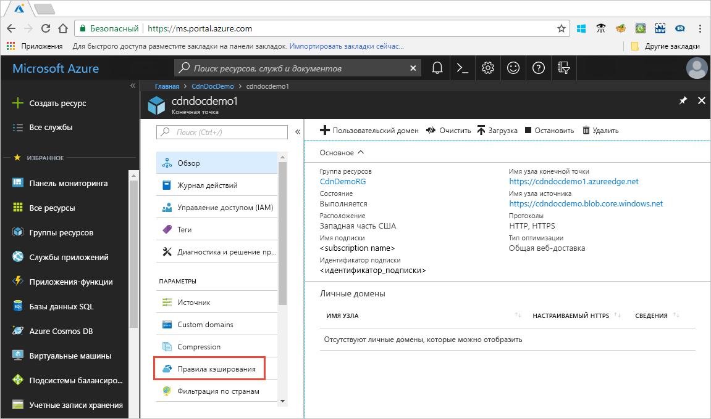

# Руководство. Настройка правил кэширования Azure CDN

> [!NOTE] 
> Правила кэширования Azure CDN доступны только для профилей **Azure CDN уровня "Стандартный" от Verizon** и **Azure CDN уровня "Стандартный" от Akamai**. Для **Azure CDN уровня "Премиум" от Verizon** используйте [обработчик правил Azure CDN](cdn-rules-engine.md) на портале **Управление** с аналогичными функциональными возможностями.
 

В этом руководстве описывается, как использовать правила кэширования сети доставки содержимого Azure (CDN) или изменять истечение срока действия кэша по умолчанию как глобально, так и с настраиваемыми условиями (например, URL-путь и расширения файла). Azure CDN предоставляет два типа правил кэширования.
- Глобальные правила кэширования. Вы можете задать в своем профиле одно глобальное правило кэширования для каждой конечной точки, которое влияет на все запросы к конечной точке. Глобальное правило кэширования переопределяет все заголовки директив кэша HTTP (если они заданы).

- Настраиваемые правила кэширования. Вы можете задать одно или несколько настраиваемых правил кэширования для каждой конечной точки в профиле. Настраиваемые правила кэширования соответствуют конкретным путям и расширениям файлов, обрабатываются по порядку и переопределяют глобальное правило кэширования (если оно задано). 

Из этого руководства вы узнаете, как выполнять такие задачи:
> [!div class="checklist"]
> - Открыть страницу правил кэширования.
> - Создать глобальное правило кэширования.
> - Создать настраиваемое правило кэширования.

[!INCLUDE [quickstarts-free-trial-note](../../includes/quickstarts-free-trial-note.md)]

## предварительным требованиям

Прежде чем перейти к выполнению шагов в этом руководстве, сначала создайте профиль и как минимум одну конечную точку CDN. Дополнительные сведения см. в статье [Начало работы с Azure CDN](cdn-create-new-endpoint.md).

## Открытие страницы правил кэширования Azure CDN

1. На [портале Azure](https://portal.azure.com) выберите профиль CDN, а затем конечную точку.

2. В области слева в разделе "Параметры" выберите **Правила кэширования**.

   

   Появится страница **Правила кэширования**.

   

## Установка глобальных правил кэширования

Создайте глобальное правило кэширования следующим образом:

1. В разделе **Глобальные правила кэширования** задайте для параметра **Режим кэширования строк запросов** значение **Пропускать строки запросов**.

2. Задайте для параметра **Поведение кэширования** значение **Установить, если отсутствует**.
       
3. Для параметра **Срок действия кэша** введите значение 10 в поле **Days** (Дни).

    Глобальное правило кэширования влияет на все запросы к конечной точке. Это правило учитывает исходные заголовки директив кэша, если они имеются (`Cache-Control` или `Expires`). В противном случае, если они не указаны, задается кэш на 10 дней. 

    

## Установка настраиваемых правил кэширования

Создайте настраиваемое правило кэширования следующим образом.

1. В разделе **Настраиваемые правила кэширования** задайте для параметра **Условие соответствия** значение **Путь**, а для параметра **Значение соответствия** — значение `/images/*.jpg`.
    
2. Задайте для параметра **Поведение кэширования** значение **Override** (Переопределить) и введите 30 в поле **Days** (Дни).
       
    Это правило кэширования задает для длительности кэширования значение "30 дней" для всех файлов изображений (`.jpg`) в папке конечной точки `/images`. Оно переопределяет все заголовки HTTP `Cache-Control` или `Expires`, отправленные с сервера-источника.

    

    
## Очистка ресурсов

На предыдущих шагах вы создали правила кэширования. Если они вам больше не нужны, их можно удалить, сделав следующее:
 
1. Выберите профиль CDN, а затем щелкните конечную точку с правилами кэширования, которые нужно удалить.

2. В области слева в разделе "Параметры" выберите **Правила кэширования**.

3. В разделе **Глобальные правила кэширования** задайте для параметра **Поведение кэширования** значение **Не задано**.
 
4. В разделе **Настраиваемые правила кэширования** установите флажок рядом с правилом, которое требуется удалить.

5. Нажмите кнопку **Удалить**.

6. В верхней части страницы выберите **Сохранить**.

## Дополнительная информация

Из этого руководства вы узнали, как выполнить следующие задачи:

> [!div class="checklist"]
> - Открыть страницу правил кэширования.
> - Создать глобальное правило кэширования.
> - Создать настраиваемое правило кэширования.

Перейти к следующей статье, чтобы научиться настраивать дополнительные параметры правил кэширования.

> [!div class="nextstepaction"]
> [Управление режимом кэширования Azure CDN с помощью правил кэширования](cdn-caching-rules.md)

