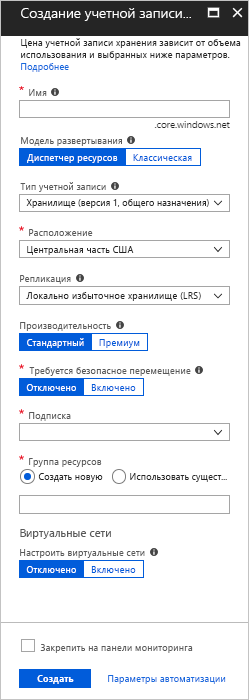
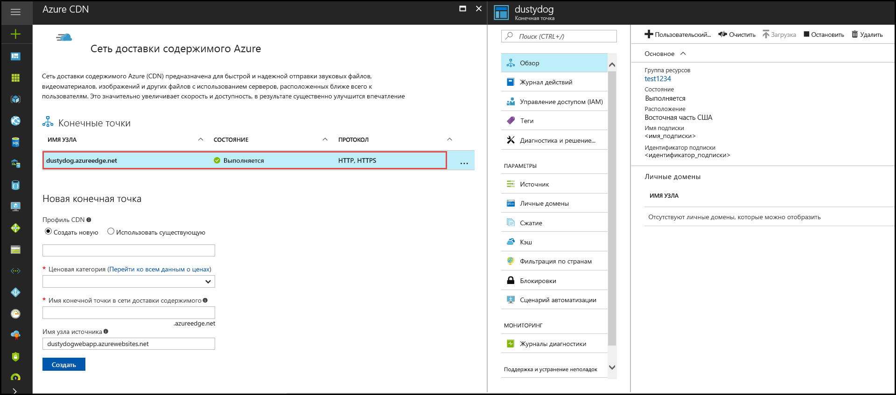

# Интеграция учетной записи хранения Azure с Azure CDN
Включите сеть доставки содержимого Azure, чтобы кэшировать содержимое хранилища Azure. Azure CDN предлагает разработчикам глобальное решение по доставке больших объемов содержимого. Она может кэшировать большие двоичные объекты и статическое содержимое вычислительных экземпляров на физических узлах в США, Европе, Азии, Австралии и Южной Америке.

## Шаг 1. Создание учетной записи хранения
Чтобы создать учетную запись хранения для подписки Azure, воспользуйтесь следующей процедурой. Учетная запись хранения предоставляет доступ к службам хранилища Azure. Учетная запись хранения представляет собой высший уровень пространства имен для доступа ко всем компонентам службы хранилища Azure: большой двоичный объект, хранилище очередей и хранилище таблиц Azure. Дополнительную информацию см. в статье [Введение в хранилище Microsoft Azure](../storage/common/storage-introduction.md).

Чтобы создать учетную запись хранения, вы должны быть администратором службы или соадминистратором для связанной подписки.

> [!NOTE]
> Есть несколько способов, которые можно использовать для создания учетной записи хранения. В их число входят портал Azure и Powershell. В этом руководстве показано, как с помощью портала Azure выполнять следующие операции.   
> 

**Создание учетной записи хранения для подписки Azure**

1. Войдите на [портале Azure](https://portal.azure.com).
2. В нижнем левом углу щелкните **Создать ресурс**. В области **Создать** выберите **Хранилище**, а затем выберите **Учетная запись хранения — BLOB-объект, файл, таблица, очередь**.
    
    Появится область **Создать учетную запись хранения**.   

    

3. В поле **Имя** введите имя дочернего домена. Запись может содержать от 3 до 24 строчных букв и цифр.
   
    Это значение станет именем узла в URI, который используется для адресации ресурсов большого двоичного объекта, очереди и таблицы в подписке. Для обращения к ресурсу контейнера в хранилище BLOB-объектов используйте URI в следующем формате:
   
    http://*&lt;StorageAcountLabel&gt;*.blob.core.windows.net/*&lt;мой_контейнер&gt;*

    где *&lt;StorageAccountLabel&gt;* указывает на значение, введенное в поле **Имя**.
   
    > [!IMPORTANT]    
    > Метка URL-адреса образует поддомен URI учетной записи хранения и должна быть уникальной на уровне всех размещенных служб в Azure.
   
    Это значение также используется как имя этой учетной записи хранения на портале или при доступе к данной учетной записи программным способом.
    
4. Используйте значения по умолчанию для **модели развертывания**, **типа учетной записи**, **производительности** и **репликации**. 
    
5. В поле **Подписка** выберите подписку, которая будет использоваться с учетной записью хранения.
    
6. В поле **Группа ресурсов** выберите или создайте группу ресурсов. Дополнительные сведения о группах ресурсов см. в статье [Общие сведения об Azure Resource Manager](../azure-resource-manager/resource-group-overview.md#resource-groups).
    
7. В поле **Расположение** выберите расположение для вашей учетной записи хранения.
    
8. Нажмите кнопку **Создать**. Процесс создания учетной записи хранения может занять несколько минут.

## Шаг 2. Включение CDN для учетной записи хранения

Вы можете включить сеть доставки содержимого непосредственно из учетной записи хранения. 

1. Выберите учетную запись хранения на панели мониторинга, а затем выберите **Сеть доставки содержимого Azure** на левой панели. Если кнопка **Сеть доставки содержимого Azure** появится не сразу, можно ввести CDN в области **Поиск** на левой панели.
    
    Отобразится панель **Сеть доставки содержимого Azure**.

    
    
2. Создайте конечную точку, указав необходимые сведения:
    - **Профиль CDN.** Создайте профиль или используйте имеющийся.
    - **Ценовая категория.** Выберите ценовую категорию только при создании профиля CDN.
    - **Имя конечной точки в сети доставки содержимого.** Введите имя конечной точки.

    > [!TIP]
    > По умолчанию созданная конечная точка CDN использует имя узла учетной записи хранения как сервер-источник.

3. Нажмите кнопку **Создать**. Созданная конечная точка отображается в списке конечных точек.

    

> [!NOTE]
> Если требуется указать дополнительные параметры для конечной точки CDN, например тип оптимизации, вместо этого можно использовать [расширение сети доставки содержимого Azure](cdn-create-new-endpoint.md#create-a-new-cdn-endpoint) для создания конечной точки CDN или профиля CDN.

## Шаг 3. Включение дополнительных функций CDN

В области **Сеть доставки содержимого Azure** учетной записи хранения выберите в списке конечную точку CDN, чтобы открыть область конфигурации CDN. Вы можете включить дополнительные функции CDN, например сжатие, строку запроса и геофильтрацию. Можно также добавить сопоставление личного домена для конечной точки CDN и включить личный домен HTTPS.
    

## Шаг 4. Доступ к содержимому CDN
Для доступа к кэшированному содержимому в сети CDN воспользуйтесь URL-адресом CDN, отображаемым в портале. Адрес для кэшированного большого двоичного объекта будет иметь следующий вид:

http://<*имя_конечной_точки*\>.azureedge.net/<*общедоступный_контейнер*\>/<*имя_большого_двоичного_объекта*\>

> [!NOTE]
> После включения доступа CDN к учетной записи хранения все общедоступные объекты будут пригодны для пограничного кэширования CDN. Если изменить объект, находящийся в данный момент в кэше сети CDN, новое содержимое будет недоступно через сеть CDN до обновления содержимого CDN по истечении срока действия кэшированного содержимого.

## Шаг 5. Удаление содержимого из сети CDN
Если кэширование объекта в сети CDN Azure больше не требуется, можно выполнить одно из следующих действий:

* Сделать контейнер закрытым, а не общедоступным. Дополнительные сведения см. в статье [Управление анонимным доступом на чтение к контейнерам и большим двоичным объектам](../storage/blobs/storage-manage-access-to-resources.md).
* Отключить или удалить конечную точку CDN с помощью портала Azure.
* Изменить размещенную службу, чтобы она перестала отвечать на запросы объекта.

Объект, кэшированный в сети Azure CDN, останется в кэше до истечения срока действия этого объекта или до удаления конечной точки. По истечении срока действия Azure CDN проверит конечную точку CDN, чтобы выяснить, что она еще действует и объект по-прежнему находится в анонимном доступе. Если это не так, объект больше не будет кэшироваться.

## Дополнительные ресурсы
* [Добавление личного домена к конечной точке CDN](cdn-map-content-to-custom-domain.md)
* [Настройка протокола HTTPS для личного домена в сети доставки содержимого Azure](cdn-custom-ssl.md)

