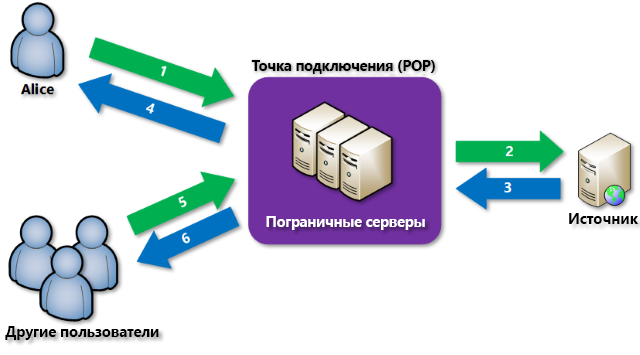

.<properties
	pageTitle="Обзор Azure CDN | Microsoft Azure"
	description="Узнайте, что собой представляет сеть доставки содержимого (CDN) Azure и как ее использовать для доставки больших объемов содержимого посредством кэширования BLOB-объектов и статического содержимого."
	services="cdn"
	documentationCenter=""
	authors="camsoper"
	manager="erikre"
	editor=""/>

<tags
	ms.service="cdn"
	ms.workload="tbd"
	ms.tgt_pltfrm="na"
	ms.devlang="na"
	ms.topic="hero-article"
	ms.date="08/09/2016"
	ms.author="casoper"/>

# Общие сведения о сети доставки содержимого(CDN) Azure

> [AZURE.NOTE] В этом документе объясняется, что такое сеть доставки содержимого Azure (CDN), принципы ее работы и функции каждого продукта Azure CDN. Если вы хотите пропустить эту информацию и перейти сразу к руководству по созданию конечной точки CDN, см. статью [Использование Azure CDN](cdn-create-new-endpoint.md). Список текущих расположений узлов CDN см. в статье [Расположение узлов POP сети доставки содержимого Azure (CDN)](cdn-pop-locations.md).

Сеть доставки содержимого (CDN) Azure кэширует статическое веб-содержимое в стратегически расположенных точках. Это позволяет обеспечить максимальную пропускную способность для доставки содержимого пользователям. CDN предлагает разработчикам глобальное решение для доставки содержимого с высокой пропускной способностью путем кэширования содержимого на физических узлах по всему миру.

Использование сети CDN для кэширования ресурсов веб-сайтов приносит следующие преимущества.

- Повышение производительности и улучшение взаимодействия с конечными пользователями, особенно для тех приложений, в которых для загрузки содержимого требуется много циклов приема-передачи.
- Высокий уровень масштабирования, который улучшает обработку пиковых нагрузок, например при запуске нового продукта.
- Снижение трафика, отправляемого на источник содержимого, благодаря распределению запросов пользователей и доставке контента с пограничных серверов.

## Принцип работы

1. Пользователь (Alice) запрашивает файл (ресурс), обращаясь к нему по URL-адресу со специальным доменным именем, например `<endpointname>.azureedge.net`. Служба DNS перенаправляет запрос на оптимальную точку присутствия (POP). Обычно используется точка присутствия, которая географически ближе к пользователю.

2. Если в кэше пограничных серверов этой точки присутствия нет нужного файла, пограничный сервер запрашивает файл у источника содержимого. Источником может служить веб-приложение Azure, облачная служба Azure, учетная запись хранилища Azure или любой общедоступный веб-сервер.

3. Источник содержимого возвращает пограничному серверу нужный файл и необязательные заголовки HTTP с информацией о сроке жизни (TTL) этого файла.

4. Пограничный сервер помещает файл в кэш, и одновременно передает его пользователю (Alice). Файл будет храниться в кэше на пограничном сервере до истечения срока жизни. Если источник не указывает срок жизни, по умолчанию принимается 7 дней.

5. После этого другой пользователь (Bob) обращается к тому же файлу, используя тот же URL-адрес, и получает перенаправление на ту же точку присутствия.

6. Если срок жизни файла еще не истек, пограничный сервер возвращает файл из кэша. Такая схема повышает скорость взаимодействия с пользователем и устраняет задержки.

## Компоненты Azure CDN

Существует три продукта Azure CDN: **Azure CDN уровня "Стандартный" от Akamai**, **Azure CDN уровня "Стандартный" от Verizon** и **Azure CDN уровня "Премиум" от Verizon**. В следующей таблице перечислены функции, доступные в каждом из продуктов.

| | Akamai уровня "Стандартный" | Verizon уровня "Стандартный" | Verizon уровня "Premium" |
|-------|-----------------|------------------|-----------------|
| Простая интеграция со службами Azure, такими как [служба хранилища](cdn-create-a-storage-account-with-cdn.md), [облачные службы](cdn-cloud-service-with-cdn.md), [веб-приложения](../app-service-web/cdn-websites-with-cdn.md) и [службы мультимедиа](../media-services/media-services-manage-origins.md#enable_cdn). | **&#x2713;** | **&#x2713;** | **&#x2713;**|
| Поддержка HTTPS. | **&#x2713;** | **&#x2713;** | **&#x2713;** |
| Балансировка нагрузки. | **&#x2713;** | **&#x2713;** | **&#x2713;** |
| Защита от DDOS-атак. | **&#x2713;** | **&#x2713;** | **&#x2713;** |
| Двойной стек IPv4/IPv6 | **&#x2713;** | **&#x2713;** | **&#x2713;** |
| [HTTP/2](https://msdn.microsoft.com/library/mt762901.aspx) | **&#x2713;** | | |
| [Поддержка пользовательских доменных имен.](cdn-map-content-to-custom-domain.md) | **&#x2713;** | **&#x2713;** | **&#x2713;** |
| [Кэширование строк запроса.](cdn-query-string.md) | **&#x2713;** | **&#x2713;** | **&#x2713;** |
| [Фильтрация по странам.](cdn-restrict-access-by-country.md) | | **&#x2713;** | **&#x2713;** |
| [Быстрая очистка.](cdn-purge-endpoint.md) | **&#x2713;** | **&#x2713;** | **&#x2713;** |
| [Предварительная загрузка ресурса.](cdn-preload-endpoint.md) | | **&#x2713;** | **&#x2713;** |
| [Базовая аналитика.](cdn-analyze-usage-patterns.md) | | **&#x2713;** | **&#x2713;** |
| Управление с помощью [REST API](https://msdn.microsoft.com/library/mt634456.aspx), [.NET](./cdn-app-dev-net.md), [Node.js](./cdn-app-dev-node.md) или [PowerShell](./cdn-manage-powershell.md). | **&#x2713;** | **&#x2713;** | **&#x2713;** |
| [Настраиваемый модуль доставки контента на основе правил.](cdn-rules-engine.md) | | | **&#x2713;** |
| [Расширенные HTTP-отчеты.](cdn-advanced-http-reports.md) | | | **&#x2713;** |
| [Статистика в режиме реального времени.](cdn-real-time-stats.md) | | | **&#x2713;** |
| [Оповещения в реальном времени](cdn-real-time-alerts.md) | | | **&#x2713;** |

>[AZURE.TIP] Хотите добавить в Azure CDN новую функцию? [Расскажите нам о ней](https://feedback.azure.com/forums/169397-cdn).

## Дальнейшие действия

Чтобы начать работу с сетью CDN, см. сведения в статье [Использование Azure CDN](./cdn-create-new-endpoint.md).

Если вы являетесь действующим клиентом CDN, то сможете управлять своими конечными точками CDN с помощью [портала Microsoft Azure](https://portal.azure.com) или [PowerShell](cdn-manage-powershell.md).

Чтобы увидеть сеть CDN в действии, просмотрите [видео с конференции Build 2016](https://azure.microsoft.com/documentation/videos/build-2016-leveraging-the-new-azure-cdn-apis-to-build-wicked-fast-applications/).

Узнайте об автоматизации Azure CDN с помощью [.NET](./cdn-app-dev-net.md) или [Node.js](./cdn-app-dev-node.md).

Сведения о ценах на CDN см. на [этой странице](https://azure.microsoft.com/pricing/details/cdn/).

<!---HONumber=AcomDC_0824_2016-->