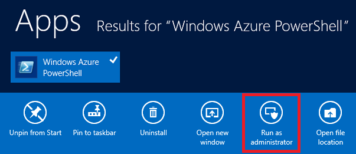
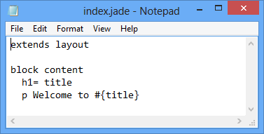

<properties urlDisplayName="Web App with Express" pageTitle="Веб-приложение с Express (Node.js) - учебник по Azure"metaKeywords ="Azure Node.js hello world, учебник Azure Node.js hello world, учебник Azure Node.js Приступая к работе, учебник Azure Node.js, учебник Azure Node.js Express" description="Настоящий учебник основывается на учебнике по облачным службам, и здесь демонстрируется использование модуля Express." metaCanonical="" services="cloud-services" documentationCenter="nodejs" title="Build a Node.js web application using Express on an Azure Cloud Service" authors="larryfr" solutions="" manager="wpickett" editor="" />

<tags ms.service="cloud-services" ms.workload="tbd" ms.tgt_pltfrm="na" ms.devlang="nodejs" ms.topic="article" ms.date="09/17/2014" ms.author="wpickett" />

# Создание веб-приложения Node.js с использованием модуля Express в облачной службе Azure

Node.js включает минимальный набор функциональных возможностей в базовой среде выполнения. Разработчики часто используют сторонние модули для получения дополнительной функциональности при разработке приложения Node.js. В этом учебнике будет создано новое приложение с помощью модуля [Express][], который предоставляет платформу MVC для создания веб-приложений Node.js.

Снимок экрана завершенного приложения приведен ниже:

##Создание проекта облачной службы

Чтобы создать новый проект облачной службы с именем expressapp, выполните следующие действия.

1. Из **меню "Пуск"** или с **рабочего стола** выполните поиск **Azure PowerShell**. Щелкните правой кнопкой мыши **Azure PowerShell** и выберите **Запуск от имени администратора**.

	

	[WACOM.INCLUDE [install-dev-tools](../includes/install-dev-tools.md)]

2. Перейдите в каталог **c:\\node**, а затем введите следующие команды, чтобы создать новое решение с именем **expressapp** и веб-роль с именем **WebRole1**:

		PS C:\node> New-AzureServiceProject expressapp
		PS C:\Node\expressapp> Add-AzureNodeWebRole
		PS C:\Node\expressapp> Set-AzureServiceProjectRole WebRole1 node 0.10.21

	> [WACOM.NOTE] По умолчанию **Add-AzureNodeWebRole** использует предыдущую версию Node.js. Показанная выше инструкция **Set-AzureServiceProjectRole** предписывает Azure использовать Node v0.10.21. 

##Установка модуля Express

1. Установите генератор Express, выполнив следующую команду:

		PS C:\node\expressapp> npm install express-generator -g

	Результат команды npm должен соответствовать показанному ниже результату. 

	

2. Перейдите в каталог **WebRole1** и используйте команду express для создания нового приложения.

        PS C:\node\expressapp\WebRole1> express

	Вам будет предложено перезаписать более раннюю версию приложения. Для продолжения введите **y** или **yes**. Модуль Express сформирует файл app.js и структуру папок для создания вашего приложения.

	

5.  Чтобы установить дополнительные зависимости, определенные в файле package.json, введите следующую команду:

        PS C:\node\expressapp\WebRole1> npm install

	

6.  С помощью следующей команды скопируйте файл **bin/www** в **server.js**. Таким образом, облачная служба сможет найти точку входа в это приложение.

		PS C:\node\expressapp\WebRole1> copy bin/www server.js

	После выполнения этой команды файл **server.js** должен находиться в каталоге WebRole1.

7.  Измените **server.js**, удалив один из символов "." из следующей строки.

		var app = require('../app');

	После сделанных изменений строка должна выглядеть следующим образом.

		var app = require('./app');

	Это изменение является обязательным, поскольку мы переместили файл (прежнее название **bin/www**,) в тот же каталог, что и обязательный файл приложения. После внесения изменений сохраните файл **server.js**.

8.  Выполнив следующую команду, запустите приложение в эмуляторе Microsoft Azure:

        PS C:\node\expressapp\WebRole1> Start-AzureEmulator -launch

	

## Изменение представления

Теперь измените представление для отображения сообщения "Вас приветствует Express в
Azure".

1.  Чтобы открыть файл index.jade, введите следующую команду:

        PS C:\node\expressapp\WebRole1> notepad views/index.jade

    

    Jade - это обработчик представлений по умолчанию, используемый приложениями Express. Дополнительные сведения об обработчике представлений Jade см. на сайте [http://jade-lang.com][].

2.  Измените последнюю строку текста, добавив **в Azure**.

	

3.  Сохраните файл и выйдите из Блокнота.

4.  Обновите браузер и увидите изменения.

	

После тестирования приложения с помощью командлета **Stop-AzureEmulator** остановите эмулятор.

##Публикация приложения в Azure

В окне Azure PowerShell с помощью командлета **Publish-AzureServiceProject** разверните приложение в облачной службе

    PS C:\node\expressapp\WebRole1> Publish-AzureServiceProject -ServiceName myexpressapp -Location "East US" -Launch

После завершения операции развертывания откроется браузер с отображением веб-страницы.

  [Веб-приложение Node.js]: http://www.windowsazure.com/ru-ru/develop/nodejs/tutorials/getting-started/
  [Express]: http://expressjs.com/
  [http://jade-lang.com]: http://jade-lang.com

<!--HONumber=35.2-->
