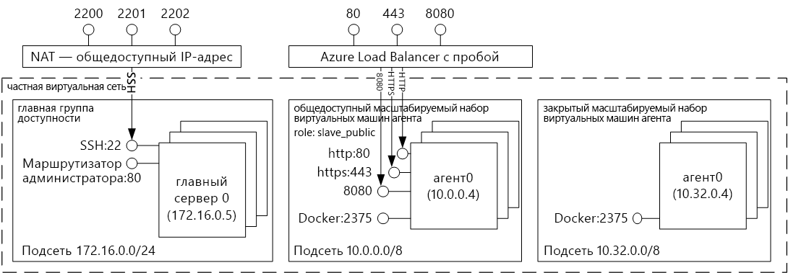

# Общие сведения о решениях для размещения контейнера Docker с помощью службы контейнеров Azure 

Служба контейнеров Azure позволяет упростить создание и настройку кластера виртуальных машин, настроенных для запуска контейнерных приложений, а также управление такими машинами. Используется оптимизированная конфигурация популярных средств планирования и оркестрации с открытым исходным кодом. Это позволяет использовать имеющиеся навыки либо положиться на опыт обширного и постоянно увеличивающегося сообщества при развертывании приложений на основе контейнера в Microsoft Azure и управлении ими.

Служба контейнеров Azure использует формат контейнера Docker, чтобы обеспечить полную переносимость контейнеров приложения. Она также поддерживает Marathon и DC/OS, Docker Swarm и Kubernetes, позволяя масштабировать эти приложения до тысяч и даже десятков тысяч контейнеров.

Служба контейнеров Azure позволяет воспользоваться преимуществами функций корпоративного уровня в Azure, сохранив при этом переносимость приложений, в том числе на уровнях оркестрации.

## Использование службы контейнеров Azure
Цель, которой мы стремимся достичь с помощью службы контейнеров Azure, заключается в том, чтобы предоставить среду для размещения контейнеров, применяя средства и технологии с открытым исходным кодом, которые сейчас пользуются популярностью среди наших клиентов. Для этого мы предоставляем стандартные конечные точки API для выбранного вами оркестратора (DC/OS, Docker Swarm или Kubernetes). С помощью этих конечных точек можно использовать любое программное обеспечение, способное взаимодействовать с ними. Например, в случае конечной точки Docker Swarm можно использовать интерфейс командной строки (CLI) Docker. Для DC/OS можно выбрать интерфейс командной строки DCOS. Для Kubernetes можно выбрать `kubectl`.

## Создание кластера Docker с помощью службы контейнеров Azure
Чтобы приступить к работе со Службой контейнеров Azure, разверните кластер Службы контейнеров Azure с помощью портала (выполните в Marketplace поиск по словам **Служба контейнеров Azure**), воспользовавшись шаблоном Azure Resource Manager ([Docker Swarm](https://github.com/Azure/azure-quickstart-templates/tree/master/101-acs-swarm), [DC/OS](https://github.com/Azure/azure-quickstart-templates/tree/master/101-acs-dcos) или [Kubernetes](https://github.com/Azure/azure-quickstart-templates/tree/master/101-acs-kubernetes)) или [Azure CLI 2.0](container-service-create-acs-cluster-cli.md). Предоставляемые шаблоны быстрого запуска можно изменять, включив дополнительную или расширенную конфигурацию Azure. Дополнительные сведения см. в статье [Развертывание кластера службы контейнеров Azure](container-service-deployment.md).

## Развертывание приложения
Служба контейнеров Azure позволяет выбрать для оркестрации Docker Swarm, DC/OS или Kubernetes. Способ развертывания приложения зависит от выбранного оркестратора.

### Использование DC/OS
DC/OS — это распределенная операционная система на базе ядра распределенных систем Apache Mesos. Apache Mesos принадлежит Apache Software Foundation. Среди пользователей и соавторов этой системы — [известные в ИТ-отрасли компании](http://mesos.apache.org/documentation/latest/powered-by-mesos/).

В DC/OS и Apache Mesos доступны впечатляющие функции.

* Надежная масштабируемость
* Отказоустойчивые, реплицируемые главная и подчиненные системы на базе Apache ZooKeeper
* Поддержка контейнеров в формате Docker
* Собственная изоляция между задачами с помощью контейнеров Linux
* Планирование множественных ресурсов (память, ЦП, диск и порты)
* API-интерфейсы Java, Python и C++ для разработки новых параллельных приложений
* Веб-интерфейс для просмотра состояния кластера

По умолчанию ОС DC/OS, работающая в службе контейнеров Azure, включает платформу оркестрации Marathon для планирования рабочих нагрузок. Однако при развертывании в DC/OS Службы контейнеров Azure также доступен пакет служб Mesosphere Universe, которые можно добавлять в свою службу. К ним относятся службы Spark, Hadoop, Cassandra и многие другие.

#### Использование Marathon
Marathon представляет собой систему инициализации и управления на уровне кластера для служб в cgroups или — как в случае со службой контейнеров Azure — в контейнерах в формате Docker. Marathon предоставляет веб-интерфейс, из которого можно развертывать приложения. Для доступа к нему используется URL-адрес, такой как `http://DNS_PREFIX.REGION.cloudapp.azure.com`, где DNS\_PREFIX и REGION определяются во время развертывания. Конечно же, вы можете задать свое собственное DNS-имя. Дополнительные сведения о запуске контейнера с помощью пользовательского веб-интерфейса Marathon см. в статье [Управление контейнером DC/OS службы контейнеров Azure с помощью веб-интерфейса Marathon](container-service-mesos-marathon-ui.md).

Кроме того, вы можете использовать интерфейсы REST API для взаимодействия с Marathon. Для каждого инструмента доступен ряд клиентских библиотек. Библиотеки представлены на разных языках и в каждом из них, разумеется, можно использовать протокол HTTP. Кроме того, Marathon поддерживается во многих популярных инструментах DevOps. Это обеспечивает максимальную гибкость работы с кластером службы контейнеров Azure. Дополнительные сведения о запуске контейнера с помощью REST API Marathon см. в статье [Управление контейнерами DC/OS с помощью REST API Marathon](container-service-mesos-marathon-rest.md).

### Использование Docker Swarm
Docker Swarm предоставляет собственные функции кластеризации для Docker. Поскольку Docker Swarm использует стандартный API Docker, любой инструмент, любое средство, которое уже взаимодействует с управляющей программой Docker, может использовать Swarm для прозрачного масштабирования на нескольких узлах в службе контейнеров Azure.

[!INCLUDE [container-service-swarm-mode-note](../../../includes/container-service-swarm-mode-note.md)]

К поддерживаемым средствам для управления контейнерами в кластере Swarm относятся следующие:

* Dokku
* Docker CLI и Docker Compose
* Krane
* Jenkins

### Использование Kubernetes
Kubernetes — это популярный инструмент оркестрации контейнеров для рабочих сред с открытым кодом. Kubernetes автоматизирует развертывание, масштабирование приложений-контейнеров и управление ими. Так как это решение имеет открытый исходный код и создано с использованием опыта сообщества разработчиков ПО с открытым исходным кодом, его можно с легкостью запустить в службе контейнеров Azure и использовать для развертывания контейнеров в ней.

Это решение предоставляет обширный набор возможностей, в том числе:
* горизонтальное масштабирование;
* обнаружение служб и балансировка нагрузки;
* управление секретами и конфигурациями;
* автоматические обновления и откаты на основе API;
* самовосстановление;

## Видеоролики
Приступая к работе со службой контейнеров Azure (101):  

> [!VIDEO https://channel9.msdn.com/Shows/Azure-Friday/Azure-Container-Service-101/player]
>
>

Создание приложений с помощью службы контейнеров Azure (Build 2016)

> [!VIDEO https://channel9.msdn.com/Events/Build/2016/B822/player]
>
>

## Дополнительная информация

Разверните кластер службы контейнеров с помощью [портала](container-service-deployment.md) или [Azure CLI 2.0](container-service-create-acs-cluster-cli.md).