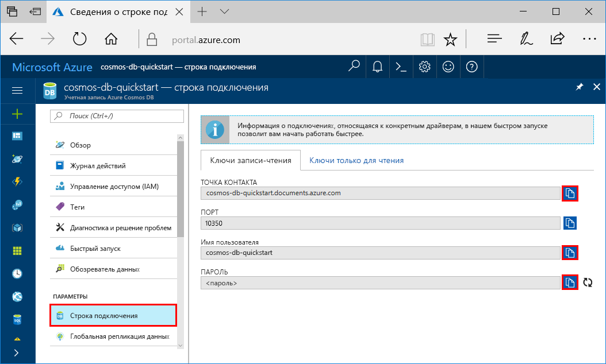
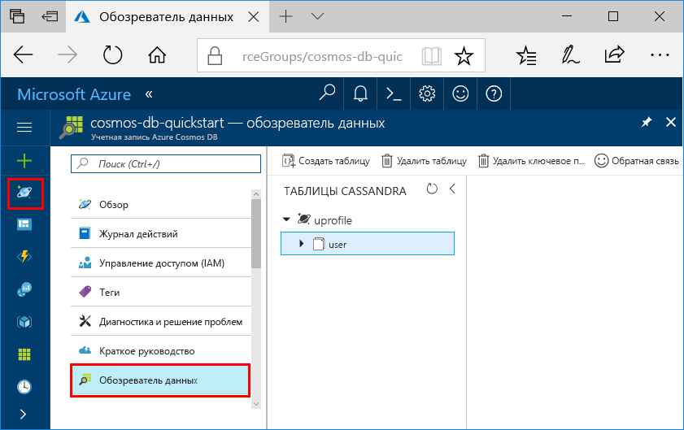

# <a name="quickstart-build-a-cassandra-app-with-net-sdk-and-azure-cosmos-db"></a>Краткое руководство. Создание приложения Cassandra с помощью пакета SDK для .NET и Azure Cosmos DB

> [!div class="op_single_selector"]
> * [.NET](create-cassandra-dotnet.md)
> * [Java](create-cassandra-java.md)
> * [Node.js](create-cassandra-nodejs.md)
> * [Python](create-cassandra-python.md)
>  

В этом руководстве показано, как использовать .NET и [API Cassandra](cassandra-introduction.md) в Azure Cosmos DB для создания приложения профиля путем клонирования примера с сайта GitHub. Кроме того, здесь показано, как создать учетную запись Azure Cosmos DB на веб-портале Azure.

Azure Cosmos DB — это глобально распределенная многомодельная служба базы данных Майкрософт. Вы можете быстро создавать и запрашивать документы, таблицы, пары "ключ — значение" и базы данных графов, используя возможности глобального распределения и горизонтального масштабирования Azure Cosmos DB. 

## <a name="prerequisites"></a>Предварительные требования

[!INCLUDE [quickstarts-free-trial-note](../../includes/quickstarts-free-trial-note.md)] Кроме того, можно воспользоваться [бесплатной пробной версией Azure Cosmos DB](https://azure.microsoft.com/try/cosmosdb/) без подписки Azure, оплаты и каких-либо обязательств.

Кроме того, вам потребуется: 
* Если вы еще не установили Visual Studio 2017, вы можете скачать и использовать **бесплатный** [выпуск Visual Studio Community 2017](https://www.visualstudio.com/downloads/). При установке Visual Studio необходимо включить возможность **разработки для Azure**.
* Установите [Git](https://www.git-scm.com/), чтобы клонировать пример.

<a id="create-account"></a>
## <a name="create-a-database-account"></a>Создание учетной записи базы данных

[!INCLUDE [cosmos-db-create-dbaccount-cassandra](../../includes/cosmos-db-create-dbaccount-cassandra.md)]


## <a name="clone-the-sample-application"></a>Клонирование примера приложения

Теперь перейдем к работе с кодом. Давайте клонируем приложение API Cassandra с GitHub, зададим строку подключения и выполним ее. Вы узнаете, как можно упростить работу с данными программным способом. 

1. Откройте окно командной строки. Создайте папку с именем `git-samples`. Затем закройте командную строку.

    ```bash
    md "C:\git-samples"
    ```

2. Откройте окно терминала git, например git bash, и выполните команду `cd`, чтобы перейти в новую папку для установки примера приложения.

    ```bash
    cd "C:\git-samples"
    ```

3. Выполните команду ниже, чтобы клонировать репозиторий с примером. Эта команда создает копию примера приложения на локальном компьютере.

    ```bash
    git clone https://github.com/Azure-Samples/azure-cosmos-db-cassandra-dotnet-getting-started.git
    ```

4. Затем откройте файл решения CassandraQuickStartSample в Visual Studio. 

## <a name="review-the-code"></a>Просмотр кода

Этот шаг не является обязательным. Если вы хотите узнать, как создавать ресурсы базы данных в коде, изучите приведенные ниже фрагменты кода. Фрагменты кода взяты из файла `Program.cs`, установленного в папке `C:\git-samples\azure-cosmos-db-cassandra-dotnet-getting-started\CassandraQuickStartSample`. Если вас это не интересует, можете сразу переходить к разделу [Обновление строки подключения](#update-your-connection-string).

* Инициализируйте сеанс путем подключения к конечной точке кластера Cassandra. API-интерфейс Cassandra в Azure Cosmos DB поддерживает только TLS версии 1.2. 

  ```csharp
   var options = new Cassandra.SSLOptions(SslProtocols.Tls12, true, ValidateServerCertificate);
   options.SetHostNameResolver((ipAddress) => CassandraContactPoint);
   Cluster cluster = Cluster.Builder().WithCredentials(UserName, Password).WithPort(CassandraPort).AddContactPoint(CassandraContactPoint).WithSSL(options).Build();
   ISession session = cluster.Connect();
   ```

* Создайте новое пространство ключей.

    ```csharp
    session.Execute("CREATE KEYSPACE uprofile WITH REPLICATION = { 'class' : 'NetworkTopologyStrategy', 'datacenter1' : 1 };"); 
    ```

* Создайте новую таблицу.

   ```csharp
  session.Execute("CREATE TABLE IF NOT EXISTS uprofile.user (user_id int PRIMARY KEY, user_name text, user_bcity text)");
   ```

* Вставьте пользовательские сущности, используя объект IMapper с новым сеансом, который подключается к пространству ключей uprofile.

    ```csharp
    mapper.Insert<User>(new User(1, "LyubovK", "Dubai"));
    ```
    
* Выполните запрос на получение информации обо всех пользователях.

    ```csharp
   foreach (User user in mapper.Fetch<User>("Select * from user"))
   {
      Console.WriteLine(user);
   }
    ```
    
* Выполните запрос на получение информации об одном пользователе.

    ```csharp
    mapper.FirstOrDefault<User>("Select * from user where user_id = ?", 3);
    ```

## <a name="update-your-connection-string"></a>Обновление строки подключения

Теперь вернитесь на портал Azure, чтобы получить данные строки подключения. Скопируйте эти данные в приложение. Информация из строки подключения обеспечивает обмен данными между приложением и размещенной базой данных.

1. На [портале Azure](https://portal.azure.com/) выберите **Строка подключения**.

    Вы можете использовать кнопку  в правой части экрана, чтобы скопировать значение параметра USERNAME (Имя пользователя).

    

2. В Visual Studio 2017 откройте файл Program.cs. 

3. Вставьте полученное на портале значение USERNAME вместо элемента `<FILLME>` в строке 13.

    Теперь строка 13 в файле Program.cs будет выглядеть примерно так: 

    `private const string UserName = "cosmos-db-quickstart";`

3. Вернитесь на портал и скопируйте значение PASSWORD (Пароль). Вставьте полученное на портале значение PASSWORD вместо элемента `<FILLME>` в строке 14.

    Теперь строка 14 в файле Program.cs будет выглядеть примерно так: 

    `private const string Password = "2Ggkr662ifxz2Mg...==";`

4. Вернитесь на портал и скопируйте значение CONTACT POINT (Точка контакта). Вставьте полученное на портале значение параметра CONTACT POINT над элементом `<FILLME>` в строке 15.

    Теперь строка 15 в файле Program.cs будет выглядеть примерно так: 

    `private const string CassandraContactPoint = "cosmos-db-quickstarts.cassandra.cosmosdb.azure.com"; //  DnsName`

5. Сохраните файл Program.cs.
    
## <a name="run-the-net-app"></a>Запустите приложение .NET.

1. В Visual Studio выберите **Сервис** > **Диспетчер пакетов NuGet** > **Консоль диспетчера пакетов**.

2. В командной строке введите указанную ниже команду, чтобы установить пакет NuGet драйвера .NET. 

    ```cmd
    Install-Package CassandraCSharpDriver
    ```
3. Нажмите клавиши CTRL + F5 для запуска приложения. Приложение откроется в окне консоли. 

    

    Нажмите клавиши CTRL+C, чтобы остановить выполнение программы и закрыть окно консоли. 
    
4. На портале Azure откройте **обозреватель данных**, чтобы запросить, изменить и обработать новые данные.

    

## <a name="review-slas-in-the-azure-portal"></a>Просмотр соглашений об уровне обслуживания на портале Azure

[!INCLUDE [cosmosdb-tutorial-review-slas](../../includes/cosmos-db-tutorial-review-slas.md)]

## <a name="clean-up-resources"></a>Очистка ресурсов

[!INCLUDE [cosmosdb-delete-resource-group](../../includes/cosmos-db-delete-resource-group.md)]

## <a name="next-steps"></a>Дополнительная информация

В этом кратком руководстве описано, как создать учетную запись Azure Cosmos DB и контейнер с помощью обозревателя данных, а также как запустить веб-приложение. Теперь можно импортировать дополнительные данные в учетную запись Azure Cosmos DB. 

> [!div class="nextstepaction"]
> [Импорт данных Cassandra в Azure Cosmos DB](cassandra-import-data.md)
