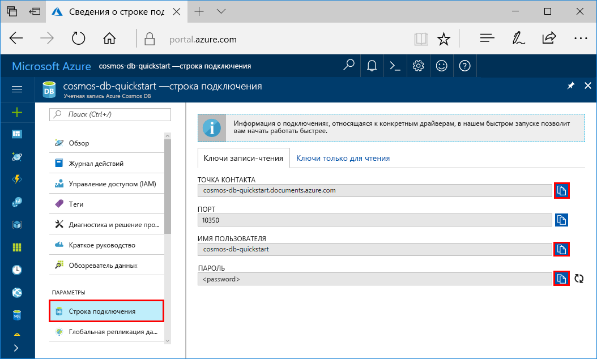
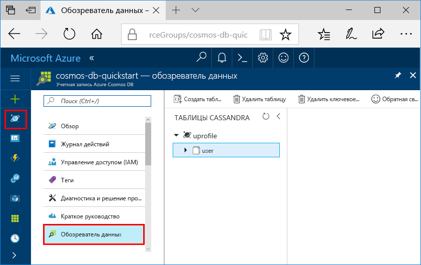

# <a name="quickstart-build-a-cassandra-app-with-nodejs-and-azure-cosmos-db"></a>Краткое руководство. Создание приложения Cassandra с помощью Node.js и Azure Cosmos DB

В этом руководстве показано, как использовать Node.js и [API Cassandra](cassandra-introduction.md) Azure Cosmos DB для создания приложения профиля путем клонирования примера с сайта GitHub. Кроме того, здесь показано, как создать учетную запись Azure Cosmos DB с помощью веб-портала Azure.

Azure Cosmos DB — это глобально распределенная многомодельная служба базы данных Майкрософт. Вы можете быстро создавать и запрашивать документы, таблицы, пары "ключ — значение" и базы данных графов, используя преимущества возможностей глобального распределения и горизонтального масштабирования Azure Cosmos DB. 

## <a name="prerequisites"></a>Предварительные требования

* Войдите в программу предварительной версии API Cassandra Azure Cosmos DB. Если вы еще не подали заявку для получения доступа, [зарегистрируйтесь сейчас](https://aka.ms/cosmosdb-cassandra-signup).
* [Node.js](https://nodejs.org/en/) версии 0.10.29 или более поздней.
* [Git.](http://git-scm.com/)

[!INCLUDE [quickstarts-free-trial-note](../../includes/quickstarts-free-trial-note.md)]Кроме того, [бесплатную пробную версию Azure Cosmos DB](https://azure.microsoft.com/try/cosmosdb/) можно использовать без подписки Azure, без оплаты и каких-либо обязательств.


## <a name="create-a-database-account"></a>Создание учетной записи базы данных

Перед созданием базы данных документов необходимо создать учетную запись Cassandra с Azure Cosmos DB.

[!INCLUDE [cosmos-db-create-dbaccount-cassandra](../../includes/cosmos-db-create-dbaccount-cassandra.md)]

## <a name="clone-the-sample-application"></a>Клонирование примера приложения

Теперь необходимо клонировать приложение API Cassandra с GitHub. Задайте строку подключения и выполните ее. Вы узнаете, как можно упростить работу с данными программным способом. 

1. Откройте окно терминала git, например git bash, и выполните команду `cd`, чтобы перейти в папку для установки примера приложения. 

    ```bash
    cd "C:\git-samples"
    ```

2. Выполните команду ниже, чтобы клонировать репозиторий с примером. Эта команда создает копию примера приложения на локальном компьютере.

    ```bash
    git clone https://github.com/Azure-Samples/azure-cosmos-db-cassandra-nodejs-getting-started.git
    ```

## <a name="review-the-code"></a>Просмотр кода

Этот шаг не является обязательным. Если вы хотите узнать, как создать в коде ресурсы базы данных, изучите приведенные ниже фрагменты кода. Они взяты из файла `uprofile.js`, который расположен в папке C:\git-samples\azure-cosmos-db-cassandra-nodejs-getting-started. Если вас это не интересует, можете сразу переходить к разделу [Обновление строки подключения](#update-your-connection-string). 

* Имя пользователя и пароль задаются с помощью страницы строки подключения на портале Azure. В path\to\cert указан путь к сертификату X509. 

   ```nodejs
   var ssl_option = {
        cert : fs.readFileSync("path\to\cert"),
        rejectUnauthorized : true,
        secureProtocol: 'TLSv1_2_method'
        };
   const authProviderLocalCassandra = new cassandra.auth.PlainTextAuthProvider(config.username, config.password);
   ```

* `client` инициализируется со сведениями contactPoint. contactPoint извлекается с портала Azure.

    ```nodejs
    const client = new cassandra.Client({contactPoints: [config.contactPoint], authProvider: authProviderLocalCassandra, sslOptions:ssl_option});
    ```

* `client` подключается к API Cassandra Azure Cosmos DB.

    ```nodejs
    client.connect(next);
    ```

* Создается пространство ключей.

    ```nodejs
    function createKeyspace(next) {
        var query = "CREATE KEYSPACE IF NOT EXISTS uprofile WITH replication = {\'class\': \'NetworkTopologyStrategy\', \'datacenter1\' : \'1\' }";
        client.execute(query, next);
        console.log("created keyspace");    
  }
    ```

* Создается таблица.

   ```nodejs
   function createTable(next) {
    var query = "CREATE TABLE IF NOT EXISTS uprofile.user (user_id int PRIMARY KEY, user_name text, user_bcity text)";
        client.execute(query, next);
        console.log("created table");
   },
   ```

* Вставляются сущности ключа и значения.

    ```nodejs
    ...
       {
          query: 'INSERT INTO  uprofile.user  (user_id, user_name , user_bcity) VALUES (?,?,?)',
          params: [5, 'IvanaV', 'Belgaum', '2017-10-3136']
        }
    ];
    client.batch(queries, { prepare: true}, next);
    ```

* Запрос на получение всех значений ключа.

    ```nodejs
   var query = 'SELECT * FROM uprofile.user';
    client.execute(query, { prepare: true}, function (err, result) {
      if (err) return next(err);
      result.rows.forEach(function(row) {
        console.log('Obtained row: %d | %s | %s ',row.user_id, row.user_name, row.user_bcity);
      }, this);
      next();
    });
    ```  
    
* Запрос на получение значения ключа.

    ```nodejs
    function selectById(next) {
        console.log("\Getting by id");
        var query = 'SELECT * FROM uprofile.user where user_id=1';
        client.execute(query, { prepare: true}, function (err, result) {
        if (err) return next(err);
            result.rows.forEach(function(row) {
            console.log('Obtained row: %d | %s | %s ',row.user_id, row.user_name, row.user_bcity);
        }, this);
        next();
        });
    }
    ```  

## <a name="update-your-connection-string"></a>Обновление строки подключения

Теперь вернитесь на портал Azure, чтобы получить данные строки подключения. Скопируйте эти данные в приложение. Так вы обеспечите обмен данными между приложением и размещенной базой данных.

1. На [портале Azure](http://portal.azure.com/) нажмите кнопку **Строка подключения**. 

    Вы можете использовать кнопку  в правой части экрана, чтобы скопировать значение параметра Contact point (Контакт).

    

2. Откройте файл `config.js` . 

3. Вставьте полученное на портале значение параметра Contact point (Контакт) над элементом `<FillMEIN>` в строке 4.

    Теперь строка 4 должна выглядеть примерно так: 

    `config.contactPoint = "cosmos-db-quickstarts.documents.azure.com:10350"`

4. Скопируйте значение параметра "Пользователь" на портале и вставьте его над элементом `<FillMEIN>` в строке 2.

    Теперь строка 2 должна выглядеть примерно так: 

    `config.username = 'cosmos-db-quickstart';`
    
5. Скопируйте значение параметра "Пароль" с портала и вставьте его над элементом `<FillMEIN>` в строке 3.

    Теперь строка 3 должна выглядеть примерно так:

    `config.password = '2Ggkr662ifxz2Mg==';`

6. Сохраните файл config.js.
    
## <a name="use-the-x509-certificate"></a>Использование сертификата X509 

1. Если требуется добавить Baltimore CyberTrust Root, он имеет серийный номер 02:00:00:b9 и отпечаток пальца SHA1 d4🇩🇪20:d0:5e:66:fc:53:fe:1a:50:88:2c:78:db:28:52:ca:e4:74. Его можно скачать по адресу https://cacert.omniroot.com/bc2025.crt и сохранить в локальном файле с расширением CER. 

2. Откройте uprofile.js и измените path\to\cert, чтобы указать на новый сертификат. 

3. Сохраните uprofile.js. 

## <a name="run-the-app"></a>Запуск приложения

1. В окне терминала git введите команду `npm install`, чтобы установить необходимые модули npm.

2. Запустите `node uprofile.js`, чтобы запустить приложение Node.

3. Проверьте результаты из командной строки.

    Нажмите клавиши CTRL + C, чтобы остановить выполнение программы и закрыть окно консоли. 

    Откройте обозреватель данных на портале Azure. Здесь вы можете просматривать, запрашивать и изменять новые данные, а также работать с ними. 

     

## <a name="review-slas-in-the-azure-portal"></a>Просмотр соглашений об уровне обслуживания на портале Azure

[!INCLUDE [cosmosdb-tutorial-review-slas](../../includes/cosmos-db-tutorial-review-slas.md)]

## <a name="clean-up-resources"></a>Очистка ресурсов

[!INCLUDE [cosmosdb-delete-resource-group](../../includes/cosmos-db-delete-resource-group.md)]

## <a name="next-steps"></a>Дальнейшие действия

В этом кратком руководстве вы узнали, как создать учетную запись Azure Cosmos DB, коллекцию с помощью обозревателя данных, а также как запустить приложение. Теперь можно импортировать дополнительные данные в учетную запись Azure Cosmos DB. 

> [!div class="nextstepaction"]
> [Azure Cosmos DB: Import Cassandra data](cassandra-import-data.md) (Azure Cosmos DB: импорт данных Cassandra)


