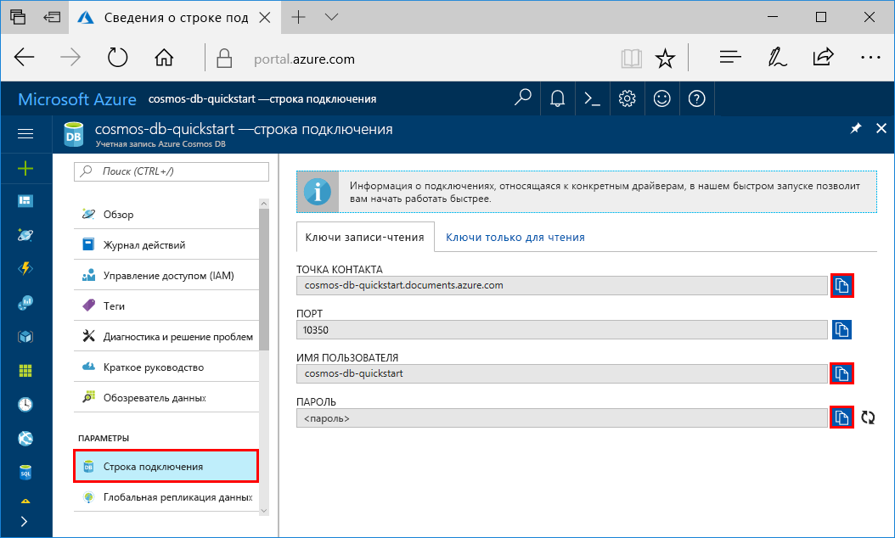

# <a name="quickstart-build-a-cassandra-app-with-python-and-azure-cosmos-db"></a>Краткое руководство. Создание приложения Cassandra с помощью Python и Azure Cosmos DB

В этом руководстве показано, как использовать Python и [API Cassandra](cassandra-introduction.md) Azure Cosmos DB для создания приложения профиля путем клонирования примера с сайта GitHub. Кроме того, здесь показано, как создать учетную запись Azure Cosmos DB с помощью веб-портала Azure.

Azure Cosmos DB — это глобально распределенная многомодельная служба базы данных Майкрософт. Вы можете быстро создавать и запрашивать документы, таблицы, пары "ключ — значение" и базы данных графов, используя возможности глобального распределения и горизонтального масштабирования Azure Cosmos DB.   

## <a name="prerequisites"></a>предварительным требованиям

[!INCLUDE [quickstarts-free-trial-note](../../includes/quickstarts-free-trial-note.md)] Кроме того, можно воспользоваться [бесплатной пробной версией Azure Cosmos DB](https://azure.microsoft.com/try/cosmosdb/) без подписки Azure, оплаты и каких-либо обязательств.

Войдите в предварительную версию API Cassandra Azure Cosmos DB. Если вы еще не подали заявку на получение доступа, [зарегистрируйтесь сейчас](cassandra-introduction.md#sign-up-now).

Кроме того, сделайте следующее:
* [Python](https://www.python.org/downloads/) версии 2.7.14
* [Git.](http://git-scm.com/)
* [Драйвер Python для Apache Cassandra](https://github.com/datastax/python-driver)

## <a name="create-a-database-account"></a>Создание учетной записи базы данных

Прежде чем создавать базу данных документов, необходимо создать в Azure Cosmos DB учетную запись Cassandra.

[!INCLUDE [cosmos-db-create-dbaccount-cassandra](../../includes/cosmos-db-create-dbaccount-cassandra.md)]

## <a name="clone-the-sample-application"></a>Клонирование примера приложения

Теперь необходимо клонировать приложение API Cassandra с GitHub. Задайте строку подключения и выполните ее. Вы узнаете, как можно упростить работу с данными программным способом. 

1. Откройте командную строку, создайте папку git-samples, а затем закройте окно командной строки.

    ```bash
    md "C:\git-samples"
    ```

2. Откройте окно терминала git, например git bash, и выполните команду `cd`, чтобы перейти в новую папку для установки примера приложения.

    ```bash
    cd "C:\git-samples"
    ```

3. Выполните команду ниже, чтобы клонировать репозиторий с примером. Эта команда создает копию примера приложения на локальном компьютере.

    ```bash
    git clone https://github.com/Azure-Samples/azure-cosmos-db-cassandra-python-getting-started.git
    ```

## <a name="review-the-code"></a>Просмотр кода

Этот шаг не является обязательным. Если вы хотите узнать, как создать в коде ресурсы базы данных, изучите приведенные ниже фрагменты кода. Фрагменты кода взяты из файла pyquickstart.py. Если вас это не интересует, можете сразу переходить к разделу [Обновление строки подключения](#update-your-connection-string). 

* Имя пользователя и пароль задаются с помощью страницы строки подключения на портале Azure. Замените path\to\cert путем к вашему сертификату X509.

   ```python
    ssl_opts = {
            'ca_certs': 'path\to\cert',
            'ssl_version': ssl.PROTOCOL_TLSv1_2
            }
    auth_provider = PlainTextAuthProvider( username=cfg.config['username'], password=cfg.config['password'])
    cluster = Cluster([cfg.config['contactPoint']], port = cfg.config['port'], auth_provider=auth_provider, ssl_options=ssl_opts)
    session = cluster.connect()
   
   ```

* `cluster` инициализируется со сведениями contactPoint. contactPoint извлекается с портала Azure.

    ```python
   cluster = Cluster([cfg.config['contactPoint']], port = cfg.config['port'], auth_provider=auth_provider)
    ```

* `cluster` подключается к API Cassandra Azure Cosmos DB.

    ```python
    session = cluster.connect()
    ```

* Создается пространство ключей.

    ```python
   session.execute('CREATE KEYSPACE IF NOT EXISTS uprofile WITH replication = {\'class\': \'NetworkTopologyStrategy\', \'datacenter1\' : \'1\' }')
    ```

* Создается таблица.

   ```
   session.execute('CREATE TABLE IF NOT EXISTS uprofile.user (user_id int PRIMARY KEY, user_name text, user_bcity text)');
   ```

* Вставляются сущности ключа и значения.

    ```Python
    insert_data = session.prepare("INSERT INTO  uprofile.user  (user_id, user_name , user_bcity) VALUES (?,?,?)")
    batch = BatchStatement()
    batch.add(insert_data, (1, 'LyubovK', 'Dubai'))
    batch.add(insert_data, (2, 'JiriK', 'Toronto'))
    batch.add(insert_data, (3, 'IvanH', 'Mumbai'))
    batch.add(insert_data, (4, 'YuliaT', 'Seattle'))
    ....
    session.execute(batch)
    ```

* Запрос на получение всех значений ключа.

    ```Python
    rows = session.execute('SELECT * FROM uprofile.user')
    ```  
    
* Запрос на получение значения ключа.

    ```Python
    
    rows = session.execute('SELECT * FROM uprofile.user where user_id=1')
    ```  

## <a name="update-your-connection-string"></a>Обновление строки подключения

Теперь вернитесь на портал Azure, чтобы получить данные строки подключения. Скопируйте эти данные в приложение. Так вы обеспечите обмен данными между приложением и размещенной базой данных.

1. На [портале Azure](http://portal.azure.com/) щелкните **Строка подключения**. 

    Вы можете использовать кнопку  в правой части экрана, чтобы скопировать значение параметра Contact point (Контакт).

    

2. Откройте файл `config.py` . 

3. Вставьте полученное на портале значение параметра Contact point (Контакт) над элементом `<FILLME>` в строке 10.

    Теперь строка 10 должна выглядеть примерно так: 

    `'contactPoint': 'cosmos-db-quickstarts.documents.azure.com:10350'`

4. Скопируйте значение параметра "Пользователь" на портале и вставьте его над элементом `<FILLME>` в строке 6.

    Теперь строка 6 должна выглядеть примерно так: 

    `'username': 'cosmos-db-quickstart',`
    
5. Скопируйте значение параметра "Пароль" с портала и вставьте его над элементом `<FILLME>` в строке 8.

    Теперь строка 8 должна выглядеть примерно так:

    `'password' = '2Ggkr662ifxz2Mg==`';`

6. Сохраните файл config.py.
    
## <a name="use-the-x509-certificate"></a>Использование сертификата X509

1. Если требуется добавить Baltimore CyberTrust Root, он имеет серийный номер 02:00:00:b9 и отпечаток пальца SHA1 d4🇩🇪20:d0:5e:66:fc:53:fe:1a:50:88:2c:78:db:28:52:ca:e4:74. Его можно скачать по адресу https://cacert.omniroot.com/bc2025.crt и сохранить в локальном файле с расширением CER.

2. Откройте pyquickstart.py и измените path\to\cert, чтобы указать на новый сертификат.

3. Сохраните pyquickstart.py.

## <a name="run-the-app"></a>Запуск приложения

1. Выполните команду cd в окне терминала git, чтобы переключиться на папку azure-cosmos-db-cassandra-python-getting-started. 

2. Чтобы установить необходимые модули, выполните следующие команды:

    ```python
    python -m pip install cassandra-driver
    python -m pip install prettytable
    python -m pip install requests
    python -m pip install pyopenssl
    ```

2. Запустите веб-приложение с помощью следующей команды:

    ```
    python pyquickstart.py
    ```

3. Проверьте результаты из командной строки.

    Нажмите клавиши CTRL+C, чтобы остановить выполнение программы и закрыть окно консоли. 

    
    
    Откройте обозреватель данных на портале Azure. Здесь вы можете просматривать, запрашивать, изменять и обрабатывать новые данные. 

    

## <a name="review-slas-in-the-azure-portal"></a>Просмотр соглашений об уровне обслуживания на портале Azure

[!INCLUDE [cosmosdb-tutorial-review-slas](../../includes/cosmos-db-tutorial-review-slas.md)]

## <a name="clean-up-resources"></a>Очистка ресурсов

[!INCLUDE [cosmosdb-delete-resource-group](../../includes/cosmos-db-delete-resource-group.md)]

## <a name="next-steps"></a>Дополнительная информация

В этом кратком руководстве вы узнали, как создать учетную запись Azure Cosmos DB, коллекцию с помощью обозревателя данных, а также как запустить приложение. Теперь можно импортировать дополнительные данные в учетную запись Azure Cosmos DB. 

> [!div class="nextstepaction"]
> [Импорт данных Cassandra в Azure Cosmos DB](cassandra-import-data.md)

