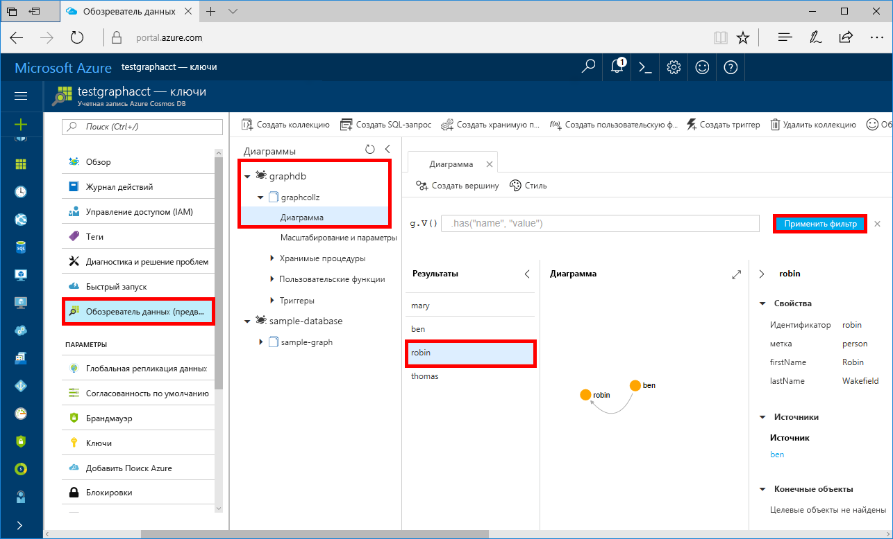

# <a name="azure-cosmos-db-build-a-net-framework-or-core-application-using-the-graph-api"></a>Azure Cosmos DB. Создание приложения .NET Framework или Core с помощью API Graph

Azure Cosmos DB — это глобально распределенная многомодельная служба базы данных Майкрософт. Вы можете быстро создавать и запрашивать документы, пары "ключ — значение" и базы данных графов, используя преимущества возможностей глобального распределения и горизонтального масштабирования базы данных Azure Cosmos DB. 

В этом кратком руководстве показано, как создать учетную запись Azure Cosmos DB, базу данных и граф (контейнер) с помощью портала Azure. Затем вы создадите и запустите консольное приложение на базе [API Graph](graph-sdk-dotnet.md).  

## <a name="prerequisites"></a>предварительным требованиям

Если вы еще не установили Visual Studio 2017, вы можете скачать и использовать **бесплатный** [выпуск Community для Visual Studio 2017](https://www.visualstudio.com/downloads/). При установке Visual Studio необходимо включить возможность **разработки для Azure**.

Если у вас есть Visual Studio 2017, проверьте наличие [обновления 3 для Visual Studio 2017](https://www.visualstudio.com/en-us/news/releasenotes/vs2017-relnotes).

[!INCLUDE [quickstarts-free-trial-note](../../includes/quickstarts-free-trial-note.md)]

## <a name="create-a-database-account"></a>Создание учетной записи базы данных

[!INCLUDE [cosmos-db-create-dbaccount-graph](../../includes/cosmos-db-create-dbaccount-graph.md)]

## <a name="add-a-graph"></a>Добавление графа

[!INCLUDE [cosmos-db-create-graph](../../includes/cosmos-db-create-graph.md)]

## <a name="clone-the-sample-application"></a>Клонирование примера приложения

Теперь необходимо клонировать приложение API Graph из GitHub. Задайте строку подключения и выполните ее. Вы узнаете, как можно упростить работу с данными программным способом. 

Этот пример проекта использует формат проекта .NET Core. В нем настроена поддержка следующих платформ:
 - netcoreapp2.0
 - net461

1. Откройте окно терминала Git, например Git Bash, и выполните команду `cd`, чтобы перейти в рабочий каталог.  

2. Выполните команду ниже, чтобы клонировать репозиторий с примером. 

    ```bash
    git clone https://github.com/Azure-Samples/azure-cosmos-db-graph-dotnet-getting-started.git
    ```

3. Затем откройте файл решения в Visual Studio. 

## <a name="review-the-code"></a>Просмотр кода

Сделаем краткий обзор того, что происходит в приложении. Откройте файл Program.cs, и вы увидите, что эти строки кода создают ресурсы Azure Cosmos DB. 

* Инициализация экземпляра DocumentClient. В предварительной версии мы добавили API расширения графа в клиент Azure Cosmos DB. Мы работаем над автономным клиентом графа, не связанным с клиентом Azure Cosmos DB и ресурсами.

    ```csharp
    using (DocumentClient client = new DocumentClient(
        new Uri(endpoint),
        authKey,
        new ConnectionPolicy { ConnectionMode = ConnectionMode.Direct, ConnectionProtocol = Protocol.Tcp }))
    ```

* Создание базы данных.

    ```csharp
    Database database = await client.CreateDatabaseIfNotExistsAsync(new Database { Id = "graphdb" });
    ```

* Создание графа.

    ```csharp
    DocumentCollection graph = await client.CreateDocumentCollectionIfNotExistsAsync(
        UriFactory.CreateDatabaseUri("graphdb"),
        new DocumentCollection { Id = "graph" },
        new RequestOptions { OfferThroughput = 1000 });
    ```
* Выполнение шагов Gremlin с использованием метода `CreateGremlinQuery`.

    ```csharp
    // The CreateGremlinQuery method extensions allow you to execute Gremlin queries and iterate
    // results asychronously
    IDocumentQuery<dynamic> query = client.CreateGremlinQuery<dynamic>(graph, "g.V().count()");
    while (query.HasMoreResults)
    {
        foreach (dynamic result in await query.ExecuteNextAsync())
        {
            Console.WriteLine($"\t {JsonConvert.SerializeObject(result)}");
        }
    }

    ```

## <a name="update-your-connection-string"></a>Обновление строки подключения

Теперь вернитесь на портал Azure, чтобы получить данные строки подключения. Скопируйте эти данные в приложение.

1. На [портале Azure](http://portal.azure.com/) щелкните **Ключи**. 

    Скопируйте первую часть значения URI.

    

2. В Visual Studio 2017 откройте файл appsettings.json и вставьте значение вместо `FILLME` в `endpoint`. 

    `"endpoint": "https://FILLME.documents.azure.com:443/",`

    Значение конечной точки должно выглядеть так:

    `"endpoint": "https://testgraphacct.documents.azure.com:443/",`

3. Если учетная запись для базы данных графа создана до 27 ноября 2017 г., замените `documents` на `graphs` в значении `endpoint`. Если учетная запись для базы данных графа создана 27 ноября 2017 г. или позднее, замените `documents` на `gremlin.cosmosdb` в значении `endpoint`.

    Значение конечной точки должно выглядеть так:

    `"endpoint": "https://testgraphacct.graphs.azure.com:443/",` или `"endpoint": "https://testgraphacct.gremlin.cosmosdb.azure.com:443/",`

4. Скопируйте значение **первичного ключа** с портала и добавьте его в качестве значения параметра ключа AuthKey в App.config, а затем сохраните изменения. 

    `"authkey": "FILLME"`

5. Сохраните файл appsettings.json. 

Теперь приложение со всеми сведениями, необходимыми для взаимодействия с Azure Cosmos DB, обновлено. 

## <a name="run-the-console-app"></a>Запуск консольного приложения

Перед запуском приложения рекомендуется обновить пакет *Microsoft.Azure.Graphs* до последней версии.

1. В Visual Studio в **обозревателе решений** щелкните проект **GraphGetStarted** правой кнопкой мыши и выберите **Управление пакетами NuGet**. 

2. На вкладке **обновлений** диспетчера пакетов NuGet введите *Microsoft.Azure.Graphs* и установите флажок для поля **включения предварительного выпуска**. 

3. В полученном результате обновите библиотеку **Microsoft.Azure.Graphs** до последней версии пакета. При этом установится пакет библиотеки расширений графов Azure Cosmos DB и все зависимые компоненты.

    Если появится сообщение о просмотре изменений в решении, нажмите кнопку **ОК**. Если появится сообщение о принятии условий лицензионного соглашения, щелкните **Принимаю**.

4. Нажмите клавиши CTRL+F5 для запуска приложения.

   В окне консоли появятся вершины и ребра, добавляемые в граф. После завершения сценария закройте окно консоли, дважды нажав клавишу ВВОД.

## <a name="browse-using-the-data-explorer"></a>Просмотр с помощью обозревателя данных

Теперь вернитесь в обозреватель данных на портале Azure. Здесь вы можете просмотреть и запросить новые данные графа.

1. В обозревателе данных новая база данных отображается в области "Графы". Разверните **graphdb** и **graphcollz**, а затем щелкните **График**.

2. Нажмите кнопку **Применить фильтр**, чтобы использовать запрос по умолчанию для просмотра всех вершин графа. Данные, созданные в примере приложения, отображаются на панели Graphs (Графы).

    Вы можете масштабировать граф, развернуть отображаемое пространство, добавить дополнительные вершины и переместить их на поверхность отображения.

    

## <a name="review-slas-in-the-azure-portal"></a>Просмотр соглашений об уровне обслуживания на портале Azure

[!INCLUDE [cosmosdb-tutorial-review-slas](../../includes/cosmos-db-tutorial-review-slas.md)]

## <a name="clean-up-resources"></a>Очистка ресурсов

Если вы не собираетесь использовать это приложение дальше, удалите все ресурсы, созданные в ходе работы с этим руководством, на портале Azure, сделав следующее: 

1. В меню слева на портале Azure щелкните **Группы ресурсов**, а затем выберите имя созданного ресурса. 
2. На странице группы ресурсов щелкните **Удалить**, в текстовом поле введите имя ресурса для удаления и щелкните **Удалить**.

## <a name="next-steps"></a>Дополнительная информация

В этом кратком руководстве вы узнали, как создать учетную запись Azure Cosmos DB, граф с помощью обозревателя данных, а также как запустить приложение. Теперь вы можете создавать более сложные запросы и внедрять эффективную логику обхода графа с помощью Gremlin. 

> [!div class="nextstepaction"]
> [Как выполнять запросы к данным в базе данных Azure Cosmos DB с помощью API Graph (предварительная версия)](tutorial-query-graph.md)

