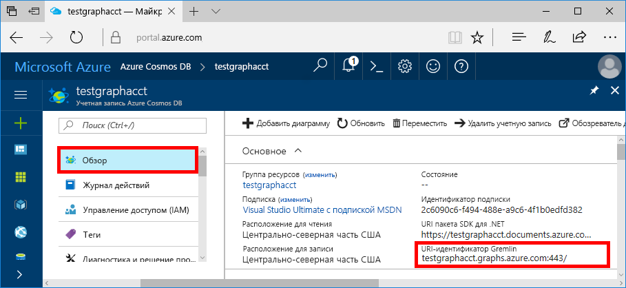
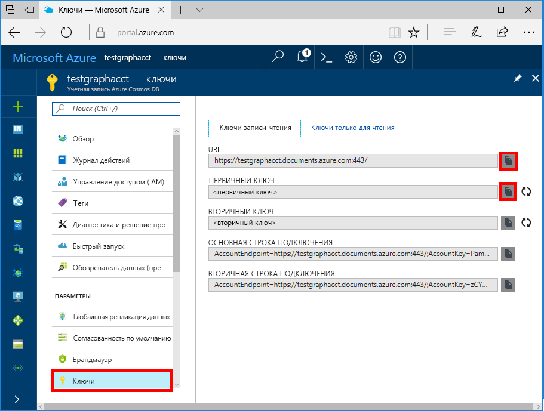

# <a name="azure-cosmos-db-build-a-nodejs-application-by-using-graph-api"></a>Azure Cosmos DB. Создание приложения Node.js с помощью API Graph

Azure Cosmos DB — это глобально распределенная многомодельная служба базы данных Майкрософт. Вы можете быстро создавать и запрашивать документы, пары "ключ — значение" и базы данных графов, используя преимущества возможностей глобального распределения и горизонтального масштабирования базы данных Azure Cosmos DB. 

В этом кратком руководстве объясняется, как создать учетную запись Azure Cosmos DB для API Graph, базу данных и граф с помощью портала Azure. Затем вы можете создать и запустить консольное приложение, используя драйвер [Gremlin Node.js](https://www.npmjs.com/package/gremlin) с открытым кодом.

## <a name="prerequisites"></a>предварительным требованиям

Для выполнения этого примера вам потребуется:
* [Node.js](https://nodejs.org/en/) v0.10.29 или более поздней версии;
* [Git.](http://git-scm.com/)

[!INCLUDE [quickstarts-free-trial-note](../../includes/quickstarts-free-trial-note.md)]

## <a name="create-a-database-account"></a>Создание учетной записи базы данных

[!INCLUDE [cosmos-db-create-dbaccount-graph](../../includes/cosmos-db-create-dbaccount-graph.md)]

## <a name="add-a-graph"></a>Добавление графа

[!INCLUDE [cosmos-db-create-graph](../../includes/cosmos-db-create-graph.md)]

## <a name="clone-the-sample-application"></a>Клонирование примера приложения

Теперь необходимо клонировать приложение API Graph из GitHub. Задайте строку подключения и выполните ее. Вы узнаете, как можно упростить работу с данными программным способом. 

1. Откройте окно терминала Git (например, Git Bash) и перейдите в рабочий каталог, выполнив команду `cd`.

2. Выполните следующую команду, чтобы клонировать репозиторий с примером. 

    ```bash
    git clone https://github.com/Azure-Samples/azure-cosmos-db-graph-nodejs-getting-started.git
    ```

3. Откройте файл решения в Visual Studio. 

## <a name="review-the-code"></a>Просмотр кода

Сделаем краткий обзор того, что происходит в приложении. Откройте файл `app.js`, и вы увидите приведенные ниже строки кода. 

* Создание клиента Gremlin.

    ```nodejs
    const client = Gremlin.createClient(
        443, 
        config.endpoint, 
        { 
            "session": false, 
            "ssl": true, 
            "user": `/dbs/${config.database}/colls/${config.collection}`,
            "password": config.primaryKey
        });
    ```

  Все конфигурации находятся в файле `config.js`, который мы изменим в [следующем разделе](#update-your-connection-string).

* Для выполнения различных операций Gremlin определяется набор функций. Это один из них:

    ```nodejs
    function addVertex1(callback)
    {
        console.log('Running Add Vertex1'); 
        client.execute("g.addV('person').property('id', 'thomas').property('firstName', 'Thomas').property('age', 44).property('userid', 1)", { }, (err, results) => {
          if (err) callback(console.error(err));
          console.log("Result: %s\n", JSON.stringify(results));
          callback(null)
        });
    }
    ```

* Каждая функция выполняет метод `client.execute` с параметром строки запроса Gremlin. Ниже приведен пример выполнения `g.V().count()`:

    ```nodejs
    console.log('Running Count'); 
    client.execute("g.V().count()", { }, (err, results) => {
        if (err) return console.error(err);
        console.log(JSON.stringify(results));
        console.log();
    });
    ```

* В конце файла все методы вызываются с помощью метода `async.waterfall()`. После этого они выполняются один за другим:

    ```nodejs
    try{
        async.waterfall([
            dropGraph,
            addVertex1,
            addVertex2,
            addEdge,
            countVertices
            ], finish);
    } catch(err) {
        console.log(err)
    }
    ```


## <a name="update-your-connection-string"></a>Обновление строки подключения

1. Откройте файл config.js. 

2. В файле сonfig.js заполните значения ключа `config.endpoint` значением **Gremlin URI** со страницы **обзора** на портале Azure. 

    `config.endpoint = "GRAPHENDPOINT";`

    

   Если **универсальный код ресурса (URI) Gremlin** имеет пустое значение, можно создать его, использовав страницу **Ключи** на портале. Используйте значение **URI**, удалите https:// и замените документы на графы.

   Конечная точка Gremlin должна состоять из имени узла без имени протокола или номера порта, например `mygraphdb.graphs.azure.com` (а не `https://mygraphdb.graphs.azure.com` или `mygraphdb.graphs.azure.com:433`).

3. В файле config.js заполните значения параметра config.primaryKey значением **первичного ключа** на странице **Ключи** на портале Azure. 

    `config.primaryKey = "PRIMARYKEY";`

   

4. Введите имя базы данных и графа (контейнера) для значения config.database и config.collection. 

Вот как должен выглядеть файл config.js:

```nodejs
var config = {}

// Note that this must not have HTTPS or the port number
config.endpoint = "testgraphacct.graphs.azure.com";
config.primaryKey = "Pams6e7LEUS7LJ2Qk0fjZf3eGo65JdMWHmyn65i52w8ozPX2oxY3iP0yu05t9v1WymAHNcMwPIqNAEv3XDFsEg==";
config.database = "graphdb"
config.collection = "Persons"

module.exports = config;
```

## <a name="run-the-console-app"></a>Запуск консольного приложения

1. Откройте окно терминала. С помощью команды `cd` перейдите в каталог установки файла package.json, включенного в проект.

2. Запустите `npm install`, чтобы установить необходимые модули npm, включая `gremlin`.

3. Запустите `node app.js` в окне терминала, чтобы запустить приложение Node.

## <a name="browse-with-data-explorer"></a>Просмотр с помощью обозревателя данных

Теперь вернитесь в обозреватель данных на портале Azure. Здесь вы можете просматривать, запрашивать и изменять новые данные графа, а также работать с ними.

В обозревателе данных новая база данных отображается в области **Графы**. Разверните базу данных, а затем коллекцию и выберите **Граф**.

Данные, созданные в примере приложения, отображаются в следующей области в пределах вкладки **Граф** при нажатии **Применить фильтр**.

Повторите выполнение `g.V()` с `.has('firstName', 'Thomas')` для тестирования фильтра. Обратите внимание, что в значении учитывается регистр.

## <a name="review-slas-in-the-azure-portal"></a>Просмотр соглашений об уровне обслуживания на портале Azure

[!INCLUDE [cosmosdb-tutorial-review-slas](../../includes/cosmos-db-tutorial-review-slas.md)]

## <a name="clean-up-your-resources"></a>Очистка ресурсов

Если вы не планируете использовать это приложение в дальнейшем, удалите все ресурсы, созданные в рамках работы с этой статьей, сделав следующее: 

1. На портале Azure в меню навигации слева выберите **Группы ресурсов**, а затем имя для созданного ресурса. 

2. На странице группы ресурсов щелкните **Удалить**. Введите имя ресурса, который необходимо удалить, а затем нажмите **Удалить**.

## <a name="next-steps"></a>Дополнительная информация

Из этой статьи вы узнали, как создать учетную запись Azure Cosmos DB, как создать граф с помощью обозревателя данных, а также как запустить приложение. Теперь вы можете создавать более сложные запросы и внедрять эффективную логику обхода графа с помощью Gremlin. 

> [!div class="nextstepaction"]
> [Как выполнять запросы к данным в базе данных Azure Cosmos DB с помощью API Graph (предварительная версия)](tutorial-query-graph.md)
