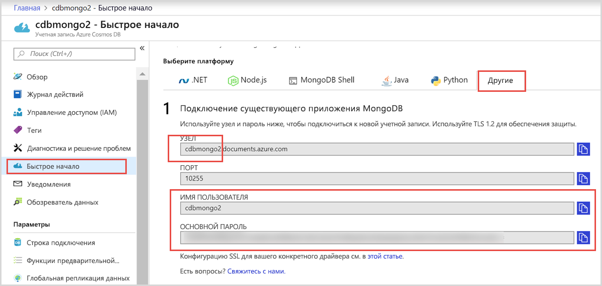
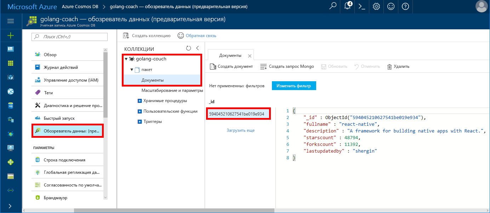

# <a name="azure-cosmos-db-build-a-mongodb-api-console-app-with-golang-and-the-azure-portal"></a>Azure Cosmos DB. Создание консольного приложения API MongoDB с использованием языка Golang и портала Azure

Azure Cosmos DB — это глобально распределенная многомодельная служба базы данных Майкрософт. Вы можете быстро создавать и запрашивать документы, пары "ключ — значение" и базы данных графов, используя преимущества возможностей глобального распределения и горизонтального масштабирования базы данных Azure Cosmos DB.

В этом кратком руководстве объясняется, как использовать существующее приложение MongoDB, написанное на [Golang](https://golang.org/), а также как подключить его к базе данных Azure Cosmos DB, поддерживающей клиентские подключения MongoDB с использованием [API MongoDB](mongodb-introduction.md).

Другими словами, только приложение Golang "знает" о подключении к базе данных с помощью API-интерфейсов MongoDB. Приложению понятно, что данные хранятся в службе Azure Cosmos DB.

## <a name="prerequisites"></a>предварительным требованиям

- Подписка Azure. Если у вас еще нет подписки Azure, [создайте бесплатную учетную запись Azure](https://azure.microsoft.com/free), прежде чем начинать работу. 

  [!INCLUDE [cosmos-db-emulator-mongodb](../../includes/cosmos-db-emulator-mongodb.md)]

- [Go](https://golang.org/dl/) и базовые знания о языке [Go](https://golang.org/).
- Интегрированная среда разработки: [Gogland](https://www.jetbrains.com/go/), созданная Jetbrains, [Visual Studio Code](https://code.visualstudio.com/) корпорации Майкрософт или [Atom](https://atom.io/). В этом руководстве используется Goglang.

<a id="create-account"></a>
## <a name="create-a-database-account"></a>Создание учетной записи базы данных

[!INCLUDE [cosmos-db-create-dbaccount](../../includes/cosmos-db-create-dbaccount-mongodb.md)]

## <a name="clone-the-sample-application"></a>Клонирование примера приложения

Клонируйте пример приложения и установите необходимые пакеты.

1. Создайте папку с именем CosmosDBSample внутри папки GOROOT\src. По умолчанию это папка C:\Go\.
2. Выполните следующую команду в окне терминала git, например git bash, чтобы клонировать пример репозитория в папку CosmosDBSample. 

    ```bash
    git clone https://github.com/Azure-Samples/azure-cosmos-db-mongodb-golang-getting-started.git
    ```
3.  Выполните следующую команду, чтобы получить пакет mgo. 

    ```
    go get gopkg.in/mgo.v2
    ```

Драйвер [mgo](http://labix.org/mgo) (произносится *mango*) — это драйвер [MongoDB](http://www.mongodb.org/) для [языка Go](http://golang.org/), реализующий полнофункциональный и хорошо проверенный набор функций в очень простом API, следуя стандартным идиомам Go.

<a id="connection-string"></a>

## <a name="update-your-connection-string"></a>Обновление строки подключения

Теперь вернитесь на портал Azure, чтобы получить данные строки подключения. Скопируйте эти данные в приложение.

1. Выберите раздел **Быстрый запуск** в меню навигации слева, а затем откройте вкладку **Другие**, чтобы просмотреть сведения строки подключения, необходимые для приложения Go.

2. В Goglang откройте файл main.go в каталоге GOROOT\CosmosDBSample и измените следующие строки кода, используя сведения строки подключения с портала Azure, как показано на следующем снимке экрана. 

    Имя базы данных — это префикс значения **узла** в области строки подключения на портале Azure. Для учетной записи, показанной на рисунке ниже, имя базы данных — golang-coach.

    ```go
    Database: "The prefix of the Host value in the Azure portal",
    Username: "The Username in the Azure portal",
    Password: "The Password in the Azure portal",
    ```

    

3. Сохраните файл main.go.

## <a name="review-the-code"></a>Просмотр кода

Кратко рассмотрим файл main.go. 

### <a name="connecting-the-go-app-to-azure-cosmos-db"></a>Подключение приложения Go к Azure Cosmos DB

Azure Cosmos DB поддерживает MongoDB с протоколом SSL. Чтобы подключиться к системе MongoDB с протоколом SSL, необходимо определить функцию **DialServer** в разделе [mgo.DialInfo](http://gopkg.in/mgo.v2#DialInfo) и использовать функцию [tls.*Dial*](http://golang.org/pkg/crypto/tls#Dial) для установки подключения.

Следующий фрагмент кода Golang подключается к приложению Go с помощью API MongoDB Azure Cosmos DB. Класс *DialInfo* содержит параметры для установки сеанса подключения к кластеру MongoDB.

```go
// DialInfo holds options for establishing a session with a MongoDB cluster.
dialInfo := &mgo.DialInfo{
    Addrs:    []string{"golang-couch.documents.azure.com:10255"}, // Get HOST + PORT
    Timeout:  60 * time.Second,
    Database: "database", // It can be anything
    Username: "username", // Username
    Password: "Azure database connect password from Azure Portal", // PASSWORD
    DialServer: func(addr *mgo.ServerAddr) (net.Conn, error) {
        return tls.Dial("tcp", addr.String(), &tls.Config{})
    },
}

// Create a session which maintains a pool of socket connections
// to our Azure Cosmos DB MongoDB database.
session, err := mgo.DialWithInfo(dialInfo)

if err != nil {
    fmt.Printf("Can't connect to mongo, go error %v\n", err)
    os.Exit(1)
}

defer session.Close()

// SetSafe changes the session safety mode.
// If the safe parameter is nil, the session is put in unsafe mode, 
// and writes become fire-and-forget,
// without error checking. The unsafe mode is faster since operations won't hold on waiting for a confirmation.
// 
session.SetSafe(&mgo.Safe{})
```

Метод **mgo.Dial()** используется, когда отсутствует подключение SSL. Для подключения SSL требуется метод **mgo.DialWithInfo()**.

Экземпляр объекта **DialWIthInfo {}** используется для создания объекта сеанса. После установки сеанса можно получить доступ к коллекции, используя следующий фрагмент кода:

```go
collection := session.DB(“database”).C(“package”)
```

<a id="create-document"></a>

### <a name="create-a-document"></a>Создание документа

```go
// Model
type Package struct {
    Id bson.ObjectId  `bson:"_id,omitempty"`
    FullName      string
    Description   string
    StarsCount    int
    ForksCount    int
    LastUpdatedBy string
}

// insert Document in collection
err = collection.Insert(&Package{
    FullName:"react",
    Description:"A framework for building native apps with React.",
    ForksCount: 11392,
    StarsCount:48794,
    LastUpdatedBy:"shergin",

})

if err != nil {
    log.Fatal("Problem inserting data: ", err)
    return
}
```

### <a name="query-or-read-a-document"></a>Запрос к документу или чтение документа

Azure Cosmos DB поддерживает полнофункциональные запросы к документам JSON, хранящимся в каждой коллекции. В следующем примере кода показан выполняемый запрос к документам в коллекции.

```go
// Get a Document from the collection
result := Package{}
err = collection.Find(bson.M{"fullname": "react"}).One(&result)
if err != nil {
    log.Fatal("Error finding record: ", err)
    return
}

fmt.Println("Description:", result.Description)
```


### <a name="update-a-document"></a>обновление документа;

```go
// Update a document
updateQuery := bson.M{"_id": result.Id}
change := bson.M{"$set": bson.M{"fullname": "react-native"}}
err = collection.Update(updateQuery, change)
if err != nil {
    log.Fatal("Error updating record: ", err)
    return
}
```

### <a name="delete-a-document"></a>Удаление документа

Azure Cosmos DB поддерживает удаление документов JSON.

```go
// Delete a document
query := bson.M{"_id": result.Id}
err = collection.Remove(query)
if err != nil {
   log.Fatal("Error deleting record: ", err)
   return
}
```
    
## <a name="run-the-app"></a>Запуск приложения

1. В Goglang убедитесь, что путь GOPATH (находится в меню **File** (Файл), **Settings** (Параметры), **Go**, **GOPATH**) включает расположение, в котором установлен gopkg. По умолчанию это папка ПРОФИЛЬ_ПОЛЬЗОВАТЕЛЯ\go. 
2. Закомментируйте строки, удаляющие документ (строки 91–96), чтобы вы могли видеть документ после запуска приложения.
3. В Goglang выберите команду **Run** (Выполнить), затем нажмите кнопку **Build main.go and run** (Создать main.go и выполнить).

    Будет создано приложение и отобразится описание документа, созданного в разделе [Создание документа](#create-document).
    
    ```
    Description: A framework for building native apps with React.
    
    Process finished with exit code 0
    ```

    
    
## <a name="review-your-document-in-data-explorer"></a>Просмотр документа в обозревателе данных

Вернитесь на портал Azure, чтобы просмотреть документ в обозревателе данных.

1. Щелкните **Обозреватель данных (предварительная версия)** в меню навигации слева, разверните узел **golang-coach**, **Пакет**, а затем выберите раздел **Документы**. На вкладке **Документы** щелкните \_идентификатор, чтобы открыть документ на панели справа. 

    
    
2. Вы можете работать со встроенным документом. Чтобы сохранить его, нажмите кнопку **Обновить**. Вы также можете удалить документ или создать новые документы или запросы.

## <a name="review-slas-in-the-azure-portal"></a>Просмотр соглашений об уровне обслуживания на портале Azure

[!INCLUDE [cosmosdb-tutorial-review-slas](../../includes/cosmos-db-tutorial-review-slas.md)]

## <a name="clean-up-resources"></a>Очистка ресурсов

Если вы не собираетесь использовать это приложение дальше, удалите все ресурсы, созданные в ходе работы с этим руководством, на портале Azure, сделав следующее:

1. В меню слева на портале Azure щелкните **Группы ресурсов**, а затем выберите имя созданного ресурса. 
2. На странице группы ресурсов щелкните **Удалить**, в текстовом поле введите имя ресурса для удаления и щелкните **Удалить**.

## <a name="next-steps"></a>Дополнительная информация

В этом кратком руководстве вы узнали, как создать учетную запись Azure Cosmos DB и запустить приложение Golang, используя API MongoDB. Теперь можно импортировать дополнительные данные в учетную запись Azure Cosmos DB. 

> [!div class="nextstepaction"]
> [Перенос данных в DocumentDB с помощью mongoimport и mongorestore](mongodb-migrate.md)
