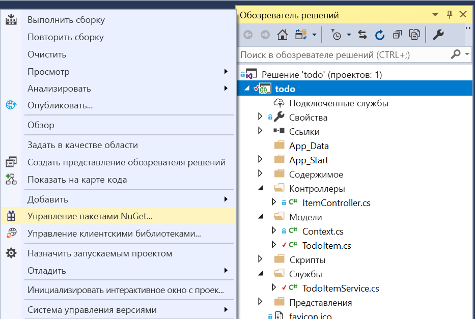
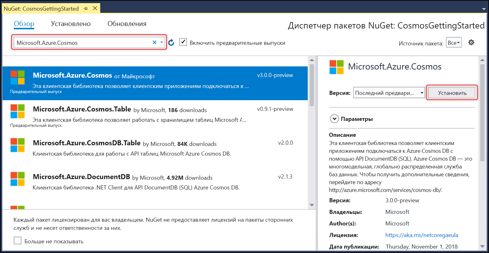

# <a name="quickstart-build-an-aspnet-web-app-with-azure-cosmos-db-using-the-sql-api-and-the-azure-portal"></a>Краткое руководство. Создание веб-приложения ASP.NET при помощи Azure Cosmos DB с использованием API SQL и портала Azure

> [!div class="op_single_selector"]
> * [.NET (предварительная версия)](create-sql-api-dotnet-preview.md)
> * [.NET](create-sql-api-dotnet.md)
> * [Java](create-sql-api-java.md)
> * [Node.js](create-sql-api-nodejs.md)
> * [Python](create-sql-api-python.md)
> * [Xamarin](create-sql-api-xamarin-dotnet.md)
>  
> 

Azure Cosmos DB — это глобально распределенная, высокодоступная, многомодельная служба базы данных Майкрософт. Вы можете быстро создавать и запрашивать документы, пары "ключ — значение" и базы данных графов, используя преимущества возможностей глобального распределения и горизонтального масштабирования базы данных Azure Cosmos DB. 

В этом кратком руководстве показано, как с помощью портала Azure создать учетную запись [API SQL](sql-api-introduction.md) для Azure Cosmos DB, базу данных и контейнер. Затем вы создадите и развернете веб-приложение ASP.NET со списком дел на основе [API-интерфейса .NET для SQL](sql-api-sdk-dotnet.md), как показано на снимке экрана ниже. 

Это краткое руководство использует выпуск 3.0+ пакета SDK .NET для Azure Cosmos DB. 


## <a name="prerequisites"></a>Предварительные требования

Если вы еще не установили Visual Studio 2017, вы можете скачать и использовать **бесплатный** [выпуск Community для Visual Studio 2017](https://www.visualstudio.com/downloads/). Убедитесь, что при установке Visual Studio доступна рабочая нагрузка **разработки для Azure**.

[!INCLUDE [quickstarts-free-trial-note](../../includes/quickstarts-free-trial-note.md)] 
[!INCLUDE [cosmos-db-emulator-docdb-api](../../includes/cosmos-db-emulator-docdb-api.md)]  

<a id="create-account"></a>
## <a name="create-a-database-account"></a>Создание учетной записи базы данных

[!INCLUDE [cosmos-db-create-dbaccount-preview](../../includes/cosmos-db-create-dbaccount-preview.md)]

<a id="create-collection"></a>
## <a name="add-a-collection"></a>Добавление коллекции

[!INCLUDE [cosmos-db-create-collection-preview](../../includes/cosmos-db-create-collection-preview.md)]

<a id="add-sample-data"></a>
## <a name="add-sample-data"></a>Добавление демонстрационных данных

[!INCLUDE [cosmos-db-create-sql-api-add-sample-data](../../includes/cosmos-db-create-sql-api-add-sample-data.md)]

## <a name="query-your-data"></a>Обращение к данным

[!INCLUDE [cosmos-db-create-sql-api-query-data](../../includes/cosmos-db-create-sql-api-query-data.md)]

## <a name="clone-the-sample-application"></a>Клонирование примера приложения

Теперь перейдем к работе с кодом. Давайте клонируем [приложение API SQL из GitHub](https://github.com/Azure-Samples/cosmos-dotnet-todo-app). Задайте строку подключения и выполните ее. 

1. Откройте командную строку, создайте папку git-samples, а затем закройте окно командной строки.

    ```bash
    md "C:\git-samples"
    ```

2. Откройте окно терминала git, например git bash, и выполните команду `cd`, чтобы перейти в новую папку для установки примера приложения.

    ```bash
    cd "C:\git-samples"
    ```

3. Выполните команду ниже, чтобы клонировать репозиторий с примером. Эта команда создает копию примера приложения на локальном компьютере.

    ```bash
    git clone https://github.com/Azure-Samples/cosmos-dotnet-todo-app.git
    ```

4. Затем откройте файл решения **todo.sln** в Visual Studio. 

## <a name="review-the-code"></a>Просмотр кода

Этот шаг не является обязательным. Если вы хотите узнать, как создать в коде ресурсы базы данных, изучите приведенные ниже фрагменты кода. Если вас это не интересует, можете сразу переходить к разделу [Обновление строки подключения](#update-your-connection-string). 

Обратите внимание, что если вам знакома предыдущая версия пакета SDK для .NET, вы уже видели термины "коллекция" и "документ". Так как Azure Cosmos DB поддерживает несколько моделей API, версия 3.0+ пакета SDK для .NET использует общие термины "контейнер" и "элемент". Контейнер может представлять собой коллекцию, граф или таблицу. Элемент может представлять собой документ, ребро, вершину или запись и является содержимым внутри контейнера. [Работа с базами данных, контейнерами и элементами Azure Cosmos](databases-containers-items.md)

Приведенные ниже фрагменты кода взяты из файла ToDoItemService.cs.

* Экземпляр CosmosClient инициализируется в строке 68–69.

    ```csharp
    CosmosConfiguration config = new CosmosConfiguration(Endpoint, PrimaryKey);
    client = new CosmosClient(config);
    ```

* Новая база данных создается в строке 71.

    ```csharp
    CosmosDatabase database = await client.Databases.CreateDatabaseIfNotExistsAsync(DatabaseId);
    ```

* Контейнер создается в строке 72 с ключом секции "/категория."

    ```csharp
    CosmosContainer container = await database.Containers.CreateContainerIfNotExistsAsync(ContainerId, "/category");
    ```

## <a name="update-your-connection-string"></a>Обновление строки подключения

Теперь вернитесь на портал Azure, чтобы получить данные строки подключения. Скопируйте эти данные в приложение.

1. На [портале Azure](https://portal.azure.com/) перейдите к учетной записи базы данных Azure Cosmos DB и на панели навигации слева щелкните **Ключи**, а затем выберите **Ключи записи-чтения**. На следующем шаге используйте кнопку копирования в правой части экрана, чтобы скопировать универсальный код ресурса (URI) и первичный ключ в файл web.config.

    

2. В Visual Studio 2017 откройте файл **web.config**. 

3. Скопируйте значение универсального кода ресурса (URI) на портале (с помощью кнопки копирования) и добавьте его в качестве значения параметра ключа ``endpoint`` в файле web.config. 

    `<add key="endpoint" value="FILLME" />`

4. Затем скопируйте значение PRIMARY KEY с портала и добавьте его в качестве значения параметра ``primarykey`` в файле web.config. 

    `<add key="primaryKey" value="FILLME" />`
    
5. Затем обновите значение базы данных и контейнера, чтобы оно соответствовало имени базы данных и контейнера, созданных ранее. Теперь приложение со всеми сведениями, необходимыми для взаимодействия с Azure Cosmos DB, обновлено. 

    `<add key="database" value="Tasks" />`

    `<add key="container" value="Items" />`
    
## <a name="run-the-web-app"></a>Запуск веб-приложения

1. В **обозревателе решений** щелкните правой кнопкой мыши на новое консольное приложение (оно находится в решении Visual Studio), а затем щелкните **Управление пакетами NuGet...**
    
    
1. На вкладке **NuGet** щелкните **Обзор** и в поле поиска введите **Microsoft.Azure.Cosmos**.
1. В результатах найдите **Microsoft.Azure.Cosmos** и щелкните **Установить**.
   Идентификатором пакета для клиентской библиотеки API SQL Azure Cosmos DB является [Microsoft Azure Cosmos DB Client Library](https://www.nuget.org/packages/Microsoft.Azure.Cosmos/).

   

    Если появится сообщение о просмотре изменений в решении, нажмите кнопку **ОК**. Если появится сообщение о принятии условий лицензионного соглашения, щелкните **Принимаю**.

1. Нажмите клавиши CTRL + F5 для запуска приложения. Приложение откроется в браузере. 

1. Выберите **Создать** в браузере и создайте несколько задач в приложении со списком задач. Там будут задачи, созданные в [Добавление демонстрационных данных](#add-sample-data)

   

Вернитесь в обозреватель данных, где вы можете просматривать, запрашивать и изменять новые данные, а также работать с ними. 

## <a name="review-slas-in-the-azure-portal"></a>Просмотр соглашений об уровне обслуживания на портале Azure

[!INCLUDE [cosmosdb-tutorial-review-slas](../../includes/cosmos-db-tutorial-review-slas.md)]

## <a name="clean-up-resources"></a>Очистка ресурсов

[!INCLUDE [cosmosdb-delete-resource-group](../../includes/cosmos-db-delete-resource-group.md)]

## <a name="next-steps"></a>Дополнительная информация

В этом кратком руководстве описано, как создать учетную запись Azure Cosmos DB, контейнер и добавить к ним элементы с помощью обозревателя данных, а также как запустить веб-приложение. Теперь можно импортировать дополнительные данные в учетную запись Azure Cosmos DB. 

> [!div class="nextstepaction"]
> [Импорт данных в DocumentDB с помощью средства миграции базы данных](import-data.md)


