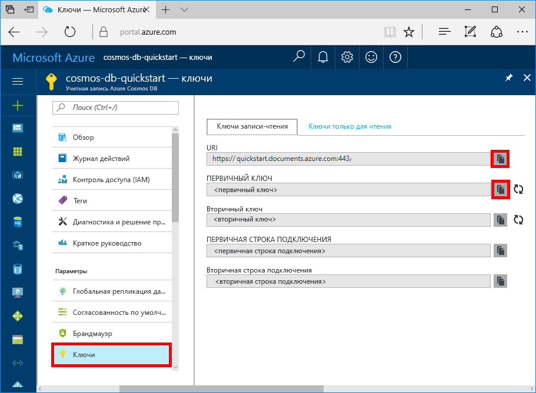

# <a name="azure-cosmos-db-build-a-web-app-with-net-xamarin-and-facebook-authentication"></a>Azure Cosmos DB. Создание веб-приложения с проверкой подлинности .NET, Xamarin и Facebook

[!INCLUDE [cosmos-db-sql-api](../../includes/cosmos-db-sql-api.md)]

Azure Cosmos DB — это глобально распределенная многомодельная служба базы данных Майкрософт. Вы можете быстро создавать и запрашивать документы, пары "ключ — значение" и базы данных графов, используя преимущества возможностей глобального распределения и горизонтального масштабирования базы данных Azure Cosmos DB.

> [!NOTE]
> Полный канонический пример кода для приложения Xamarin, демонстрирующий множество предложений Azure, включая Cosmos DB, можно найти [на этой странице](https://github.com/xamarinhq/app-geocontacts) сайта GitHub. Это приложение позволяет просмотреть географически распределенные контакты и обеспечивает обновление их расположения.

В этом кратком руководстве показано, как создать учетную запись Azure Cosmos DB, базу данных документов и коллекцию с использованием портала Azure. Затем вы создадите и развернете веб-приложение со списком задач на основе [API-интерфейса .NET для SQL](sql-api-sdk-dotnet.md), [Xamarin](https://www.xamarin.com/) и обработчика авторизации Azure Cosmos DB. В веб-приложении со списком задач реализован шаблон данных каждого пользователя, разрешающий им выполнять вход с помощью аутентификации Facebook, а также управлять собственными элементами.

## <a name="prerequisites"></a>предварительным требованиям

Если вы еще не установили Visual Studio 2017, вы можете скачать и использовать **бесплатный** [выпуск Community для Visual Studio 2017](https://www.visualstudio.com/downloads/). При установке Visual Studio необходимо включить возможность **разработки для Azure**.

[!INCLUDE [quickstarts-free-trial-note](../../includes/quickstarts-free-trial-note.md)]
[!INCLUDE [cosmos-db-emulator-docdb-api](../../includes/cosmos-db-emulator-docdb-api.md)]

## <a name="create-a-database-account"></a>Создание учетной записи базы данных

[!INCLUDE [cosmos-db-create-dbaccount](../../includes/cosmos-db-create-dbaccount.md)]

## <a name="add-a-collection"></a>Добавление коллекции

[!INCLUDE [cosmos-db-create-collection](../../includes/cosmos-db-create-collection.md)]

## <a name="clone-the-sample-application"></a>Клонирование примера приложения

Теперь необходимо клонировать приложение API SQL из GitHub. Задайте строку подключения и выполните ее. Вы узнаете, как можно упростить работу с данными программным способом. 

1. Откройте окно терминала Git, например Git Bash, и выполните команду `cd`, чтобы перейти в рабочий каталог.

2. Выполните команду ниже, чтобы клонировать репозиторий с примером. 

    ```bash
    git clone https://github.com/Azure/azure-documentdb-dotnet.git
    ```

3. Затем откройте файл DocumentDBTodo.sln из папки samples/xamarin/UserItems/xamarin.forms в Visual Studio.

## <a name="review-the-code"></a>Просмотр кода

Код в папке Xamarin содержит:

* Приложение Xamarin. Приложение хранит элементы списка задач пользователя в секционированной коллекции UserItems.
* Брокер маркера ресурса API. Простой веб-API ASP.NET в качестве брокера токенов ресурсов Azure Cosmos DB в приложении пользователей, вошедших в систему. Токены ресурсов — это токены кратковременного доступа, предоставляющие приложению доступ к данным пользователя, вошедшего в систему.

На приведенной ниже схеме показана процедура аутентификации и обработки данных.

* Коллекция UserItems создается с ключом раздела /userid. Если указать ключ раздела для коллекции, Azure Cosmos DB сможет осуществлять неограниченное масштабирование по мере того, как растет количество пользователей и элементов.
* Приложение Xamarin позволяет пользователям выполнять вход с учетными данными Facebook.
* Оно использует маркер доступа Facebook для проверки подлинности с помощью ResourceTokenBroker API.
* API брокера токена ресурса проверяет подлинность запроса с помощью функции проверки подлинности службы приложений и запрашивает токен ресурса Azure Cosmos DB с доступом на чтение и запись для всех документов, совместно использующих ключ раздела прошедшего проверку подлинности пользователя.
* Брокер токена ресурса возвращает токен ресурса в клиентское приложение.
* Приложение получает доступ к элементам списка задач пользователя с помощью токена ресурса.


## <a name="update-your-connection-string"></a>Обновление строки подключения

Теперь вернитесь на портал Azure, чтобы получить данные строки подключения. Скопируйте эти данные в приложение.

1. На [портале Azure](http://portal.azure.com/) перейдите к учетной записи Azure Cosmos DB и на левой панели навигации щелкните **Ключи**, а затем выберите **Ключи записи-чтения**. На следующем шаге используйте кнопку копирования в правой части экрана, чтобы скопировать универсальный код ресурса (URI) и первичный ключ в файл Web.config.

    

2. В Visual Studio 2017 откройте файл Web.config в папке azure-documentdb-dotnet/samples/xamarin/UserItems/ResourceTokenBroker/ResourceTokenBroker. 

3. Скопируйте значение универсального кода ресурса (URI) c портала (с помощью кнопки копирования) и добавьте его в качестве значения параметра accountUrl в файле Web.config. 

    `<add key="accountUrl" value="{Azure Cosmos DB account URL}"/>`

4. Затем скопируйте значение первичного ключа с портала и добавьте его в качестве значения параметра accountKey в файле Web.congif.

    `<add key="accountKey" value="{Azure Cosmos DB secret}"/>`

Теперь приложение со всеми сведениями, необходимыми для взаимодействия с Azure Cosmos DB, обновлено. 

## <a name="build-and-deploy-the-web-app"></a>Создание и развертывание веб-приложения

1. Создайте на портале Azure веб-сайт службы приложений для размещения API брокера токена ресурса.
2. На портале Azure откройте колонку "Параметры приложения" веб-сайта API брокера токена ресурса. Заполните следующие параметры приложения:

    * accountUrl — URL-адрес учетной записи Azure Cosmos DB на вкладке "Ключи".
    * accountKey — главный ключ учетной записи Azure Cosmos DB на вкладке "Ключи".
    * databaseId и collectionId созданной базы данных и коллекции.

3. Опубликуйте решение ResourceTokenBroker на созданном веб-сайте.

4. Откройте проект Xamarin, а затем файл TodoItemManager.cs. Присвойте необходимые значения параметрам accountURL, collectionId, databaseId, а также укажите resourceTokenBrokerURL как базовый URL-адрес HTTPS для веб-сайта брокера токена ресурса.

5. Чтобы настроить аутентификацию Facebook и веб-сайт ResourceTokenBroker, ознакомьтесь со статьей [Как настроить приложение службы приложений для использования имени для входа Facebook](../app-service/app-service-mobile-how-to-configure-facebook-authentication.md).

    Запустите приложение Xamarin.

## <a name="review-slas-in-the-azure-portal"></a>Просмотр соглашений об уровне обслуживания на портале Azure

[!INCLUDE [cosmosdb-tutorial-review-slas](../../includes/cosmos-db-tutorial-review-slas.md)]

## <a name="clean-up-resources"></a>Очистка ресурсов

Если вы не собираетесь использовать это приложение дальше, удалите все ресурсы, созданные в ходе работы с этим руководством, на портале Azure, сделав следующее:

1. В меню слева на портале Azure щелкните **Группы ресурсов**, а затем выберите имя созданного ресурса.
2. На странице группы ресурсов щелкните **Удалить**, в текстовом поле введите имя ресурса для удаления и щелкните **Удалить**.

## <a name="next-steps"></a>Дополнительная информация

В этом кратком руководстве вы узнали, как создать учетную запись Azure Cosmos DB, коллекцию с помощью обозревателя данных, а также как создать и развернуть приложение Xamarin. Теперь можно импортировать дополнительные данные в учетную запись Azure Cosmos DB.

> [!div class="nextstepaction"]
> [Импорт данных в DocumentDB с помощью средства миграции базы данных](import-data.md)
