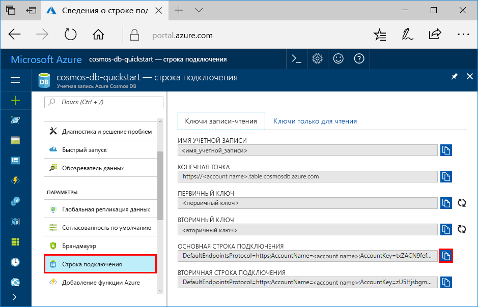

# <a name="quickstart-build-a-table-api-app-with-python-and-azure-cosmos-db"></a>Краткое руководство. Сборка приложения API таблиц с помощью Python и Azure Cosmos DB

В этом руководстве показано, как использовать Python и [API таблиц](table-introduction.md) Azure Cosmos DB для сборки приложения путем клонирования примера с сайта GitHub. Кроме того, здесь показано, как создать учетную запись Azure Cosmos DB и использовать обозреватель данных для создания таблиц и сущностей на веб-портале Azure.

Azure Cosmos DB — это глобально распределенная многомодельная служба базы данных Майкрософт. Вы можете быстро создавать и запрашивать базы данных документов, пар "ключ — значение", графов и базы данных с широкими столбцами, используя возможности глобального распределения и горизонтального масштабирования Azure Cosmos DB. 

## <a name="prerequisites"></a>предварительным требованиям

[!INCLUDE [quickstarts-free-trial-note](../../includes/quickstarts-free-trial-note.md)]
[!INCLUDE [cosmos-db-emulator-docdb-api](../../includes/cosmos-db-emulator-docdb-api.md)]

Кроме того, сделайте следующее:

* Если вы еще не установили Visual Studio 2017, вы можете скачать и использовать **бесплатный** [выпуск Community для Visual Studio 2017](https://www.visualstudio.com/downloads/). При установке Visual Studio необходимо включить возможность **разработки для Azure**.
* Средства Python для Visual Studio с сайта [GitHub](http://microsoft.github.io/PTVS/). В этом руководстве используются средства Python для VS 2015.
* Python 2.7 с сайта [python.org](https://www.python.org/downloads/release/python-2712/).

## <a name="create-a-database-account"></a>Создание учетной записи базы данных

> [!IMPORTANT] 
> Для работы с общедоступными пакетами SDK для API таблиц нужно создать новую учетную запись API таблиц. Учетные записи API таблиц, созданные во время работы с предварительной версией, не поддерживаются в общедоступных пакетах SDK.
>

[!INCLUDE [cosmos-db-create-dbaccount-table](../../includes/cosmos-db-create-dbaccount-table.md)]

## <a name="add-a-table"></a>Добавление таблицы

[!INCLUDE [cosmos-db-create-table](../../includes/cosmos-db-create-table.md)]

## <a name="add-sample-data"></a>Добавление демонстрационных данных

Теперь вы можете добавить данные в созданную таблицу с помощью обозревателя данных.

1. В обозревателе данных разверните **пример таблицы**, затем щелкните **Сущности** и нажмите кнопку **Добавление сущности**.

   
2. Добавьте данные в поля значений свойств PartitionKey и RowKey, а затем нажмите кнопку **Добавить сущность**.

   
  
    Теперь вы можете добавить больше сущностей в свою таблицу, изменить эти сущности или выполнить запрос данных в обозревателе данных. В обозревателе данных вы можете масштабировать пропускную способность, а также добавлять хранимые процедуры, определенные пользователем функции и триггеры в свою таблицу.

## <a name="clone-the-sample-application"></a>Клонирование примера приложения

Теперь необходимо клонировать приложение "Таблица" из GitHub. Задайте строку подключения и выполните ее. Вы узнаете, как можно упростить работу с данными программным способом. 

1. Откройте окно терминала git, например git bash, и выполните команду `cd`, чтобы перейти в папку для установки примера приложения. 

    ```bash
    cd "C:\git-samples"
    ```

2. Выполните команду ниже, чтобы клонировать репозиторий с примером. Эта команда создает копию примера приложения на локальном компьютере. 

    ```bash
    git clone https://github.com/Azure-Samples/storage-python-getting-started.git
    ```

3. Затем откройте файл решения в Visual Studio. 

## <a name="update-your-connection-string"></a>Обновление строки подключения

Теперь вернитесь на портал Azure, чтобы получить данные строки подключения. Скопируйте эти данные в приложение. Так вы обеспечите обмен данными между приложением и размещенной базой данных. 

1. На [портале Azure](http://portal.azure.com/) щелкните **Строка подключения**. 

    

2. Скопируйте имя учетной записи с помощью кнопки копирования справа.

3. Откройте файл config.py и вставьте скопированное имя учетной записи как значение параметра STORAGE_ACCOUNT_NAME в строке 19.

4. Вернитесь на портал и скопируйте первичный ключ.

5. Вставьте скопированный первичный ключ как значение параметра STORAGE_ACCOUNT_KEY в строке 20.

3. Сохраните файл config.py.

## <a name="run-the-app"></a>Запуск приложения

1. В Visual Studio щелкните правой кнопкой мыши проект в **обозревателе решений**, выберите текущую среду Python и щелкните ее правой кнопкой мыши.

2. Выберите "Установить пакет Python...", а затем введите **azure-storage-table**.

3. Нажмите клавишу F5 для запуска приложения. Приложение откроется в браузере. 

Вернитесь в обозреватель данных, где вы можете просматривать, запрашивать и изменять новые данные, а также работать с ними. 

## <a name="review-slas-in-the-azure-portal"></a>Просмотр соглашений об уровне обслуживания на портале Azure

[!INCLUDE [cosmosdb-tutorial-review-slas](../../includes/cosmos-db-tutorial-review-slas.md)]

## <a name="clean-up-resources"></a>Очистка ресурсов

[!INCLUDE [cosmosdb-delete-resource-group](../../includes/cosmos-db-delete-resource-group.md)]

## <a name="next-steps"></a>Дополнительная информация

Из этого краткого руководства вы узнали, как создать учетную запись Azure Cosmos DB и таблицу с помощью обозревателя данных, а также как запустить приложение.  Теперь вы можете выполнить запрос данных с помощью API таблиц.  

> [!div class="nextstepaction"]
> [Импорт данных таблиц в API таблицы](table-import.md)
