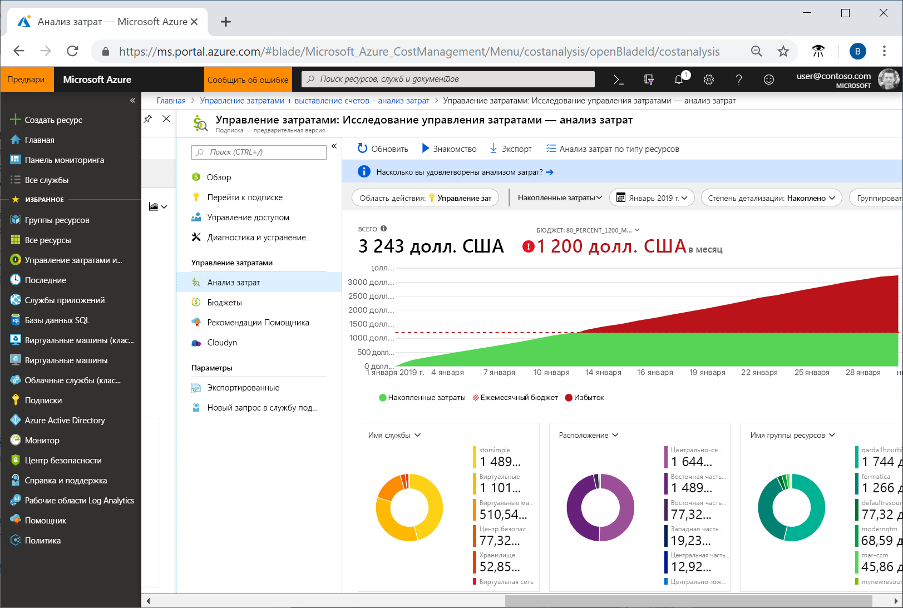
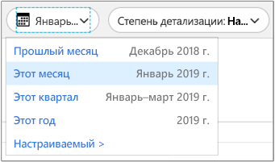
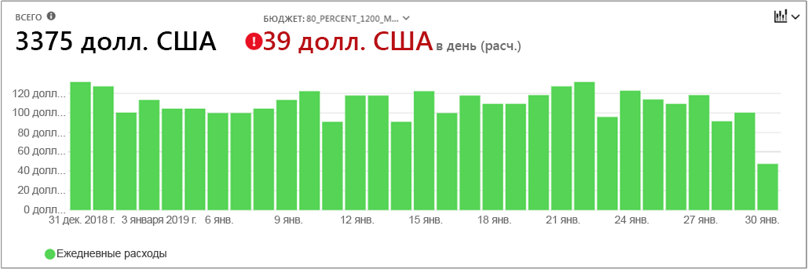
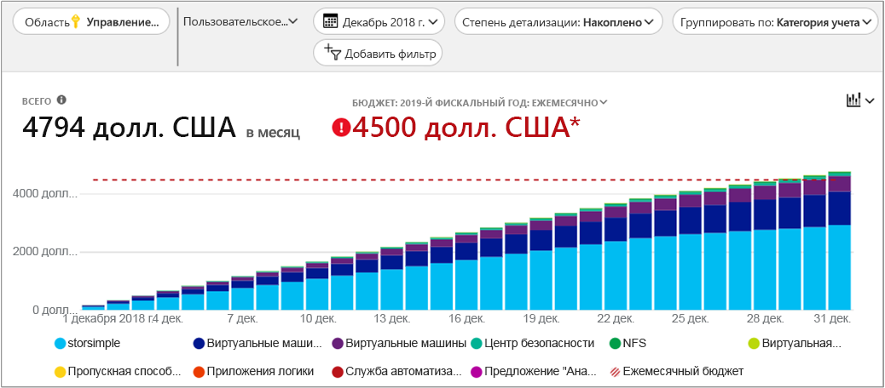
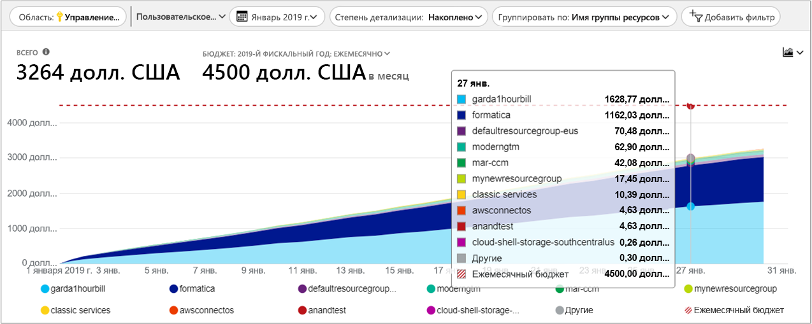

# Краткое руководство: изучение и анализ затрат с помощью службы анализа затрат

Прежде чем вы сможете правильно контролировать и оптимизировать свои затраты в Azure, вам необходимо понять, где они возникают в вашей организации. Также полезно понимать, сколько стоят ваши службы и какие среды и системы задействуются при их работе. Видимость всего спектра затрат имеет решающее значение для точного понимания тенденций расходов организации. Типичные расходы можно использовать для применения механизмов контроля затрат, таких как бюджеты.

В этом кратком руководстве вы можете использовать службу анализа затрат, чтобы изучить и проанализировать затраты своей организации. Вы просмотрите агрегированные затраты своей организации, чтобы понять, где возникают затраты с течением времени, и определить тенденции расходов. Вы просмотрите накопленные затраты с течением времени для оценки ежемесячных, квартальных или даже годовых тенденций затрат с учетом бюджета. Бюджет помогает соблюдать финансовые ограничения. С его помощью можно просматривать ежедневные или ежемесячные затраты для выявления нарушений. Вы можете скачать данные текущего отчета для дальнейшего анализа или использования во внешней системе.

Из этого краткого руководства вы узнаете, как выполнять следующие задачи:

- Просмотр затрат в функции анализа затрат
- Настройка представления затрат
- Скачивание данных анализа затрат

## Предварительные требования

Функция анализа затрат доступна для всех клиентов с [соглашением Enterprise (EA)](https://azure.microsoft.com/pricing/enterprise-agreement/). Для просмотра данных о расходах вы должны по крайней мере иметь доступ на чтение к одной или нескольким следующим областям. Дополнительные сведения о назначении доступа к данным службы "Управление затратами" см. в [этой статье](assign-access-acm-data.md).

- учетная запись выставления счетов;
- Department
- учетная запись регистрации;
- группа управления;
- Подписка
- Группа ресурсов

## Вход в Azure

- Войдите на портал Azure по адресу http://portal.azure.com.

## Просмотр затрат в функции анализа затрат

Чтобы просмотреть данные о затратах с помощью функции анализа затрат, на портале Azure последовательно выберите **Управление затратами + выставление счетов** &gt; **Управление затратами** &gt; **Изменить область**, выберите область и нажмите кнопку **Выбрать**.

Выбранная вами область используется на протяжении всего процесса управление затратами, чтобы обеспечить консолидацию данных и управление доступом к сведениям о затратах. При использовании области не нужно выбирать по отдельности. Вместо этого выберите более широкую область, в которую входят другие области, и отфильтруйте по нужным областям. Это важно понимать, так как некоторым пользователям не требуется доступ к родительской области, в которую входят дочерние области.

Щелкните **Открыть анализ затрат**.

В первоначальном представлении анализа затрат содержатся следующие области:

**Всего** — показаны общие затраты на текущий месяц.

**Бюджет** — показана запланированная предельная сумма расходов (при наличии) для выбранной области.

**Accumulated cost** (Накопленные затраты) — показаны общие накопленные ежедневные затраты начиная с начала месяца. После [создания бюджета](tutorial-acm-create-budgets.md) для учетной записи выставления счетов или подписки вы можете быстро просмотреть тенденцию расходов по отношению к бюджету. Наведите курсор на дату для просмотра накопленных затрат до этого дня.

**Сводные (круговые) диаграммы** предоставляют динамические сводные данные, разделяя общие затраты на набор стандартных вариантов. На них показаны минимальные и максимальные затраты, накопленные за текущий месяц. Вы можете изменить сводные диаграммы в любое время, выбрав другую сводку. Затраты разделены по категориям: служба (категория единиц измерения), расположение (регион) и дочерняя область по умолчанию. Например, учетные записи регистрации в учетных записях выставления счетов, группы ресурсов в подписках и ресурсы в группах ресурсов.

## Настройка представления затрат

Представление по умолчанию позволяет получить быстрые ответы на общие вопросы, такие как:

- Сколько потрачено?
- Выхожу ли я за пределы бюджета?

Однако есть много случаев, когда вам нужен более глубокий анализ. Настройка начинается с выбора даты в верхней части страницы.

В разделе анализа затрат по умолчанию отображаются данные за текущий месяц. Используйте селектор даты, чтобы быстро переключиться на последний месяц, этот месяц, этот календарный квартал, текущий календарный год или пользовательский диапазон дат по вашему выбору. Выбор последнего месяца — это самый быстрый способ проанализировать ваш последний счет Azure и с легкостью выверить платежи. Варианты за текущий квартал и год помогают отслеживать расходы по отношению к долгосрочным бюджетам. Вы также можете выбрать другой диапазон дат. Например, можно выбрать один день, последние семь дней или любую дату за год до текущего месяца.

В разделе анализа затрат по умолчанию отображаются **накопленные** затраты. Накопленные затраты включают в себя все расходы за каждый день в дополнение к предыдущим дням. Вы можете видеть постоянно растущее представление ваших ежедневно начисляемых расходов. Это представление оптимизировано для отображения наблюдаемых тенденций по отношению к бюджету для выбранного диапазона времени.

Для просмотра затрат за каждый день доступно **ежедневное** представление. В ежедневном представлении не отображается тенденция роста. Представление показывает ежедневные нарушения в виде максимумов и минимумов затрат. После выбора бюджета ежедневное представление также отображает оценку того, как может выглядеть ваш дневной бюджет. Если ваши ежедневные расходы постоянно превышают ожидаемый суточный бюджет, вы, вероятно, превысите ежемесячный бюджет. Ожидаемый дневной бюджет позволяет вам визуализировать ваш бюджет на более низком уровне. При наличии колебания в ежедневных расходах сравнение предполагаемого ежедневного бюджета с ежемесячным бюджетом будет менее точным.

Вы можете выполнить **группирование**, чтобы выбрать категорию группы для изменения данных, отображаемых в верхнем графике общей области. Группирование позволяет быстро увидеть, как ваши расходы классифицируются по типу ресурсов. Ниже мы видим представление затрат на службы Azure за последний месяц.

Сводные диаграммы под верхним представлением "Итог" отображают представления для разных групп и категорий фильтрации. Когда вы выбираете какую-либо категорию группы, полный набор данных общего представления находится в нижней части представления. Ниже приведен пример групп ресурсов.

На предыдущем рисунке показаны имена групп ресурсов. Просмотр тегов ресурсов недоступен в представлениях анализа затрат, фильтрах или группировках.

При группировании затрат по определенным атрибутам первые десять основных факторов затрат будут отображаться в порядке убывания. При наличии более десяти групп отображаются первые девять основных факторов затрат, а также группа **Другие**, которая охватывают не уместившиеся группы.

*Классические* (Управление службами Azure или ASM) виртуальные машины, сетевые ресурсы и ресурсы хранения не предоставляют детальную информацию о данных выставления счетов. При группировании затрат они объединяются в группу **Classic services** (Классические службы).

## Скачивание данных анализа затрат

Вы можете **Скачать** сведения из службы анализа затрат, чтобы создать CSV-файл для всех данных, отображаемых на портале Azure. Любые примененные фильтры или группы включены в файл. Базовые данные для верхней диаграммы "Итог", которая сейчас не отображается, включены в CSV-файл.

## Дополнительная информация

Перейдите к первому руководству, чтобы узнать, как создать бюджет и управлять им.

> [!div class="nextstepaction"]
> [Создание бюджетов и управление ими](tutorial-acm-create-budgets.md)
