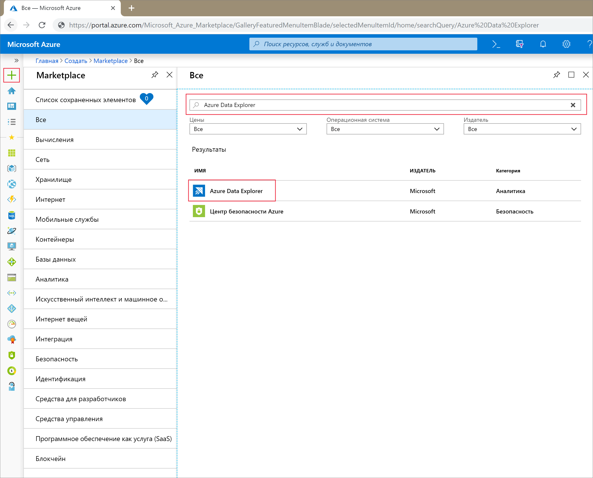
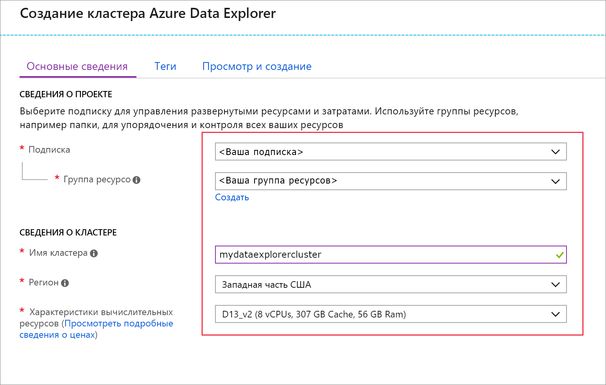
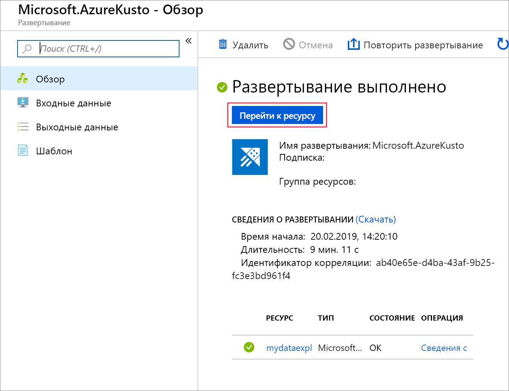
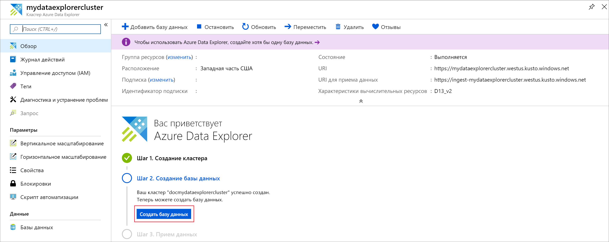
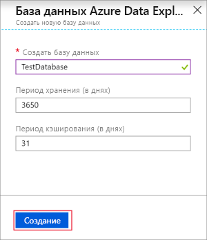

# Краткое руководство. Создание кластера и базы данных Azure Data Explorer

Обозреватель данных Azure — это быстрая и высокомасштабируемая служба для изучения данных журналов и телеметрии. Чтобы использовать обозреватель данных Azure, сначала нужно создать *кластер* и одну или несколько *баз данных* в этом кластере. Затем вы должны *принять* (загрузить) данные в базы данных, чтобы к ним можно было выполнять запросы. В этом кратком руководстве вы создадите кластер и базу данных. В последующих статьях мы покажем, как принять данные.

Если у вас еще нет подписки Azure, создайте [бесплатную учетную запись](https://azure.microsoft.com/free/) Azure, прежде чем начинать работу.

## Вход на портал Azure

Войдите на [портале Azure](https://portal.azure.com/).

## Создание кластера

Вы создаете кластер обозревателя данных Azure в группе ресурсов Azure с определенным набором вычислительных ресурсов и ресурсов хранилища.

1. Нажмите кнопку **Создать ресурс** (+) в левом верхнем углу окна портала.

1. Найдите *Azure Data Explorer*.

   

1. В разделе **Azure Data Explorer** нажмите кнопку **Создать** внизу экрана.

1. Введите уникальное имя для кластера, выберите свою подписку и создайте группу ресурсов с именем *test-resource-group*.

    

1. Заполните форму, указав следующую информацию.

   

    **Параметр** | **Рекомендуемое значение** | **Описание поля**
    |---|---|---|
    | Имя кластера | Уникальное имя кластера | Выберите уникальное имя для кластера. Например, *mytestcluster*. К введенному имени кластера добавляется имя домена *[region].kusto.windows.net*. Имя должно содержать только строчные буквы и цифры. Его длина должна составлять от 3 до 22 символов.
    | Подписка | Ваша подписка | Выберите подписку Azure, которую вы хотите использовать для кластера.|
    | Группа ресурсов | *test-resource-group* | Создайте новую группу ресурсов. |
    | Расположение | *Западная часть США* | Выберите *Западная часть США* для этого краткого руководства. Для производственной системы выберите регион, лучше всего соответствующий вашим потребностям.
    | Спецификации вычислительных ресурсов | *D13_v2* | Для этого краткого руководства выберите спецификацию с наименьшей ценой. Для производственной системы выберите спецификацию, лучше всего соответствующую вашим потребностям.
    | | |

1. Щелкните **Создать**, чтобы подготовить кластер. Обычно подготовка занимает около 10 минут. На панели инструментов щелкните **Уведомления**, чтобы отслеживать процесс подготовки.

    

1. По завершении процесса выберите **Уведомления**, затем **Перейти к ресурсу**.

    

## Создание базы данных

Теперь все готово для второго этапа процесса — создания базы данных.

1. На вкладке **Обзор** выберите **Создать базу данных**.

    

1. Заполните форму, указав следующую информацию.

    

    **Параметр** | **Рекомендуемое значение** | **Описание поля**
    |---|---|---|
    | Имя базы данных | *TestDatabase* | Имя базы данных должно быть уникальным в пределах кластера.
    | Срок хранения | *3650* | Интервал времени (в днях), в течение которого данные будут гарантированно доступны для запросов. Интервал времени измеряется с момента приема данных.
    | Период кэша | *31* | Интервал времени (в днях), в течение которого необходимо хранить часто запрашиваемые данные в хранилище SSD или ОЗУ, а не в долговременном хранилище.
    | | | |

1. Нажмите кнопку **Сохранить**, чтобы создать базу данных. Создание обычно занимает меньше минуты. По завершении процесса вы вернетесь на вкладку **Обзор** в кластере.

## Выполнения базовых команд в базе данных

Теперь, когда у вас есть кластер и базы данных, можно выполнять запросы и команды. Пока в базе данных нет данных, но вы видите, как работают эти инструменты.

1. В кластере выберите **Запрос**.

    

1. Вставьте следующую команду в окно запросов: `.show databases`, затем выберите **Выполнить**.

    

    Результирующий набор показывает **TestDatabase** — единственную базу данных в кластере.

1. Вставьте следующую команду в окно запросов: `.show tables`, затем выберите эту команду в окне. Выберите **Запуск**.

    Эта команда возвращает пустой результирующий набор, так как у вас еще нет таблиц. Вы добавите таблицу в следующей статье этой серии.

## Остановка и перезапуск кластера

Вы можете остановить и перезапустить кластер в зависимости от потребностей бизнеса.

1. Чтобы остановить кластер, в верхней части вкладки **Обзор** нажмите **Остановить**.

    Пока кластер остановлен, данные недоступны для запросов, и вы не можете принимать новые данные.

1. Чтобы перезапустить кластер, в верхней части вкладки **Обзор** нажмите **Перезапуск**.

    При перезапуске кластера он станет доступным примерно через 10 минут (как при первоначальной подготовке). Для загрузки данных в горячий кэш потребуется дополнительное время.  

## Очистка ресурсов

Если вы планируете работать с другими нашими краткими и подробными руководствами, сохраните созданные ресурсы. Если нет, очистите группу ресурсов **test-resource-group**, чтобы избежать лишних расходов.

1. На портале Azure выберите **Группа ресурсов** слева, а затем выберите созданную группу ресурсов.  

    Если левое меню свернуто, нажмите  чтобы развернуть его.

   

1. В разделе **test-resource-group** выберите **Удалить группу ресурсов**.

1. В новом окне введите имя удаляемой группы ресурсов (*test-resource-group*) и нажмите кнопку **Удалить**.

## Дополнительная информация

> [!div class="nextstepaction"]
> [Краткое руководство Прием данных из концентратора событий в Azure Data Explorer](ingest-data-event-hub.md)

