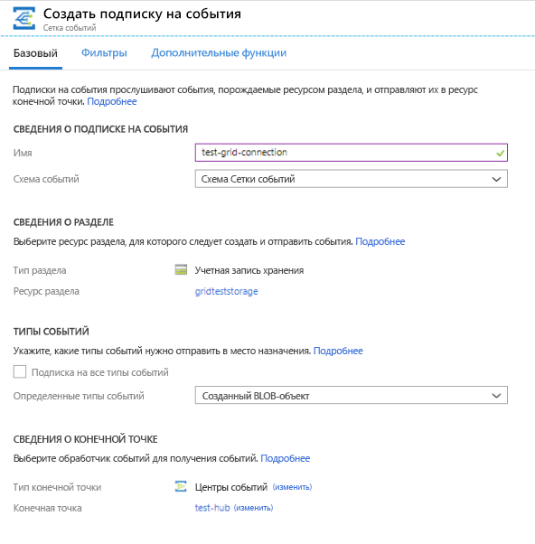
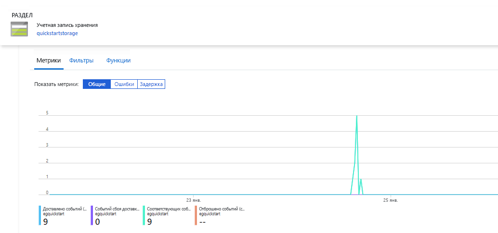
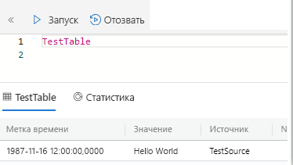

# <a name="quickstart-ingest-azure-blobs-into-azure-data-explorer-by-subscribing-to-event-grid-notifications"></a>Краткое руководство. Прием больших двоичных объектов Azure в Azure Data Explorer благодаря подписке на уведомления службы "Сетка событий Azure"

Обозреватель данных Azure — это быстрая и высокомасштабируемая служба для изучения данных журналов и телеметрии. Azure Data Explorer позволяет непрерывно принимать (загружать) данные из больших двоичных объектов, записанных в контейнеры больших двоичных объектов. Для этого нужно настроить подписку службы [Сетка событий Azure](/azure/event-grid/overview) на события создания больших двоичных объектов и направлять эти события к Kusto через концентратор событий. Для работы с этим кратким руководством у вас должна быть учетная запись хранения с подпиской на службу "Сетка событий Azure", которая отправляет уведомления в концентратор событий. После этого вы сможете создать подключение к данным службы "Сетка событий Azure" и просмотреть поток данных в системе.

## <a name="prerequisites"></a>Предварительные требования

1. Если у вас нет подписки Azure, создайте [бесплатную учетную запись Azure](https://azure.microsoft.com/free/).
1. [Кластер и база данных](create-cluster-database-portal.md).
1. [Учетная запись хранения](https://docs.microsoft.com/azure/storage/common/storage-quickstart-create-account?tabs=azure-portal).
1. [Концентратор событий](https://docs.microsoft.com/azure/event-hubs/event-hubs-create).

## <a name="create-an-event-grid-subscription-in-your-storage-account"></a>Создание подписки на службу "Сетка событий Azure" в учетной записи хранения

1. Войдите в свою учетную запись хранения на портале Azure.
1. На вкладке **События** щелкните **Подписка на события**.

    

1. В окне **Создание подписки на событие** на вкладке **Основные** введите следующие значения:

    **Параметр** | **Рекомендуемое значение** | **Описание поля**
    |---|---|---|
    | ИМЯ | *test-grid-connection* | Имя создаваемой сетки событий.|
    | Схема событий | *Схема сетки событий* | Схема, которая должна использоваться для службы "Сетка событий Azure". |
    | Тип раздела | *Учетная запись хранения* | Тип раздела сетки событий. |
    | Ресурс раздела | *gridteststorage* | Имя учетной записи хранения. |
    | Подписка на все типы событий | *Снять пометку* | Позволяет указать, что получать уведомления обо всех событиях не нужно. |
    | Определенные типы событий | *Blob created* (Большой двоичный объект создан) | Позволяет указать, о каких конкретных событиях нужно получать уведомления. |
    | Тип конечной точки | *Центры событий* | Тип конечной точки, куда будут отправляться события. |
    | Конечная точка | *test-hub* | Созданный концентратор событий. |
    | | |

1. Если вы хотите отслеживать файлы из определенного контейнера, щелкните вкладку **Дополнительные функции**. Настройте фильтры для получения уведомлений следующим образом:
    * Поле **Тема начинается с** — это префикс *литерала* контейнера больших двоичных объектов (так как применен шаблон *startswith*, этот префикс может относиться к нескольким контейнерам). Подстановочные знаки не допускаются.
     Значение *необходимо* задать следующим образом: *`/blobServices/default/containers/`*[префикс контейнера].
    * Поле **Тема заканчивается на** — это суффикс *литерала* большого двоичного объекта. Подстановочные знаки не допускаются.

## <a name="create-a-target-table-in-azure-data-explorer"></a>Создание целевой таблицы в обозревателе данных Azure

Создайте таблицу в Azure Data Explorer, куда Центры событий будут отправлять данные. Таблица создается в кластере и базе данных, описанных в разделе **Необходимые компоненты**.

1. На портале Azure, в своем кластере, выберите **Запрос**.

    

1. Скопируйте следующую команду в окно и выберите **Выполнить**, чтобы создать таблицу (TestTable), которая будет принимать входящие данные.

    ```Kusto
    .create table TestTable (TimeStamp: datetime, Value: string, Source:string)
    ```

    

1. Скопируйте следующую команду в окно и выберите **Выполнить** для сопоставления входящих данных JSON с именами столбцов и типами данных таблицы (TestTable).

    ```Kusto
    .create table TestTable ingestion json mapping 'TestMapping' '[{"column":"TimeStamp","path":"$.TimeStamp"},{"column":"Value","path":"$.Value"},{"column":"Source","path":"$.Source"}]'
    ```

## <a name="create-an-event-grid-data-connection-in-azure-data-explorer"></a>Создание подключения к данным службы "Сетка событий Azure" в Azure Data Explorer

Теперь подключитесь к Сетке событий с помощью Azure Data Explorer, чтобы данные, поступающие в контейнер больших двоичных объектов, потоком передавались в тестовую таблицу.

1. Выберите **уведомления** на панели инструментов, чтобы убедиться в успешном развертывании концентратора событий.

1. В созданном кластере выберите **Базы данных**, затем **TestDatabase**.

    

1. Выберите **Прием данных**, затем **Добавить подключение к данным**.

    

1. Выберите тип подключения: **Хранилище больших двоичных объектов**.

1. Заполните форму, указав следующую информацию, затем нажмите кнопку **Создать**.

    

     Источник данных:

    **Параметр** | **Рекомендуемое значение** | **Описание поля**
    |---|---|---|
    | Имя подключения к данным | *test-hub-connection* | Имя создаваемого подключения к обозревателю данных Azure.|
    | Подписка учетной записи хранения | Идентификатор подписки | Идентификатор подписки, где находится учетная запись хранилища.|
    | Учетная запись хранения | *gridteststorage* | Имя созданной учетной записи хранения.|
    | Сетка событий Azure | *test-grid-connection* | Имя создаваемой Сетки событий. |
    | имя концентратора событий; | *test-hub* | Созданный концентратор событий. Это значение заполняется автоматически при выборе Сетки событий. |
    | Группа потребителей | *test-group* | Группа получателей событий, определенная в созданном концентраторе событий. |
    | | |

    Целевая таблица

     **Параметр** | **Рекомендуемое значение** | **Описание поля**
    |---|---|---|
    | Таблица | *TestTable* | Таблица, созданная в базе данных **TestDatabase**. |
    | Формат данных | *JSON* | Поддерживаются форматы JSON и CSV. |
    | Сопоставление столбцов | *TestMapping* | Сопоставление, созданное в таблице **TestDatabase**, которое сопоставляет входящие данные JSON с именами столбцов и типами данных **TestTable**.|
    | | |

## <a name="generate-sample-data"></a>Создание примера данных

Теперь, когда Azure Data Explorer и учетная запись хранения подключены, вы можете создать примеры данных и отправить их в хранилище BLOB-объектов.

Мы создадим небольшой скрипт оболочки, который выполняет несколько базовых команд Azure CLI для взаимодействия с ресурсами службы хранилища Azure. Сначала скрипт создает новый контейнер в учетной записи хранения, а затем отправляет существующий файл (в виде большого двоичного объекта) в этот контейнер. В нем будут перечислены все большие двоичные объекты в контейнере. Чтобы выполнить скрипт непосредственно на портале, можно использовать [Cloud Shell](https://docs.microsoft.com/azure/cloud-shell/overview).

Сохраните следующие данные в файле и используйте с приведенным ниже скриптом:

```Json
{"TimeStamp": "1987-11-16 12:00","Value": "Hello World","Source": "TestSource"}
```

```bash
#!/bin/bash
### A simple Azure Storage example script

    export AZURE_STORAGE_ACCOUNT=<storage_account_name>
    export AZURE_STORAGE_KEY=<storage_account_key>

    export container_name=<container_name>
    export blob_name=<blob_name>
    export file_to_upload=<file_to_upload>
    export destination_file=<destination_file>

    echo "Creating the container..."
    az storage container create --name $container_name

    echo "Uploading the file..."
    az storage blob upload --container-name $container_name --file $file_to_upload --name $blob_name

    echo "Listing the blobs..."
    az storage blob list --container-name $container_name --output table

    echo "Done"
```

## <a name="review-the-data-flow"></a>Просмотр потока данных

> [!NOTE]
> В ADX настроена политика агрегирования (пакетной обработки) для приема данных, предназначенная для оптимизации процесса приема.
По умолчанию политика настроена на прием данных с интервалом в 5 минут.
При необходимости вы сможете изменить политику позже. В этом кратком руководстве может возникать задержка в несколько минут.

1. На портале Azure в разделе сетки событий во время работы приложения появится пик активности.

    

1. Чтобы проверить, сколько сообщений поступило в базу данных к этому моменту, выполните следующий запрос в тестовой базе данных.

    ```Kusto
    TestTable
    | count
    ```

1. Чтобы увидеть содержимое сообщений, выполните следующий запрос в тестовой базе данных.

    ```Kusto
    TestTable
    ```

    Результат должен быть похож на следующее.

    

## <a name="clean-up-resources"></a>Очистка ресурсов

Если не планируется повторно использовать сетку событий, очистите **test-hub-rg**, чтобы избежать взимания оплаты.

1. На портале Azure выберите **Группа ресурсов** слева, а затем выберите созданную группу ресурсов.  

    Если левое меню свернуто, нажмите  чтобы развернуть его.

   

1. В разделе **test-resource-group** выберите **Удалить группу ресурсов**.

1. В новом окне введите имя удаляемой группы ресурсов (*test-hub-rg*) и нажмите кнопку **Удалить**.

## <a name="next-steps"></a>Дополнительная информация

> [!div class="nextstepaction"]
> [Краткое руководство Запрос данных в Azure Data Explorer](web-query-data.md)