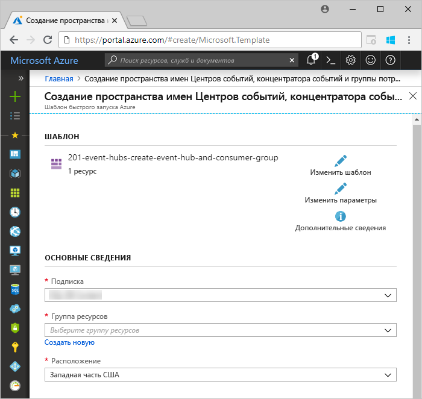
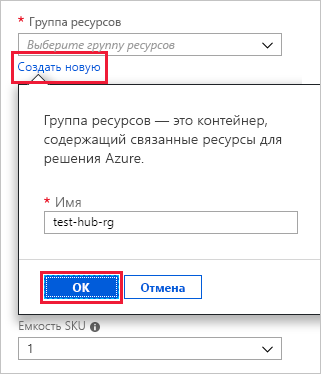
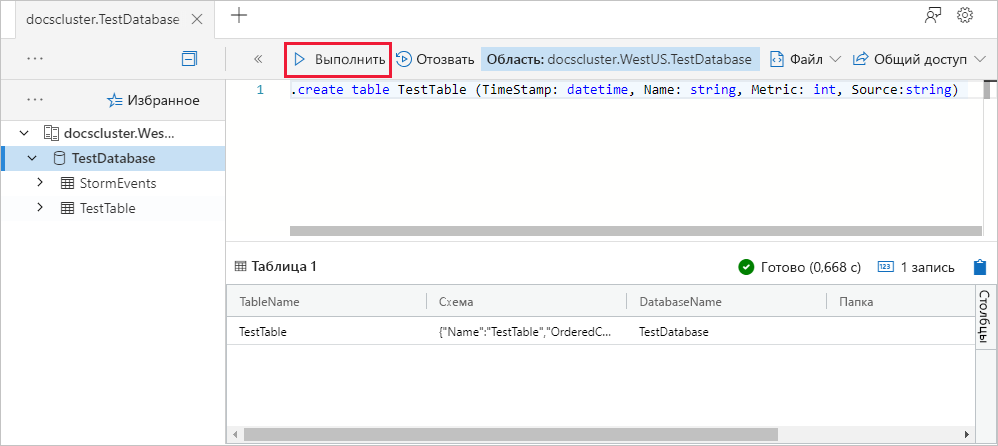
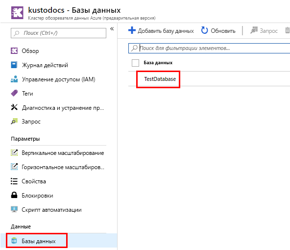
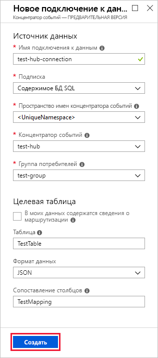
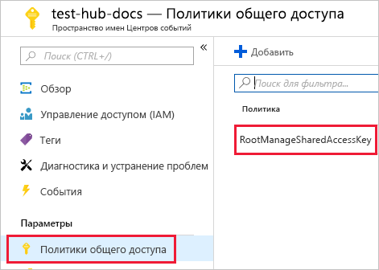
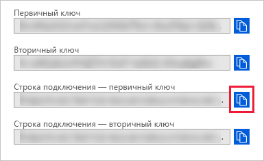
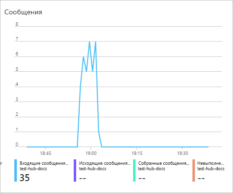
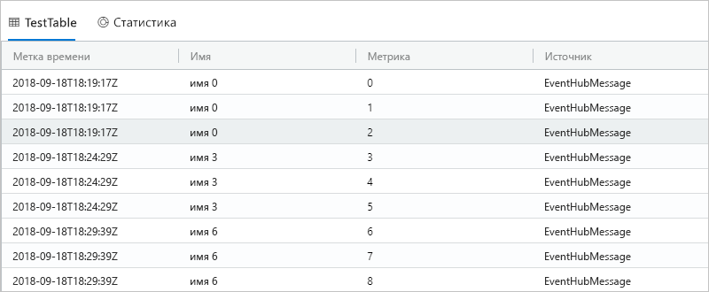
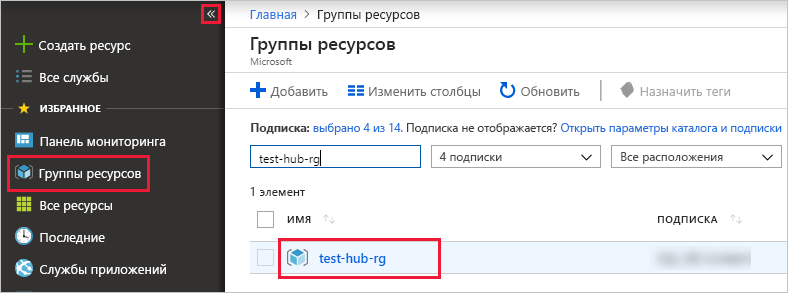

# <a name="quickstart-ingest-data-from-event-hub-into-azure-data-explorer"></a>Краткое руководство. Прием данных из концентратора событий в Azure Data Explorer

Обозреватель данных Azure — это быстрая и высокомасштабируемая служба для изучения данных журналов и телеметрии. Обозреватель данных Azure позволяет выполнять прием (загрузку) данных из концентраторов событий, платформы потоковой передачи больших данных и службы приема данных событий. [Центры событий](/azure/event-hubs/event-hubs-about) могут обрабатывать миллионы событий в секунду практически в режиме реального времени. В этом кратком курсе вы научитесь создавать концентратор событий, подключиться к нему из обозревателя данных Azure и просматривать поток данных, проходящих через систему.

## <a name="prerequisites"></a>Предварительные требования

* Если у вас еще нет подписки Azure, создайте [бесплатную учетную запись](https://azure.microsoft.com/free/) Azure, прежде чем начинать работу.

* [Тестовый кластер и база данных](create-cluster-database-portal.md)

* [Пример приложения](https://github.com/Azure-Samples/event-hubs-dotnet-ingest), создающего данные и отправляющего их в концентратор событий. Загрузите пример приложения в систему.

* [Visual Studio 2017 версии 15.3.2 или более поздней](https://www.visualstudio.com/vs/) для выполнения примера приложения

## <a name="sign-in-to-the-azure-portal"></a>Вход на портал Azure

Войдите на [портале Azure](https://portal.azure.com/).

## <a name="create-an-event-hub"></a>Создание концентратора событий

В этом кратком курсе создаются демонстрационные данные, которые передаются в концентратор событий. Первым шагом является создание концентратора событий. Это делается с помощью шаблона Azure Resource Manager на портале Azure.

1. Нажмите следующую кнопку, чтобы начать развертывание и создание концентратора событий. Чтобы закончить выполнение инструкций из этой статьи, щелкните правой кнопкой мыши и выберите ссылку **Открыть в новом окне**.

    [](https://portal.azure.com/#create/Microsoft.Template/uri/https%3A%2F%2Fraw.githubusercontent.com%2FAzure%2Fazure-quickstart-templates%2Fmaster%2F201-event-hubs-create-event-hub-and-consumer-group%2Fazuredeploy.json)

    Кнопка **Развернуть в Azure** выполняет переход на портал Azure для заполнения формы развертывания.

    

1. Выберите подписку, в которой нужно создать концентратор событий, и создайте группу ресурсов с именем *test-hub-rg*.

    

1. Заполните форму, указав следующую информацию.

    

    Используйте значения по умолчанию для всех параметров, отсутствующих в следующей таблице.

    **Параметр** | **Рекомендуемое значение** | **Описание поля**
    |---|---|---|
    | Подписка | Ваша подписка | Выберите подписку Azure, которую нужно использовать для своего концентратора событий.|
    | Группа ресурсов | *test-hub-rg* | Создайте новую группу ресурсов. |
    | Расположение | *Западная часть США* | Выберите *Западная часть США* для этого краткого руководства. Для производственной системы выберите регион, лучше всего соответствующий вашим потребностям. Создайте пространство имен концентратора событий в одном расположении с кластером Kusto, чтобы обеспечить оптимальную производительность (крайне важно для пространств имен концентраторов событий с высокой пропускной способностью).
    | Имя пространства имен | Уникальное имя пространства имен | Выберите уникальное имя, идентифицирующее пространство имен. Например, *mytestnamespace*. К введенному имени добавляется имя домена *servicebus.windows.net*. Имя может содержать только буквы, цифры и дефисы. Имя должно начинаться с буквы или цифры и заканчиваться буквой или цифрой. Длина значения в символах должна быть от 6 до 50.
    | Имя концентратора событий | *test-hub* | Концентратор событий находится в пространстве имен, предоставляющем уникальный контейнер области. Имя концентратора событий должно быть уникальным в пределах пространства имен. |
    | Имя группы потребителей | *test-group* | Группы получателей событий позволяют каждому из нескольких получающих события приложений иметь отдельное представление потока событий. |
    | | |

1. Выберите **Купить**, что подтверждает создание ресурсов в вашей подписке.

1. На панели инструментов щелкните **Уведомления**, чтобы отслеживать процесс подготовки. Успешное выполнение развертывания может занять несколько минут, но теперь можно перейти к следующему шагу.

    

## <a name="create-a-target-table-in-azure-data-explorer"></a>Создание целевой таблицы в обозревателе данных Azure

Теперь создадим таблицу в обозревателе данных Azure, в которые концентраторы событий будут отправлять данные. Таблица создается в кластере и базе данных, представленных в разделе **Необходимые компоненты**.

1. Войдите на портал Azure, перейдите в свой кластер и выберите **Запрос**.

    

1. Скопируйте следующую команду в окно и выберите **Выполнить**, чтобы создать таблицу (TestTable), которая будет принимать входящие данные.

    ```Kusto
    .create table TestTable (TimeStamp: datetime, Name: string, Metric: int, Source:string)
    ```

    

1. Скопируйте следующую команду в окно и выберите **Выполнить** для сопоставления входящих данных JSON с именами столбцов и типами данных таблицы (TestTable).

    ```Kusto
    .create table TestTable ingestion json mapping 'TestMapping' '[{"column":"TimeStamp","path":"$.timeStamp","datatype":"datetime"},{"column":"Name","path":"$.name","datatype":"string"},{"column":"Metric","path":"$.metric","datatype":"int"},{"column":"Source","path":"$.source","datatype":"string"}]'
    ```

## <a name="connect-to-the-event-hub"></a>Подключение к концентратору событий

Теперь вы можете подключиться к концентратору событий с помощью Azure Data Explorer. После установки этого подключения данные, поступающие в концентратор событий, передаются потоком в тестовую таблицу, созданную ранее в этой статье.

1. Выберите **уведомления** на панели инструментов, чтобы убедиться в успешном развертывании концентратора событий.

1. В созданном кластере выберите **Базы данных**, затем **TestDatabase**.

    

1. Выберите **Прием данных**, затем **Добавить подключение к данным**.

    

1. Заполните форму, указав следующую информацию, затем нажмите кнопку **Создать**.

    

    Источник данных

    **Параметр** | **Рекомендуемое значение** | **Описание поля**
    |---|---|---|
    | Имя подключения к данным | *test-hub-connection* | Имя создаваемого подключения к обозревателю данных Azure.|
    | Пространство имен концентратора событий | Уникальное имя пространства имен | Имя, выбранное ранее и определяющее пространство имен. |
    | концентратор событий; | *test-hub* | Созданный концентратор событий. |
    | Группа потребителей | *test-group* | Группа получателей событий, определенная в созданном концентраторе событий. |
    | | |

    Целевая таблица

    Существует два варианта маршрутизации: *статическая* и *динамическая*. В этом кратком руководстве используется статическая маршрутизация (по умолчанию), в которой можно указать имя таблицы, формат файла и сопоставление. Поэтому не устанавливайте флажок **Мои данные содержат сведения о маршрутизации**.
    Вы также можете использовать динамическую маршрутизацию, где данные содержат необходимые сведения о маршрутизации.

     **Параметр** | **Рекомендуемое значение** | **Описание поля**
    |---|---|---|
    | Таблица | *TestTable* | Таблица, созданная в базе данных **TestDatabase**. |
    | Формат данных | *JSON* | Поддерживаются форматы JSON и CSV. |
    | Сопоставление столбцов | *TestMapping* | Сопоставление, созданное в таблице **TestDatabase**, которое сопоставляет входящие данные JSON с именами столбцов и типами данных **TestTable**.|
    | | |

## <a name="copy-the-connection-string"></a>Копирование строки подключения

При запуске [примера приложения](https://github.com/Azure-Samples/event-hubs-dotnet-ingest), указанного в списке предварительных требований, потребуется строка подключения для пространства имен концентратора событий.

1. В созданном пространстве имен концентратора событий выберите **Политики общего доступа**, затем **RootManageSharedAccessKey**.

    

1. Скопируйте значение в поле **Строка подключения — первичный ключ**. Вставьте его при работе со следующим разделом.

    

## <a name="generate-sample-data"></a>Создание примера данных

Используйте [пример приложения](https://github.com/Azure-Samples/event-hubs-dotnet-ingest), загруженный для создания данных.

1. Откройте решение для примера приложения в Visual Studio.

1. В файле *program.cs* обновите константу `connectionString`, указав строку подключения, скопированную из пространства имен концентратора событий.

    ```csharp
    const string eventHubName = "test-hub";
    // Copy the connection string ("Connection string-primary key") from your Event Hub namespace.
    const string connectionString = @"<YourConnectionString>";
    ```

1. Выполните сборку и запустите приложение. Приложение отправляет сообщения в концентратор событий, и он печатает состояние каждые десять секунд.

1. После отправки приложением нескольких сообщений перейдите к следующему шагу: просмотрите поток данных, поступающий в концентратор событий центра и тестовую таблицу.

## <a name="review-the-data-flow"></a>Просмотр потока данных

Теперь, когда приложение создает данные, вы можете просмотреть поток данных, поступающих из концентратора событий в таблицу в кластере.

1. На портале Azure, в разделе своего концентратора событий, во время работы приложения появится пик активности.

    

1. Чтобы проверить, сколько сообщений поступило в базу данных к этому моменту, выполните следующий запрос в тестовой базе данных.

    ```Kusto
    TestTable
    | count
    ```

1. Чтобы увидеть содержимое сообщений, выполните следующий запрос:

    ```Kusto
    TestTable
    ```

    Результат должен выглядеть примерно так:

    

    > [!NOTE]
    > В Azure Data Explorer настроена политика агрегирования (пакетной обработки) для приема данных, предназначенных для оптимизации процесса. Эта политика настроена на 5 минут, поэтому могут возникать задержки.

## <a name="clean-up-resources"></a>Очистка ресурсов

Если не планируется повторно использовать концентратор событий, очистите **test-hub-rg**, чтобы избежать взимания оплаты.

1. На портале Azure выберите **Группа ресурсов** слева, а затем выберите созданную группу ресурсов.  

    Если левое меню свернуто, нажмите  чтобы развернуть его.

   

1. В разделе **test-resource-group** выберите **Удалить группу ресурсов**.

1. В новом окне введите имя удаляемой группы ресурсов (*test-hub-rg*) и нажмите кнопку **Удалить**.

## <a name="next-steps"></a>Дополнительная информация

> [!div class="nextstepaction"]
> [Краткое руководство Запрос данных в Azure Data Explorer](web-query-data.md)
