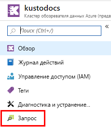

# <a name="quickstart-ingest-data-from-kafka-into-azure-data-explorer"></a>Краткое руководство. Прием данных из Kafka в Azure Data Explorer
 
Обозреватель данных Azure — это быстрая и высокомасштабируемая служба для изучения данных журналов и телеметрии. Azure Data Explorer позволяет принимать (загружать) данные из Kafka. Kafka — это распределенная платформа потоковой передачи, которая позволяет в режиме реального времени выполнять сборку конвейеров потоковой передачи данных, обеспечивающих надежный обмен данными между системами и приложениями.
 
## <a name="prerequisites"></a>Предварительные требования
 
* Если у вас еще нет подписки Azure, создайте [бесплатную учетную запись](https://azure.microsoft.com/free/) Azure, прежде чем начинать работу. 
 
* [Тестовый кластер и база данных](create-cluster-database-portal.md)
 
* [Пример приложения](https://github.com/Azure/azure-kusto-samples-dotnet/tree/master/kafka), создающего данные и отправляющего их в Kafka.

* [Visual Studio 2017 версии 15.3.2 или более поздней](https://www.visualstudio.com/vs/) для выполнения примера приложения
 
## <a name="kafka-connector-setup"></a>Настройка соединителя Kafka

Kafka Connect — это средство для масштабируемой и надежной потоковой передачи данных между Apache Kafka и другими системами. Это средство позволяет легко и быстро определять соединители, перемещающие большие наборы данных в Kafka и из Kafka. ADX Kafka Sink служит соединителем для данных со стороны Kafka.
 
### <a name="bundle"></a>Пакет

С помощью Kafka можно загрузить `.jar` как подключаемый модуль, который будет выступать в качестве настраиваемого соединителя. Для создания такого `.jar` мы клонируем код локально и выполним сборку с помощью Maven. 

#### <a name="clone"></a>Clone (Клонировать)

```bash
git clone git://github.com:Azure/kafka-sink-azure-kusto.git
cd ./kafka-sink-azure-kusto/kafka/
```

#### <a name="build"></a>Создание

Выполните сборку локально с помощью Maven, чтобы создать `.jar` с зависимостями.

* [Скачать](https://www.oracle.com/technetwork/java/javase/downloads/index.html) JDK >= 1.8.
* [Скачать](https://maven.apache.org/install.html) Maven.
 

В корневом каталоге *kafka-sink-azure-kusto* выполните следующее.

```bash
mvn clean compile assembly:single
```

### <a name="deploy"></a>Развертывание 

Загрузка подключаемого модуля в Kafka. Пример развертывания с помощью Docker находится здесь: [kafka-sink-azure-kusto](https://github.com/Azure/kafka-sink-azure-kusto#deploy).
 

Подробная документация о соединителях Kafka и способах развертывания доступна на странице [Kafka Connect](https://kafka.apache.org/documentation/#connect). 

### <a name="example-configuration"></a>Пример конфигурации 
 
```config
name=KustoSinkConnector 
connector.class=com.microsoft.azure.kusto.kafka.connect.sink.KustoSinkConnector 
kusto.sink.flush_interval_ms=300000 
key.converter=org.apache.kafka.connect.storage.StringConverter 
value.converter=org.apache.kafka.connect.storage.StringConverter 
tasks.max=1 
topics=testing1 
kusto.tables.topics_mapping=[{'topic': 'testing1','db': 'daniel', 'table': 'TestTable','format': 'json', 'mapping':'TestMapping'}] 
kusto.auth.authority=XXX 
kusto.url=https://ingest-{mycluster}.kusto.windows.net/ 
kusto.auth.appid=XXX 
kusto.auth.appkey=XXX 
kusto.sink.tempdir=/var/tmp/ 
kusto.sink.flush_size=1000
```
 
## <a name="create-a-target-table-in-adx"></a>Создание целевой таблицы в ADX
 
Создайте таблицу в ADX, в которую Kafka может отправлять данные. Создайте таблицу в кластере и базе данных, представленных в разделе **Необходимые компоненты**.
 
1. На портале Azure перейдите в свой кластер и выберите **Запрос**.
 
    
 
1. Скопируйте следующую команду в окно и выберите **Выполнить**.
 
    ```Kusto
    .create table TestTable (TimeStamp: datetime, Name: string, Metric: int, Source:string)
    ```
 
    
 
1. Скопируйте следующую команду в окно и выберите **Выполнить**.
 
    ```Kusto
    .create table TestTable ingestion json mapping 'TestMapping' '[{"column":"TimeStamp","path":"$.timeStamp","datatype":"datetime"},{"column":"Name","path":"$.name","datatype":"string"},{"column":"Metric","path":"$.metric","datatype":"int"},{"column":"Source","path":"$.source","datatype":"string"}]'
    ```

    Эта команда сопоставляет входящие данные JSON с именами и типами данных столбцов таблицы (TestTable).


## <a name="generate-sample-data"></a>Создание примера данных

Теперь, когда ADX подключен к кластеру Kafka, используйте [пример приложения](https://github.com/Azure-Samples/event-hubs-dotnet-ingest), скачанный для создания данных.

### <a name="clone"></a>Clone (Клонировать)

Клонируйте пример приложения локально.

```cmd
git clone git://github.com:Azure/azure-kusto-samples-dotnet.git
cd ./azure-kusto-samples-dotnet/kafka/
```

### <a name="run-the-app"></a>Запуск приложения

1. Откройте решение для примера приложения в Visual Studio.

1. В файле `Program.cs` обновите константу `connectionString` в строке подключения к Kafka.

    ```csharp    
    const string connectionString = @"<YourConnectionString>";
    ```

1. Выполните сборку и запустите приложение. Приложение отправляет сообщения в кластер Kafka, и каждые 10 секунд он сообщает о своем состоянии.

1. Когда приложение отправит нескольких сообщений, переходите к следующему шагу.
 
## <a name="query-and-review-the-data"></a>Запрос и просмотр данных

1. Чтобы убедиться в том, что прием выполнен без ошибок, выполните следующее:

    ```Kusto
    .show ingestion failures
    ```

1. Чтобы просмотреть принятые данные, выполните следующее:

    ```Kusto
    TestTable 
    | count
    ```

1. Чтобы просмотреть содержимое сообщений, выполните следующее:
 
    ```Kusto
    TestTable
    ```
 
    Результат должен выглядеть примерно так:
 
    
 
## <a name="next-steps"></a>Дополнительная информация
 
> [!div class="nextstepaction"]
> [Краткое руководство Запрос данных в Azure Data Explorer](web-query-data.md)
