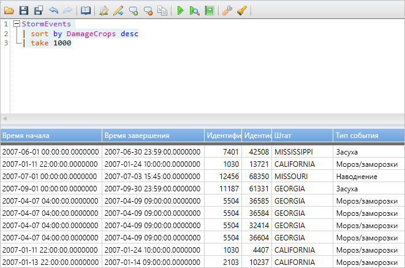
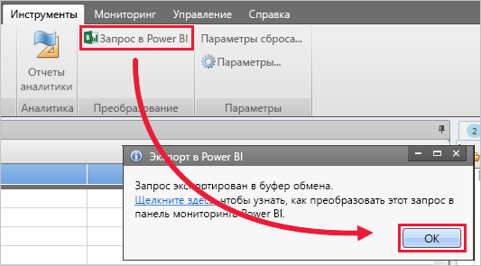
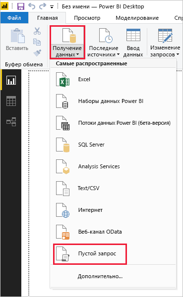
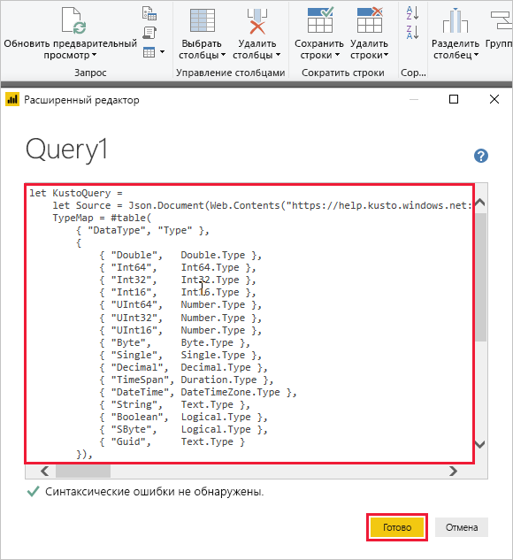
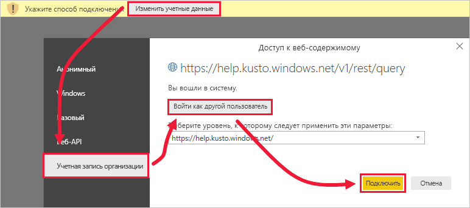
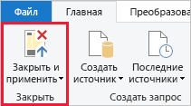

# <a name="quickstart-visualize-data-using-a-query-imported-into-power-bi"></a>Краткое руководство. Визуализация данных с помощью запроса, импортированного в Power BI

Обозреватель данных Azure — это быстрая и высокомасштабируемая служба для изучения данных журналов и телеметрии. Power BI — это решение бизнес-аналитики, позволяющее визуализировать данные и делиться результатами с коллегами.

Azure Data Explorer поддерживает три варианта подключения к данным в Power BI: использование встроенного соединителя, импорт запроса из Azure Data Explorer и использование SQL-запроса. В этом кратком руководстве показано, как импортировать запрос для получения и визуализаций данных в отчете Power BI.

Если у вас еще нет подписки Azure, создайте [бесплатную учетную запись](https://azure.microsoft.com/free/) Azure, прежде чем начинать работу.

## <a name="prerequisites"></a>Предварительные требования

Для работы с этим кратким руководством требуется следующее:

* учетная запись электронной почты организации, подключенной к Azure Active Directory, для доступа к [кластеру help в Azure Data Explorer](https://dataexplorer.azure.com/clusters/help/databases/samples);

* [Power BI Desktop](https://powerbi.microsoft.com/get-started/) (выберите **Скачать бесплатно**);

* [классическое приложение Azure Data Explorer](/azure/kusto/tools/kusto-explorer).

## <a name="get-data-from-azure-data-explorer"></a>Получение данных из Azure Data Explorer

Сначала вам нужно создать запрос в классическом приложении Azure Data Explorer и экспортировать его в Power BI. Затем вы подключаетесь к кластеру help в Azure Data Explorer, чтобы добавить набор данных из таблицы *StormEvents*. [!INCLUDE [data-explorer-storm-events](../../includes/data-explorer-storm-events.md)]

1. В браузере перейдите к [https://help.kusto.windows.net/](https://help.kusto.windows.net/), чтобы запустить классическое приложение Azure Data Explorer.

1. В приложении скопируйте следующий запрос в окно запроса в правом верхнем углу и запустите его.

    ```Kusto
    StormEvents
    | sort by DamageCrops desc
    | take 1000
    ```

    Первые несколько строк результирующего набора должны выглядеть, как на рисунке ниже.

    

1. На вкладке **Tools** (Средства) выберите **Query to Power BI** (Создать запрос в Power BI) и щелкните **ОК**.

    

1. В Power BI Desktop на вкладке **Главная** выберите **Получить данные**, а затем **Пустой запрос**.

    

1. В редакторе Power Query на вкладке **Главная** выберите **Расширенный редактор**.

1. В окне **Расширенный редактор** вставьте экспортированный запрос и нажмите **Готово**.

    

1. В главном окне редактора Power Query выберите **Изменить учетные данные**. Выберите **Учетная запись организации**, выполните вход и нажмите **Подключиться**.

    

1. На вкладке **Главная** выберите **Закрыть и применить**.

    

## <a name="visualize-data-in-a-report"></a>Визуализация данных в отчете

[!INCLUDE [data-explorer-power-bi-visualize-basic](../../includes/data-explorer-power-bi-visualize-basic.md)]

## <a name="clean-up-resources"></a>Очистка ресурсов

Если отчет, созданный в этом кратком руководстве, вам больше не нужен, удалите файл Power BI Desktop (файл с расширением .pbix).

## <a name="next-steps"></a>Дополнительная информация

> [!div class="nextstepaction"]
> [Краткое руководство. Визуализация данных с помощью запроса, импортированного в Power BI](power-bi-sql-query.md)