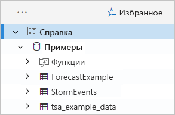
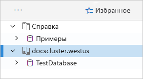
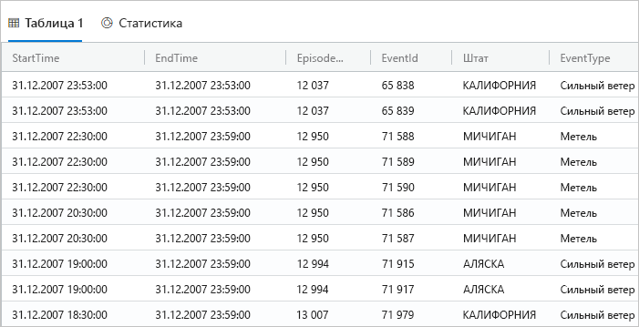
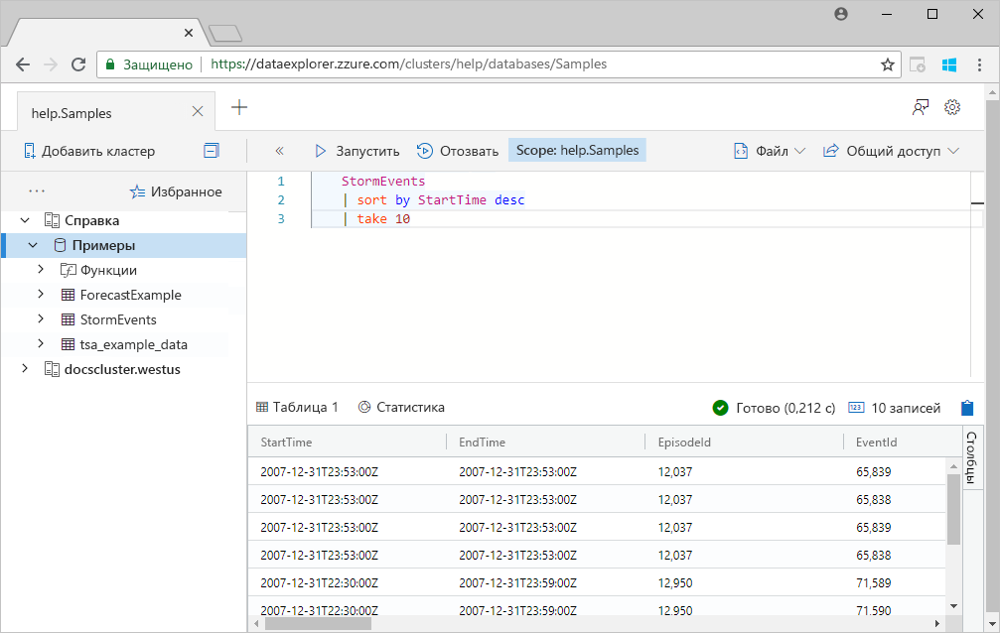
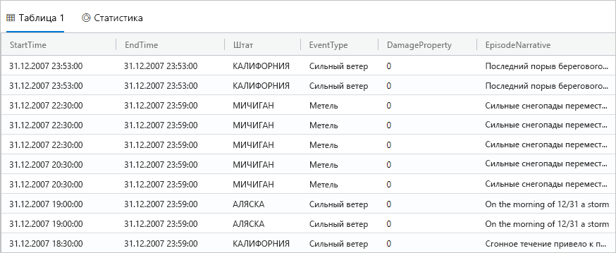
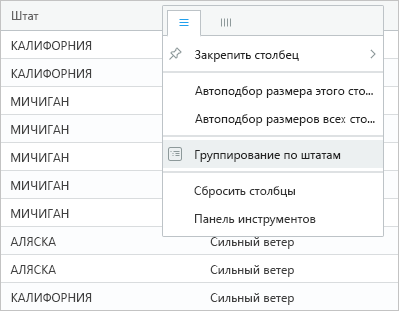
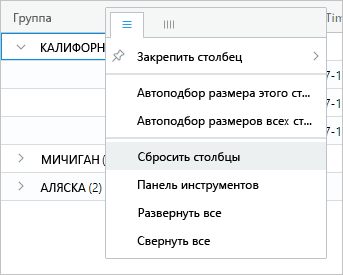
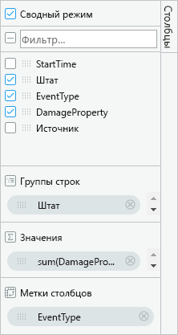
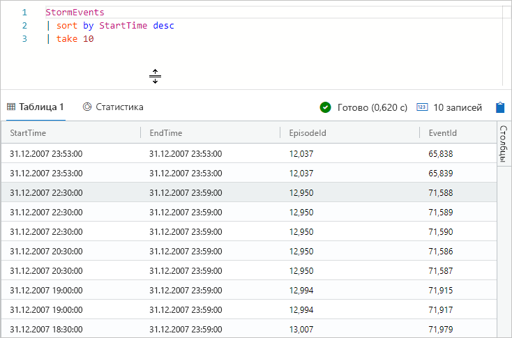

# <a name="quickstart-query-data-in-azure-data-explorer"></a>Краткое руководство. Запрос данных в обозревателе данных Azure

Обозреватель данных Azure — это быстрая и высокомасштабируемая служба для изучения данных журналов и телеметрии. Обозреватель данных Azure предоставляет веб-приложение для выполнения запросов и предоставления общего доступа к ним. Приложение доступно на портале Azure и в качестве отдельного веб-приложения. В этой статье вы работаете в изолированной версии, которая позволяет подключиться к нескольким кластерам, а также совместно использовать прямые ссылки на запросы.

Если у вас еще нет подписки Azure, создайте [бесплатную учетную запись](https://azure.microsoft.com/free/) Azure, прежде чем начинать работу.

## <a name="prerequisites"></a>Предварительные требования

Кроме подписки Azure, для прохождения этого краткого курса потребуется [тестовый кластер и база данных](create-cluster-database-portal.md).

## <a name="sign-in-to-the-application"></a>Вход в приложение

Выполните [вход в приложение](https://dataexplorer.azure.com/).

## <a name="add-clusters"></a>Добавление кластеров

При первом открытии приложения подключения отсутствуют.


Перед началом выполнения запросов необходимо добавить подключение по крайней мере к одному кластеру. В этом разделе добавляются подключения к *справочному кластеру* обозревателя данных Azure, который мы настроили, чтобы облегчить обучение, и к тестовому кластеру, созданному в предыдущем кратком руководстве.

1. В левом верхнем углу приложения выберите **Добавить кластер**.

1. В диалоговом окне **Добавление кластера** введите `https://help.kusto.windows.net` и выберите **Добавить**.

1. В левой области вы увидите **справочный** кластер. Разверните базу данных **Примеры**, чтобы увидеть примеры таблиц, к которым у вас есть доступ.

    

    Впоследствии в этом кратком руководстве и в других статьях по обозревателю данных Azure используется таблица **StormEvents**.

Теперь добавьте созданный тестовый кластер.

1. Выберите **Добавить кластер**.

1. В диалоговом окне **Добавить кластер** введите URL-адрес тестового кластера в форму `https://<ClusterName>.<Region>.kusto.windows.net/`, а затем выберите **Добавить**.

    В приведенном ниже примере вы видите **справочный** кластер и новый кластер **docscluster.westus** (полный URL-адрес — `https://docscluster.westus.kusto.windows.net/`).

    

## <a name="run-queries"></a>Выполнение запросов

Теперь можно выполнять запросы, адресованные любому кластеру, к которому вы подключены (при наличии данных в тестовом кластере). Мы сосредоточимся на **справочном** кластере.

1. В левой области в разделе **справочный** кластер выберите базу данных **Примеры**.

1. Копируйте и вставьте в окно запроса следующий запрос. Вверху окна выберите **Выполнить**.

    ```Kusto
    StormEvents
    | sort by StartTime desc
    | take 10
    ```
    Этот запрос возвращает десять последних записей в таблице **StormEvents**. В левой части результатов должно отобразиться что-то вроде следующей таблицы.

    

    На следующем рисунке показано состояние, в котором должно сейчас находиться приложение, с добавленными кластерами, а также запрос с результатами.

    

1. Копируйте и вставьте в окно запроса под первым запросом следующий запрос. Обратите внимание, что он не форматирован на отдельных строках, как первый запрос.

    ```Kusto
    StormEvents | sort by StartTime desc | project StartTime, EndTime, State, EventType, DamageProperty, EpisodeNarrative | take 10
    ```

1. Щелкните новый запрос в окне, чтобы выбрать запрос. Нажмите Shift + Alt + F, чтобы форматировать запрос, который должен выглядеть следующим образом.

    

1. Нажмите Shift + Ввод, чтобы выполнить запрос.

   Этот запрос возвращает те же записи, что и первый, но включает только столбцы, указанные в инструкции `project`. В результате должно отобразиться что-то вроде следующей таблицы.

    

1. В верхней части окна запроса выберите **Отозвать**.

    В окне запроса теперь отображается набор результатов из первого запроса, выполнять запрос повторно не требуется. Часто во время анализа выполняется несколько запросов, а функция **Отозвать** позволяет вернуться к результатам предыдущих запросов.

1. Давайте выполним еще один запрос, чтобы увидеть другой тип выходных данных.

    ```Kusto
    StormEvents
    | summarize event_count=count(), mid = avg(BeginLat) by State
    | sort by mid
    | where event_count > 1800
    | project State, event_count
    | render columnchart
    ```
    Результат должен напоминать следующую схему.

    

## <a name="work-with-the-table-grid"></a>Работа с сеткой таблицы

Теперь вы знаете, как работают базовые запросы. Давайте рассмотрим, как можно использовать сетку таблицы для пользовательской настройки результатов и дальнейшего анализа.

1. Выполните повторно первый запрос. Наведите указатель мыши на столбец **Штат**, выберите меню и пункт **Группировать по штату**.

    

1. В сетке разверните узел **Калифорния** для просмотра записей для данного штата.

    

    Этот тип группировки полезен в исследовательском анализе.

1. Наведите указатель мыши на столбец **Группировка** и выберите **Сбросить столбцы**.

    

    Сетка вернется в исходное состояние.

1. Выполните следующий запрос.

    ```Kutso
    StormEvents
    | sort by StartTime desc
    | where DamageProperty > 5000
    | project StartTime, State, EventType, DamageProperty, Source
    | take 10
    ```

1. В правой части сетки выберите **Столбцы** для просмотра панели инструментов.

    

    Это панель работает так же, как список полей сводной таблицы в Excel, позволяя анализировать больше данных из самой сетки.

1. Выберите **Сводный режим** и перетащите столбцы следующим образом: **State** в **Группы строк**; **DamageProperty** в **Значения**, а **EventType** в **Метки столбцов**.  

    

    Результаты должны иметь вид, как в следующей сводной таблице.

    

    Обратите внимание, что у Вермонта и Алабамы по два события в одной категории, а у Техаса — два события в разных категориях. Сводные таблицы позволяют быстро выявлять подобные вещи; они идеально подходят для быстрого анализа.

## <a name="share-queries"></a>Обмен запросами

Очень часто требуется предоставить общий доступ к создаваемым запросам. Можно предоставить глубокую ссылку, чтобы другие пользователи с доступом в кластер могли выполнять запросы.

1. В окне запроса выберите первый скопированный вами запрос.

1. В верхней части окна запроса выберите **Поделиться**.

1. Выберите **Копировать ссылку и запрос в буфер обмена**.

1. Копируйте ссылку и запрос в текстовый файл.

1. Вставьте ссылку в новом окне браузера. После выполнения запроса должно отобразиться следующее.

    

## <a name="provide-feedback"></a>Отзывы

Обозреватель данных в настоящее время доступен в ознакомительной версии, и мы ждем отзывов о вашей работе. Можно сделать это сейчас или подождать, пока вы как следует ознакомитесь с новым инструментом.

1. В правом верхнем углу приложения щелкните значок отзыва: .

1. Введите свой отзыв, а затем выберите **Отправить**.

## <a name="clean-up-resources"></a>Очистка ресурсов

В этом кратком руководстве не было создано никаких ресурсов, однако если вы хотите удалить один или оба кластера из приложения, щелкните кластер правой кнопкой и выберите **Удалить подключение**.

## <a name="next-steps"></a>Дополнительная информация

> [!div class="nextstepaction"]
> [Написание запросов для обозревателя данных Azure](write-queries.md)