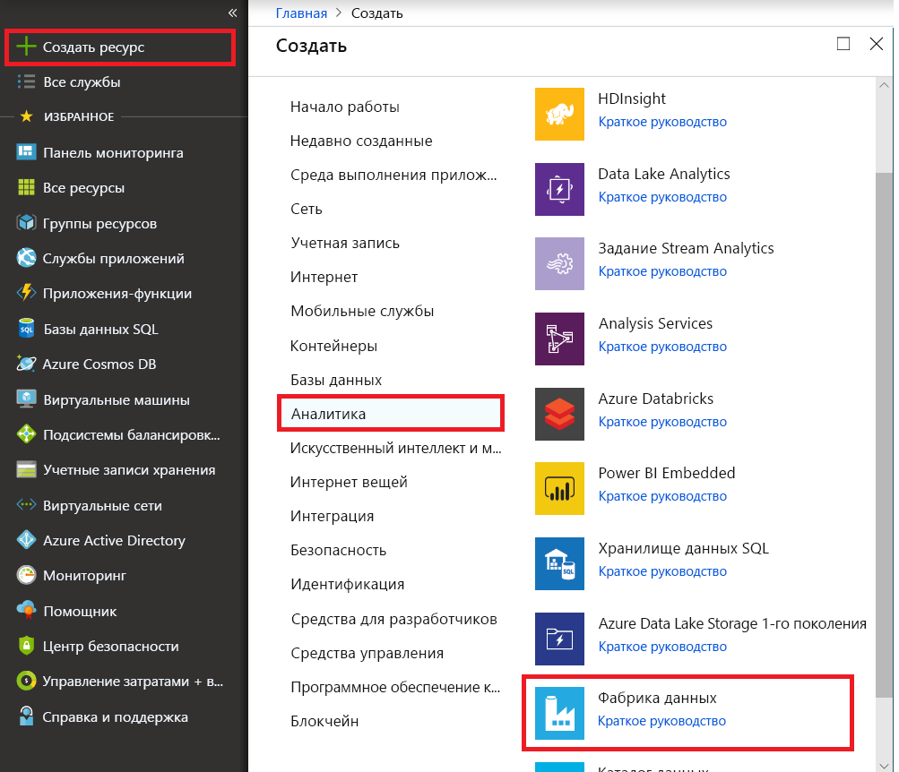

# Копирование данных с помощью средства копирования данных 
> [!div class="op_single_selector" title1="Select the version of Data Factory service that you are using:"]
> * [Версия 1](v1/data-factory-copy-data-from-azure-blob-storage-to-sql-database.md)
> * [Текущая версия](quickstart-create-data-factory-copy-data-tool.md)

В этом руководстве вы создадите фабрику данных с помощью портала Azure. После этого вы примените средство копирования данных, чтобы создать конвейер для копирования данных из одной папки в другую в хранилище BLOB-объектов Azure. 

> [!NOTE]
> Если вы еще не работали со службой "Фабрика данных Azure", ознакомьтесь с [общими сведениями](data-factory-introduction.md) о ней перед изучением этого руководства. 

[!INCLUDE [data-factory-quickstart-prerequisites](../../includes/data-factory-quickstart-prerequisites.md)] 

## Создание фабрики данных

1. В меню слева выберите **Создать**, **Данные+аналитика**, **Фабрика данных**. 
   
   
1. На странице **Новая фабрика данных** введите **ADFTutorialDataFactory** в поле **Имя**. 
      
   
 
   Имя фабрики данных Azure должно быть *глобально уникальным*. При возникновении указанной ниже ошибки измените имя фабрики данных (например, на **&lt;ваше_имя_&gt;ADFTutorialDataFactory**) и попробуйте создать фабрику данных снова. Правила именования для артефактов службы "Фабрика данных" см. в [этой](naming-rules.md) статье.
  
   
1. В поле **Подписка** выберите подписку Azure, в рамках которой вы хотите создать фабрику данных. 
1. Для **группы ресурсов** выполните одно из следующих действий:
     
   - Выберите **Use existing** (Использовать имеющуюся) и выберите имеющуюся группу ресурсов в списке. 
   - Выберите **Создать новую**и укажите имя группы ресурсов.   
         
   Сведения о группах ресурсов см. в статье, где описывается [использование групп ресурсов для управления ресурсами Azure](../azure-resource-manager/resource-group-overview.md).  
1. Укажите **V2** при выборе **версии**.
1. В поле **Расположение** выберите расположение фабрики данных. 

   В списке отображаются только расположения, которые поддерживаются Фабрикой данных и в которых будут храниться метаданные Фабрики данных Azure. Учтите, что связанные хранилища данных, (такие как служба хранилища Azure и база данных SQL Azure) и вычислительные среды (например, Azure HDInsight), используемые фабрикой данных, могут находиться в других регионах.

1. Нажмите кнопку **Создать**.
1. Когда создание завершится, откроется страница **Фабрика данных**. Выберите элемент **Author & Monitor** (Создание и мониторинг), чтобы открыть на отдельной вкладке приложение пользовательского интерфейса службы "Фабрика данных Azure".
   
   

## Запуск средства копирования данных

1. Чтобы запустить средство копирования данных, на странице **Let's get started** (Начало работы) выберите элемент **Копирование данных**. 

   

1. На странице **Свойства** средства копирования данных можно указать имя и описание конвейера, а затем нажать кнопку **Далее**. 

   
1. На странице **Исходное хранилище данных** сделайте следующее:

    a. Нажмите кнопку **+Создать подключение**, чтобы добавить подключение.

    

    b. В коллекции выберите **Хранилище BLOB-объектов Azure**, а затем нажмите кнопку **Далее**.

    

    c. На странице **Specify the Azure Blob storage account** (Указание учетной записи хранилища BLOB-объектов Azure) выберите учетную запись из списка **Имя учетной записи хранения**, а затем щелкните **Готово**. 

   

   d. Выберите созданную связанную службу в качестве источника, а затем нажмите кнопку **Далее**.

   

1. На странице **Choose the input file or folder** (Выбор входного файла или папки) выполните следующие действия:

   a. Нажмите кнопку **Обзор**, чтобы перейти к папке **adftutorial/input**, выделите файл **emp.txt** и щелкните **Выбрать**. 

   

   d. Установите флажок **Двоичное копирование**, чтобы скопировать файл как есть, и нажмите кнопку **Далее**. 

   

1. На странице **целевого хранилища данных** выберите созданную связанную службу **Хранилище BLOB-объектов Azure** и нажмите кнопку **Далее**. 

   

1. На странице **Выбор целевого файла или папки** укажите путь к папке **adftutorial/output** и нажмите кнопку **Далее**. 

    

1. На странице **Параметры** нажмите кнопку **Далее**, чтобы использовать настройки по умолчанию. 

1. Проверьте все параметры на странице **Сводка** и нажмите кнопку **Далее**. 

    

1. На странице **Deployment complete** (Развертывание завершено) щелкните **Monitor** (Мониторинг), чтобы отслеживать созданный конвейер. 

    

1. Приложение переключится на вкладку **Мониторинг**. На этой вкладке можно увидеть состояние конвейера. Щелкните **Обновить**, чтобы обновить список. 
    
    

1. Выберите ссылку **View Activity Runs** (Просмотр запусков действий) в столбце **Действия**. Наш конвейер содержит только одно действие типа **Копирование**. 

    
    
1. Чтобы просмотреть сведения об операции копирования, щелкните ссылку **Сведения** (изображение очков) в столбце **Действия**. Дополнительные сведения о свойствах см. в [обзоре действия копирования](copy-activity-overview.md).

    

1. Убедитесь, что файл **emp.txt** создан в папке **output** в контейнере **adftutorial**. Если указанной папки выходных данных нет, она будет автоматически создана в службе "Фабрика данных". 

1. Перейдите на вкладку **Автор**, расположенную над вкладкой **мониторинга** на панели слева. Там вы сможете изменять связанные службы, наборы данных и конвейеры. Дополнительные сведения об их изменении в пользовательском интерфейсе фабрики данных см. в статье [Создание фабрики данных с помощью пользовательского интерфейса службы "Фабрика данных Azure"](quickstart-create-data-factory-portal.md).

## Дополнительная информация
В этом примере конвейер копирует данные из одного расположения в другое в хранилище BLOB-объектов Azure. Перейдите к [руководствам](tutorial-copy-data-portal.md), чтобы узнать об использовании фабрики данных в различных сценариях. 