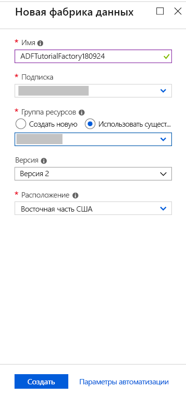
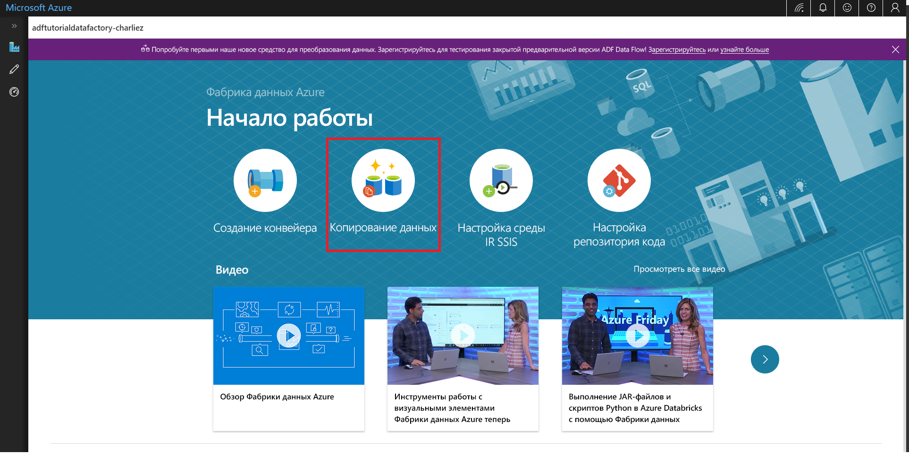

# Копирование данных с помощью средства копирования данных 
> [!div class="op_single_selector" title1="Select the version of Data Factory service that you are using:"]
> * [Версия 1 — общедоступная](v1/data-factory-copy-data-from-azure-blob-storage-to-sql-database.md)
> * [Версия 2 — предварительная](quickstart-create-data-factory-copy-data-tool.md)

В этом руководстве вы создадите фабрику данных с помощью портала Azure. После этого вы примените средство копирования данных, чтобы создать конвейер для копирования данных из одной папки в другую в хранилище BLOB-объектов Azure. 

> [!NOTE]
> Если вы еще не работали со службой "Фабрика данных Azure", ознакомьтесь с [общими сведениями](data-factory-introduction.md) о ней перед изучением этого руководства. 
>
> Эта статья относится к версии 2 фабрики данных, которая в настоящее время доступна в предварительной версии. Если вы используете общедоступную версию 1 службы, см. статью [Руководство. Копирование данных из хранилища BLOB-объектов Azure в базу данных SQL с помощью фабрики данных](v1/data-factory-copy-data-from-azure-blob-storage-to-sql-database.md).

[!INCLUDE [data-factory-quickstart-prerequisites](../../includes/data-factory-quickstart-prerequisites.md)] 

## Создать фабрику данных

1. В меню слева выберите **Создать**, **Данные+аналитика**, **Фабрика данных**. 
   
   
2. На странице **Новая фабрика данных** введите **ADFTutorialDataFactory** в поле **Имя**. 
      
   
 
   Имя фабрики данных Azure должно быть *глобально уникальным*. При возникновении указанной ниже ошибки измените имя фабрики данных (например, на **&lt;ваше_имя_&gt;ADFTutorialDataFactory**) и попробуйте создать фабрику данных снова. Правила именования для артефактов службы "Фабрика данных" см. в [этой](naming-rules.md) статье.
  
   
3. В поле **Подписка** выберите подписку Azure, в рамках которой вы хотите создать фабрику данных. 
4. Для **группы ресурсов** выполните одно из следующих действий:
     
   - Выберите **Use existing** (Использовать имеющуюся) и выберите имеющуюся группу ресурсов в списке. 
   - Выберите **Создать новую**и укажите имя группы ресурсов.   
         
   Сведения о группах ресурсов см. в статье, где описывается [использование групп ресурсов для управления ресурсами Azure](../azure-resource-manager/resource-group-overview.md).  
4. Для **версии** выберите **V2 (предварительная версия)**.
5. В поле **Расположение** выберите расположение фабрики данных. 

   В списке отображены только поддерживаемые расположения. Хранилища данных (такие как служба хранилища Azure и база данных SQL Azure) и вычислительные среды (например, Azure HDInsight), используемые фабрикой данных, могут находиться в других расположениях и/или регионах.

6. Кроме того, установите флажок **Закрепить на панели мониторинга**.     
7. Нажмите кнопку **Создать**.
8. На панели мониторинга вы увидите приведенный ниже элемент с состоянием **Deploying data factory** (Развертывание фабрики данных). 

    
9. Когда создание завершится, откроется страница **Фабрика данных**. Выберите элемент **Author & Monitor** (Создание и мониторинг), чтобы открыть на отдельной вкладке приложение пользовательского интерфейса службы "Фабрика данных Azure".
   
   

## Запуск средства копирования данных

1. Чтобы запустить средство копирования данных, на странице **Let's get started** (Начало работы) выберите элемент **Копирование данных**. 

   
2. На странице **Свойства** для средства копирования данных выберите **Далее**. На этой странице можно указать имя и описание конвейера. 

   
3. На странице **исходного хранилища данных** выберите **Хранилище BLOB-объектов Azure**, а затем выберите **Далее**.

   
4. На странице **Specify the Azure Blob storage account** (Указание учетной записи хранилища BLOB-объектов Azure) выберите учетную запись из списка **Имя учетной записи хранения**, а затем щелкните **Далее**. 

   
5. На странице **Choose the input file or folder** (Выбор входного файла или папки) выполните следующие действия:

   a. Перейдите в папку **adftutorial/input**.

   Б. Выберите файл **emp.txt**.

   c. Выберите пункт **Выбор**. Вместо этого можно просто дважды щелкнуть файл **emp.txt**.

   d. Щелкните **Далее**. 

   
6. На странице **File format settings** (Параметры формата файла) убедитесь, что средство правильно автоматически определило разделители столбцов и строк, и выберите **Далее**. Кроме того, на этой странице вы можете просмотреть данные и схемы входных данных. 

   
7. На странице **целевого хранилища данных** выберите **Хранилище BLOB-объектов Azure**, затем **Далее**. 

       
8. На странице **Specify the Azure Blob storage account** (Указание учетной записи хранилища BLOB-объектов Azure) выберите имя учетной записи хранения, а затем выберите **Далее**. 

   
9. На странице **Choose the output file or folder** (Выбор целевого файла или папки) выполните следующие действия: 

   a. Введите **adftutorial/output** в поле пути к папке.

   Б. Введите **emp.txt** в поле имени файла.

   c. Щелкните **Далее**. 

    
10. На странице **File format settings** (Параметры формата файла) выберите **Далее**. 

    
11. На странице **Параметры** выберите **Далее**. 

    
12. Проверьте все параметры на странице **Summary** (Сводка) и выберите **Далее**. 

    
13. На странице **Deployment complete** (Развертывание завершено) щелкните **Monitor** (Мониторинг), чтобы отслеживать созданный конвейер. 

    
14. Приложение переключится на вкладку **Мониторинг**. На этой вкладке можно увидеть состояние конвейера. Щелкните **Обновить**, чтобы обновить список. 
    
    
15. Выберите ссылку **View Activity Runs** (Просмотр запусков действий) в столбце **Действия**. Наш конвейер содержит только одно действие типа **Копирование**. 

    
16. Чтобы просмотреть сведения об операции копирования, щелкните ссылку **Сведения** (изображение очков) в столбце **Действия**. Дополнительные сведения о свойствах см. в [обзоре действия копирования](copy-activity-overview.md). 

    
17. Убедитесь, что файл **emp.txt** создан в папке **output** в контейнере **adftutorial**. Если указанной папки выходных данных нет, она будет автоматически создана в службе "Фабрика данных". 
18. Перейдите на вкладку **Изменить**, чтобы редактировать связанные службы, наборы данных и конвейеры. Дополнительные сведения об их изменении в пользовательском интерфейсе фабрики данных см. в статье [Создание фабрики данных с помощью пользовательского интерфейса службы "Фабрика данных Azure"](quickstart-create-data-factory-portal.md).

    

## Дополнительная информация
В этом примере конвейер копирует данные из одного расположения в другое в хранилище BLOB-объектов Azure. Перейдите к [руководствам](tutorial-copy-data-portal.md), чтобы узнать об использовании фабрики данных в различных сценариях. 