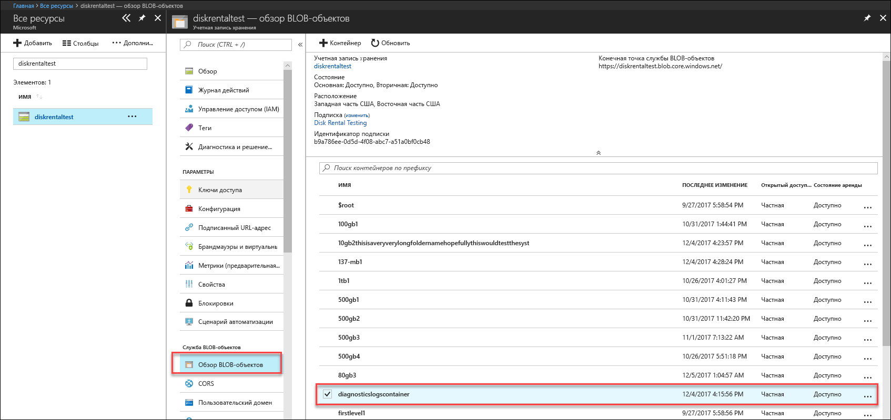
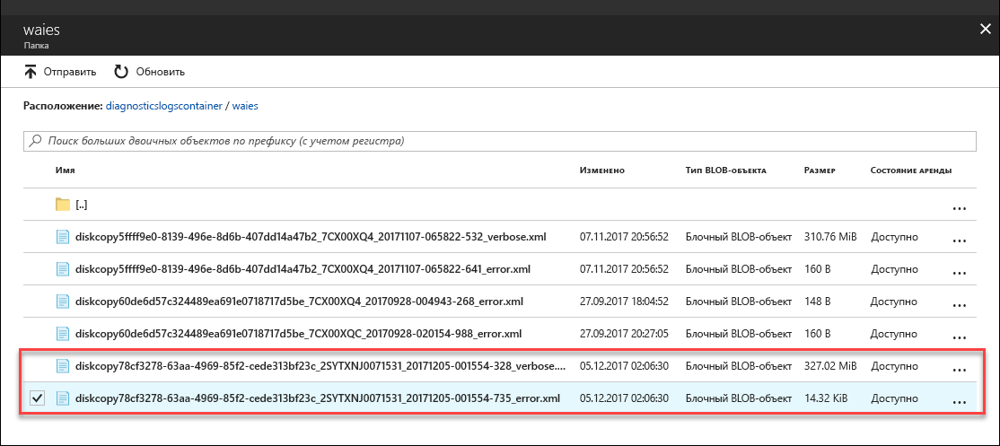

# Устранение неполадок с Диском Azure Data Box

Эта статья применяется к Диску Microsoft Azure Data Box и описывает рабочие процессы, используемые для устранения любых неполадок, возникающих при развертывании этого решения. 

В этой статье содержатся следующие разделы:

- Загрузка журналов диагностики
- Запрос журналов действий
- Ошибки средства разблокировки диска Data Box
- Ошибки средства Data Box Disk Split Copy

## Загрузка журналов диагностики

Если во время процесса копирования данных имеются какие-либо ошибки, портал покажет путь к папке, в которой находятся журналы диагностики. 

Журналы диагностики делятся на две группы.
- Журналы ошибок
- Журналы подробных сведений  

Чтобы перейти к пути для копирования журнала, перейдите в учетную запись хранения, связанную с заказом Data Box. 

1.  Перейдите в **Общие > Сведения о заказе** и отметьте учетную запись хранения, связанную с заказом.
 

2.  Перейдите в раздел **Все ресурсы** и найдите учетную запись хранения, указанную на предыдущем шаге. Выберите и щелкните учетную запись хранения.

    

3.  Перейдите в раздел **Служба BLOB-объектов > Просмотреть BLOB-объекты** и найдите BLOB-объект, соответствующий учетной записи хранения. Перейдите к **diagnosticslogcontainer > waies**. 

    

    Вы увидите как журналы ошибок, так и подробные журналы для копирования данных. Выберите и щелкните каждый файл, а затем загрузите локальную копию.

## Запрос журналов действий

Журналы действий используются для поиска ошибки при устранении неполадок, а также для наблюдения за тем, как пользователь организации изменяет ресурс. С помощью журналов действий можно определить:

- Какие операции выполнялись с ресурсами в подписке.
- Сторона, инициировавшая операцию. 
- Когда была выполнена операция.
- Состояние операции.
- Значения других свойств, которые могут помочь в анализе операции.

Журнал действий содержит все операции записи (PUT, POST, DELETE), выполняемые с ресурсами, но не содержит операций чтения (таких как GET). 

Журналы изменений сохраняются в течение 90 дней. Вы можете запросить любой диапазон дат, при условии, что дата начала не старше 90 дней в прошлом. Также можно фильтровать один из встроенных запросов в аналитических сведениях. Например, щелкните ошибку, а затем выберите и щелкните конкретные ошибки, чтобы понять основную причину.

## Ошибки средства разблокировки диска Data Box

| Сообщение об ошибке/Режимы работы средства      | Рекомендации                                                                                               |
|-------------------------------------------------------------------------------------------------------------------------------------|------------------------------------------------------------------------------------------------------|
| Нет  Аварийное завершение средства разблокировки диска Data Box.                                                                            | Bitlocker не установлен. Убедитесь, что на главном компьютере, на котором установлено средство разблокировки диска Data Box, установлен BitLocker.                                                                            |
| Текущая платформа .NET не поддерживается. Поддерживаемые версии — 4.5 и более поздние.  Средство завершит свою работу с сообщением.  | Платформа .NET версии 4.5 не установлена. Установите .NET 4.5 или более поздней версии на главном компьютере, на котором запущено средство разблокировки диска Data Box.                                                                            |
| Не удалось разблокировать или проверить какие-либо тома. Обратитесь в службу технической поддержки Майкрософт.    Средство не может разблокировать или проверить заблокированный диск. | Средству не удалось разблокировать ни один из заблокированных дисков с помощью поставляемого ключа доступа. Обратитесь в службу поддержки Майкрософт, чтобы узнать, что делать дальше.                                                |
| Следующие тома разблокированы и проверены.  Буквы диска тома: E. Не удалось разблокировать все тома со следующими ключами доступа: werwerqomnf, qwerwerqwdfda   Средство разблокирует некоторые диски и перечислит успешные и неудачные буквы дисков.| Частично удалось. Не удалось разблокировать некоторые диски с помощью поставляемого ключа доступа. Обратитесь в службу поддержки Майкрософт, чтобы узнать, что делать дальше. |
| Не удалось найти заблокированные тома. Проверьте, что диск, полученный от Microsoft, подключен правильно и находится в заблокированном состоянии.          | Средству не удается найти заблокированные диски. Либо диски уже разблокированы или не обнаружены. Убедитесь, что диски подключены и заблокированы.                                                           |
| Неустранимая ошибка: недопустимый параметр. Имя параметра: invalid_arg Использование. DataBoxDiskUnlock /Ключи доступа:<passkey_list_separated_by_semicolon>  Пример: DataBoxDiskUnlock /PassKeys:passkey1;passkey2;passkey3. Пример: DataBoxDiskUnlock /SystemCheck. Пример: DataBoxDiskUnlock /Help.  /PassKeys:       получите этот ключ доступа из заказа Диска Azure Data Box. Ключ доступа разблокирует диски. /Help:           этот параметр предоставляет справку об использовании командлета и примеры. /SystemCheck:    этот параметр проверяет, соответствует ли система требованиям для запуска средства.  Нажмите любую клавишу, чтобы выйти. | Недопустимый ввод параметра. Единственными допустимыми параметрами являются /SystemCheck, /PassKey и /Help.                                                                            |

## Ошибки средства Data Box Disk Split Copy

|Сообщение об ошибке и предупреждения  |Рекомендации |
|---------|---------|
|[Сведения] Идет получение пароля Bitlocker для тома: m  [Ошибка] Перехвачено исключение при получении ключа Bitlocker для тома m:  В последовательности нет элементов.|Эта ошибка возникает в том случае, если целевой диск Data Box находятся в автономном режиме.   Используйте средство `diskmgmt.msc` для подключенных дисков.|
|[Ошибка] Возникло исключение. Операция WMI завершилась со сбоем:  Method=UnlockWithNumericalPassword, ReturnValue=2150694965,  Win32Message=недопустимый формат восстановления пароля.  Пароли восстановления BitLocker состоят из 48 цифр.  Убедитесь, что пароль восстановления установлен в правильном формате, и повторите попытку.|Используйте средство разблокировки диска Data Box, чтобы открыть диск, затем повторите команду. Дополнительные сведения см. в следующих разделах: <li> [Разблокировка дисков на клиенте Windows](data-box-disk-deploy-set-up.md#unlock-disks-on-windows-client). </li><li> [Разблокировка дисков на клиенте Linux](data-box-disk-deploy-set-up.md#unlock-disks-on-linux-client). </li>|
|[Ошибка] Возникло исключение. Файл DriveManifest.xml существует на целевом диске.   Это означает, что целевой диск был подготовлен с помощью другого файла журнала.  Чтобы добавить больше данных на тот же диск, используйте предыдущий файл журнала. Чтобы удалить имеющиеся данные и повторно использовать целевой диск для нового задания импорта, удалите DriveManifest.xml с диска. Повторно выполните команду с использованием нового файла журнала.| Эта ошибка возникает, если вы пытались использовать один и тот же набор дисков для нескольких сеансов импорта.   Используйте один набор дисков только для одного сеанса разделения и копирования.|
|[Ошибка] Возникло исключение. Данные импорта CopySessionId importdata-sept-test-1 ссылаются на предыдущий сеанс копирования, и их нельзя использовать повторно для нового сеанса копирования.|Эта ошибка возникает, если вы пытаетесь использовать то же имя задания, которое уже использовали для успешно выполненного задания.  Укажите уникальное имя для нового задания.|
|[Сведения] Имя конечного файла или каталога превышает ограничение по длине NTFS. |Это сообщение возникает, если конечный файл был переименован из-за длинного пути.  Измените расположение параметра в файле `config.json` для управления действиями такого типа.|
|[Ошибка] Возникло исключение. Неверная escape-последовательность JSON. |Это сообщение возникает, если файлу config.json назначен недопустимый формат.   Проверьте файл `config.json`, используя [JSONlint](https://jsonlint.com/), перед его сохранением.|

## Проблемы с развертыванием для Linux

В этом разделе подробно рассматриваются некоторые из основных проблем, которые возникают при развертывании Диска Data Box в случае использования клиента Linux для копирования данных.

### Проблема Диск подключается как доступный только для чтения
 
**Причина** 

Это может быть вызвано некорректной работой файловой системы. 

Повторное подключение диска как доступного для чтения и записи не работает с Дисками Data Box. Этот сценарий не поддерживается для дисков, расшифрованных с помощью DisLocker. Вам может удастся повторно подключить устройство с помощью следующей команды: 

    `# mount -o remount, rw / mnt / DataBoxDisk / mountVol1 ß`

Хотя повторное подключение прошло успешно, данные не будут сохраняться.

**Способы устранения:**

Если вы видите указанную выше ошибку, попробуйте один из следующих способов разрешения.

- Установите [`ntfsfix`](https://linux.die.net/man/8/ntfsfix) (доступно в пакете `ntfsprogs`) и запустите его для соответствующей секции.

- Если у вас есть доступ к системе Windows:

    - Загрузите диск в систему Windows.
    - Откройте окно командной строки с правами администратора. Запустите `chkdsk` в томе.
    - Безопасно удалите том и повторите попытку.
 
### Проблема Ошибка с данными, не сохраняющимися после копирования
 
**Причина** 

Если вы видите, что на вашем диске нет данных после того, как он был отключен (хотя на него были скопированы данные), тогда, возможно, вы повторно подключили диск в качестве доступного для чтения и записи после того, как он был подключен как доступный только для чтения.

**Способы устранения:**
 
В этом случае просмотрите разрешения для [дисков, подключаемых как доступные только для чтения](#issue-drive-getting-mounted-as-read-only).

Если это не так, скопируйте журналы из папки, которая содержит средство разблокировки Диска Data Box, и [обратитесь в службу поддержки Майкрософт](data-box-disk-contact-microsoft-support.md).

## Проблемы с развертыванием для Windows

В этом разделе подробно рассматриваются некоторые из основных проблем, которые возникают при развертывании Диска Data Box в случае использования клиента Windows для копирования данных.

### Проблема Не удалось разблокировать диск из BitLocker
 
**Причина** 

Вы использовали пароль в диалоговом окне BitLocker и пытались разблокировать диск с помощью диалогового окна разблокировки в BitLocker. Это не будет работать. 

**Способы устранения:**

Чтобы разблокировать Диски Data Box, необходимо использовать средство разблокирования Дисков Data Box и предоставить пароль с портала Azure. Дополнительные сведения см. в статье [Руководство. Распаковка, подключение и разблокировка Диска Azure Data Box](data-box-disk-deploy-set-up.md#connect-to-disks-and-get-the-passkey).
 
### Проблема Не удалось разблокировать или проверить некоторые тома. Обратитесь в службу технической поддержки Майкрософт.
 
**Причина** 

Вы можете увидеть следующую ошибку в журнале ошибок и не иметь возможности разблокировать или проверить некоторые тома.

`Exception System.IO.FileNotFoundException: Could not load file or assembly 'Microsoft.Management.Infrastructure, Version=1.0.0.0, Culture=neutral, PublicKeyToken=31bf3856ad364e35' or one of its dependencies. The system cannot find the file specified.`
 
Это означает, что в вашем клиенте Windows, скорее всего, отсутствует соответствующая версия Windows PowerShell.

**Способы устранения:**

Вы можете установить [Windows PowerShell версии 5.0](https://www.microsoft.com/download/details.aspx?id=54616) и повторить операцию.
 
Если тома по-прежнему не удается разблокировать, скопируйте журналы из папки, которая содержит средство разблокировки Диска Data Box, и [обратитесь в службу поддержки Майкрософт](data-box-disk-contact-microsoft-support.md).

## Дополнительная информация

- Узнайте, как [управлять диском Data Box с помощью портала Azure](data-box-portal-ui-admin.md).
