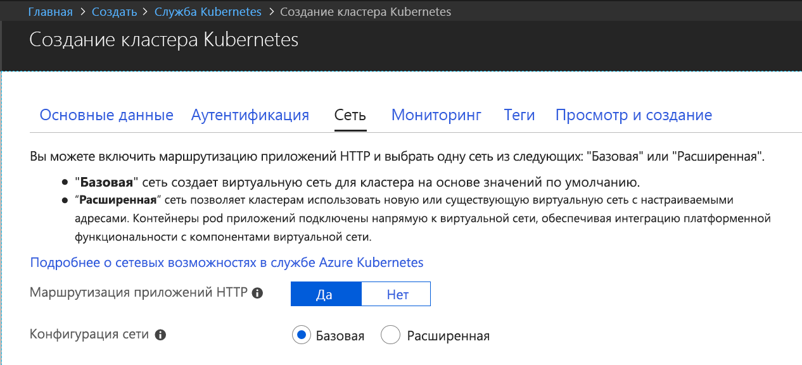

## Создание и включение кластера Kubernetes для Azure Dev Spaces

1. Войдите на портал Azure по адресу http://portal.azure.com.
1. Выберите **Создать ресурс**, выполните поиск **Kubernetes**, затем выберите **Kubernetes Service** (Служба Kubernetes)  >  **Создать**.

   Выполните приведенные ниже действия под каждым заголовком в форме создания кластера AKS.

    - **PROJECT DETAILS** (Сведения о проекте): выберите подписку Azure и создайте новую или выберите существующую группу ресурсов Azure.
    - **Сведения о кластере.** Для кластера AKS укажите имя, регион (сейчас нужно выбрать EastUS, Central US, WestEurope, WestUS2, CanadaCentral или CanadaEast), версию и префикс имени DNS.
    - **Масштаб**. Выберите размер виртуальной машины для узлов агента AKS и количество узлов. Если вы только начинаете работать с Azure Dev Spaces, одного узла будет достаточно, чтобы ознакомиться с функциями. После развертывания кластера вы сможете легко изменить количество узлов в любое время. Обратите внимание, что размер виртуальной машины невозможно изменить после создания кластера AKS. Но после развертывания кластера AKS можно легко создать новый кластер с виртуальными машинами большего размера и с помощью Dev Spaces выполнить повторное развертывание в большем кластере, если требуется масштабировать ресурсы.

   Выберите Kubernetes 1.9.6 или более поздней версии.

   

   По завершении выберите **Далее: проверка подлинности**.

1. Выберите нужный параметр для управления доступом на основе ролей (RBAC). Служба Azure Dev Spaces поддерживает кластеры как с включенным, так и с отключенным механизмом RBAC.

    

1. Убедитесь, что маршрутизация приложений HTTP включена.

   

    > [!IMPORTANT]
    > Обязательно включите параметр "Маршрутизация приложений HTTP" при создании кластера AKS. Вы не сможете изменить значение этого параметра позже.

1. Выберите **Review + create** (Проверить и создать), а по завершении щелкните **Create** (Создать).
