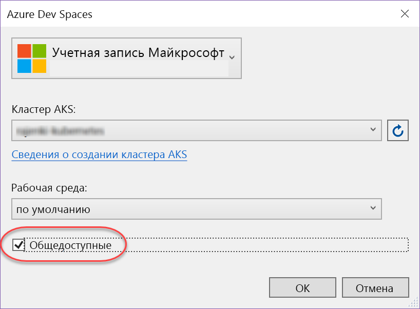

# Краткое руководство. Создание среды разработки Kubernetes с помощью Azure Dev Spaces (.NET Core и Visual Studio)

Из этого руководства вы узнаете, как выполнить следующие задачи:

- Настройка Azure Dev Spaces с помощью управляемого кластера Kubernetes в Azure.
- итеративно разрабатывать код в контейнерах с помощью Visual Studio.
- выполнять отладку кода, запущенного в кластере.

> [!Note]
> **Если на каком-то этапе у вас возникли трудности**, см. статью [Устранение неполадок](troubleshooting.md) или оставьте комментарий на этой странице. Можно также ознакомиться с более подробным [руководством](get-started-netcore-visualstudio.md).

## Предварительные требования

- Кластер Kubernetes, работающий на платформе Kubernetes версии 1.9.6 или выше, размещенный в регионе "Восточная часть США", "Восточная часть США 2", "Центральная часть США", "Западная часть США 2", "Западная Европа", "Юго-Восточная Азия", "Центральная Канада" или "Восточная Канада" и с включенным параметром "Маршрутизация HTTP для приложений".

  

- Visual Studio 2017 с установленной рабочей нагрузкой "Веб-разработка". Если эта среда не установлена, скачайте ее [с этой страницы](https://aka.ms/vsdownload?utm_source=mscom&utm_campaign=msdocs).

## Настройка Azure Dev Spaces

Установка [Средств Visual Studio для Kubernetes](https://aka.ms/get-vsk8stools).

## Подключение к кластеру

Теперь вам предстоит создать и настроить проект для Azure Dev Spaces.

### Создание веб-приложения ASP.NET

Создайте новый проект в Visual Studio 2017. В настоящее время проект должен быть **веб-приложением ASP.NET Core**. Присвойте проекту имя **webfrontend**.

Выберите шаблон **Веб-приложение (модель-представление-контроллер)** и выберите **.NET Core** и **ASP.NET Core 2.0**.

### Включение Dev Spaces для кластера AKS

В только что созданном проекте в раскрывающемся списке параметров запуска выберите **Azure Dev Spaces**, как показано ниже.

В появившемся диалоговом окне убедитесь, что вы вошли в систему с соответствующей учетной записью, а затем выберите существующий кластер.

В раскрывающемся списке **Пространство** пока сохраните значение `default`. Установите флажок **Publicly Accessible** (Общедоступное), чтобы веб-приложение было доступно через общедоступную конечную точку.

Нажмите кнопку **ОК**, чтобы выбрать или создать кластер.

Если выбран кластер, который еще не был настроен для работы с Azure Dev Spaces, вы увидите сообщение с вопросом, хотите ли вы настроить его.

Нажмите кнопку **ОК**. 

### Просмотр файлов, добавленных в проект
Пока вы ожидаете создания пространства разработки, просмотрите файлы, которые были добавлены в ваш проект при выборе Azure Dev Spaces.

- В проекте появилась папка с именем `charts`, в которой создана [диаграмма Helm](https://docs.helm.sh) для вашего приложения. Эти файлы используются для развертывания приложения в пространство разработки.
- Файл `Dockerfile` содержит сведения, необходимые для упаковки приложения в стандартный формат Docker.
- `azds.yaml` содержит конфигурацию, которая использовалась при разработке и которая требуется для пространства разработки.

## Отладка контейнера в Kubernetes
После успешного создания пространства разработки вы можете приступить к отладке приложения. Установите точку останова в коде, например, в строке 20 в файле `HomeController.cs`, где установлена ​​переменная `Message`. Нажмите клавишу **F5**, чтобы запустить отладку. 

Visual Studio будет взаимодействовать с пространством разработки для создания и развертывания приложения, а затем откроет браузер с работающим веб-приложением. Может показаться, что контейнер работает локально, но на самом деле он выполняется в пространстве разработки в Azure. В адресе указано localhost, так как Azure Dev Spaces создает временный туннель SSH к контейнеру, работающему в AKS.

Перейдите по ссылке **About** (Сведения) в верхней части страницы, чтобы вызвать точку останова. У вас есть полный доступ к отладочной информации, как если бы код выполнялся локально, например к стеку вызовов, локальным переменным, информации об исключениях и т. д.

## Итерационная разработка кода

Azure Dev Spaces — это не просто среда выполнения кода в Kubernetes. Она позволяет быстро и итеративно видеть, как изменения вашего кода вступают в силу в среде Kubernetes в облаке.

### Обновление файла содержимого
1. Найдите файл `./Views/Home/Index.cshtml` и внесите изменения в HTML. Например, измените строку 70 `<h2>Application uses</h2>` строкой примерно такого содержания: `<h2>Hello k8s in Azure!</h2>`
1. Сохраните файл.
1. Вернитесь в браузер и обновите страницу. Должна отобразиться веб-страница с обновленным HTML.

Что произошло? Изменения файлов содержимого, таких как HTML и CSS, не требуют повторной компиляции в веб-приложении .NET Core, поэтому активный сеанс F5 автоматически синхронизирует любые измененные файлы содержимого в запущенный контейнер в AKS, чтобы можно было сразу же видеть изменения содержимого.

### Обновление файла кода
Для обновления файлов кода требуется немного больше работы, так как приложение .NET Core должно перестроить и создать обновленные двоичные файлы приложений.

1. Остановите отладчик в Visual Studio.
1. Откройте файл кода с именем `Controllers/HomeController.cs` и измените сообщение, которое будет отображаться на странице About (Сведения): `ViewData["Message"] = "Your application description page.";`
1. Сохраните файл.
1. Нажмите клавишу **F5**, чтобы снова запустить отладку. 

Вместо того, чтобы перестраивать и повторно развертывать новый образ контейнера при каждой правке кода, что часто занимает много времени, Azure Dev Spaces пошагово перекомпилирует код в существующем контейнере, чтобы ускорить цикл редактирования и отладки.

В браузере обновите веб-приложение и перейдите на страницу About (Сведения). Вы должны увидеть настраиваемое сообщение в пользовательском интерфейсе.

## Дополнительная информация

> [!div class="nextstepaction"]
> [Работа с несколькими контейнерами и командной разработкой](team-development-netcore-visualstudio.md)
