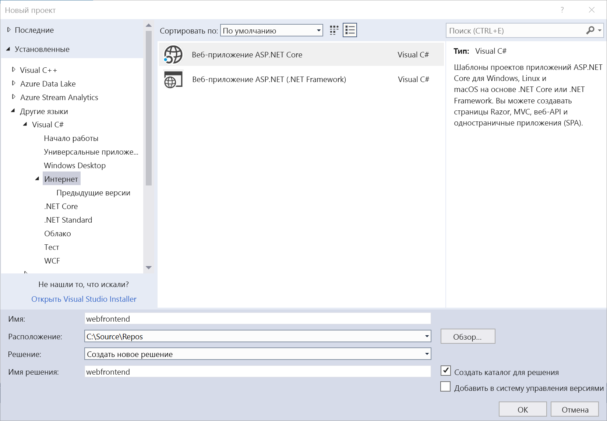
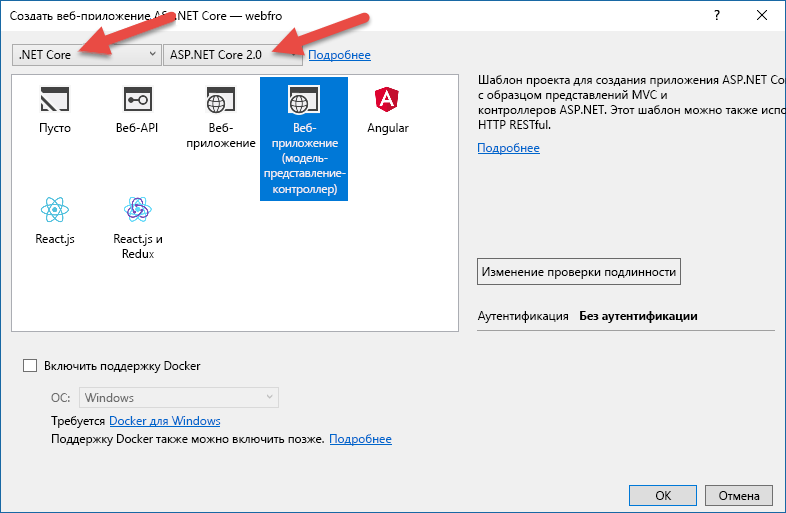

# Краткое руководство по созданию среды разработки Kubernetes с помощью Azure Dev Spaces (.NET Core и Visual Studio)

В этом руководстве вы узнаете как:

- создать в Azure среду на основе Kubernetes, которая оптимизирована для разработки;
- итеративно разрабатывать код в контейнерах с помощью Visual Studio.

[!INCLUDE]

[!INCLUDE]

## Получение средств Visual Studio 
1. Установите последнюю версию [Visual Studio 2017](https://www.visualstudio.com/vs/).
1. Убедитесь, что выбрана следующая рабочая нагрузка в установщике Visual Studio:
    * ASP.NET и веб-разработка.
1. Установите [расширение Visual Studio для Azure Dev Spaces](https://aka.ms/get-azds-visualstudio)

Теперь вы готовы создать веб-приложение ASP.NET с помощью Visual Studio.

## Создание веб-приложения ASP.NET

Создайте новый проект в Visual Studio 2017. В настоящее время проект должен быть **веб-приложением ASP.NET Core**. Присвойте проекту имя **webfrontend**.

Выберите шаблон **Веб-приложение (модель-представление-контроллер)** и выберите **.NET Core** и **ASP.NET Core 2.0** в двух раскрывающихся списках в верхней части диалогового окна. Нажмите кнопку **ОК** , чтобы создать проект.

## Создание среды разработки в Azure

В Azure Dev Spaces вы можете создавать среды разработки на основе Kubernetes, которые полностью управляются Azure и оптимизированы для разработки. В только что созданном проекте из раскрывающегося списка параметров запуска выберите **Azure Dev Spaces**, как показано ниже.

В появившемся диалоговом окне убедитесь, что вы вошли в систему с соответствующей учетной записью, а затем выберите существующий кластер.

В раскрывающемся списке **Пространство** оставьте пока значение по умолчанию (`default`). Позже вы узнаете больше об этом параметре. Установите флажок **Publicly Accessible** (Общедоступное), чтобы веб-приложение было доступно через общедоступную конечную точку. Этот параметр не является обязательным, но он будет полезен для демонстрации некоторых концепций далее в этом пошаговом руководстве. Но не волнуйтесь, вы в любом случае сможете выполнить отладку веб-сайта с помощью Visual Studio.

Нажмите кнопку **ОК**, чтобы выбрать или создать кластер.

Если выбран кластер, который еще не был настроен для работы с Azure Dev Spaces, вы увидите сообщение с вопросом, хотите ли вы настроить его.

Нажмите кнопку **ОК**. 

Запустится задача в фоновом режиме. Выполнение может занять несколько минут. Чтобы увидеть, находится ли кластер в процессе создания, наведите указатель мыши на значок **фоновые задачи** в левом нижнем углу строки состояния, как показано на следующем изображении.

> [!Note]
Пока среда разработки не будет успешно создана, вы не сможете отлаживать свое приложение.

## Просмотр файлов, добавленных в проект
Пока вы ожидаете создания среды разработки просмотрите файлы, которые были добавлены в ваш проект при выборе среды разработки.

Во-первых, вы можете увидеть, что была добавлена папка с именем `charts`, в которой создана [диаграмма Helm](https://docs.helm.sh) для вашего приложения. Эти файлы используются для развертывания приложения в среду разработки.

Вы увидите добавленный файл с именем `Dockerfile`. Этот файл содержит сведения, необходимые для упаковки приложения в стандартном формате Docker. Также был создан файл `HeaderPropagation.cs`. Мы обсудим его позже в пошаговом руководстве. 

Наконец, вы увидите файл с именем `azds.yaml`, содержащий сведения о конфигурации, необходимые для среды разработки. Например, должно ли приложение быть доступным через общедоступную конечную точку.

## Отладка контейнера в Kubernetes
После успешного создания среды разработки вы сможете приступить к отладке приложения. Установите точку останова в коде, например, в строке 20 в файле `HomeController.cs`, где установлена ​​переменная `Message`. Нажмите клавишу **F5**, чтобы запустить отладку. 

Visual Studio будет взаимодействовать со средой разработки для сборки и развертывания приложения, а затем откроет браузер с работающим веб-приложением. Может показаться, что контейнер выполняется локально, хотя фактически он выполняется в среде разработки в Azure. В адресе указано localhost, потому что Azure Dev Spaces создает временный туннель SSH к контейнеру, работающему в Azure.

Перейдите по ссылке **About** (Сведения) в верхней части страницы, чтобы вызвать точку останова. У вас есть полный доступ к отладочной информации, как если бы код выполнялся локально, например к стеку вызовов, локальным переменным, информации об исключениях и т. д.

## Дополнительная информация

> [!div class="nextstepaction"]
> [Работа с несколькими контейнерами и командной разработкой](get-started-netcore-visualstudio.md#call-another-container)