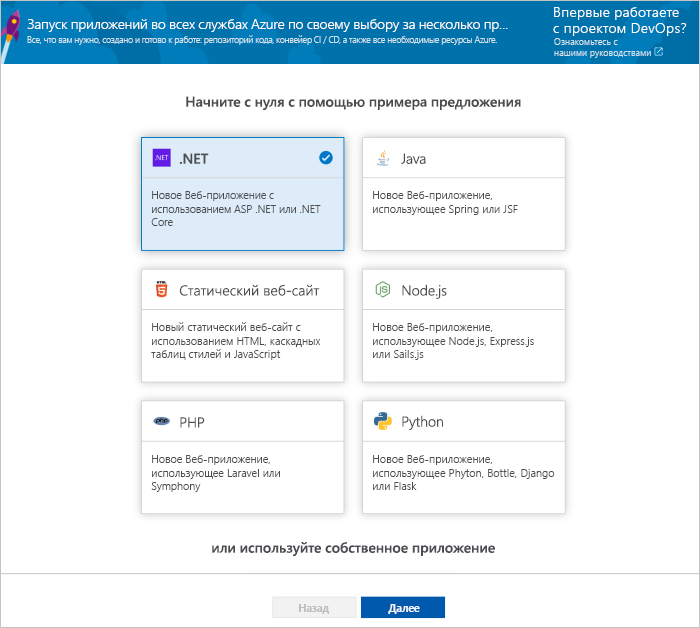
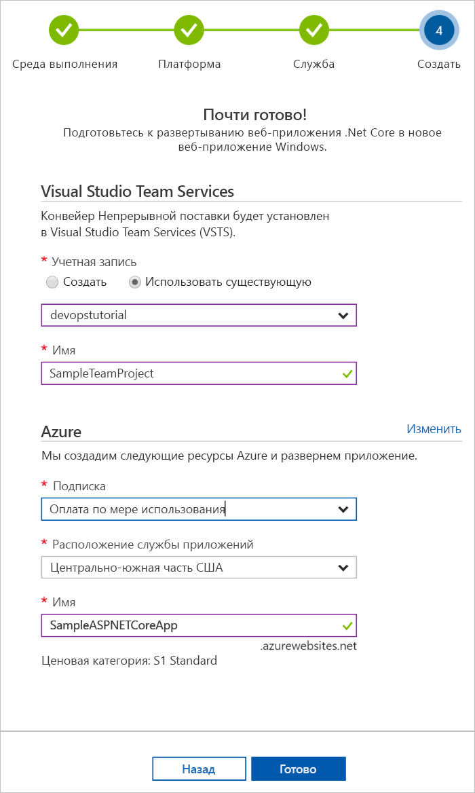
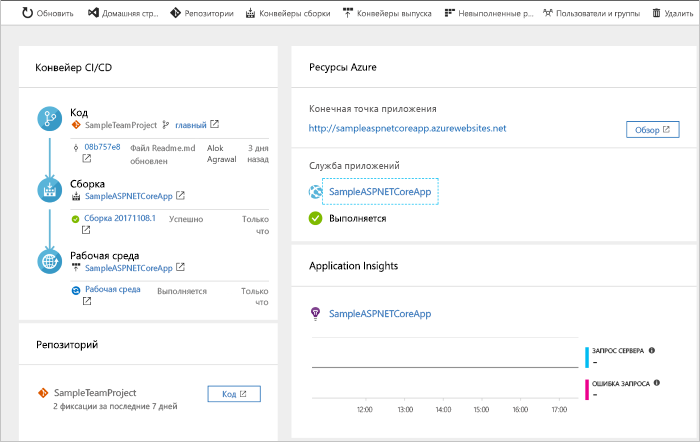
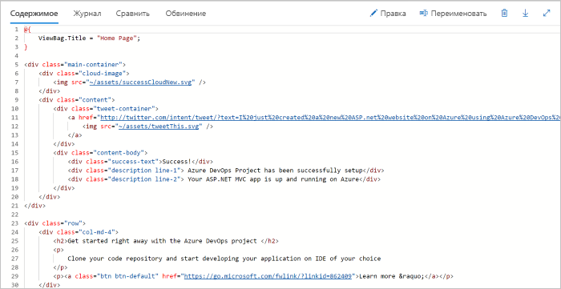
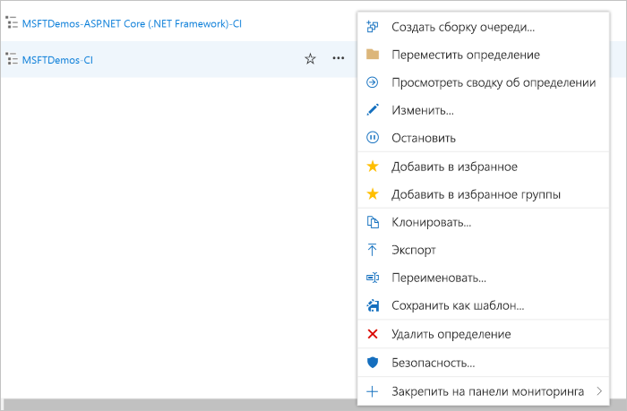

# Создание конвейера CI/CD для .NET с помощью проекта Azure DevOps

Настройте непрерывную интеграцию (CI) и непрерывную доставку (CD) для вашего приложения .NET Core или ASP.NET с помощью проекта **Azure DevOps**.  Проект Azure DevOps упрощает первоначальную конфигурацию конвейера сборки и выпуска VSTS.

Если у вас нет подписки Azure, вы можете получить ее бесплатно с помощью [Visual Studio Dev Essentials](https://visualstudio.microsoft.com/dev-essentials/).

## Выполните вход на портал Azure.

Проект Azure DevOps создает конвейер CI/CD в VSTS.  Вы можете создать учетную запись **VSTS** или использовать **имеющуюся**.  Проект Azure DevOps также создает **ресурсы Azure** в необходимой **подписке Azure**.

1. Войдите на портал [Microsoft Azure](https://portal.azure.com).

1. Щелкните значок **Создать ресурс** на левой панели навигации, затем найдите **проект DevOps**.  Выберите **Создать**.

    

## Выбор примера приложения и службы Azure

1. Выберите пример приложения **.NET**.  Примеры .NET включают в себя либо платформу ASP.NET с открытым кодом, либо кросс-платформенную платформу .NET Core.

    

1. Выберите платформу приложения **.NET Core**.  Этот пример представляет собой приложение ASP.NET Core MVC. Когда все будет готово, щелкните **Далее**.

1. **Веб-приложение в Windows** является целью развертывания по умолчанию.  При необходимости можно выбрать веб-приложение в Linux или веб-приложение для контейнеров.  Исполняющая среда, которую вы выбрали на предыдущих шагах, определяет тип цели развертывания службы Azure, доступной здесь.  Оставьте службу по умолчанию и нажмите кнопку **Далее**.

## Настройка VSTS и подписки Azure 

1. **Создайте** бесплатную учетную запись VSTS или выберите **имеющуюся**.  Выберите **имя** для проекта VSTS.  Выберите **подписку Azure**, **расположение** и укажите **имя** приложения.  Когда все будет готово, щелкните **Done** (Готово).

    

1. Через несколько минут на портале Azure загрузится **панель мониторинга проекта**.  Пример приложения настраивается в репозитории в вашей учетной записи VSTS, выполняется сборка, а ваше приложение развертывается в Azure.  Эта панель мониторинга обеспечивает видимость **репозитория кода**, **конвейера VSTS CI/CD** и **приложения в Azure**.  В правой части панели мониторинга выберите **Обзор**, чтобы просмотреть запущенное приложение.

     

## Фиксация изменений, внесенных в код, и выполнение CI/CD

Проект Azure DevOps создает репозиторий Git в вашей учетной записи VSTS или GitHub.  Выполните следующие действия, чтобы просмотреть репозиторий и внести изменения в приложение.

1. В левой части панели мониторинга DevOps выберите ссылку **главной** ветви.  Эта ссылка открывает представление созданного репозитория Git.

1. Чтобы просмотреть URL-адрес клона репозитория, щелкните **Клонировать** в правом верхнем углу браузера. Вы можете клонировать свой репозиторий Git в предпочитаемую интегрированную среду разработки.  В следующих нескольких шагах вы можете использовать веб-браузер для создания и фиксации изменений кода непосредственно в главной ветви.

1. В левой части браузера перейдите к файлу **Views/Home/index.cshtml**.

1. Щелкните **Изменить** и внесите изменения в заголовок h2.  Например, введите **Начало работы с проектом Azure DevOps** или внесите некоторые изменения.

    

1. Выберите **Зафиксировать**, а затем сохраните изменения.

1. В браузере перейдите к панели мониторинга **Azure DevOps**.  Теперь вы должны увидеть, что сборка выполняется.  Внесенные изменения автоматически создаются и развертываются через конвейер VSTS CI/CD.

## Анализ конвейера VSTS CI/CD.

Проект Azure DevOps автоматически настроил полный конвейер VSTS CI/CD в вашей учетной записи VSTS.  При необходимости изучите и настройте конвейер.  Выполните следующие шаги, чтобы ознакомиться с определениями выпуска и сборки VSTS.

1. Щелкните **Конвейеры сборки** в **верхней части** панели мониторинга проекта Azure DevOps.  Эта ссылка открывает вкладку браузера и определение сборки VSTS нового проекта.

1. Щелкните **многоточие**.  После этого откроется меню, в котором можно начать выполнение нескольких действий, таких как постановка новой сборки в очередь, приостановка создания и изменение определения сборки.

1. Выберите **Изменить**

    

1. В этом представлении **рассмотрите различные задачи** для определения сборки.  Сборка выполняет различные задачи, такие как выборка источников из репозитория Git, восстановление зависимостей и публикация результатов, используемых для развертывания.

1. В верхней части определения сборки выберите **имя определения сборки**.

1. Замените **имя** определения сборки более описательным именем.  Щелкните **Save & queue** (Сохранить и поместить в очередь), а затем выберите **Сохранить**.

1. Под именем определения сборки щелкните **Журнал**.  Вы увидите журнал аудита последних изменений сборки.  VSTS отслеживает любые изменения, внесенные в определение сборки, и позволяет сравнивать версии.

1. Выберите **Триггеры**.  Проект Azure DevOps автоматически создает триггер CI, а каждая фиксация в репозитории создает новую сборку.  При желании выберите включение или исключение ветвей из процесса непрерывной интеграции.

1. Щелкните **Период удержания**.  На основе вашего сценария можно указать политики для хранения или удаления определенного количества сборок.

1. Щелкните **Сборка и выпуск**, а затем выберите **Выпуски**.  Проект Azure DevOps создал определение выпуска VSTS для управления развертываниями в Azure.

1. В левой части браузера щелкните **многоточие** рядом с определением выпуска, а затем выберите **Изменить**.

1. Определение выпуска содержит **конвейер**, определяющий процесс выпуска.  В разделе **Артефакты** выберите **Удалить**.  Определение сборки, рассмотренное на предыдущих этапах, создает выходные данные, используемые для артефакта. 

1. Справа от значка **Удалить** выберите **Триггер непрерывного развертывания**.  Это определение выпуска содержит триггер непрерывного развертывания, выполняющий развертывание каждый раз, когда становится доступным новый артефакт сборки.  При желании можно отключить триггер, чтобы развертывание требовалось выполнять вручную. 

1. В левой части окна браузера выберите **Задачи**.  Задачи являются действиями, выполняемыми в процессе развертывания.  В этом примере задача была создана для развертывания в **службу приложений Azure**.

1. В правой части окна браузера выберите **Просмотреть выпуски**.  В этом представлении можно просмотреть журнал выпусков.

1. Щелкните **многоточие** рядом с одним из выпусков и выберите **Открыть**.  В этом представлении есть несколько меню, которые можно изучить, например меню сводки, связанных рабочих элементов и тестов.

1. Щелкните **Фиксации**.  В этом представлении отображаются фиксации кода, связанные с конкретным развертыванием. 

1. Выберите **Журналы**.  Журналы содержат полезную информацию о процессе развертывания.  Их можно просматривать как во время, так и после развертывания.

## Очистка ресурсов

Если вам больше не нужны служба приложений Azure и связанные с ней ресурсы, созданные в рамках этого краткого руководства, их можно удалить с помощью функции **Удалить** на панели мониторинга проекта Azure DevOps.

## Дополнительная информация

Чтобы узнать больше об изменении определений сборки и выпуска в соответствии с потребностями вашей команды, см. это руководство:

> [!div class="nextstepaction"]
> [Define your multi-stage continuous deployment (CD) process](https://docs.microsoft.com/vsts/pipelines/release/define-multistage-release-process?view=vsts) (Определение многоэтапного процесса непрерывного развертывания)

## Видеоролики

> [!VIDEO https://www.youtube.com/embed/itwqMf9aR0w]
