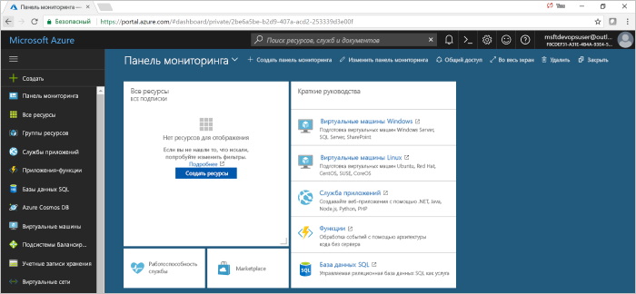
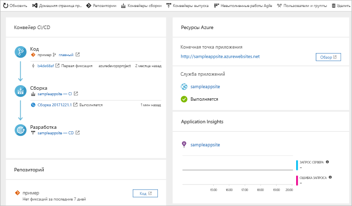

# Создание конвейера CI/CD для Java с помощью Azure DevOps Projects

Azure DevOps Projects представляет собой упрощенный интерфейс, который создает ресурсы Azure и конвейер непрерывной интеграции (CI) и непрерывной поставки (CD) для приложения Java в Azure Pipelines.  

Если у вас нет подписки Azure, вы можете получить ее бесплатно с помощью [Visual Studio Dev Essentials](https://visualstudio.microsoft.com/dev-essentials/).

## Вход на портал Azure

  DevOps Projects создает конвейер CI/CD в Azure Pipelines. Вы можете создать новую организацию Azure DevOps или использовать существующую. DevOps Projects также создает ресурсы Azure в требуемой подписке Azure.

1. Войдите на [портал Microsoft Azure](https://portal.azure.com).

1. Выберите **Создать ресурс** в области слева и выполните поиск по запросу **DevOps Projects**.  

2. Нажмите кнопку **Создать**.

    

## Выбор примера приложения и службы Azure

1. Выберите пример приложения Java.  
Примеры Java включают в себя выбор нескольких платформ приложений.

1. В примере используется платформа Spring. Оставьте значение по умолчанию и нажмите кнопку **Далее**.  Веб-приложение для контейнеров является целевым объектом развертывания по умолчанию. Исполняющая среда, которую вы выбрали ранее, определяет доступный тип целевого объекта развертывания в службе Azure. 

2. Оставьте службу по умолчанию и нажмите кнопку **Далее**.
 
## Настройка Azure DevOps и подписки Azure 

1. Создайте новую организацию Azure DevOps или выберите существующую. 

    a. Выберите имя для проекта. 

    b. Выберите подписку Azure и расположение, задайте имя приложения и нажмите кнопку **Готово**.  
    Через несколько минут панель мониторинга DevOps Projects отобразится на портале Azure. Пример приложения настраивается в репозитории в организации Azure DevOps, после чего выполняется сборка и развертывание приложения в Azure. Эта панель мониторинга обеспечивает видимость репозитория кода, конвейера CI/CD и приложения в Azure.
    

2. Выберите **Обзор**, чтобы просмотреть выполняющееся приложение.

     
    
 DevOps Projects автоматически настраивает сборку непрерывной интеграции и триггер выпуска.  Теперь вы готовы сотрудничать с командой в приложении Java с процессом CI/CD, который автоматически развертывает данные последней работы на вашем веб-сайте.

## Фиксация изменений, внесенных в код, и выполнение CI/CD

DevOps Projects создает репозиторий Git в Azure Repos или на сайте GitHub. Выполните следующие действия, чтобы просмотреть репозиторий и внести изменения в код приложения.

1. В левой части панели мониторинга DevOps Projects выберите ссылку на главную ветвь.  
Эта ссылка открывает представление созданного репозитория Git.

1. Чтобы просмотреть URL-адрес клона репозитория, щелкните **Клонировать** в правом верхнем углу браузера.   
    Вы можете клонировать свой репозиторий Git в предпочитаемую интегрированную среду разработки. В следующих нескольких шагах вы можете использовать веб-браузер для создания и фиксации изменений кода непосредственно в главной ветви.

1. В левой части браузера перейдите к файлу **src/main/webapp/index.html**.

1. Выберите **Изменить** и внесите изменения в текст.
    Например, измените часть текста для одного из тегов div.

1. Выберите **Зафиксировать**, а затем сохраните изменения.

1. В браузере откройте панель мониторинга DevOps Projects.   
Вы увидите выполнение сборки. С помощью конвейера CI/CD выполняется автоматическая сборка и развертывание внесенных изменений.

## Изучение конвейера CI/CD

 На предыдущем этапе весь конвейер CI/CD был автоматически настроен с помощью DevOps Projects. При необходимости изучите и настройте конвейер. Чтобы ознакомиться с конвейерами сборки и выпуска, сделайте следующее.

1. В верхней части панели мониторинга DevOps Projects выберите **Конвейеры сборки**.  
По ссылке откроется вкладка браузера с конвейером сборки для нового проекта.

1. Выберите поле **Состояние** и щелкните значок многоточия (…).  
    После этого откроется меню, в котором можно начать выполнение нескольких действий, таких как постановка новой сборки в очередь, приостановка создания и изменение конвейера сборки.

1. Выберите **Изменить**

1. В этой области можно просмотреть различные задачи для конвейера сборки.  
При сборке выполняются различные задачи, такие как получение исходного кода из репозитория Git, восстановление зависимостей и публикация результатов, используемых для развертывания.

1. Выберите имя конвейера сборки в верхней части соответствующей области.

1. Замените имя конвейера сборки более понятным для себя, выберите **Сохранить и поместить в очередь** и нажмите кнопку **Сохранить**.

1. Под именем конвейера сборки щелкните **Журнал**.   
В области **Журнал** можно просмотреть журнал аудита последних изменений сборки.  Azure Pipelines отслеживает все изменения, внесенные в конвейер сборки, и позволяет сравнивать версии.

1. Выберите **Триггеры**.   
 DevOps Projects автоматически создает триггер CI, а при каждой фиксации в репозитории запускается новая сборка.  При желании выберите включение или исключение ветвей из процесса непрерывной интеграции.

1. Щелкните **Период удержания**.   
В зависимости от сценария можно указать политики для хранения или удаления определенного количества сборок.

1. Выберите **Сборка и выпуск**, а затем — **Выпуски**.  
 DevOps Projects создаст конвейер выпуска для управления развертываниями в Azure.

1. Щелкните многоточие (…) рядом с конвейером выпуска и выберите **Изменить**.  
Конвейер выпуска содержит конвейер, определяющий процесс выпуска.  
    
12. В разделе **Артефакты** выберите **Удалить**.  
Конвейер сборки, который вы изучали на предыдущих этапах, создаст выходные данные для артефакта. 

1. Рядом со значком **Удалить** выберите **Триггер непрерывного развертывания**.  
В этом конвейере выпуска активирован триггер непрерывного развертывания, выполняющий развертывание каждый раз, когда становится доступным новый артефакт сборки. При желании можно отключить триггер, чтобы выполнить развертывание вручную. 

1. В левой части окна выберите **Задачи**.   
Задачи — это действия, выполняемые при развертывании. В этом примере задача заключается в развертывании в Службе приложений Azure.

1. В правой части выберите **Просмотреть выпуски**.  
В этом представлении можно просмотреть журнал выпусков.

1. Щелкните многоточие (…) рядом с каким-нибудь выпуском и выберите **Открыть**.  
В этом представлении доступно несколько меню, например меню сводки по выпуску, меню связанных рабочих элементов и тестов.

1. Щелкните **Фиксации**.   
В этом представлении отображаются фиксации кода, связанные с определенным развертыванием. 

1. Выберите **Журналы**.  
Журналы содержат полезную информацию о процессе развертывания. Их можно просматривать как во время, так и после развертывания.

## Очистка ресурсов

Если Служба приложений Azure и другие связанные с ней ресурсы вам больше не нужны, их можно удалить. Для этого воспользуйтесь функцией **Удалить** на панели мониторинга DevOps Projects.

## Дополнительная информация

После настройки процесса CI/CD конвейеры сборки и выпуска были созданы автоматически. Вы можете изменить эти конвейеры сборки и выпуска в соответствии с потребностями вашей команды. См. дополнительные сведения о конвейере CI/CD:

> [!div class="nextstepaction"]
> [Define your multi-stage continuous deployment (CD) process](https://docs.microsoft.com/azure/devops/pipelines/release/define-multistage-release-process?view=vsts) (Определение многоэтапного процесса непрерывного развертывания)
