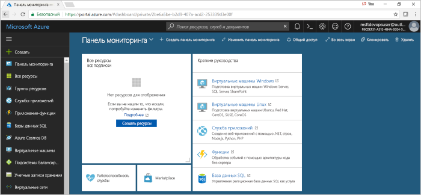
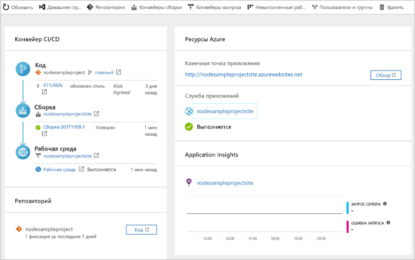

# Создание конвейера CI/CD для Node.js с помощью проекта Azure DevOps

Проект Azure DevOps предоставляет собой упрощенный интерфейс, который создает ресурсы Azure и устанавливает конвейер непрерывной интеграции (CI) и непрерывной доставки (CD) для вашего приложения Node.js в Azure DevOps Services.  

Если у вас нет подписки Azure, вы можете получить ее бесплатно с помощью [Visual Studio Dev Essentials](https://visualstudio.microsoft.com/dev-essentials/).

## Вход на портал Azure

Проект Azure DevOps создает в Azure конвейер CI/CD.  Вы можете создать новую бесплатную организацию **Azure DevOps Services** или использовать **существующую**.  Проект DevOps также создает **ресурсы Azure** в необходимой **подписке Azure**.

1. Войдите на портал [Microsoft Azure](https://portal.azure.com).

1. Щелкните значок **Создать ресурс** на панели навигации слева, затем выполните поиск по строке **Проект DevOps**.  Выберите **Создать**.

    

## Выбор примера приложения и службы Azure

1. Выберите пример приложения **Node.js**.  Примеры Node.js включают в себя выбор нескольких платформ приложений.

1. Платформа примера по умолчанию — **Express.js**. Оставьте значение по умолчанию и нажмите кнопку **Далее**.  

1. **Веб-приложение в Windows** является целью развертывания по умолчанию.  Исполняющая среда, которую вы выбрали на предыдущих шагах, определяет тип цели развертывания службы Azure, доступной здесь.  Оставьте службу по умолчанию и нажмите кнопку **Далее**.
 
## Настройка Azure DevOps Services и подписки Azure 

1. Создайте **новую** организацию Azure DevOps Services или выберите **существующую**.  Выберите **имя** для проекта Azure DevOps.  Выберите **подписку Azure**, **расположение** и укажите **имя** приложения.  Когда все будет готово, щелкните **Done** (Готово).

1. За несколько минут на портале Azure загружается **панель мониторинга проекта Azure DevOps**.  Пример приложения настраивается в репозитории в организации Azure DevOps Services, выполняется сборка, а ваше приложение развертывается в Azure.  Эта панель мониторинга обеспечивает видимость **репозитория кода**, **конвейера CI/CD Azure** и **приложения в Azure**.  В правой части панели мониторинга выберите **Обзор**, чтобы просмотреть запущенное приложение.

     
    
Проект Azure DevOps автоматически настраивает сборку непрерывной интеграции и триггер выпуска.  Теперь вы готовы сотрудничать с командой в приложении Node.js с процессом CI/CD, который автоматически развертывает данные последней работы на вашем веб-сайте.

## Фиксация изменений, внесенных в код, и выполнение CI/CD

Проект Azure DevOps создает репозиторий Git в вашей учетной записи организации Azure DevOps Services или GitHub.  Выполните следующие действия, чтобы просмотреть репозиторий и внести изменения в приложение.

1. В левой части панели мониторинга DevOps выберите ссылку **главной** ветви.  Эта ссылка открывает представление созданного репозитория Git.

1. Чтобы просмотреть URL-адрес клона репозитория, щелкните **Клонировать** в правом верхнем углу браузера. Вы можете клонировать свой репозиторий Git в предпочитаемую интегрированную среду разработки.  В следующих нескольких шагах вы можете использовать веб-браузер для создания и фиксации изменений кода непосредственно в главной ветви.

1. В левой части браузера перейдите к файлу **views/index.pug**.

1. Щелкните **Изменить** и внесите изменения в заголовок h2.  Например, введите **Начало работы с проектом Azure DevOps** или внесите некоторые изменения.

1. Выберите **Зафиксировать**, а затем сохраните изменения.

1. В браузере перейдите к **панели мониторинга Azure DevOps**.  Теперь вы должны увидеть, что сборка выполняется.  Внесенные изменения автоматически создаются и развертываются через конвейер CI/CD Azure.

## Анализ конвейера Azure CI/CD

Проект Azure DevOps автоматически настраивает конвейер CI/CD Azure в организации Azure DevOps Services.  При необходимости изучите и настройте конвейер.  Выполните следующие шаги, чтобы ознакомиться с конвейерами сборки и выпуска Azure DevOps Services.

1. Щелкните **Конвейеры сборки** в **верхней части** панели мониторинга проекта Azure DevOps.  Эта ссылка открывает в новой вкладке браузера конвейер сборки Azure DevOps Services для нового проекта.

1. Поместите указатель мыши справа от конвейера сборки рядом с полем **Состояние**. Выберите отобразившееся **многоточие**.  После этого откроется меню, в котором можно начать выполнение нескольких действий, таких как постановка новой сборки в очередь, приостановка создания и изменение конвейера сборки.

1. Выберите **Изменить**

1. В этом представлении **рассмотрите различные задачи** для конвейера сборки.  Сборка выполняет различные задачи, такие как выборка источников из репозитория Git, восстановление зависимостей и публикация результатов, используемых для развертывания.

1. Выберите **имя конвейера сборки** в верхней части конвейера сборки.

1. Замените **имя** конвейера сборки более описательным.  Щелкните **Save & queue** (Сохранить и поместить в очередь), а затем выберите **Сохранить**.

1. Щелкните **Журнал** под именем конвейера сборки.  Вы увидите журнал аудита последних изменений сборки.  Azure DevOps Services отслеживает любые изменения, внесенные в конвейер сборки, и позволяет сравнивать версии.

1. Выберите **Триггеры**.  Проект Azure DevOps автоматически создал триггер CI, и теперь каждая фиксация в репозитории запускает новую сборку.  При желании выберите включение или исключение ветвей из процесса непрерывной интеграции.

1. Щелкните **Период удержания**.  На основе вашего сценария можно указать политики для хранения или удаления определенного количества сборок.

1. Щелкните **Сборка и выпуск**, а затем выберите **Выпуски**.  Проект Azure DevOps создал конвейер выпуска Azure DevOps Services для управления развертываниями в Azure.

1. В левой части окна браузера щелкните **многоточие** рядом с конвейером выпуска и выберите действие **Изменить**.

1. Конвейер выпуска содержит **конвейер**, в котором определен процесс выпуска.  В разделе **Артефакты** выберите **Удалить**.  Конвейер сборки, который вы изучали на предыдущих этапах, создает выходные данные для артефакта. 

1. Справа от значка **Удалить** выберите **Триггер непрерывного развертывания**.  Этот выпуск конвейера содержит триггер непрерывного развертывания, выполняющий развертывание каждый раз, когда становится доступным новый артефакт сборки.  При желании можно отключить триггер, чтобы развертывание требовалось выполнять вручную. 

1. В левой части окна браузера выберите **Задачи**.  Задачи являются действиями, выполняемыми в процессе развертывания.  В этом примере задача была создана для развертывания в **службу приложений Azure**.

1. В правой части окна браузера выберите **Просмотреть выпуски**.  В этом представлении можно просмотреть журнал выпусков.

1. Щелкните **многоточие** рядом с одним из выпусков и выберите **Открыть**.  В этом представлении есть несколько меню, которые можно изучить, например меню сводки, связанных рабочих элементов и тестов.

1. Щелкните **Фиксации**.  В этом представлении отображаются фиксации кода, связанные с конкретным развертыванием. 

1. Выберите **Журналы**.  Журналы содержат полезную информацию о процессе развертывания.  Их можно просматривать как во время, так и после развертывания.

## Очистка ресурсов

Если вам больше не нужны служба приложений Azure и связанные с ней ресурсы, созданные в рамках этого краткого руководства, их можно удалить с помощью функции **Удалить** на панели мониторинга проекта Azure DevOps.

## Дополнительная информация

После настройки процесса CI/CD в рамках этого руководства в проекте Azure DevOps автоматически создается конвейер сборки и выпуска. Вы можете изменить эти конвейеры сборки и выпуска в соответствии с потребностями вашей команды. Дополнительные сведения см. в этом руководстве:

> [!div class="nextstepaction"]
> [Define your multi-stage continuous deployment (CD) process](https://docs.microsoft.com/azure/devops/pipelines/release/define-multistage-release-process?view=vsts) (Определение многоэтапного процесса непрерывного развертывания)

## Видеоролики

> [!VIDEO https://www.youtube.com/embed/3etwjubReJs]
