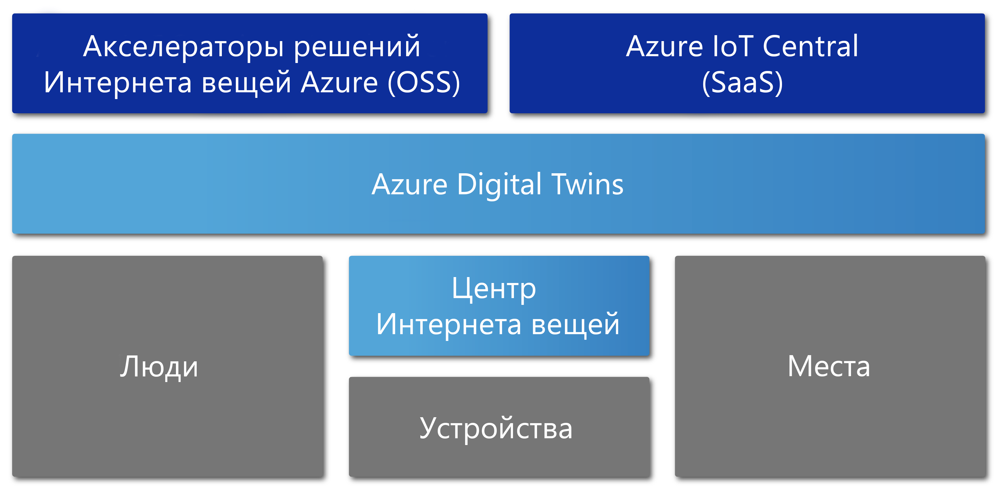

# Обзор Azure Digital Twins

Azure Digital Twins представляет собой службу Интернета вещей, с помощью которой можно создать комплексные модели физического окружения. Среди множества функций службы можно выделить возможность создавать пространственные интеллектуальные графы для моделирования связей и взаимодействий между людьми, пространствами и устройствами.

Digital Twins позволяет запрашивать данные из физического пространства, а не из многих разрозненных датчиков. С помощью этой службы можно создавать многоразовые, высокомасштабируемые, пространственно-ориентированные возможности, которые связывают потоковые данные в цифровом и реальном мире. Независимо от того, предсказываете ли вы требования в техническом обслуживании производства, анализируете требования в энергии в реальном времени для электрической сети или оптимизируете использование свободного места для офиса, ваши приложения можно оптимизировать благодаря этим уникальным контекстно-зависимым функциям.

Digital Twins применяется ко всем типам сред, например хранилищам, офисам, школам, больницам, банкам, стадионам, фабрикам, автостоянкам, паркам, интеллектуальным сетям и городам. Подумайте о сценариях, таких как отслеживание суточной температуры в разных штатах, мониторинг загруженных путей для полета дронов, определение автономных транспортных средств, анализ уровней заполняемости здания или поиск самого загруженного кассового аппарата в магазине. Независимо от вашего реального бизнес-сценария с помощью Digital Twins можно подготовить соответствующий цифровой экземпляр.

В видеоролике ниже Digital Twins рассматривается более подробно:

> [!VIDEO https://www.youtube.com/embed/TvN_NxpgyzQ]

## Ключевые возможности

Ниже приведены основные возможности Digital Twins.

### Пространственный интеллектуальный граф

[*Пространственный интеллектуальный граф*](./concepts-objectmodel-spatialgraph.md) (или просто *пространственный граф*) является виртуальным представлением физического окружения, которое позволяет моделировать связи между людьми, местами и устройствами.

Рассмотрим интеллектуальное приложение, предназначенное для коммунально-бытовых сценариев. Оно может включать несколько счетчиков потребления электроэнергии, подключенных в одном районе. Чтобы точно отслеживать и прогнозировать потребление электроэнергии и выставление счетов, компания, использующая это приложение, должна моделировать каждое устройство и датчик с контекстом о расположении и клиенте, которому будет выставлен счет. Пространственный интеллектуальный граф позволяет моделировать такие сложные взаимосвязи.

### Цифровые модели объектов двойников

[Цифровые модели объектов двойников](./concepts-objectmodel-spatialgraph.md) — это заранее определенные протоколы устройств и схема данных, которые представляют потребности определенной предметной области решения, чтобы ускорить и упростить разработку.

Например, приложение для заполнения комнаты может использовать заранее определенные типы пространства, такие как корпус, здание, этаж, комната и т. д.

### Множественные и вложенные клиенты

Вы можете создавать решения, которые безопасно масштабируются и которые можно повторно использовать для нескольких клиентов. Вы также можете создать несколько вложенных клиентов, к которым можно получить доступ и которые можно использовать изолированным и безопасным образом.

Например, приложение для использования пространства можно настроить для изоляции данных клиента от данных другого клиента в рамках одного здания или для объединения данных для одного клиента с несколькими зданиями.

### Расширенные вычислительные возможности

Расширенные вычислительные возможности, которые называются [определяемыми пользователем функциями](./concepts-user-defined-functions.md), позволяют определять и запускать пользовательские функции в отношении входящих [данных устройства](./concepts-device-ingress.md) для отправки сигналов в заранее определенные конечные точки. Эта возможность улучшает процессы настройки и автоматизацию задач устройства.

Например, интеллектуальное приложение для сельского хозяйства может выполнять определяемую пользователем функцию для оценки показаний датчика влажности почвы, а также прогнозирования погоды, а затем отправлять сигналы о потребностях в орошении.

### Встроенное управление доступом

Функции управления доступом и идентификацией, такие как [управление доступом на основе ролей](./security-role-based-access-control.md) и [Azure Active Directory](./security-authenticating-apis.md), позволяют вам безопасно контролировать доступ отдельных лиц и устройств.

Например, приложение для управления объектами можно сконфигурировать таким образом, чтобы позволить людям в комнате устанавливать температуру в указанном диапазоне и менеджерам объектов устанавливать любое значение температуры в любой комнате.

### Экосистема

Вы можете подключить экземпляр Digital Twins ко многим эффективным службам Azure, включая Azure Stream Analytics, службы ИИ и хранилища, а также Azure Maps, Microsoft Mixed Reality, Dynamics 365 или Office 365.

Например, интеллектуальное приложение для офисного здания может использовать Digital Twins для представления команд и устройств, расположенных на многих этажах. Так как устройства потоком передают динамические данные в подготовленный экземпляр Digital Twin, Azure Stream Analytics может обрабатывать эти данные для предоставления эффективных практических сведений. Затем эти данные можно сохранить в службе хранилища Azure и преобразовать в формат файла с совместным доступом, чтобы распространить его по всей организации с помощью Office 365.

## Преимущества использования Digital Twins

Служба Digital Twins эффективна для представления реального мира и его многочисленных связей, так как упрощает моделирование Интернета вещей, обработку данных, событий и отслеживание устройств. Рассмотрим только несколько следующих сценариев, представляющих разные отрасли, в которых эффективно использование Digital Twins:

* Отображение для компаний по управлению объектами уровней заполняемости пространства с течением времени для получения сведений о лучших способах конфигурации офисного здания.
* Запуск бланков на заказ работы для мобильного приложения, которое управляет отправкой охранников, планированием услуг по уборке и поддержанию чистоты и любыми другими услугами в торговом или спортивном помещении.
* Отображение сведений о том, какие комнаты в помещении заняты (в режиме реального времени), и помощь в резервировании рабочего пространства в соответствии с потребностями.
* Отслеживание расположения ресурсов в пространстве.
* Оптимизация зарядки электрических транспортных средств путем моделирования предпочтений пользователей и ограничений энергосетей.

## Digital Twins в контексте других Служб Интернета вещей

Digital Twins использует Центр Интернета вещей для подключения устройств и датчиков Интернета вещей, чтобы обеспечить соответствие всех процессов современному реальному миру. На следующей схеме показано, как служба Digital Twins связана с другими службами Интернета вещей:

Более подробное описание остальной части экосистемы Интернета вещей приводится в статье [Технологии и решения Интернета вещей Azure: PaaS и SaaS](https://docs.microsoft.com/azure/iot-fundamentals/iot-services-and-technologies).

## Дополнительная информация

Ознакомьтесь с кратким руководством о возможностях Digital Twins:

> [!div class="nextstepaction"]
> [Краткое руководство. Поиск свободных помещений с помощью Azure Digital Twins](./quickstart-view-occupancy-dotnet.md)

Ознакомьтесь с более подробными сведениями о приложении управления объектами с помощью Digital Twins:

> [!div class="nextstepaction"]
> [Руководство по развертыванию Azure Digital Twins и настройке пространственного графа](./tutorial-facilities-setup.md)

Ознакомьтесь с основными понятиями Digital Twins:

> [!div class="nextstepaction"]
> [Understanding Digital Twins object models and spatial intelligence graph](./concepts-objectmodel-spatialgraph.md) (Основные сведения об объектных моделях и пространственном интеллектуальном графе в Digital Twins)
