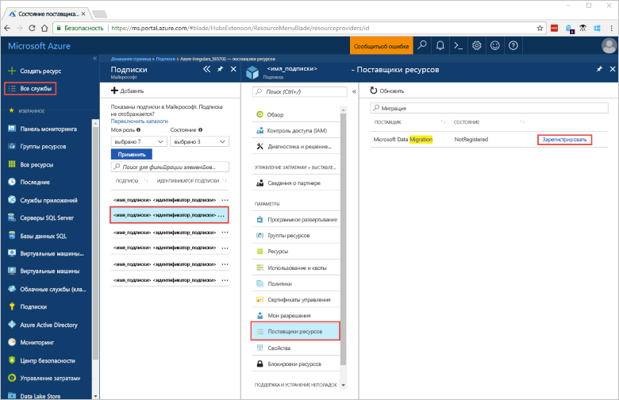
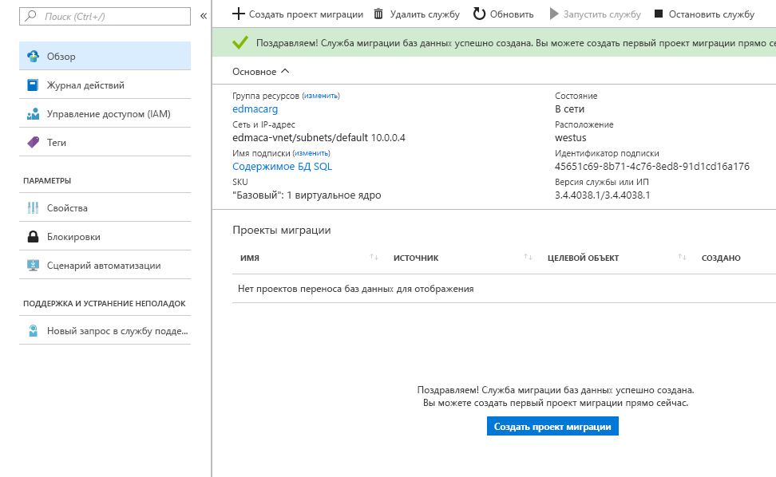

# Создание экземпляра службы Azure Database Migration Service с помощью портала Azure
В этом кратком руководстве вы воспользуетесь порталом Azure, чтобы создать экземпляр службы Azure Database Migration Service.  После создания службы вы сможете использовать ее для переноса данных с локального сервера SQL Server в базу данных SQL Azure.

Если у вас еще нет подписки Azure, создайте [бесплатную](https://azure.microsoft.com/free/) учетную запись Azure, прежде чем начинать работу.

## Вход на портал Azure
Откройте свой веб-браузер и перейдите на [портал Microsoft Azure](https://portal.azure.com/). Введите свои учетные данные для входа на портал. Панель мониторинга службы является представлением по умолчанию.

## Регистрация поставщика ресурсов
Прежде чем вы создадите свою первую службу Database Migration Service, вам нужно зарегистрировать поставщик ресурсов Microsoft.DataMigration.

1. На портале Azure щелкните **Все службы** и выберите **Подписки**.

1. Выберите подписку, в которой нужно создать экземпляр Azure Database Migration Service, а затем щелкните **Поставщики ресурсов**.

1. В поле поиска введите migration, а затем справа от Microsoft.DataMigration щелкните **Зарегистрировать**.

## Создание службы Azure Database Migration Service
1. Щелкните **+**, чтобы создать новую службу.  Пока что доступна только предварительная версия службы Database Migration Service.  

1. Выполните поиск в Marketplace по слову "migration", выберите "Database Migration Service (предварительная версия)", а затем щелкните **Создать**.

    

    - Выберите **имя службы**, которое хорошо запоминается и будет уникальным для идентификации экземпляра службы Azure Database Migration Service.
    - Выберите **подписку** Azure, в рамках которой нужно создать службу Database Migration Service.
    - Создайте новую **сеть** с уникальным именем.
    - Выберите **расположение**, наиболее близкое к исходному или целевому серверу.
    - Дл параметра **Ценовая категория** выберите значение Basic: 1 vCore (Базовый: 1 виртуальное ядро).

1. Щелкните **Создать**.

Через несколько секунд служба Azure Database Migration Service будет создана и готова к использованию.  Служба Database Migration Service отобразится, как показано на рисунке.

## Очистка ресурсов
Чтобы очистить ресурсы, созданные при работе с этим кратким руководством, удалите [группу ресурсов Azure](../azure-resource-manager/resource-group-overview.md).  Чтобы удалить группу ресурсов, перейдите к созданной вами службе Database Migration Service, щелкните имя **группы ресурсов**, а затем выберите **Удалить группу ресурсов**.  Это действие удаляет все ресурсы в группе ресурсов, а также саму группу.

## Дальнейшие действия
> [!div class="nextstepaction"]
> [Перенос локального сервера SQL Server в базу данных SQL Azure](tutorial-sql-server-to-azure-sql.md)