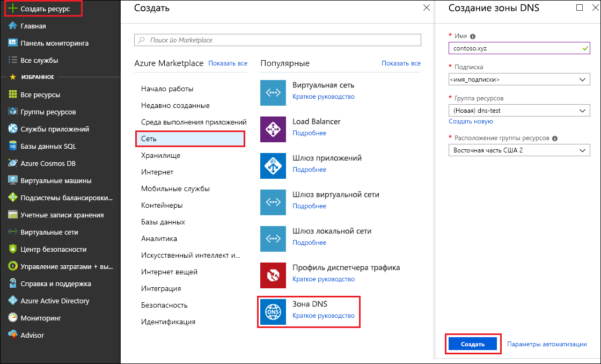

# <a name="quickstart-configure-azure-dns-for-name-resolution-by-using-the-portal"></a>Краткое руководство. Настройка Azure DNS для разрешения имен с помощью портала Azure

В общедоступном домене можно настроить Azure DNS для разрешения имен узлов. Например, если было приобретено доменное имя *contoso.com* у регистратора доменных имен, можно настроить Azure DNS для размещения домена *contoso.com* и разрешить *www.contoso.com* IP-адресу веб-сервера или веб-приложения.

В рамках этого краткого руководства вы создадите тестовый домен, а затем запись адреса для разрешения *www* IP-адресу *10.10.10.10*.

>[!IMPORTANT]
>Все имена и IP-адреса в этом кратком руководстве приведены в качестве примеров и не представляют собой сценарии из реальной жизни. В кратком руководстве также при возможности обсуждаются реальные последствия.

<!---
You can also perform these steps using [Azure PowerShell](dns-getstarted-powershell.md) or the cross-platform [Azure CLI](dns-getstarted-cli.md).
--->

Если у вас еще нет подписки Azure, [создайте бесплатную учетную запись Azure](https://azure.microsoft.com/free/?WT.mc_id=A261C142F), прежде чем начинать работу.

Для выполнения действий на портале войдите на [портал Azure](https://portal.azure.com).

## <a name="create-a-dns-zone"></a>Создание зоны DNS

Зона DNS содержит записи DNS для домена. Чтобы разместить свой домен в Azure DNS, необходимо создать зону DNS для этого доменного имени. 

**Создание зоны DNS.**

1. В верхнем левом углу выберите **Создать ресурс**, затем **Сетевые подключения**, а затем **Зона DNS**.
   
1. На странице **Создание зоны DNS** введите или выберите следующие значения.
   
   - **Имя**: для примера из этого руководства введите *contoso.xyz*. Именем зоны DNS может быть любое значение, которое еще не настроено на серверах Azure DNS. Реальное значение будет доменом, который был приобретен у регистратора доменных имен.
   - **Группа ресурсов**: выберите **Создать**, введите *dns-test* и выберите **ОК**. Имя группы ресурсов должно быть уникальным в пределах подписки Azure. 
   
1. Нажмите кнопку **Создать**.

   
   
Создание зоны может занять несколько минут.

## <a name="create-a-dns-record"></a>Создание записи DNS

Записи DNS для домена создаются внутри зоны DNS. Создайте новую запись адреса или запись "A", чтобы разрешить имя узла адресу IPv4.

**Создание записи "A".**

1. На портале Azure в разделе **Все ресурсы** в группе ресурсов **dns-test** откройте зону DNS **contoso.xyz**. Чтобы упростить поиск, можно ввести *contoso.xyz* в поле **Фильтровать по имени**.

1. В верхней части страницы **Зона DNS** выберите **+ Набор записей**.

1. На странице **Добавление набора записей** введите или выберите следующие значения.

   - **Имя**: введите *www*. Имя записи — это имя узла, который необходимо разрешить указанному IP-адресу.
   - **Тип**: выберите **A**. Записи "А" самые распространенные, но существуют другие типы записей для почтовых серверов ("MX"), IPv6-адресов ("AAAA") и т. д. 
   - **Срок жизни**: введите *1*. *Срок жизни* DNS-запроса указывает, как долго DNS-серверы и клиенты могут кэшировать ответ.
   - **Единица срока жизни**: выберите **Часы**. Это единица времени для значения **срока жизни**. 
   - **IP-адрес**: для примера из этого руководства введите *10.10.10.10*. Это значение — это IP-адрес, которому разрешается имя записи. Для реального сценария необходимо ввести общедоступный IP-адрес своего веб-сервера.

Так как в этом кратком руководстве не используется настоящий домен, нет необходимости настраивать серверы доменных имен Azure в регистраторе доменных имен. Используя настоящий домен, имеет смысл предоставить любому пользователю в Интернете возможность разрешить имя узла для подключения к веб-серверу или приложению. Необходимо обратиться к регистратору доменного имени, чтобы заменить записи имени сервера на сервер доменных имен Azure. Дополнительные сведения см. в руководстве по [размещению домена в Azure DNS](dns-delegate-domain-azure-dns.md#delegate-the-domain).

## <a name="test-the-name-resolution"></a>Тестирование разрешения имен

Теперь, когда у вас есть тестовая зона DNS с тестовой записью "A", можно протестировать разрешение имен с помощью инструмента *nslookup*. 

**Тестирование разрешения DNS-имени.**

1. На портале Azure в разделе **Все ресурсы** в группе ресурсов **dns-test** откройте зону DNS **contoso.xyz**. Чтобы упростить поиск, можно ввести *contoso.xyz* в поле **Фильтровать по имени**.

1. Скопируйте одно из имен сервера доменных имен из списка на странице **Обзор**. 
   
   
   
   >[!NOTE]
   >В реальном сценарии необходимо скопировать все четыре имени серверов доменных имен, включая конечные точки, и использовать их в качестве новых имен сервера доменных имен Azure DNS на сайте регистратора домена. Дополнительные сведения см. в статье [Делегирование домена в Azure DNS](dns-delegate-domain-azure-dns.md).
   
1. Откройте командную строку и выполните приведенную ниже команду.

   ```
   nslookup <host name> <name server name>
   ```
   
   Например: 
   
   ```
   nslookup www.contoso.xyz ns1-08.azure-dns.com.
   ```
   
   Результат будет подобным приведенному на следующем снимке экрана.
   
   

Имя узла **www.contoso.xyz** разрешается в **10.10.10.10**, как и было настроено. Такой результат подтверждает, что разрешение имен работает правильно. 

## <a name="clean-up-resources"></a>Очистка ресурсов

Если вы больше не нуждаетесь в ресурсах, созданных в этом кратком руководстве, удалите их, удалив группу ресурсов **dns-test**. Откройте группу ресурсов **dns-test** и выберите **Удалить группу ресурсов**.

## <a name="next-steps"></a>Дополнительная информация

> [!div class="nextstepaction"]
> [Создание записей DNS для веб-приложения в пользовательском домене](./dns-web-sites-custom-domain.md)