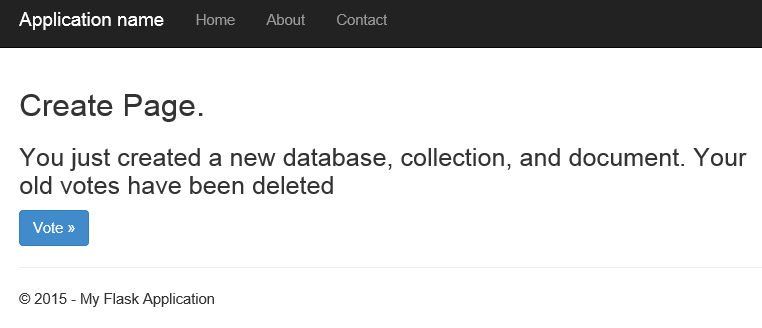
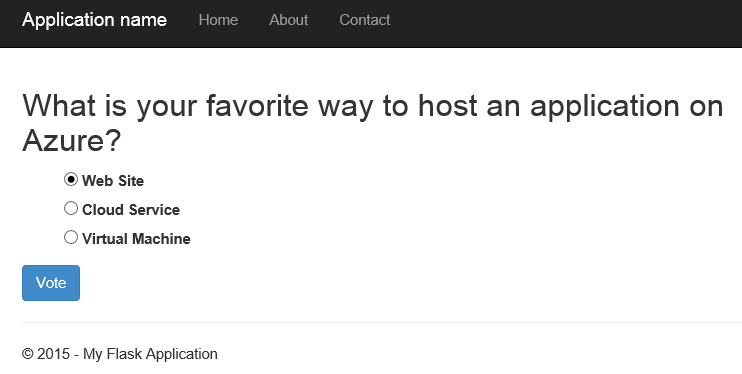

<properties title="Build a web application with Python and Flask (MVC) using DocumentDB" pageTitle="Создание веб-приложения Python и Flask с использованием DocumentDB | Azure" description="Learn how to use DocumentDB to store and access data from an Python and Flask (MVC) web application hosted on Azure."  metaKeywords="NoSQL, DocumentDB,  database, document-orientated database, JSON, account" services="documentdb"  solutions="data-management" documentationCenter=""  authors="hawong" manager="jhubbard" editor="cgronlun" videoId="" scriptId="" />

<tags ms.service="documentdb" ms.workload="data-management" ms.tgt_pltfrm="na" ms.devlang="na" ms.topic="article" ms.date="08/20/2014" ms.author="hawong" />

<a name="_Toc395809324">Создание веб-приложения Python и Flask (MVC) с использованием DocumentDB</a>
===========================================================================================================================================

<a name="_Toc395809324">

<a name="_Toc389828008">Обзор</a>
========================================================================================================================

<a name="_Toc395809326">Сценарий</a>
----------------------------------------------------------------

Чтобы показать, как клиенты могут эффективно использовать DocumentDB в службе Azure для
хранения и запросов документов JSON, ниже приведена пошаговая инструкция
по созданию веб-приложения для голосования с использованием Azure Document
DB.

В этой инструкции показан пример использования службы DocumentDB, предоставляемой
Azure, для хранения данных и доступа к ним из веб-приложения Python, размещенного в
Azure. Предполагается, что у вас уже имеется некоторый опыт использования Python и
веб-сайтов Azure.

Вы узнаете:

1\. Создание и подготовка учетной записи DocumentDB

2\. Создание приложения Python MVC

3\. Подключение и использование Azure DocumentDB из веб-приложения

4\. Развертывание веб-приложения на веб-сайтах Azure

Следуя указаниям, вы создадите простое
веб-приложение для голосования, позволяющее голосовать в опросах.

<a name="_Toc395809329">Предварительные требования</a>

Перед выполнением инструкций, приведенных в данной статье, убедитесь,
что установлены следующие компоненты:

Visual Studio 2013 (или [Visual Studio Express][], бесплатная
версия)

Средства Python Tools для Visual Studio (можно скачать [здесь][])

Пакет Azure SDK для Visual Studio 2013, версии 2.4 или более поздней (можно скачать
[здесь][1])

Межплатформенные средства командной строки Azure, доступные в [Установщике веб-платформы
Microsoft][]

<a name="_Toc395809328">Создание учетной записи базы данных DocumentDB</a>
============================================================================================

Чтобы подготовить учетную запись базы данных DocumentDB в Azure, откройте портал управления Azure
либо нажмите плитку коллекции Azure на
домашней странице или кнопку со знаком "+" в левом нижнем углу экрана.

Откроется коллекция Azure, где можно выбрать любую из множества
доступных служб Azure. В списке категорий коллекции выберите "Данные, хранение и
резервное копирование".

Здесь, выберите параметр для Azure DocumentDB

Затем нажмите "Создать" в нижней части экрана

Откроется выноска "Новый документ DocumentDB", где можно указать
имя, регион, масштаб, группу ресурсов и другие параметры для новой
учетной записи.

После ввода значений для вашей учетной записи нажмите кнопку "Создать",
чтобы запустить процесс создания учетной записи базы данных.
После завершения процесса отобразится уведомление
в области уведомлений портала и плитка на
начальном экране (если вы ее создали) изменится,
отображая выполненное действие.

Теперь при нажатии плитки DocumentDB на
начальном экране будет отображаться основная выноска для вновь созданной
учетной записи DocumentDB.

С помощью кнопки "Ключи" выполните доступ к URL-адресу конечной точки и первичному ключу,
скопируйте их в буфер обмена и держите всегда под рукой, так как мы будем использовать эти
значения в веб-приложении, которое создадим в дальнейшем.

</a>

<a name="_Toc395809329">Создание нового веб-приложения Python Flask</a>
=================================================================================================

Откройте Visual Studio, выберите Файл -\> Новый проект -\> Python -\>, веб-проект Flask
с именем **tutorial**. Вам будет предложено
установить внешние пакеты. Нажмите кнопку "Установить" в виртуальной среде"
и выберите команду "Создать". Будет выполнена установка требуемой виртуальной среды Python
для вашего проекта.

Для тех, кто не знаком с Flask: это веб-фреймворк, позволяющий ускорить процесс создания
веб-приложения в Python. [Нажмите здесь, чтобы ознакомиться с учебниками по Flask][].

<a name="_Toc395809329">Добавление пакетов Flask в ваш проект</a>
==================================

После выполнения настроек проекта необходимо добавить определенные пакеты Flask, которые
понадобятся для нашего проекта, например формы. Щелкните правой кнопкой мыши на значении **env**
и выберите **Установить пакеты Python (очень важно выполнять инструкции
в указанном порядке)**:

    flask==0.9
    flask-login
    flask-openid
    flask-mail==0.7.6
    sqlalchemy==0.7.9
    flask-sqlalchemy==0.16
    sqlalchemy-migrate==0.7.2
    flask-whooshalchemy==0.55a
    flask-wtf==0.8.4
    pytz==2013b
    flask-babel==0.8
    flup

**Примечание.**Примечание. В редких случаях в окне вывода появляется ошибка. Если
такое произойдет, проверьте, относится ли эта ошибка к очистке. Иногда
в процессе очистки происходит сбой, но это не повлияет на ход установки (прокрутите вверх
в окне вывода, чтобы убедиться в этом).
 В случае сбоя можно продолжать.

</h1>
<a name="_Toc395809331">Проверка виртуальной среды</a>
======================================================================================

Убедимся, что выполнена корректная установка. Запустите веб-сайт,
нажав **клавишу F5** Запустится сервер разработки Flask
и веб-браузер. Отобразится следующая страница:

<a name="_Toc395809332">Добавление в проект DocumentDB</a>
=========================================================================================

Пакет Python SDK для DocumentDB размещен в PyPi и может быть установлен с помощью
PIP.

Разверните узел среды Python в обозревателе решений, щелкните правой кнопкой мыши
в своей среде и выберите "Установить пакет Python..."

Введите "--pre pydocumentdb" - имя пакета PyPi. При необходимости
можно указать известную вам версию, если вы хотите самостоятельно определять
какая именно версия будет установлена. При отсутствии других вариантов будет установлена последняя
стабильная версия. Обратите внимание, что необходимо ввести
полное имя "--pre pydocumentdb".

В вашу среду будет загружен и установлен пакет pydocumentdb.
По завершении pydocumentdb отобразится
в списке модулей вашей среды.

</h1>
<a name="_Toc395809333">Создание базы данных, коллекции и определения документа</a>
============================================================================================================

Добавьте следующий файл Python **forms.py**, а затем добавьте его в папку
tutorial в обозревателе решений. Добавьте следующий код в
forms.py. Мы создаем приложение для голосования. Это будет реализовано
путем создания трех логических полей, которые будут переключаться в зависимости от ввода данных пользователем.

</h1>

    #forms.py
    from flask.ext.wtf import Form
    from wtforms import TextField, BooleanField
    from wtforms.validators import Required
    import pydocumentdb.documents as documents
    import pydocumentdb.document_client as document_client
    import pydocumentdb.errors as errors
    class LoginForm(Form):
        openid = TextField('openid')
        remember_me = BooleanField('remember_me', default = False)
        remember_me1 = BooleanField('remember_me1', default = False)
        remember_me2 = BooleanField('remember_me2', default = False)

============================

### <a name="_Toc395809338">Создание базы данных, коллекции и документа</a>

\#Примечание. Хранить учетные данные для проверки подлинности безопаснее
в файле конфигурации, нежели в приложении. Чтобы упростить эту процедуру, мы
разместим их в исходном коде. Создайте новую функцию в views.py и присвойте ей имя
Добавьте в файл**views.py**. Не удаляйте
существующие коды.

</h1>

    @app.route('/create')
    def create():
        """Renders the contact page."""
        host = 'https://meetdemo.documents.azure.com:443/'
        masterKey = '7xPDjHxJSuAUPI2BEWXF2VNVO6c3MN4q+941NAQwPphIqOGW/gE+pB1CQNp4K2F9/4T1bTl040t6JDeyCBmj3A=='
        client = document_client.DocumentClient(host, {'masterKey': masterKey})
        databases = client.ReadDatabases().ToArray()
        #delete any existing databases for simplicity
        for database in databases:
            client.DeleteDatabase(database['_self'])
        #create database
        db = client.CreateDatabase({ 'id': 'sample database' })
        # create collection
        collection = client.CreateCollection(db['_self'],{ 'id': 'sample collection' })
        # create document
        document = client.CreateDocument(collection['_self'],
        { 'id': 'sample document',
        'Web Site': '0 votes',
        'Cloud Service': '0 votes',
        'Virtual Machine': '0 votes',
        'name': 'sample document' })
        return render_template('create.html',title='Create Page',year=datetime.now().year,
        message='You just created a new database - sample database a collection - sample collection and a document - sample document that has your votes. Your old votes have been deleted')

<a name="_Toc395809338">Учитываем голос пользователя и обновляем документ</a>
=================================================================================================

### <a name="_Toc395809338">Добавление необходимых элементов импорта

============================

Добавьте следующие инструкции импорта в начало файла **views.py**. Они служат
для импорта пакетов Python SDK и Flask базы данных DocumentDB.

    from wtforms import Form, BooleanField, TextField, PasswordField, validators
    from forms import LoginForm
    import pydocumentdb.documents as documents
    import pydocumentdb.document_client as document_client
    import pydocumentdb.errors as errors

### <a name="_Toc395809338">Чтение базы данных, коллекции и документа</a>

Добавьте следующий код в файл **views.py**. Он служит для настройки
формы, чтения базы данных, коллекции и документа. Не удаляйте
существующий код в views.py. Просто переместите его в конец.

    @app.route('/vote', methods=['GET', 'POST'])
    def vote(): 
        form = LoginForm()
        replaced_document ={}
        if form.validate_on_submit(): # is user submitted vote  
            host = 'https://meetdemo.documents.azure.com:443/'
            masterKey = '7xPDjHxJSuAUPI2BEWXF2VNVO6c3MN4q+941NAQwPphIqOGW/gE+pB1CQNp4K2F9/4T1bTl040t6JDeyCBmj3A=='
            client = document_client.DocumentClient(host, {'masterKey': masterKey})
            databases = client.ReadDatabases().ToArray()   #Read database
            db =databases[0] #For simplicity we are assuming there is only one database
            collections = client.ReadCollections(db['_self']).ToArray() #Read collection
            coll =collections[0] #For simplicity we are assuming there is only one collection
            documents = client.ReadDocuments(coll['_self']).ToArray() #Read document
            doc = documents[0]   #For simplicity we are assuming there is only document
    
### <a name="_Toc395809338">Registering the vote and modifying the document</a>

            replaced_document = doc
            if form.remember_me.data:
                print 'choice 1'             
                setvar = doc['Web Site']
                finalvar = setvar.split();
                votes = int(finalvar[0])
                votes = votes+1
                doc['Web Site'] = str(votes)+' '+finalvar[1]
                replaced_document = client.ReplaceDocument(doc['_self'],
                                                       doc)
                print replaced_document
            elif form.remember_me1.data:
                print 'choice 2'             
                setvar = doc['Cloud Service']
                finalvar = setvar.split();
                votes = int(finalvar[0])
                votes = votes+1
                doc['Cloud Service'] = str(votes)+' '+finalvar[1]
                replaced_document = client.ReplaceDocument(doc['_self'],
                                                       doc)
            else:
                print 'choice 2'             
                setvar = doc['Virtual Machine']
                finalvar = setvar.split();
                votes = int(finalvar[0])
                votes = votes+1
                doc['Virtual Machine'] = str(votes)+' '+finalvar[1]
                replaced_document = client.ReplaceDocument(doc['_self'],
                                                       doc)

### <a name="_Toc395809338">Отображение результатов</a>

    return render_template('results.html', 
            title = 'Website = ' + replaced_document['Web Site'] + '\n' +'Cloud Service = ' + replaced_document['Cloud Service'] + '\n' + 'Virtual Machine = ' + replaced_document['Virtual Machine'])
        else :        
            return render_template('vote.html', 
            title = 'Vote',
            form = form,
            providers = app.config['OPENID_PROVIDERS'])

    @app.route('/results')
    def results():
        """Renders the results page."""
        return render_template(
            'results.html',
            title='Results',
            year=datetime.now().year,
            message='Your application description page.')

### <a name="_Toc395809338">Создание файлов html</a>

В папку "Шаблоны" добавьте такие html-файлы:
create.html, results.html, vote.html

Добавьте следующий код в файл **create.html**. Он служит для отображения
сообщения о создании новой базы данных, коллекции и документа.

    
    
    <h2>{{ title }}.</h2>
    <h3>{{ message }}</h3>
    
<a href="{{ url_for('vote') }}" class="btn btn-primary btn-large">Click here to Vote &raquo;</a>

    

Добавьте следующий код в файл **results.html**. Он служит для отображения
результатов опроса.
    
    
    
    <h3>Results of the vote</h3>
    <pre>{{ title }}</pre>
    
<a href="{{ url_for('vote') }}" class="btn btn-primary btn-large">Vote Again &raquo;</a>

    

Добавьте следующий код в файл **vote.html**. Он служит для отображения
опроса и принимает голоса. При регистрации голосов управление передается
к views.py, где они будут учитываться и
соответственно добавляться в документ.

    
    
    <h1>What is your favorite way to host an application on Azure?</h1>
    <form action="" method="post" name="login">
    {{form.hidden_tag()}}
    
 

        {{form.remember_me}} Website
        {{form.remember_me1}} Cloud
        {{form.remember_me2}} Virtual Machine
        
<input type="submit" value="Cast your vote">

    </form>
    
    

============================

Удалите код в файле **layout.html** и замените на приведенный ниже. Он
служит для настройки панели навигации и соответствующих ссылок для маршрутизации

Удалите код в файле index.html и замените на приведенный ниже. Он
будет служить целевой страницей вашего приложения

</h1>
<a name="_Toc395809341">Добавьте файл конфигурации и измените \_\_init\_\_.py</a>.
----------------------------------------------------------------------------------------------------------------

Щелкните правой кнопкой мыши имя проекта и добавьте файл **config.py**.
Этот файл необходим для работы форм в Flask. Кроме того, его можно использовать
для предоставления секретного ключа. Добавьте следующий код в файл config.py
    
    CSRF_ENABLED = True
    SECRET_KEY = 'you-will-never-guess'
    OPENID_PROVIDERS = [
       ]

Аналогичным образом добавьте **\_\_init\_\_.py file**. Он находится
в папке tutorial. Замените код на приведенный ниже. Он
обеспечивает соединение между представлениями и файлом config.py.

    from flask import Flask
    app = Flask(__name__)
    app.config.from_object('config')
    import tutorial.views

После выполнения указанных выше шагов ваш обозреватель
решений должен выглядеть примерно так:

<a name="_Toc395637774">Локальный запуск приложения</a>
============================

Нажмите клавишу F5 или кнопку запуска в Visual Studio и на экране
отобразится следующее:

Щелкните на голосе и сделайте выбор

Для каждого учтенного голоса будет увеличиваться соответствующий счетчик. При
следующем голосовании можно будет просмотреть результаты.

</h1>
<a name="_Toc395637774">Разверните приложение на веб-сайтах Azure</a>
========================================================================================================================

Теперь, когда у вас есть готовое приложение и оно корректно работает в
DocumentDB, мы развернем его на веб-сайтах Azure. Щелкните правой кнопкой мыши
проект в обозревателе решений (убедитесь, что он не запущен
локально) и выберите пункт "Опубликовать".

Настройте веб-сайт Azure, введя свои учетные данные и создав
новый веб-сайт или повторно использовав существующий.

Через несколько секунд Visual Studio завершит публикацию вашего веб-приложения и
запустит браузер, где вы сможете увидеть свое творение,
запущенное в Azure!

</h1>
<a name="_Toc395809338">Заключение</a>
==========

Поздравляем! Вы только что создали свое первое приложение на Python с помощью
Azure DocumentDB и опубликовали его на веб-сайтах Azure.

Скачать готовое решение можно [здесь][]. (Примечание. Вам
по-прежнему необходимо добавить виртуальную среду, установить средства python и
выше упомянутые пакеты)

</h1>

  [Щелкните здесь]: http://go.microsoft.com/fwlink/?LinkID=509840&clcid=0x409
  [Учебники по Flask доступны здесь]: http://blog.miguelgrinberg.com/post/the-flask-mega-tutorial-part-i-hello-world

  [Visual Studio Express]: http://www.visualstudio.com/ru-ru/products/visual-studio-express-vs.aspx
  [здесь]: https://pytools.codeplex.com/releases/view/123624
  [1]: http://go.microsoft.com/fwlink/?linkid=254281&clcid=0x409
  [Установщик веб-платформы Майкрософт]: http://www.microsoft.com/web/downloads/platform.aspx
