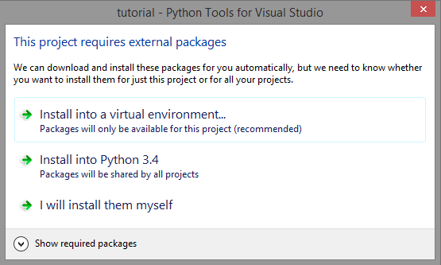
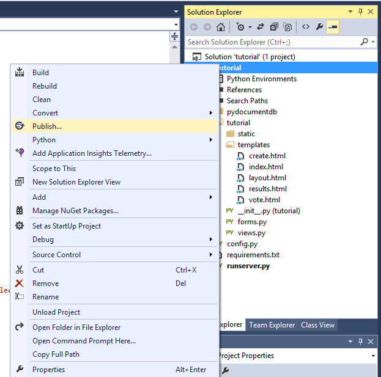

<properties 
    pageTitle="Создание веб-приложения Python и Flask с использованием DocumentDB | Azure" 
    description="Узнайте, как использовать DocumentDB для хранения и использования данных из веб-приложения Python и Flask (MVC), размещенного в Azure." 
    services="documentdb" 
    documentationCenter="" 
    authors="crwilcox" 
    manager="jhubbard" 
    editor="cgronlun"/>

<tags 
    ms.service="documentdb" 
    ms.workload="data-management" 
    ms.tgt_pltfrm="na" 
    ms.devlang="na" 
    ms.topic="article" 
    ms.date="02/12/2015" 
    ms.author="crwilcox"/>

# Создание веб-приложения Python и Flask (MVC) с использованием DocumentDB
------------------------------------------------------------------------

Чтобы показать, как клиенты могут эффективно использовать DocumentDB в службе Azure для хранения и запросов документов JSON, ниже приведена пошаговая инструкция по созданию веб-приложения для голосования с использованием Azure Document DB.

В этой инструкции показан пример использования службы DocumentDB, предоставляемой Azure, для хранения данных и доступа к ним из веб-приложения Python, размещенного в Azure. Предполагается, что у вас уже имеется некоторый опыт использования Python и веб-сайтов Azure.

В этом руководстве рассматриваются следующие темы.

1. Создание и подготовка учетной записи DocumentDB

2. Создание приложения Python MVC

3. Подключение и использование Azure DocumentDB из веб-приложения

4. Развертывание веб-приложения на веб-сайтах Azure

Следуя указаниям, вы создадите простое
веб-приложение для голосования, позволяющее голосовать в опросах.

## Предварительные требования

Перед выполнением инструкций, приведенных в этой статье, следует убедиться, что установлены следующие компоненты:

- Visual Studio 2013 (или [Visual Studio Express][], бесплатная версия)

- Средства Python Tools для Visual Studio (можно загрузить [здесь][])

- Пакет Azure SDK для Visual Studio 2013, версии 2.4 или более поздней (можно загрузить [здесь][)1]

- Python 2.7 можно загрузить [здесь][2]

- Компилятор Microsoft Visual C++ для Python 2.7 (можно загрузить [здесь][)3]

## Шаг 1. Создание учетной записи базы данных DocumentDB

Чтобы подготовить учетную запись базы данных DocumentDB в Azure, откройте [портал управления Azure][] либо нажмите плитку коллекции Azure на домашней странице или кнопку со знаком "+" в левом нижнем углу экрана.

Откроется Azure Marketplace, где можно выбрать любую из множества доступных служб Azure. В Marketplace в списке категорий выберите "Данные и аналитика".

Здесь выполните поиск и выберите параметр для DocumentDB.

Затем нажмите "Создать" в нижней части экрана

Откроется выноска "Новый документ DocumentDB", где можно указать имя, регион, масштаб, группу ресурсов и другие параметры для новой учетной записи.

После ввода значений для вашей учетной записи нажмите кнопку "Создать", чтобы запустить процесс создания учетной записи базы данных.
После завершения процесса отобразится уведомление в области уведомлений портала и плитка на начальном экране (если вы ее создали) изменится, отображая выполненное действие.

После завершения подготовки нажатие плитки DocumentDB на начальном экране вызовет основную колонку новой созданной учетной записи DocumentDB.

С помощью кнопки "Ключи" выполните доступ к URL-адресу конечной точки и первичному ключу, скопируйте их в буфер обмена и держите всегда под рукой, так как мы будем использовать эти значения в веб-приложении, которое создадим в дальнейшем.

## Шаг 2. Создание нового веб-приложения Python Flask

Откройте Visual Studio, выберите Файл -> Новый проект -> Python -> веб-проект Flask с именем **tutorial**. 

Для тех, кто не знаком с Flask: это веб-фреймворк, позволяющий ускорить процесс создания веб-приложения в Python. [Щелкните здесь, чтобы ознакомиться с учебниками по Flask][].

Будет выведен запрос на установку внешних пакетов. Выберите вариант **Установить в виртуальной среде**. В качестве базовой среды необходимо использовать Python 2.7, поскольку PyDocumentDB не поддерживает Python 3.x.  Для вашего проекта будет настроена требуемая виртуальная среда Python.

## Шаг 3. Изменение веб-приложения Python Flask

### Добавление пакетов Flask в ваш проект

После выполнения настроек проекта необходимо добавить определенные пакеты Flask, которые понадобятся для проекта, включая pydocumentdb - пакет python для DocumentDB. Откройте файл с именем **requirements.txt** и замените его содержимое следующим.

    flask==0.9
    flask-mail==0.7.6
    sqlalchemy==0.7.9
    flask-sqlalchemy==0.16
    sqlalchemy-migrate==0.7.2
    flask-whooshalchemy==0.55a
    flask-wtf==0.8.4
    pytz==2013b
    flask-babel==0.8
    flup
    pydocumentdb>=0.9.4-preview

Щелкните правой кнопкой мыши **env** и выберите пункт **Установить их файла requirements.txt**.

**Примечание.** В редких случаях в окне вывода появляется ошибка. Если такое произойдет, проверьте, относится ли эта ошибка к очистке. Иногда в процессе очистки происходит сбой, но это не повлияет на ход установки (прокрутите вверх в окне вывода, чтобы убедиться в этом).
 Если это произойдет, нажмите кнопку "ОК", чтобы продолжить.

### Проверка виртуальной среды

Убедимся, что выполнена корректная установка. Запустите веб-сайт, нажав клавишу **F5**. Запустится сервер разработки Flask и веб-браузер. Вы должны увидеть следующую страницу:

### Создание базы данных, коллекции и определения документа

Добавьте файл Python, щелкнув правой кнопкой мыши папку с именем **tutorial** в обозревателе решений.  Присвойте файлу имя **forms.py**.  Мы создаем приложение для голосования.

    from flask.ext.wtf import Form
    from wtforms import RadioField

    class VoteForm(Form):
        deploy_preference  = RadioField('Deployment Preference', choices=[
            ('Web Site', 'Web Site'),
            ('Cloud Service', 'Cloud Service'),
            ('Virtual Machine', 'Virtual Machine')], default='Web Site')

### Добавьте необходимые файлы импорта в views.py.

Добавьте следующие инструкции import в начало файла **views.py**. Они выполнят импорт пакета SDK Python и пакетов Flask в DocumentDB.

    from forms import VoteForm
    import config
    import pydocumentdb.document_client as document_client
    

### Создание базы данных, коллекции и документа

Добавьте следующий код в файл **views.py**. Он отвечает за создание базы данных, используемой формой. Не удаляйте существующий код в **views.py**. Просто переместите его в конец.

    @app.route('/create')
    def create():
        """Renders the contact page."""
        client = document_client.DocumentClient(config.DOCUMENTDB_HOST, {'masterKey': config.DOCUMENTDB_KEY})
    
        # Attempt to delete the database.  This allows this to be used to recreate as well as create
        try:
            db = next((data for data in client.ReadDatabases() if data['id'] == config.DOCUMENTDB_DATABASE))
            client.DeleteDatabase(db['_self'])
        except:
            pass
    
        # Create database
        db = client.CreateDatabase({ 'id': config.DOCUMENTDB_DATABASE })
        # Create collection
        collection = client.CreateCollection(db['_self'],{ 'id': config.DOCUMENTDB_COLLECTION })
        # Create document
        document = client.CreateDocument(collection['_self'],
            { 'id': config.DOCUMENTDB_DOCUMENT,
            'Web Site': 0,
            'Cloud Service': 0,
            'Virtual Machine': 0,
            'name': config.DOCUMENTDB_DOCUMENT })
    
        return render_template(
            'create.html', 
            title='Create Page', 
            year=datetime.now().year,
            message='You just created a new database, collection, and document.  Your old votes have been deleted')

### Чтение базы данных и коллекции и документов и отправка формы

Добавьте следующий код в файл **views.py**. Он служит для настройки формы, чтения базы данных, коллекции и документа. Не удаляйте существующий код в **views.py**. Просто переместите его в конец.
    
    @app.route('/vote', methods=['GET', 'POST'])
    def vote(): 
        form = VoteForm()
        replaced_document ={}
        if form.validate_on_submit(): # is user submitted vote  
            client = document_client.DocumentClient(config.DOCUMENTDB_HOST, {'masterKey': config.DOCUMENTDB_KEY})
            
            # Read databases and take first since id should not be duplicated.
            db = next((data for data in client.ReadDatabases() if data['id'] == config.DOCUMENTDB_DATABASE))
            
            # Read collections and take first since id should not be duplicated.
            coll = next((coll for coll in client.ReadCollections(db['_self']) if coll['id'] == config.DOCUMENTDB_COLLECTION))
    
            # Read documents and take first since id should not be duplicated.
            doc = next((doc for doc in client.ReadDocuments(coll['_self']) if doc['id'] == config.DOCUMENTDB_DOCUMENT))
    
            # Take the data from the deploy_preference and increment our database
            doc[form.deploy_preference.data] = doc[form.deploy_preference.data] + 1
            replaced_document = client.ReplaceDocument(doc['_self'], doc)
    
            # Create a model to pass to results.html
            class VoteObject:
                choices = dict()
                total_votes = 0
    
            vote_object = VoteObject()
            vote_object.choices = {
                "Web Site" : doc['Web Site'],
                "Cloud Service" : doc['Cloud Service'],
                "Virtual Machine" : doc['Virtual Machine']
            }
            vote_object.total_votes = sum(vote_object.choices.values())
    
            return render_template(
                'results.html', 
                year=datetime.now().year, 
                vote_object = vote_object)
    
        else :
            return render_template(
                'vote.html', 
                title = 'Vote',
                year=datetime.now().year,
                form = form)

### Создание файлов html

В папку "Шаблоны" добавьте такие HTML-файлы: create.html, results.html, vote.html.

Добавьте следующий код в файл **create.html**. Он служит для отображения сообщения о создании новой базы данных, коллекции и документа.

    
    
    <h2>{{ title }}.</h2>
    <h3>{{ message }}</h3>
    
<a href="{{ url_for('vote') }}" class="btn btn-primary btn-large">Vote &raquo;</a>

    

Добавьте следующий код в файл **results.html**. Он служит для отображения результатов опроса.

    
    
    <h2>Results of the vote</h2>
     

    
    

        
{{choice}}

        

            

                

                    {{vote_object.choices[choice]}}
                

            

        

    

    

     
    <a class="btn btn-primary" href="{{ url_for('vote') }}">Vote again?</a>
    

Добавьте следующий код в файл **vote.html**. Он служит для отображения опроса и принимает голоса. При регистрации голосов управление передается к views.py, где они будут учитываться и, соответственно, добавляться в документ.

    
    
    <h2>What is your favorite way to host an application on Azure?</h2>
    <form action="" method="post" name="vote">
        {{form.hidden_tag()}}
        {{form.deploy_preference}}
        <button class="btn btn-primary" type="submit">Vote</button>
    </form>
    

Замените содержимое файла **index.html** на приведенный ниже код. Он будет служить главной страницей приложения.

    
    
    <h2>Python + DocumentDB Voting Application.</h2>
    <h3>This is a sample DocumentDB voting application using PyDocumentDB</h3>
    
<a href="{{ url_for('create') }}" class="btn btn-primary btn-large">Create/Clear the Voting Database &raquo;</a>

    
<a href="{{ url_for('vote') }}" class="btn btn-primary btn-large">Vote &raquo;</a>

    

### Добавьте файл конфигурации и измените \_\_init\_\_.py

Щелкните правой кнопкой мыши имя проекта и добавьте файл **config.py**.
Этот файл необходим для работы форм в Flask. Кроме того, его можно использовать для предоставления секретного ключа. В этом учебнике это не требуется. Добавьте следующий код в файл config.py.   Измените значения **DOCUMENTDB\_HOST** и **DOCUMENTDB\_KEY**.

    CSRF_ENABLED = True
    SECRET_KEY = 'you-will-never-guess'
    
    DOCUMENTDB_HOST = 'https://YOUR_DOCUMENTDB_NAME.documents.azure.com:443/'
    DOCUMENTDB_KEY = 'YOUR_SECRET_KEY_ENDING_IN_=='
    
    DOCUMENTDB_DATABASE = 'voting database'
    DOCUMENTDB_COLLECTION = 'voting collection'
    DOCUMENTDB_DOCUMENT = 'voting document'

Аналогичным образом замените содержимое файла **\_\_init\_\_.py** на следующий код.

    from flask import Flask
    app = Flask(__name__)
    app.config.from_object('config')
    import tutorial.views

После выполнения указанных выше шагов ваш обозреватель
решений должен выглядеть примерно так:

## Шаг 4. Локальный запуск приложения

Нажмите клавишу F5 или кнопку запуска в Visual Studio, после чего на экране будут отображено следующее.

Щелкните "Создать или очистить базу данных голосования", чтобы создать базу данных.

Затем нажмите кнопку "Голосовать" и сделайте свой выбор.

Для каждого учтенного голоса будет увеличиваться соответствующий счетчик.

## Шаг 5. Разверните приложение на веб-сайтах Azure

Теперь, когда у вас есть готовое приложение и оно корректно работает в DocumentDB, мы собираемся развернуть его на веб-сайтах Azure. Правой кнопкой мыши щелкните проект в обозревателе решений (убедитесь, что он не запущен локально) и выберите пункт "Опубликовать".  Затем выберите "Веб-сайты Microsoft Azure".

Настройте веб-сайт Azure, введя свои учетные данные и нажав кнопку "Опубликовать".

Через несколько секунд Visual Studio завершит публикацию вашего веб-приложения и запустит браузер, где вы увидите свое творение, запущенное в Azure!

## Дальнейшие действия

Поздравляем! Вы только что создали свое первое приложение на Python с помощью Azure DocumentDB и опубликовали его на веб-сайтах Azure.

  [Щелкните здесь, чтобы ознакомиться с учебниками по Flask]: http://blog.miguelgrinberg.com/post/the-flask-mega-tutorial-part-i-hello-world

  [Visual Studio Express]: http://www.visualstudio.com/products/visual-studio-express-vs.aspx
  [здесь]: http://aka.ms/ptvs
  [1]: http://go.microsoft.com/fwlink/?linkid=254281&clcid=0x409
  [2]: https://www.python.org/downloads/windows/
  [3]: http://aka.ms/vcpython27 
  [Установщик веб-платформы Microsoft]: http://www.microsoft.com/web/downloads/platform.aspx
  [Портал управления Azure]: http://portal.azure.com
<!--HONumber=47-->
