# <a name="create-and-route-blob-storage-events-with-the-azure-portal-and-event-grid"></a>Создание и перенаправление событий хранилища BLOB-объектов с помощью службы "Сетка событий Azure" и портала Azure

"Сетка событий Azure" — это служба обработки событий для облака. В этой статье описано, как с помощью портала Azure создать учетную запись хранилища BLOB-объектов и подписку на связанные события, а также активировать событие для просмотра результата. Как правило, события отправляются на конечную точку, которая обрабатывает данные событий и выполняет соответствующие действия. Но в этой статье для простоты события отправляются в веб-приложение, которое собирает и отображает сообщения.

[!INCLUDE [quickstarts-free-trial-note.md](../../includes/quickstarts-free-trial-note.md)]

По завершении можно увидеть, что данные событий отправлены в веб-приложение.

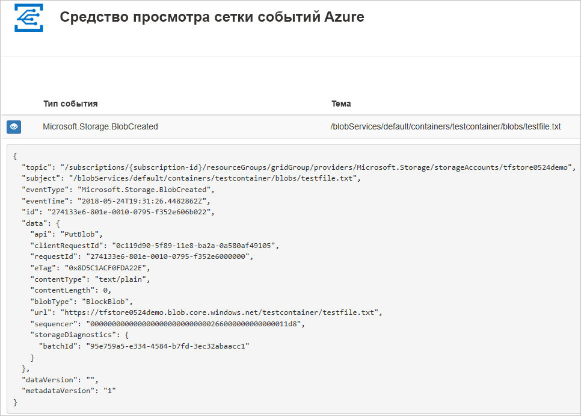

## <a name="create-a-storage-account"></a>Создание учетной записи хранения

Для использования событий хранилища BLOB-объектов требуется либо [учетная запись хранения BLOB-объектов](../storage/common/storage-create-storage-account.md?toc=%2fazure%2fstorage%2fblobs%2ftoc.json#blob-storage-accounts), либо [учетная запись хранения общего назначения версии 2](../storage/common/storage-account-options.md#general-purpose-v2). Учетные записи **общего назначения версии 2 (GPv2)** являются учетными записями хранения, которые поддерживают все функции для всех служб хранилища, включая большие двоичные объекты, файлы, очереди и таблицы. **Учетные записи хранения BLOB-объектов** — это специализированные учетные записи хранения таких неструктурированных данных, как большие двоичные объекты, в службе хранилища Azure. Учетные записи хранилища BLOB-объектов похожи на учетные записи хранения общего назначения и обладают такими же функциями обеспечения устойчивости, надежности, масштабируемости и производительности, которые вы уже используете, а также отличаются полной согласованностью API в плане блочных BLOB-объектов и добавления больших двоичных объектов. Для приложений, требующих только блокировки или добавления больших двоичных объектов, рекомендуется использовать учетные записи хранения больших двоичных объектов. 

1. Войдите на [портал Azure](https://portal.azure.com/).

1. Чтобы создать хранилище BLOB-объектов, выберите **Создать ресурс**. 

   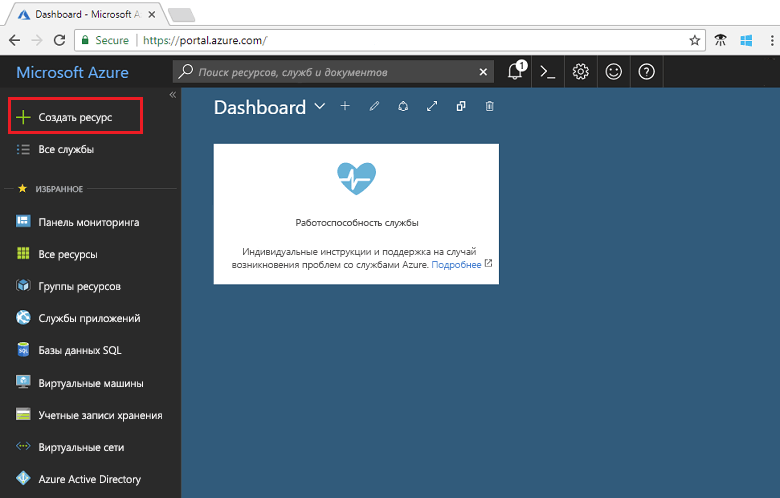

1. Щелкните **Хранилище**, чтобы отфильтровать доступные параметры, и выберите **Учетная запись хранения — BLOB-объект, файл, таблица, очередь**.

   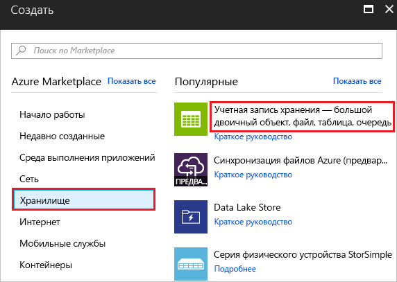

1. Укажите значения для хранилища BLOB-объектов, включая уникальное имя для учетной записи. В качестве типа учетной записи выберите **Хранилище BLOB-объектов**. В качестве расположения выберите одно из [расположений](overview.md) с поддержкой службы "Сетка событий". Введя все значения, выберите **Создать**.

   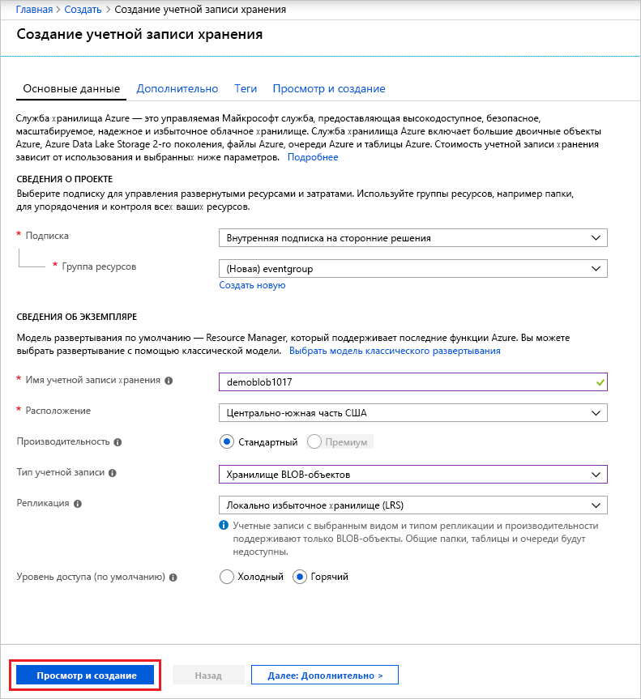

## <a name="create-a-message-endpoint"></a>Создание конечной точки сообщения

Перед созданием подписки на события хранилища BLOB-объектов необходимо создать конечную точку для сообщения о событии. Обычно конечная точка выполняет действия на основе данных событий. Чтобы упростить работу с этим руководством, разверните [готовое веб-приложение](https://github.com/dbarkol/azure-event-grid-viewer), которое отображает сообщения о событиях. Развернутое решение содержит план службы приложений, веб-приложение службы приложений и исходный код из GitHub.

1. Выберите **Развернуть в Azure**, чтобы развернуть решение в своей подписке. На портале Azure укажите значения остальных параметров.

   <a href="https://portal.azure.com/#create/Microsoft.Template/uri/https%3A%2F%2Fraw.githubusercontent.com%2Fdbarkol%2Fazure-event-grid-viewer%2Fmaster%2Fazuredeploy.json" target="_blank"></a>

1. Завершение развертывания может занять несколько минут. Когда развертывание успешно завершится, откройте веб-приложение и убедитесь, что оно работает. Откройте браузер и перейдите по адресу `https://<your-site-name>.azurewebsites.net`.

1. Вы увидите сайт без опубликованных событий.

   

[!INCLUDE [event-grid-register-provider-portal.md](../../includes/event-grid-register-provider-portal.md)]

## <a name="subscribe-to-the-blob-storage"></a>Создание подписки на хранилище BLOB-объектов

Подпишитесь на раздел, чтобы определить в сетке событий Azure, какие из них необходимо отслеживать и куда их отправлять.

1. На портале выберите хранилище BLOB-объектов и щелкните **События**.

   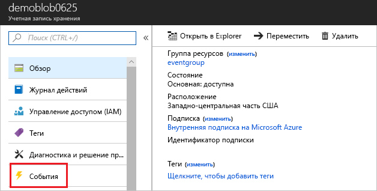

1. Чтобы отправить события в приложение для просмотра, используйте веб-перехватчик для конечной точки. Выберите **Дополнительные параметры** и **Веб-перехватчик**.

   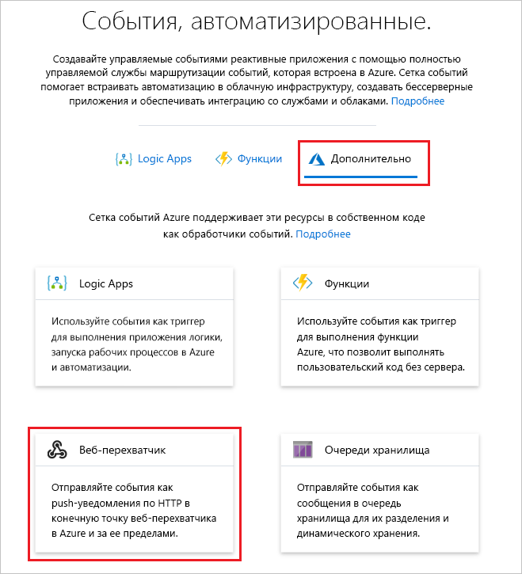

1. Подписка на событие автоматически заполняется значениями для хранилища BLOB-объектов. Для конечной точки веб-перехватчика укажите URL-адрес веб-приложения и добавьте `api/updates` к URL-адресу домашней страницы. Присвойте подписке имя. Затем выберите **Создать**.

   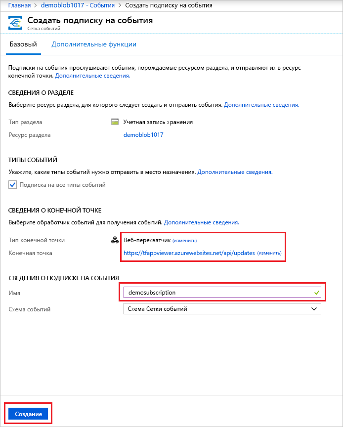

1. Теперь снова откройте веб-приложение и убедитесь, что оно успешно получило отправленное событие подтверждения подписки. Щелкните значок с изображением глаза, чтобы развернуть данные события. Сетка событий отправляет событие подтверждения, чтобы конечная точка могла подтвердить, что она готова получать данные события. Веб-приложение содержит код для проверки подписки.

   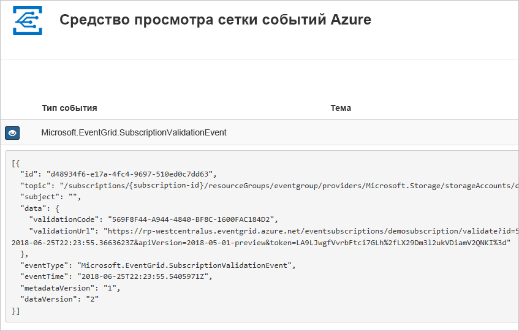

Теперь необходимо активировать событие, чтобы увидеть, как Сетка событий Azure распределяет сообщение к вашей конечной точке.

## <a name="send-an-event-to-your-endpoint"></a>Отправка события в конечную точку

Событие для хранилища BLOB-объектов активируется при отправке файла. Определенное содержимое для файла не требуется. В статье предполагается, что у вас есть файл с именем testfile.txt, но вы также можете использовать любой другой файл.

1. В качестве хранилища BLOB-объектов выберите **Большие двоичные объекты**.

   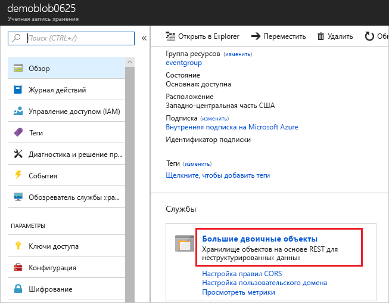

1. Выберите **+ Container** (+ Контейнер). Присвойте контейнеру имя и уровень доступа.

   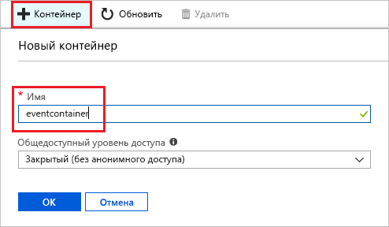

1. Выберите новый контейнер.

   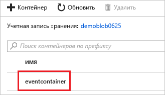

1. Чтобы отправить файл, выберите **Отправить**.

   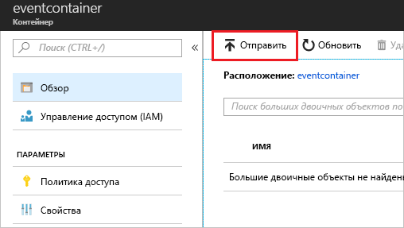

1. Перейдите к тестовому файлу и отправьте его.

1. Вы активировали событие, а служба "Сетка событий" отправила сообщение в конечную точку, настроенную вами при оформлении подписки. Просмотрите веб-приложение. Вы увидите полученное событие создания большого двоичного объекта. 

  ```json
  {
    "topic": "/subscriptions/{subscription-id}/resourceGroups/eventgroup/providers/Microsoft.Storage/storageAccounts/demoblob0625",
    "subject": "/blobServices/default/containers/eventcontainer/blobs/testfile.txt",
    "eventType": "Microsoft.Storage.BlobCreated",
    "eventTime": "2018-06-25T22:50:41.1823131Z",
    "id": "89a2f9da-c01e-00bb-13d6-0c599506e4e3",
    "data": {
      "api": "PutBlockList",
      "clientRequestId": "41341a9b-e977-4a91-9000-c64125039047",
      "requestId": "89a2f9da-c01e-00bb-13d6-0c5995000000",
      "eTag": "0x8D5DAEE13C8F9ED",
      "contentType": "text/plain",
      "contentLength": 4,
      "blobType": "BlockBlob",
      "url": "https://demoblob0625.blob.core.windows.net/eventcontainer/testfile.txt",
      "sequencer": "00000000000000000000000000001C24000000000004712b",
      "storageDiagnostics": {
        "batchId": "ef633252-32fd-464b-8f5a-0d10d68885e6"
      }
    },
    "dataVersion": "",
    "metadataVersion": "1"
  }
  ```

## <a name="clean-up-resources"></a>Очистка ресурсов

Если вы планируете продолжить работу с этим событием, не удаляйте ресурсы, созданные при работе с этой статьей. В противном случае удалите ресурсы, созданные при работе с этой статьей.

Выберите группу ресурсов и щелкните **Удалить группу ресурсов**.

## <a name="next-steps"></a>Дополнительная информация

Теперь, когда вы знаете, как создавать пользовательские раздели и подписки на события, ознакомьтесь с дополнительными сведениями о сетке событий, которые могут помочь вам:

- [An introduction to Azure Event Grid](overview.md) (Общие сведения о службе "Сетка событий Azure")
- [Перенаправление событий хранилища BLOB-объектов в пользовательскую конечную веб-точку (предварительная версия)](../storage/blobs/storage-blob-event-quickstart.md?toc=%2fazure%2fevent-grid%2ftoc.json)
- [Monitor virtual machine changes with Azure Event Grid and Logic Apps](monitor-virtual-machine-changes-event-grid-logic-app.md) (Отслеживание изменений виртуальной машины с помощью Azure Logic Apps и службы "Сетка событий Azure")
- [Потоковая передача больших данных в хранилище данных](event-grid-event-hubs-integration.md)
