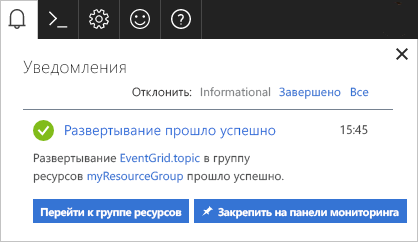
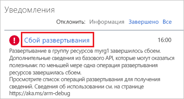
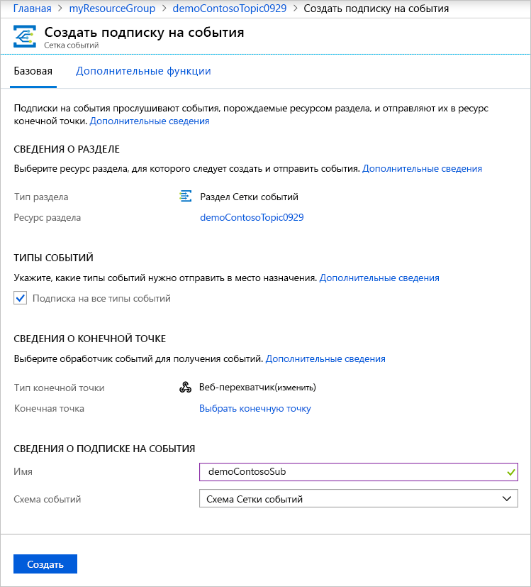

# <a name="create-and-route-custom-events-with-the-azure-portal-and-event-grid"></a>Создание и перенаправление пользовательских событий с помощью портала Azure и службы "Сетка событий"

"Сетка событий Azure" — это служба обработки событий для облака. В этой статье используется портал Azure, чтобы создать пользовательскую тему, подписаться на тему и активировать событие, чтобы увидеть результат. Вы отправите событие функции Azure, которая регистрирует данные событий. По завершении можно увидеть, что данные событий были отправлены в конечную точку и зарегистрированы.

[!INCLUDE [quickstarts-free-trial-note.md](../../includes/quickstarts-free-trial-note.md)]

[!INCLUDE [event-grid-register-provider-portal.md](../../includes/event-grid-register-provider-portal.md)]

## <a name="create-a-custom-topic"></a>Создание пользовательской темы

Раздел сетки событий содержит определяемую пользователем конечную точку, в которой можно размещать свои события. 

1. Войдите на [портал Azure](https://portal.azure.com/).

1. Чтобы создать пользовательский раздел, выберите **Создать ресурс**. 

   

1. Выполните поиск по запросу *Раздел сетки событий* и выберите его из списка результатов.

   

1. Нажмите кнопку **Создать**.

   

1. Укажите уникальное имя для пользовательского раздела. Имя раздела должно быть уникальным, так как оно представлено записью службы доменных имен (DNS). Не используйте имя, указанное на изображении. Вместо этого создайте собственное имя. Выберите один из [поддерживаемых регионов](overview.md). Укажите имя для группы ресурсов. Нажмите кнопку **Создать**.

   

1. После создания пользовательского раздела появится уведомление об успехе.

   

   Если при развертывании возникла ошибка, выясните, что ее вызвало. Выберите **Сбой развертывания**.

   

   Выберите сообщение об ошибке.

   

   На следующем изображение показано развертывание, которое завершилось ошибкой, так как имя пользовательского раздела уже используется. Увидев эту ошибку, повторите развертывание с другим именем.

   

## <a name="create-an-azure-function"></a>Создание функции Azure

Перед подпиской на раздел необходимо создать конечную точку для сообщения о событии. В этой статье для создания приложения-функции для конечной точки мы используем решение "Функции Azure".

1. Чтобы создать функцию, выберите **Создать ресурс**.

   

1. Выберите **Вычисления** и **Приложение-функция**.

   

1. Укажите уникальное имя функции Azure. Не используйте имя, указанное на изображении. Выберите группу ресурсов, созданную в этой статье. Для плана размещения используйте **План потребления**. Используйте предложенную новую учетную запись хранения. Application Insights можно отключить. После предоставления значений нажмите кнопку **Создать**.

   

1. После завершения развертывания выберите **Перейти к ресурсу**.

   

1. Рядом с пунктом **Функции** выберите **+**.

   

1. Выберите **Пользовательская функция** из доступных вариантов.

   

1. Прокрутите вниз, пока не найдете пункт **Триггер сетки событий**. Выберите **C#**.

   

1. Примите значения по умолчанию и нажмите кнопку **Создать**.

   

Теперь функция готова к получению событий.

## <a name="subscribe-to-a-topic"></a>Оформление подписки на тему

Подпишитесь на раздел, чтобы определить в сетке событий Azure, какие из них необходимо отслеживать и куда их отправлять.

1. В функции Azure выберите **Добавить подписку сетки событий**.

   

1. Укажите значения для подписки. Выберите **Разделы сетки событий** в качестве типа раздела. Для подписки и группы ресурсов выберите подписку и группу ресурсов, в которых был создан пользовательский раздел. Для экземпляра выберите свое имя пользовательского раздела. Конечная точка подписчика предварительно заполняется URL-адресом для функции.

   

1. Прежде чем активировать событие, откройте журналы для функции, чтобы увидеть данные события при отправке. В нижней части функции Azure выберите **Журналы**.

   

Теперь необходимо активировать событие, чтобы увидеть, как Сетка событий Azure распределяет сообщение к вашей конечной точке. Для упрощения этой статьи используйте Cloud Shell для отправки примера данных событий в пользовательский раздел. Как правило, приложение или служба Azure отправит данные события.

[!INCLUDE [cloud-shell-try-it.md](../../includes/cloud-shell-try-it.md)]

## <a name="send-an-event-to-your-topic"></a>Отправка события в тему

Отправьте тестовое событие в пользовательский раздел с помощью PowerShell или Azure CLI.

В первом примере используется Azure CLI. Он возвращает URL-адрес, ключ раздела и пример данных события. Используйте имя раздела для `<topic_name>`. Чтобы просмотреть полное событие, используйте `echo "$body"`. Элемент `data` JSON отображает полезные данные события. Любое значение JSON с правильным форматом может быть в этом поле. Кроме того, можно использовать поле темы для дополнительной маршрутизации и фильтрации. CURL — это служебная программа, которая отправляет HTTP-запросы.

```azurecli-interactive
endpoint=$(az eventgrid topic show --name <topic_name> -g myResourceGroup --query "endpoint" --output tsv)
key=$(az eventgrid topic key list --name <topic_name> -g myResourceGroup --query "key1" --output tsv)

body=$(eval echo "'$(curl https://raw.githubusercontent.com/Azure/azure-docs-json-samples/master/event-grid/customevent.json)'")

curl -X POST -H "aeg-sas-key: $key" -d "$body" $endpoint
```

Во втором примере для выполнения аналогичных действий используется PowerShell.

```azurepowershell-interactive
$endpoint = (Get-AzureRmEventGridTopic -ResourceGroupName gridResourceGroup -Name <topic-name>).Endpoint
$keys = Get-AzureRmEventGridTopicKey -ResourceGroupName gridResourceGroup -Name <topic-name>

$eventID = Get-Random 99999

#Date format should be SortableDateTimePattern (ISO 8601)
$eventDate = Get-Date -Format s

#Construct body using Hashtable
$htbody = @{
    id= $eventID
    eventType="recordInserted"
    subject="myapp/vehicles/motorcycles"
    eventTime= $eventDate   
    data= @{
        make="Ducati"
        model="Monster"
    }
    dataVersion="1.0"
}

#Use ConvertTo-Json to convert event body from Hashtable to JSON Object
#Append square brackets to the converted JSON payload since they are expected in the event's JSON payload syntax
$body = "["+(ConvertTo-Json $htbody)+"]"

Invoke-WebRequest -Uri $endpoint -Method POST -Body $body -Headers @{"aeg-sas-key" = $keys.Key1}
```

Вы активировали событие, а служба "Сетка событий" отправила сообщение в конечную точку, настроенную вами при оформлении подписки. Чтобы увидеть данные события, просмотрите журналы.


## <a name="clean-up-resources"></a>Очистка ресурсов

Если вы планируете продолжить работу с этим событием, не удаляйте ресурсы, созданные при работе с этой статьей. В противном случае удалите ресурсы, созданные при работе с этой статьей.

Выберите группу ресурсов и щелкните **Удалить группу ресурсов**.

## <a name="next-steps"></a>Дополнительная информация

Теперь, когда вы знаете, как создавать пользовательские раздели и подписки на события, ознакомьтесь с дополнительными сведениями о сетке событий, которые могут помочь вам:

- [An introduction to Azure Event Grid](overview.md) (Общие сведения о службе "Сетка событий Azure")
- [Перенаправление событий хранилища BLOB-объектов в пользовательскую конечную веб-точку (предварительная версия)](../storage/blobs/storage-blob-event-quickstart.md?toc=%2fazure%2fevent-grid%2ftoc.json)
- [Monitor virtual machine changes with Azure Event Grid and Logic Apps](monitor-virtual-machine-changes-event-grid-logic-app.md) (Отслеживание изменений виртуальной машины с помощью Azure Logic Apps и службы "Сетка событий Azure")
- [Потоковая передача больших данных в хранилище данных](event-grid-event-hubs-integration.md)
