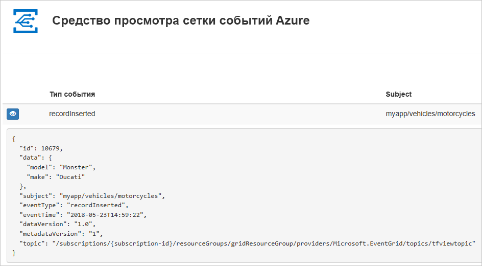
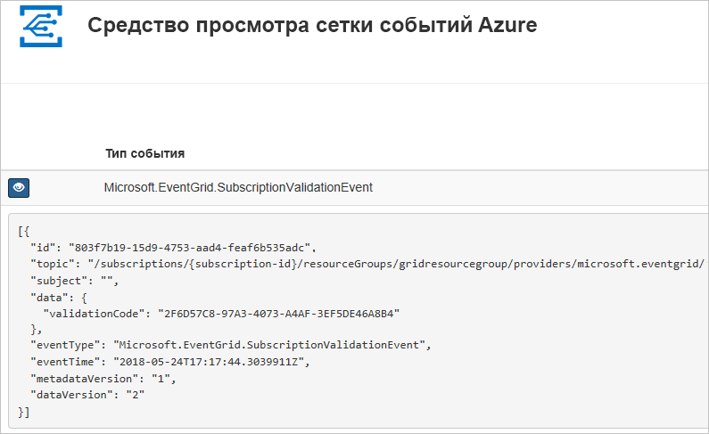

# <a name="create-and-route-custom-events-with-azure-powershell-and-event-grid"></a>Создание и перенаправление пользовательских событий с помощью службы Azure PowerShell и "Сетка событий"

"Сетка событий Azure" — это служба обработки событий для облака. В этой статье используется Azure PowerShell, чтобы создать пользовательскую тему, подписаться на тему и активировать событие, чтобы увидеть результат. Как правило, события отправляются на конечную точку, которая обрабатывает данные событий и выполняет соответствующие действия. Но в этой статье для простоты события отправляются в веб-приложение, которое собирает и отображает сообщения.

По завершении можно увидеть, что данные событий отправлены в веб-приложение.



[!INCLUDE [quickstarts-free-trial-note.md](../../includes/quickstarts-free-trial-note.md)]

В этой статье требуется последняя версия Azure PowerShell. Если вам необходимо выполнить установку или обновление, см. статью [об установке модуля Azure PowerShell](/powershell/azure/install-azurerm-ps).

## <a name="create-a-resource-group"></a>Создание группы ресурсов

Темами событий сетки являются ресурсы Azure, которые необходимо поместить в группу ресурсов Azure. Группа ресурсов Azure — это логическая коллекция, в которой выполняется развертывание и администрирование ресурсов Azure.

Создайте группу ресурсов с помощью команды [New-AzureRmResourceGroup](/powershell/module/azurerm.resources/new-azurermresourcegroup).

В следующем примере создается группа ресурсов с именем *gridResourceGroup* в расположении *westus2*.

```powershell-interactive
New-AzureRmResourceGroup -Name gridResourceGroup -Location westus2
```

[!INCLUDE [event-grid-register-provider-powershell.md](../../includes/event-grid-register-provider-powershell.md)]

## <a name="create-a-custom-topic"></a>Создание пользовательской темы

Раздел сетки событий содержит определяемую пользователем конечную точку, в которой можно размещать свои события. В приведенном ниже примере создается пользовательский раздел в вашей группе ресурсов. Замените `<your-topic-name>` уникальным именем для вашей темы. Имя раздела должно быть уникальным, так как оно включается в запись DNS.

```powershell-interactive
$topicname="<your-topic-name>"

New-AzureRmEventGridTopic -ResourceGroupName gridResourceGroup -Location westus2 -Name $topicname
```

## <a name="create-a-message-endpoint"></a>Создание конечной точки сообщения

Перед подпиской на раздел необходимо создать конечную точку для сообщения о событии. Обычно конечная точка выполняет действия на основе данных событий. Чтобы упростить работу с этим руководством, разверните [готовое веб-приложение](https://github.com/dbarkol/azure-event-grid-viewer), которое отображает сообщения о событиях. Развернутое решение содержит план службы приложений, веб-приложение службы приложений и исходный код из GitHub.

Замените `<your-site-name>` уникальным именем для вашего веб-приложения. Имя веб-приложения должно быть уникальным, так как оно включается в запись DNS.

```powershell-interactive
$sitename="<your-site-name>"

New-AzureRmResourceGroupDeployment `
  -ResourceGroupName gridResourceGroup `
  -TemplateUri "https://raw.githubusercontent.com/dbarkol/azure-event-grid-viewer/master/azuredeploy.json" `
  -siteName $sitename `
  -hostingPlanName viewerhost
```

Завершение развертывания может занять несколько минут. Когда развертывание успешно завершится, откройте веб-приложение и убедитесь, что оно работает. Откройте браузер и перейдите по адресу `https://<your-site-name>.azurewebsites.net`.

Вы увидите сайт, на котором сейчас не отображаются никакие сообщения.

## <a name="subscribe-to-a-topic"></a>Оформление подписки на тему

Подписка на раздел предоставляет Сетке событий Azure информацию о том, какие события вы намерены отслеживать и куда их следует отправлять. В следующем примере создается подписка на созданный раздел и передается URL-адрес веб-приложения в качестве конечной точки для уведомления о событиях.

Конечная точка веб-приложения должна содержать суффикс `/api/updates/`.

```powershell-interactive
$endpoint="https://$sitename.azurewebsites.net/api/updates"

New-AzureRmEventGridSubscription `
  -EventSubscriptionName demoViewerSub `
  -Endpoint $endpoint `
  -ResourceGroupName gridResourceGroup `
  -TopicName $topicname
```

Теперь снова откройте веб-приложение и убедитесь, что оно успешно получило отправленное событие подтверждения подписки. Щелкните значок с изображением глаза, чтобы развернуть данные события. Сетка событий отправляет событие подтверждения, чтобы конечная точка могла подтвердить, что она готова получать данные события. Веб-приложение содержит код для проверки подписки.



## <a name="send-an-event-to-your-topic"></a>Отправка события в тему

Давайте активируем событие, чтобы увидеть, как сообщение отправляется в конечную точку при помощи службы "Сетка событий". Сначала получите URL-адрес и ключ для темы.

```powershell-interactive
$endpoint = (Get-AzureRmEventGridTopic -ResourceGroupName gridResourceGroup -Name $topicname).Endpoint
$keys = Get-AzureRmEventGridTopicKey -ResourceGroupName gridResourceGroup -Name $topicname
```

Для упрощения мы настроим пример данных событий для отправки в пользовательский раздел. Как правило, приложение или служба Azure отправит данные события. В следующем примере используется хэш-таблица для создания данных событий `htbody` с последующим преобразованием в объект полезных данных JSON с правильным форматом`$body`:

```powershell-interactive
$eventID = Get-Random 99999

#Date format should be SortableDateTimePattern (ISO 8601)
$eventDate = Get-Date -Format s

#Construct body using Hashtable
$htbody = @{
    id= $eventID
    eventType="recordInserted"
    subject="myapp/vehicles/motorcycles"
    eventTime= $eventDate   
    data= @{
        make="Ducati"
        model="Monster"
    }
    dataVersion="1.0"
}

#Use ConvertTo-Json to convert event body from Hashtable to JSON Object
#Append square brackets to the converted JSON payload since they are expected in the event's JSON payload syntax
$body = "["+(ConvertTo-Json $htbody)+"]"
```

При просмотре `$body` вы увидите событие полностью. Элемент `data` JSON отображает полезные данные события. Любое значение JSON с правильным форматом может быть в этом поле. Кроме того, можно использовать поле темы для дополнительной маршрутизации и фильтрации.

Теперь отправьте событие в раздел.

```powershell-interactive
Invoke-WebRequest -Uri $endpoint -Method POST -Body $body -Headers @{"aeg-sas-key" = $keys.Key1}
```

Вы активировали событие, а служба "Сетка событий" отправила сообщение в конечную точку, настроенную вами при оформлении подписки. Откройте веб-приложение и просмотрите в нем отправленные события.

```json
[{
  "id": "1807",
  "eventType": "recordInserted",
  "subject": "myapp/vehicles/motorcycles",
  "eventTime": "2018-01-25T15:58:13",
  "data": {
    "make": "Ducati",
    "model": "Monster"
  },
  "dataVersion": "1.0",
  "metadataVersion": "1",
  "topic": "/subscriptions/{subscription-id}/resourceGroups/{resource-group}/providers/Microsoft.EventGrid/topics/{topic}"
}]
```

## <a name="clean-up-resources"></a>Очистка ресурсов

Если вы планируете продолжить работу с этим событием или с приложением для просмотра событий, не удаляйте ресурсы, созданные при работе с этой статьей. В противном случае удалите соответствующие ресурсы с помощью следующей команды.

```powershell
Remove-AzureRmResourceGroup -Name gridResourceGroup
```

## <a name="next-steps"></a>Дополнительная информация

Теперь, когда вы знаете, как создавать темы и подписки на события, ознакомьтесь с дополнительными сведениями о сетке событий, которые могут помочь вам:

- [An introduction to Azure Event Grid](overview.md) (Общие сведения о службе "Сетка событий Azure")
- [Перенаправление событий хранилища BLOB-объектов в пользовательскую конечную веб-точку (предварительная версия)](../storage/blobs/storage-blob-event-quickstart.md?toc=%2fazure%2fevent-grid%2ftoc.json)
- [Monitor virtual machine changes with Azure Event Grid and Logic Apps](monitor-virtual-machine-changes-event-grid-logic-app.md) (Отслеживание изменений виртуальной машины с помощью Azure Logic Apps и службы "Сетка событий Azure")
- [Потоковая передача больших данных в хранилище данных](event-grid-event-hubs-integration.md)
