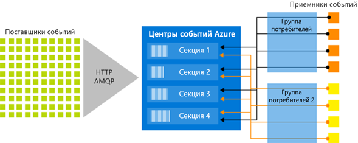

# Что такое Центры событий Azure?

Центры событий Azure — это платформа потоковой передачи больших данных и служба приема событий, принимающая и обрабатывающая миллионы событий в секунду. Центры событий могут обрабатывать и сохранять события, данные и телеметрию, созданные распределенным программным обеспечением и устройствами. Данные, отправляемые в концентратор событий, можно преобразовывать и сохранять с помощью любого поставщика аналитики в реальном времени, а также с помощью адаптеров пакетной обработки или хранения. 

Центры событий используются в нескольких распространенных сценариях:

- Обнаружение аномалий (мошенничество/выбросы)
- Ведение журнала приложения
- Конвейеры аналитики, например сведения о посещениях
- Динамические панели мониторинга
- Архивация данных
- Обработка транзакций
- Обработка пользовательских телеметрических данных
- Потоковая передача данных телеметрии устройств 

## Каковы преимущества Центров событий?

Данные имеют практическую ценность только в том случае, если существует возможность быстро обрабатывать их и своевременно получать аналитические сведения на основе источников данных. Служба "Центры событий" предоставляет платформу распределенной потоковой обработки, которая обеспечивает низкую задержку и эффективную интеграцию со службами обработки данных и аналитики на платформе Azure и вне ее, что позволяет реализовать полнофункциональный конвейер для работы с большими данными.

Центры событий в архитектуре решения — это аналог парадного входа для конвейера событий. Иными словами, это *приемник событий*. Приемник событий — это компонент или служба, располагающиеся между источниками событий и адресатами событий и отделяющие создание потока событий от использования этих событий. Центры событий предоставляют унифицированную платформу потоковой передачи с буфером хранения времени, что позволяет отделить поставщиков событий от их получателей. 

В следующих разделах описаны основные возможности службы "Центры событий Azure". 

## Полностью управляемая архитектура PaaS 

Центры событий — это управляемая служба, не требующая значительных затрат усилий на конфигурацию и управление, что позволяет вам сосредоточиться на работе со своими решениями для бизнеса. [Центры событий для экосистем Apache Kafka](event-hubs-for-kafka-ecosystem-overview.md) позволяют использовать возможности архитектуры PaaS Kafka, не тратя время и силы на настройку, эксплуатацию кластеров и управление ими.

## Поддержка обработки в режиме реального времени и пакетной обработки

Возможность приема, буферизации, сохранения и обработки потоковых данных в реальном времени для получения ценной практической информации. В Центрах событий используется [секционированная модель потребителей](event-hubs-features.md#partitions), благодаря чему поток может обрабатываться одновременно несколькими приложениями с устанавливаемой вами скоростью.

[Запись](event-hubs-capture-overview.md) данных в близком к реальному времени режиме в [хранилище BLOB-объектов Azure](https://azure.microsoft.com/services/storage/blobs/) или [Azure Data Lake Store](https://azure.microsoft.com/services/data-lake-store/)  для долгосрочного хранения или микропакетной обработки. Это может выполняться в том же потоке, который используется для получения аналитических данных в реальном времени. Настройка функции "Сбор" выполняется быстро, ее использование не влечет дополнительных административных расходов, а масштабирование осуществляется автоматически на основе  [единиц пропускной способности](event-hubs-features.md#throughput-units) Центров событий. Функция "Сбор" в Центрах событий позволяет вам сосредоточиться на обработке данных, а не на их сборе.

Центры событий Azure также интегрированы с [функциями Azure](/azure/azure-functions/), образуя бессерверную архитектуру.

## масштабируемость, 

Вы можете начать работу с Центрами событий с потоков размером в несколько мегабайт и при необходимости увеличить их объем до нескольких гигабайт или терабайт. [Функция автоматического расширения](event-hubs-auto-inflate.md) является одним из множества доступных способов масштабирования количества единиц пропускной способности в соответствии с вашими требованиями. 

## Обширная экосистема

[Центры событий для экосистем Apache Kafka](event-hubs-for-kafka-ecosystem-overview.md) позволяют клиентам и приложениям [Apache Kafka (версии 1.0 и более поздних)](https://kafka.apache.org/) работать со службой "Центры событий", не тратя время и силы на управление кластерами.
 
Благодаря широкому спектру поддерживаемых экосистем [на различных языках (.NET, Java, Python, Go, Node.js)](https://github.com/Azure/azure-event-hubs) вы сможете с легкостью приступить к обработке потоков из Центров событий. Все поддерживаемые языки клиентов реализуют низкоуровневую интеграцию. Экосистема также обеспечивает тесную интеграцию со службами Azure, такими как Stream Analytics и Функции Azure, что позволяет создавать бессерверную архитектуру.

## Основные компоненты архитектуры

Центры событий позволяют обрабатывать потоки сообщений. По своим характеристикам они отличаются от традиционных корпоративных служб обмена сообщениями. Центры событий разработаны с учетом высокой пропускной способности и сценариев обработки событий. Центры событий содержат следующие [основные компоненты](event-hubs-features.md):

- **Производители событий** — это любые сущности, которые отправляют данные в концентратор событий. Издатели событий могут публиковать события с помощью HTTPS, AMQP 1.0 или Apache Kafka (версия 1.0 и более поздние).
- **Разделы** — каждый потребитель считывает только определенный раздел (подмножество) потока сообщений.
- **Группа потребителей** — это представление всего концентратора событий (состояние, позиция или смещение). Группы потребителей обеспечивают каждому из нескольких потребляющих приложений отдельное представление потока событий, а также возможность считывания потока независимо друг от друга в своем темпе и с собственными смещениями.
- **Единицы пропускной способности** — заранее приобретаемые единицы, определяющие пропускную способность Центров событий.
- **Приемники событий** — любые сущности, считывающие данные из концентратора событий. Все потребители Центров событий подключаются через сеанс AMQP 1.0, в рамках которого события доставляются, как только становятся доступными. Все объекты-получатели Kafka подключаются через протокол Kafka 1.0 и более поздней версии.

На следующем рисунке показана архитектура обработки потока Центров событий.

## Дополнительная информация

Чтобы начать работу с Центрами событий, обратитесь к следующим статьям:

1. **Создание концентратора событий**: [портал Azure](event-hubs-create.md), [Azure CLI](event-hubs-quickstart-cli.md), [Azure PowerShell](event-hubs-quickstart-powershell.md), [шаблон Azure Resource Manager](event-hubs-resource-manager-namespace-event-hub.md)
2. **Отправка событий в концентратор**: [.NET Standard](event-hubs-dotnet-standard-getstarted-send.md), [.NET Framework](event-hubs-dotnet-framework-getstarted-send.md), [Java](event-hubs-java-get-started-send.md), [Python](event-hubs-python-get-started-send.md), [Node.js](event-hubs-node-get-started-send.md), [Go](event-hubs-go-get-started-send.md), [C](event-hubs-c-getstarted-send.md)
3. **Получение событий из концентратора**: [Основные сведения о получении сообщений с помощью узла EventProcessorHost в .NET Standard](event-hubs-dotnet-standard-getstarted-receive-eph.md), [Получение событий от Центров событий Azure с помощью платформы .NET Framework](event-hubs-dotnet-framework-getstarted-receive-eph.md), [Получение событий от Центров событий Azure с помощью Java](event-hubs-java-get-started-receive-eph.md), [Получение событий из концентраторов событий с помощью Python](event-hubs-python-get-started-receive.md), [Получение событий от Центров событий Azure с помощью Node.js](event-hubs-node-get-started-receive.md), [Получение событий из концентраторов событий с помощью Go](event-hubs-go-get-started-receive-eph.md), [Получение событий из Центров событий с помощью Apache Storm](event-hubs-storm-getstarted-receive.md)   

Чтобы узнать больше о Центрах событий, обратитесь к следующим статьям:

- [Обзор функций Центров событий](event-hubs-features.md)
- [Часто задаваемые вопросы](event-hubs-faq.md).

