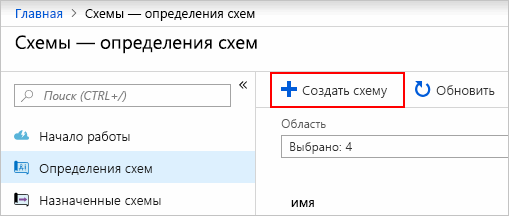
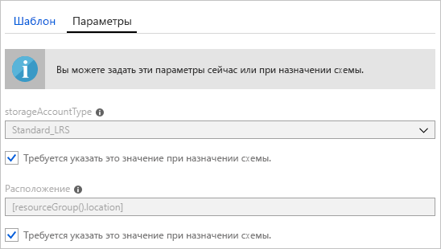
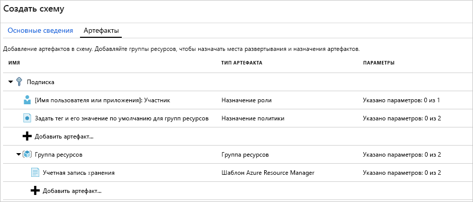
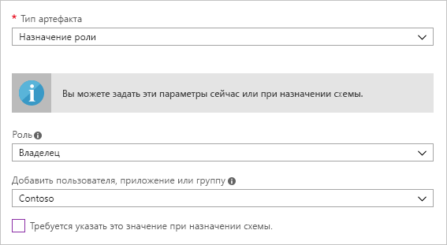
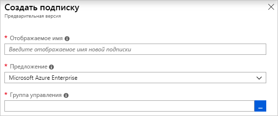
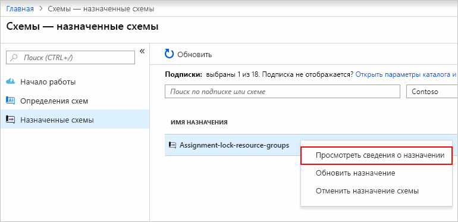

# <a name="define-and-assign-an-azure-blueprint-in-the-portal"></a>Определение и назначение схемы Azure на портале

Зная, как создавать и присваивать схемы, вы сможете определять распространенные шаблоны для разработки многоразовых и быстро развертываемых конфигураций, основанных на шаблонах Resource Manager, политике, правилах безопасности и других элементах. В этом руководстве вы научитесь использовать службу Azure Blueprint для выполнения некоторых общих задач, связанных с созданием, публикацией и назначением схемы в вашей организации, таких как:

> [!div class="checklist"]
> - создание схемы и добавление различных поддерживаемых артефактов;
> - внесение изменений в существующую схему на стадии **черновика**;
> - обозначение схемы как готовой к назначению с помощью **публикации**;
> - назначение схемы существующей подписке;
> - проверка состояния и хода выполнения назначенной схемы;
> - удаление схемы, назначенной подписке.

Если у вас еще нет подписки Azure, [создайте бесплатную учетную запись Azure](https://azure.microsoft.com/free), прежде чем начинать работу.

## <a name="create-a-blueprint"></a>Создание схемы

Первым этапом при определении стандартной модели соответствия требованиям является формирование схемы на основе доступных ресурсов. В этом примере вы создадите схему с именем MyBlueprint с целью настройки назначений ролей и политик для подписки, добавите группу ресурсов, а затем создадите для нее шаблон Resource Manager и назначение ролей в новой группе ресурсов.

1. Выберите **Все службы** в левой области. Найдите и выберите пункт **Схемы**.

1. Выберите **Определения схем** на странице слева и щелкните кнопку **+Создать схему** в верхней части страницы.

   - Либо нажмите кнопку **Создать** на странице **Приступая к работе**, чтобы перейти непосредственно к созданию схемы.

   

1. Укажите **имя схемы**, например MyBlueprint (буквы и цифры — до 48 знаков, но без пробелов и специальных символов) для проекта, но не заполняйте **описание схемы**. В поле **Расположение определения** нажмите кнопку с многоточием справа, выберите [группу управления](../management-groups/overview.md) или подписку, в которой вы хотите сохранить схему, и нажмите кнопку **Выбрать**.

1. Убедитесь, что информация правильная (значения в полях **Имя схемы** и **Расположение определения** нельзя будет изменить позже) и нажмите кнопку **Далее: артефакты** в нижней части страницы или вкладку **Артефакты** в верхней части страницы.

1. Добавьте назначение ролей в подписку. Щелкните левой кнопкой мыши строку **+ Добавить артефакт...** в группе **Подписки**, и в правой части браузера откроется окно "Добавление артефактов". Выберите "Назначение ролей" в качестве _типа артефакта_. В разделе _Роли_ выберите "Участник" и оставьте в поле _Добавить пользователя, приложение или группу_ флажок, означающий **динамический параметр**. Нажмите кнопку **Добавить**, чтобы добавить артефакт в схему.

   

   > [!NOTE]
   > Большинство _артефактов_ поддерживают параметры. Параметр, которому присвоено значение во время создания схемы, является **статическим параметром**. Если параметр назначается во время назначения схемы, это **динамический параметр**. Дополнительные сведения см. в описании [параметров схемы](./concepts/parameters.md).

1. Добавьте назначение политики в подписку. Щелкните левой кнопкой мыши **+Добавить артефакт** под артефактом назначения ролей. Выберите "Назначение политик" в качестве _типа артефакта_. Измените _тип_ на "Встроенные" и в поле _Поиск_ введите "tag". Выйдите из поля _Поиск_, чтобы была выполнена фильтрация. Выберите поле "Применить тег и его значение по умолчанию группам ресурсов", щелкнув по нему. Нажмите кнопку **Добавить**, чтобы добавить артефакт в схему.

1. Щелкните строку назначения политики "Применить тег и его значение по умолчанию группам ресурсов". Откроется окно, где можно задать параметры артефакта как часть определения схемы. В нем можно задать параметры для всех назначений (**статические параметры**), основанные на этой схеме, а не во время назначения (**динамические параметры**). В этом примере используются **динамические параметры** во время назначения схемы, поэтому оставьте значения по умолчанию и нажмите кнопку **Отменить**.

1. Добавьте группу ресурсов в подписку. Щелкните левой кнопкой мыши строку **+ Добавить артефакт...** под разделом **Подписка**. Выберите "Группа ресурсов" в качестве _типа артефакта_. Оставьте поля _Отображаемое имя артефакта_, _Имя группы ресурсов_ и _Расположение_ пустыми, но убедитесь, что для каждого свойства параметра установлен флажок, позволяющий сделать их **динамическими**. Нажмите кнопку **Добавить**, чтобы добавить артефакт в схему.

1. Добавьте шаблон в группу ресурсов. Щелкните левой кнопкой мыши строку **+ Добавить артефакт...** под записью **ResourceGroup**. Выберите "Шаблон Azure Resource Manager" для _Типа артефакта_, задайте _Отображаемое имя артефакта_ как "Учетная запись хранения" и оставьте _Описание_ пустым. На вкладке **Шаблон** в окне редактора вставьте следующий шаблон Resource Manager. Вставив шаблон, выберите вкладку **Параметры** и убедитесь, что параметры шаблона **storageAccountType** и **Расположение** были обнаружены. Каждый параметр обнаруживается и заполняется автоматически, но настраивается как **динамический**. Снимите флажок **storageAccountType** и обратите внимание на то, что раскрывающийся список содержит только значения, включенные в шаблон Resource Manager в разделе **allowedValues**. Установите флажок, чтобы вернуть **динамический параметр**. Нажмите кнопку **Добавить**, чтобы добавить артефакт в схему.

   > [!IMPORTANT]
   > При импорте шаблона убедитесь, что файл формата JSON и не содержит HTML. При ссылке на URL-адрес на сайте GitHub убедитесь, что выбрана **RAW** для получения чистых JSON-файлов, а не HTML-оболочка для отображения на сайте GitHub. Если импортированный файл не формата JSON, произойдет ошибка.

   ```json
   {
       "$schema": "https://schema.management.azure.com/schemas/2015-01-01/deploymentTemplate.json#",
       "contentVersion": "1.0.0.0",
       "parameters": {
           "storageAccountType": {
               "type": "string",
               "defaultValue": "Standard_LRS",
               "allowedValues": [
                   "Standard_LRS",
                   "Standard_GRS",
                   "Standard_ZRS",
                   "Premium_LRS"
               ],
               "metadata": {
                   "description": "Storage Account type"
               }
           },
           "location": {
               "type": "string",
               "defaultValue": "[resourceGroups('ResourceGroup').location]",
               "metadata": {
                   "description": "Location for all resources."
               }
           }
       },
       "variables": {
           "storageAccountName": "[concat('store', uniquestring(resourceGroup().id))]"
       },
       "resources": [{
           "type": "Microsoft.Storage/storageAccounts",
           "name": "[variables('storageAccountName')]",
           "location": "[parameters('location')]",
           "apiVersion": "2018-07-01",
           "sku": {
               "name": "[parameters('storageAccountType')]"
           },
           "kind": "StorageV2",
           "properties": {}
       }],
       "outputs": {
           "storageAccountName": {
               "type": "string",
               "value": "[variables('storageAccountName')]"
           }
       }
   }
   ```

   

1. Завершенная схема должны выглядеть следующим образом. Обратите внимание, что у каждого артефакта указано, что "заполнено _x_ параметров из _y_" в столбце _Параметры_. **Динамические параметры** устанавливаются при каждом назначении схемы.

   

1. Теперь, когда были добавлены все планируемые артефакты, нажмите кнопку **Сохранить черновик** в нижней части страницы.

## <a name="edit-a-blueprint"></a>Редактирование схемы

В окне [Создании схемы](#create-a-blueprint) не было указано описание, и назначение ролей не было добавлено в новую группу ресурсов. Это можно исправить, выполнив следующие действия:

1. Выберите **Определения схем** на странице слева.

1. В списке схем щелкните правой кнопкой мыши созданную ранее схему и выберите **Изменить схему**.

1. В поле **Описание схемы** укажите требуемые сведения о схеме и входящих в нее артефактах. В этом случае введите нечто вроде: "Эта схема задает политику использования тегов и назначение ролей при подписке, создает группу ресурсов и развертывает шаблон ресурсов и назначение ролей этой группе ресурсов."

1. Щелкните **Далее: артефакты** в нижней части страницы или вкладку **Артефакты** в верхней части страницы.

1. Добавьте назначение ролей в группу ресурсов. Щелкните левой кнопкой мыши строку **+ Добавить артефакт...** непосредственно под записью **ResourceGroup**. Выберите "Назначение ролей" в качестве _типа артефакта_. В разделе _Роль_ выберите "Владелец", снимите флажок для поля _Добавить пользователя, приложения или группу_, а затем найдите и выберите пользователя, приложение или группу для добавления. Этот артефакт использует **статический параметр**, который не меняется в каждом назначении этой схемы. Нажмите кнопку **Добавить**, чтобы добавить артефакт в схему.

   

1. Завершенная схема должны выглядеть следующим образом. Обратите внимание, что добавленное назначение ролей показывает **заполнено 1 из 1 параметров**, что значит, что это **статический параметр**.

   

1. Нажмите кнопку **Сохранить черновик** после обновления.

## <a name="publish-a-blueprint"></a>Публикация схемы

Теперь, когда артефакты добавлены в схему, пора ее опубликовать.
Публикация схемы позволяет назначать ее подписке.

1. Выберите **Определения схем** на странице слева.

1. В списке схем выберите созданную вами ранее схему и щелкните **Опубликовать схему**.

1. В открывшемся диалоговом окне укажите **версию** (буквы, цифры и дефисы с максимальной длиной 20 символов), например "v1", и **измените заметку** (необязательно), например "Первая публикация".

1. Щелкните **Публиковать** в нижней части страницы.

## <a name="assign-a-blueprint"></a>Назначение схемы

После публикации схемы ее можно назначить подписке. Назначьте созданную схему одной из подписок в иерархии группы управления. Если схема сохранена в подписке, схему можно будет назначить только этой подписке.

1. Выберите **Определения схем** на странице слева.

1. В списке схем щелкните правой кнопкой мыши созданную ранее схему или щелкните левой кнопкой мыши многоточие и выберите **Опубликовать схему**.

1. На странице **Назначение схемы** в раскрывающемся списке **Подписки** выберите подписки, в которые необходимо развернуть эту схему.

   - Если есть доступные и поддерживаемые предложения Enterprise в разделе [Выставление счетов Azure](../../billing/index.md), ссылка **Создать новую** под полем **Подписки** активируется.

     1. Чтобы создать новую подписку, а не выбирать существующую, щелкните ссылку **Создать новую**.

        

     1. Введите **отображаемое имя** новой подписки.

     1. В раскрывающемся списке выберите доступное **предложение**.

     1. Используйте кнопку с многоточием, чтобы выбрать [группу управления](../management-groups/index.md), для которой подписка будет дочерним элементом.

     1. В нижней части страницы выберите **Создать**.

     > [!IMPORTANT]
     > Новая подписка создается после нажатия кнопки **Создать**.

   > [!NOTE]
   > Назначения будут создаваться для каждой выбранной подписки, позволяя изменять назначения одной подписки в будущем без необходимости вносить изменения во все выбранные подписки.

1. В поле **Имя назначения** укажите уникальное имя этого назначения.

1. В поле **Расположение** выберите регион для управляемого удостоверения и объекта развертывания подписки, в котором необходимо создать назначение. Azure Blueprint использует это управляемое удостоверение для развертывания всех артефактов в назначенную схему. Дополнительные сведения см. в статье [Управляемые удостоверения для ресурсов Azure](../../active-directory/managed-identities-azure-resources/overview.md).

1. Установите раскрывающийся список **Версия определения схемы** версий **Опубликовано** на запись "v1" (по умолчанию как последняя **опубликованная** версия).

1. Для **назначения блокировки** оставьте значение по умолчанию **Не блокировать**. Дополнительные сведения см. в разделе [Блокировка ресурсов схем](./concepts/resource-locking.md).

   

1. В разделе **Управляемое удостоверение** оставьте значение по умолчанию **Назначено системой**.

1. Для назначения роли на уровне подписки **[имя пользователя, группы или приложения]: участник** найдите и выберите пользователя, приложение или группу.

1. Для назначения политик на уровне подписки задайте **Имя тега** как "CostCenter" и **значение тега** как "ContosoIT".

1. В "ResourceGroup" укажите **имя** как "Учетная запись хранения" и **Расположение** как "Восточная часть США 2" из раскрывающегося списка.

   > [!NOTE]
   > Каждый артефакт, который был добавлен в группе ресурсов во время определения схемы, отображается с отступом в соответствии с группой ресурсов или объектом, в который он развертывается. Для артефактов, которые не принимают или не имеют параметров для определения во время назначения, перечисляются только контекстные сведения.

1. В шаблоне Azure Resource Manager "Учетная запись хранения" выберите "Standard_GRS" для параметра **storageAccountType**.

1. Прочтите поле сведений в нижней части страницы и нажмите кнопку **Назначить**.

## <a name="track-deployment-of-a-blueprint"></a>Отследить развертывание схемы

Когда схема была назначена одной или нескольким подпискам, происходит следующее:

- схема добавляется на страницу **Назначенные схемы** к подписке, которой она назначена;
- начинается процесс развертывания всех артефактов, определенных в проекте.

Теперь, когда схема была назначена подписке, проверьте ход выполнения развертывания.

1. Выберите **Назначенные схемы** на странице слева.

1. В списке схем щелкните правой кнопкой мыши созданную вами ранее схему и выберите **Просмотреть информацию о схеме**.

   

1. На странице **Назначение схемы** убедитесь, что все артефакты были успешно развернуты и во время развертывания не произошло ошибок. Если возникли ошибки, перейдите к статье [Устранение неполадок с помощью службы Azure Blueprint](./troubleshoot/general.md), чтобы узнать, как определить проблему.

## <a name="unassign-a-blueprint"></a>Отмена назначения схемы

Удалите назначение схемы из подписки, если оно вам больше не нужно. Схема могла быть заменена на более новую с обновленными шаблонами, политиками и схемами. При удалении схемы назначенные артефакты оставляются. Чтобы удалить назначение схемы, выполните следующие действия:

1. Выберите **Назначенные схемы** на странице слева.

1. В списке схем выберите схему, назначение которой необходимо отменить, и нажмите кнопку **Отменить назначение схемы** в верхней части страницы.

1. В сообщении с подтверждением нажмите кнопку **ОК**.

## <a name="delete-a-blueprint"></a>Удаление схемы

1. Выберите **Определения схем** на странице слева.

1. Щелкните правой кнопкой мыши схему, которую необходимо удалить, и выберите **Удалить схему**, а затем нажмите кнопку **Да** в диалоговом окне для подтверждения.

> [!NOTE]
> Удаление схемы этим способом приводит к удалению всех **опубликованных версий** выбранной схемы. Чтобы удалить одну версию, откройте схему, щелкните на вкладке **Опубликованные версии**, выберите и щелкните версию, которую требуется удалить, а затем нажмите кнопку **Удалить эту версию**. Схему с назначениями нельзя удалить до тех пор, пока не удалены все назначения схемы.

## <a name="next-steps"></a>Дополнительная информация

- Ознакомьтесь с [жизненным циклом схемы](./concepts/lifecycle.md).
- Узнайте, как использовать [статические и динамические параметры](./concepts/parameters.md).
- Научитесь настраивать [последовательность схемы](./concepts/sequencing-order.md).
- Узнайте, как применять [блокировку ресурсов схемы](./concepts/resource-locking.md).
- Узнайте, как [обновлять существующие назначения](./how-to/update-existing-assignments.md).
- Устраняйте проблемы, возникающие во время назначения схемы, с помощью [общих инструкций по устранению неполадок](./troubleshoot/general.md).