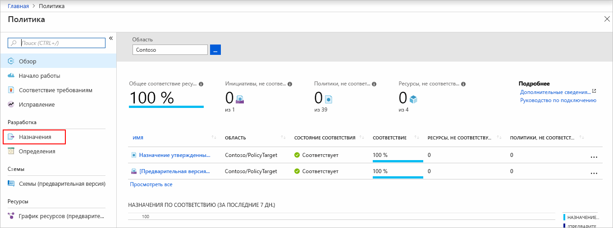
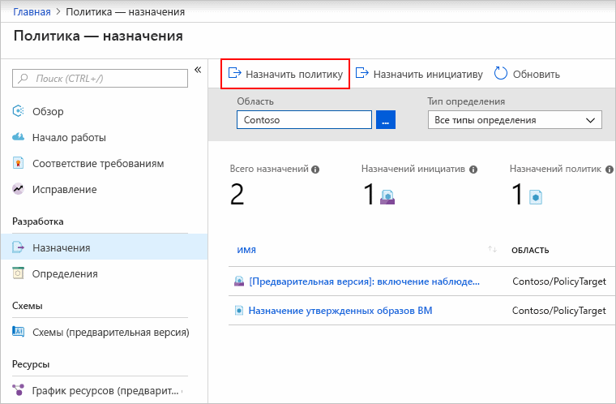
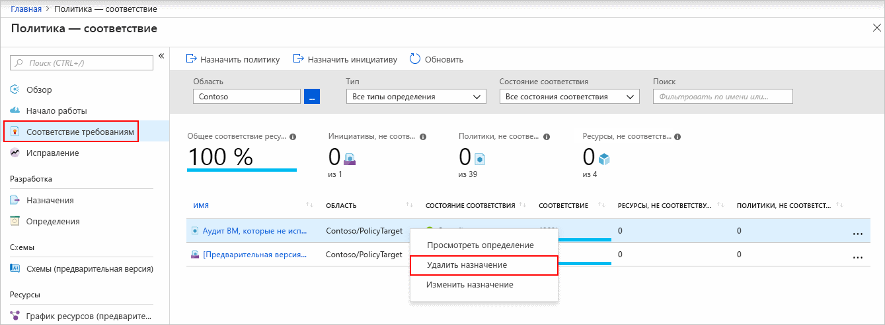

# Создание назначения политики для идентификации ресурсов, не соответствующих требованиям, в среде Azure

Чтобы понять, соответствуют ли ресурсы требованиям в Azure, прежде всего нужно определить их состояние.
В этом кратком руководстве описывается поэтапный процесс создания назначения политики для выявления виртуальных машин, которые не используют управляемые диски.

Этот процесс позволит вам определить, какие виртуальные машины не используют управляемые диски. Они *не соответствуют* назначению политики.

Если у вас еще нет подписки Azure, создайте [бесплатную](https://azure.microsoft.com/free/) учетную запись Azure, прежде чем начинать работу.

## Создание назначения политики

С помощью этого краткого руководства вы создадите назначение политики и назначите определение политики *Audit Virtual Machines without Managed Disks*.

1. Запустите службу "Политика Azure" на портале Azure, щелкнув **Все службы**, а затем выполнив поиск и выбрав **Политика**.

   

1. Выберите **Назначения** на странице службы "Политики Azure" слева. Назначение — это политика, которая назначена в рамках определенной области.

   

1. Выберите **Назначить политику** в верхней части страницы **Policy — Assignments** (Политика — назначения).

   

1. На странице **Назначить политику** выберите **Область**, нажав кнопку с многоточием и выбрав либо группу управления, либо подписку. Либо выберите группу ресурсов. Она определяет, к каким ресурсам или группе ресурсов принудительно применяется назначение политики.  Теперь щелкните **Выбрать** в нижней части страницы **Область**.

   В этом примере используется подписка **Contoso**. Ваша подписка будет отличаться.

1. Ресурсы можно исключить на основе параметра **Область**.  **Исключения** начинаются на один уровень ниже уровня параметра **Область**. **Исключения** являются необязательными, поэтому пока оставьте это поле пустым.

1. Выберите многоточие рядом с пунктом **Определение политики**, чтобы открыть список доступных определений. Служба "Политика Azure" поставляется со встроенными определениями политик, которые можно использовать. Доступны многие политики, такие как:

   - принудительно применять тег и его значение;
   - применять тег и его значение;
   - Require SQL Server version 12.0;

   Полный список всех доступных встроенных политик см. в статье [Шаблоны для службы "Политика Azure"](./samples/index.md).

1. Найдите определение политики в списке по строке *Аудит виртуальных машин, которые не используют управляемые диски*. Щелкните эту политику, а затем выберите действие **Выбрать**.

   

1. **Имя назначения** автоматически заполняется выбранным именем политики, но его можно изменить. Для нашего примера сохраните значение *Аудит виртуальных машин, которые не используют управляемые диски*. При желании вы можете добавить необязательное **описание**. Описание содержит сведения о назначении этой политики. Поле **Назначено** будет заполнено автоматически, в зависимости от текущего пользователя. Это поле не является обязательным, поэтому можно ввести произвольные значения.

1. Оставьте флажок **Создать управляемое удостоверение** неустановленным. Его _необходимо_ устанавливать, когда назначаемая политика или инициатива содержит политику с эффектом [deployIfNotExists](./concepts/effects.md#deployifnotexists). Так как эта политика не используется в этом кратком руководстве, оставьте соответствующее поле пустым. Дополнительные сведения см. в разделе [управляемые удостоверения](../../active-directory/managed-identities-azure-resources/overview.md) и [как работает безопасность исправлений](./how-to/remediate-resources.md#how-remediation-security-works).

1. Щелкните **Назначить**.

Теперь все готово к выявлению ресурсов, которые не соответствуют требованиям, что позволит оценить состояние соответствия в среде.

## Выявление несоответствующих ресурсов

Выберите элемент **Соответствие** в левой части страницы и найдите ранее созданное назначение политики **Аудит виртуальных машин, которые не используют управляемые диски**.

Существующие ресурсы, которые не соответствуют новому назначению, отображаются в разделе **Non-compliant resources** (Несоответствующие ресурсы).

Если условие применяется к существующим ресурсам и оказывается верным, такие ресурсы помечаются как несовместимые с настроенной политикой. В следующей таблице показано, как действуют разные политики в сочетании с оценкой условий для определения итогового состояния соответствия. Хотя логика оценки не отображается на портале Azure, результаты состояния соответствия выводятся. Они могут быть такими: "Соответствует" либо "Не соответствует".

| **Состояние ресурса** | **Эффект** | **Оценка политики** | **Состояние соответствия** |
| --- | --- | --- | --- |
| Exists | Deny, Audit, Append\*, DeployIfNotExist\*, AuditIfNotExist\* | Истина | Не соответствует |
| Exists | Deny, Audit, Append\*, DeployIfNotExist\*, AuditIfNotExist\* | Ложь | Соответствует |
| Создать | Audit, AuditIfNotExist\* | Истина | Не соответствует |
| Создать | Audit, AuditIfNotExist\* | Ложь | Соответствует |

\*Для эффектов Append, DeployIfNotExist и AuditIfNotExist требуется, чтобы оператор IF имел значение TRUE. Эффекты также требуют, чтобы условие существования FALSE было несоответствующим. Когда установлено значение TRUE, условие IF запускает оценку условия существования для связанных ресурсов.

## Очистка ресурсов

Остальные руководства из этой серии являются продолжением этого документа. Если вы намерены переходить к ним, не удаляйте ресурсы, которые создали при работе с этим руководством. Если вы не планируете продолжать работу, удалите все созданные ресурсы, выполнив на портале Azure следующие действия.

1. Выберите элемент **Соответствие** (или **Назначения**) в левой части страницы службы "Политика Azure" и найдите ранее созданное назначение политики **Аудит виртуальных машин, которые не используют управляемые диски**.

1. Щелкните правой кнопкой мыши назначение политики **Аудит виртуальных машин, которые не используют управляемые диски** и выберите **Удалить назначение**.

   

## Дополнительная информация

С помощью этого краткого руководства вы назначили определение политики для области и изучили отчет о соответствии. Определение политики гарантирует, что все ресурсы в области соответствуют требованиям, и определяет, какие из них не соответствуют.

Следующее руководство серии содержит сведения о назначении политик, обеспечивающих соответствие требованиям для **новых ресурсов**:

> [!div class="nextstepaction"]
> [Создание политик и управление ими](./tutorials/create-and-manage.md)