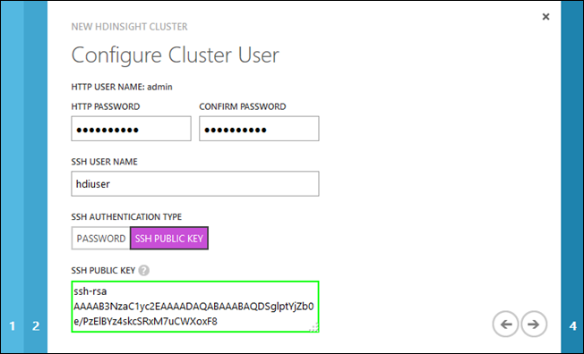
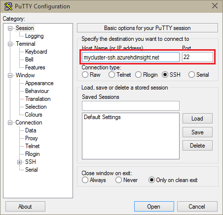

<properties
   pageTitle="Использование ключей SSH с Hadoop в HDInsight на платформе Linux в Windows | Aure"
   description="Узнайте, как создавать и использовать ключи SSH для аутентификации в кластерах HDInsight на основе Linux."
   services="hdinsight"
   documentationCenter=""
   authors="Blackmist"
   manager="paulettm"
   editor="cgronlun"/>

<tags
   ms.service="hdinsight"
   ms.devlang=""
   ms.topic="article"
   ms.tgt_pltfrm="na"
   ms.workload="big-data"
   ms.date="02/18/2015"
   ms.author="larryfr"/>

##Использование SSH с Hadoop в HDInsight на платформе Linux в Windows (предварительная версия)

Кластеры HDInsight на основе Linux предоставляют возможность защиты доступа по протоколу SSH с помощью пароля или ключа SSH. Этот документ содержит информацию о подключении к HDInsight из клиентов Windows с помощью клиента PuTTY SSH.

> [AZURE.NOTE] При описаний действий в данной статье предполагается, что вы используете клиент Windows. Если вы используете клиент OS X, Linux или Unix, см. статью [Использование SSH с Hadoop в HDInsight на платформе Linux из Linux, Unix или OS X](/ru-ru/documentation/articles/hdinsight-hadoop-linux-use-ssh-unix/).

##Предварительные требования

* **PuTTY** и **PuTTYGen** для клиентов Windows. Эти служебные программы доступны по адресу: <a href="http://www.chiark.greenend.org.uk/~sgtatham/putty/download.html" target="_blank">http://www.chiark.greenend.org.uk/~sgtatham/putty/download.html</a>

* Современный браузер, который поддерживает HTML5

ИЛИ

* Azure PowerShell

ИЛИ

* кроссплатформенные программы командной строки Azure.

##Что такое SSH?

SSH - это служебная программа для входа в систему и удаленного выполнения команд на удаленном сервере. Используя HDInsight на основе Linux, SSH устанавливает безопасное подключение к головному узлу кластера и предоставляет окно командной строки, используемое для ввода команд. Команды выполняются непосредственно на сервере.

##Создание ключа SSH (необязательно)

При создании кластера HDInsight на основе Linux вы можете использовать пароль или ключ SSH для аутентификации на сервере, если используется SSH. Ключи SSH считаются более надежными, так как они основаны на сертификатах. Если вы планируете использовать ключи SSH на своем кластере, используйте следующую информацию.

1. Откройте **PuTTYGen**.

2. Для параметра **Тип формируемого ключа** выберите значение **RSA SSH-2**, а затем нажмите кнопку **Сформировать**.

	

3. Перемещайте указатель мыши в области под индикатором выполнения, пока он не заполнится. Перемещение указателя мыши формирует случайные данные, которые используются для создания ключа.

	

	После создания ключа отобразится открытый ключ.

4. Для большей безопасности можно ввести парольную фразу в поле **Парольная фраза ключа**, а затем ввести то же значение в поле **Подтверждение парольной фразы**.

	
	
	> [AZURE.NOTE] Мы настоятельно рекомендуем использовать безопасную парольную фразу для ключа. Однако если вы забудете парольную фразу, восстановить ее будет невозможно.

5. Щелкните **Сохранить закрытый ключ**, чтобы сохранить ключ в **PPK**-файле. Этот ключ будет использоваться для аутентификации в кластере HDInsight на платформе Linux.

	> [AZURE.NOTE] Этот ключ следует хранить в безопасном месте, так как он будет использоваться для доступа к кластеру HDInsight на платформе Linux.

6. Щелкните **Сохранить открытый ключ**, чтобы сохранить ключ в **TXT**-файле. Это позволяет повторно использовать открытый ключ в будущем при создании дополнительных кластеров HDInsight на платформе Linux.

	> [AZURE.NOTE] Открытый ключ также отображается в верхней части **PuTTYGen**. Щелкните правой кнопкой мыши это поле, скопируйте значение и вставьте его в форму, например в мастере HDInsight на портале управления Azure.

##Создание кластера HDInsight на основе Linux

При создании кластера HDInsight на основе Linux необходимо предоставить **открытый ключ**, созданный ранее. В клиентах Windows кластер HDInsight на платформе Linux можно создать двумя способами:

* **Портал управления Azure** - для создания кластера используется веб-портал.

* **Кроссплатформенный интерфейс командной строки Azure (xplat-cli)** - для создания кластера используются команды командной строки.

Для каждого из этих способов потребуется **открытый ключ**. Полную информацию о создании кластера HDInsight на основе Linux см. в разделе <a href="./hdinsight-hadoop-provision-linux-clusters/" target="_blank">"Подготовка кластеров HDInsight на основе Linux"</a>.

###Портал управления Azure

При использовании портала для создания кластера HDInsight под управлением Linux необходимо ввести имя пользователя и пароль или открытый ключ в следующей форме.

Создает имя входа для указанного пользователя и позволяет выполнять аутентификацию с помощью пароля или ключа SSH.

###Кроссплатформенный интерфейс командной строки Azure

Вы можете использовать <a href="../xplat-cli/" target="_brad">кроссплатформенный интерфейс командной строки Azure, </a>чтобы создать новый кластер с помощью команды `azure hdinsight cluzter create`.

Дополнительную информацию об использовании этой команды см. в разделе <a href="../hdinsight-hadoop-provision-linux-clusters/" target="_blank">"Подготовка кластеров Hadoop на основе Linux в HDInsight с помощью настраиваемых параметров".</a>

##Подключение к кластеру HDInsight на основе Linux

1. Откройте PuTTY.

	

2. Если вы указали **ключ SSH** при создании учетной записи пользователя, необходимо выполнить следующий шаг, чтобы выбрать **закрытый ключ**, который будет использоваться при аутентификации в кластере.

	В разделе **Категория**, разверните **Подключение**, **SSH** и выберите **Проверка подлинности**. Наконец, нажмите кнопку **Обзор** и выберите **PPK**-файл, содержащий **закрытый ключ**.

	

3. В поле **Категория** выберите **Сеанс**. На экране **Основные параметры вашего сеанса PuTTY** в поле **Имя узла (или IP-адрес)** введите адрес SSH своего сервера HDInsight. Адрес SSH - это имя кластера с суффиксом **-ssh.azurehdinsight.net**. Например, **mycluster-ssh.azurehdinsight.net**.

	

4. Чтобы сохранить данные соединения для использования в будущем, в разделе **Сохраненные сеансы** введите имя для этого подключения и нажмите кнопку **Сохранить**. Соединение будет добавлено в список сохраненных сеансов.

5. Щелкните **Открыть** для подключения к кластеру.

	> [AZURE.NOTE] При первом подключении к кластеру, вы получите оповещение системы безопасности. Это нормально - для продолжения выберите **Да**, чтобы кэшировать ключ RSA2 сервера.

6. При появлении запроса введите имя пользователя, которое было введено при создании кластера. Если для пользователя использовался **пароль**, отобразится также запрос на ввода пароля.

##Добавление дополнительных учетных записей

2. Создайте новый **открытый ключ** и **закрытый ключ** для новой учетной записи пользователя, как было описано ранее.

1. Из сеанса SSH в кластер добавьте нового пользователя с помощью следующей команды.

		sudo adduser --disabled-password <username> 

	Она создаст новую учетную запись пользователя, но отключит проверку пароля.

2. Создайте каталог и файлы для хранения ключа, воспользовавшись следующими командами.

		sudo mkdir -p /home/<username>/.ssh
		sudo touch /home/<username>/.ssh/authorized_keys
		sudo nano /home/<username>/.ssh/authorized_keys

3. Когда откроется редактор nano, скопируйте и вставьте в него содержимое **открытого ключа** для новой учетной записи пользователя. Наконец, используйте **Ctrl-X**, чтобы сохранить файл и закрыть редактор.

	

4. Используйте следующую команду, чтобы изменить владельца папки .ssh и ее содержимого на новую учетную запись пользователя.

		sudo chown -hR <username>:<username> /home/<username>/.ssh

5. Теперь можно будет проходить аутентификацию на сервере с новой учетной записью пользователя и **закрытым ключом**.

##Туннелирование SSH

SSH может также использоваться для туннелирования локальных запросов, например веб-запросов, к кластеру HDInsight. Запрос будет затем перенаправлен к запрошенному ресурсу, как если бы исходил от головного узла кластера HDInsight.

Это может пригодиться при доступе к веб-службам в кластере HDInsight, использующим внутренние доменные имена для головного или рабочих узлов в кластере. Например, некоторые части веб-страницы Ambari используют внутренние доменные имена, например **headnode0.mycluster.d1.internal.cloudapp.net**. Эти имена нельзя разрешить извне кластера, однако запросы, туннелированные через SSH, создаются внутри кластера и будут разрешены правильно.

Выполните следующие действия, чтобы создать туннель SSH и настроить браузер, чтобы использовать его для подключения к кластеру.

1. Откройте PuTTY и введите информацию о подключении, как указано в разделе [Подключение](#connect) .

2. В разделе **Категории** в левой части диалогового окна, разверните **Подключение**, **SSH** и выберите **Туннели**.

2. Введите следующую информацию в форме **Параметры, управляющие перенаправлением портов SSH**.

	* **Порт источника** - порт на стороне клиента, трафик которого нужно перенаправлять. Например, **9876**.

	* **Назначение** - адрес SSH для кластера HDInsight на платформе Linux. Например, **mycluster-ssh.azurehdinsight.net**.

	* **Динамическая** - включает динамическую маршрутизацию прокси-сервера SOCKS.

	

3. Наконец, выберите **Добавить**, чтобы добавить параметры, затем выберите **Открыть**, чтобы открыть подключение SSH.

4. При необходимости войдите на сервер. При этом будет установлен сеанс SSH и включен туннель.

2. Настройте клиентскую программу, например Firefox, чтобы использовать **localhost:9876** в качестве прокси-сервера **SOCKS v5**. Вот как выглядят параметры Firefox.

	

	> [AZURE.NOTE] Если выбрать параметр **Удаленная служба DNS**, то запросы DNS будут разрешаться с использованием кластера HDInsight. Если этот параметр не выбран, запросы DNS будут разрешаться локально.

	Вы можете проверить, направляется ли трафик через туннель, например, посетив сайт <a href="http://www.whatismyip.com/" target="_blank">http://www.whatismyip.com/</a> с включенными и отключенными параметрами прокси-сервера в Firefox. Если он включен, IP-адрес будет относиться к компьютеру в центре обработки данных Microsoft Azure.

###Расширения браузера

Обычно при настройке браузера для использования туннеля вы не хотите направлять через туннель весь трафик. Расширения браузера, такие как <a href="http://getfoxyproxy.org/" target="_blank">FoxyProxy,</a>  поддерживают сопоставление шаблонов для запросов URL-адресов (только FoxyProxy Standard или FoxyProxy Plus), что позволяет отправлять через туннель только запросы определенных URL-адресов.

Если вы установили **FoxyProxy Standard**, выполните следующие действия, чтобы настроить его для перенаправления через туннель только трафика для HDInsight.

1. Откройте расширение FoxyProxy в браузере. Например, в Firefox щелкните значок FoxyProxy рядом с полем адреса.

	

2. На вкладке **Общие** нажмите кнопку **Добавить**, а затем введите имя прокси-сервера **HDInsight**.

	

3. Выберите **вкладку информации о прокси-сервере** и заполните следующие поля.

	* **Хост или IP-адрес** - localhost, так как мы используем туннель SSH на локальном компьютере.

	* **Порт** - порт, используемый для туннеля SSH.

	* **SOCKS-прокси** - выберите этот параметр, чтобы позволить браузеру использовать туннель в качестве прокси-сервера.

	* **SOCKS v5** - выберите этот параметр, чтобы установить требуемую версию прокси-сервера.

	

4. Выберите вкладку **Шаблоны URL**, а затем нажмите кнопку **Добавить**. Используйте следующие параметры, чтобы определить шаблон, а затем нажмите кнопку **ОК**.

	* **Имя шаблона** - **headnode**, это просто понятное имя для шаблона.

	* **Шаблон URL** - **\*headnode\***, определяет шаблон, которому соответствует любой URL-адрес со словом **headnode** в нем.

	

4. Нажмите кнопку **ОК**, чтобы добавить прокси-сервер и закрыть окно **Параметры прокси**.

5. В верхней части диалогового окна FoxyProxy в раскрывающемся списке **Выбран режим** выберите пункт **Использовать прокси, основанные на шаблонах**, а затем нажмите кнопку **Выйти**.

	

После выполнения этих действий только запросы URL-адресов, которые содержат строку **headnode**, будут направляться через туннель SSL.

##Дальнейшие действия

Теперь, когда вы знаете, как пройти аутентификацию помощью ключа SSH, узнайте, как использовать MapReduce с Hadoop в HDInsight.

* [Использование Hive с HDInsight](../hdinsight-use-hive/)

* [Использование Pig с HDInsight](../hdinsight-use-pig/)

* [Использование заданий MapReduce с HDInsight](../hdinsight-use-mapreduce/)
 
<!--HONumber=45--> 
