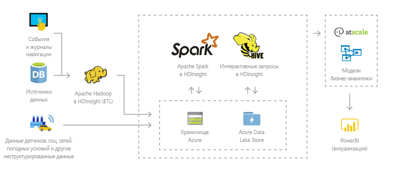
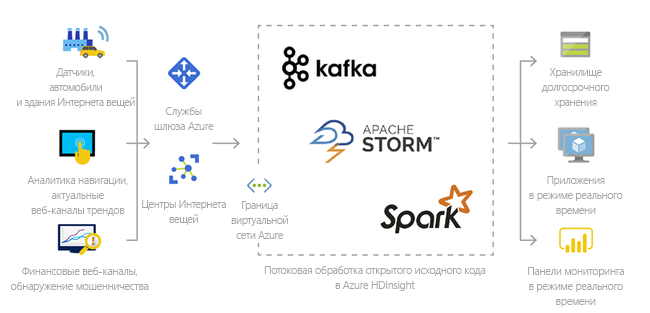
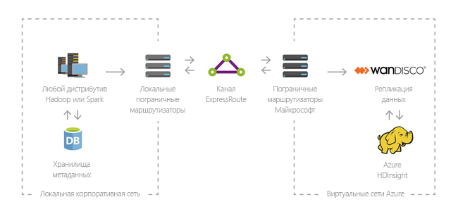

# Что такое Azure HDInsight и стек технологий Hadoop

В этой статье содержатся общие сведения об использовании Apache Hadoop в Azure HDInsight. Azure HDInsight — это полностью управляемая комплексная служба аналитики с открытым исходным кодом, предназначенная для предприятий. Вы можете использовать такие платформы с открытым кодом, как Hadoop, Spark, Hive, LLAP, Kafka, Storm, R и др. 

[!INCLUDE [hdinsight-price-change](../../../includes/hdinsight-enhancements.md)]

## Что такое HDInsight и технологическая платформа Hadoop?

Первоначально технология [Apache Hadoop](http://hadoop.apache.org/) была платформой с открытым кодом для распределенной обработки и анализа наборов больших данных в кластерах. Технологическая платформа Hadoop включает связанные программное обеспечение и служебные программы, включая Apache Hive, HBase, Spark, Kafka и т. д.

Azure HDInsight является облачным распределением компонентов Hadoop из [платформы данных Hortonworks Data Platform (HDP)](https://hortonworks.com/products/data-center/hdp/). Azure HDInsight обеспечивает простую, быструю и экономичную обработку больших объемов данных. Вы можете использовать такие популярные платформы с открытым кодом, как Hadoop, Spark, Hive, LLAP, Kafka, Storm, R и другие. С помощью этих платформ можно реализовать различные сценарии, такие как извлечение, преобразование и загрузка, хранение данных, машинное обучение и Интернет вещей.

Просмотреть доступные компоненты стека технологии Hadoop в HDInsight можно в статье [Что представляют собой компоненты и версии Hadoop, доступные в HDInsight?][component-versioning]. Дополнительные сведения о Hadoop в HDInsight см. на странице [возможностей HDInsight в Azure](https://azure.microsoft.com/services/hdinsight/).

## Что такое данные большого объема?

Большие данные в различных форматах объединяются в крупные тома с большей скоростью обработки, чем когда-либо. Они могут быть историческими (т. е. сохраненными за прошлый период) или данными в реальном времени (т. е. транслируемыми из источника). Наиболее распространенные варианты использования больших данных см. в разделе о [Сценарии использования HDInsight](#scenarios-for-using-hdinsight).

## Почему следует использовать Hadoop в HDInsight?

В этом разделе перечислены возможности Azure HDInsight.

|Функция  |ОПИСАНИЕ  |
|---------|---------|
|Собственные решения в облаке     |     Azure HDInsight позволяет создавать кластеры, оптимизированные для [Hadoop](apache-hadoop-linux-tutorial-get-started.md), [Spark](../spark/apache-spark-jupyter-spark-sql.md), [Interactive Query (LLAP)](../interactive-query/apache-interactive-query-get-started.md), [Kafka](../kafka/apache-kafka-get-started.md), [ Storm](../storm/apache-storm-tutorial-get-started-linux.md), [HBase](../hbase/apache-hbase-tutorial-get-started-linux.md) и  [Служб машинного обучения](../r-server/r-server-get-started.md) в Azure. HDInsight также предоставляет полное соглашение об уровне обслуживания для всех рабочих нагрузок.  |
|Экономия и масштабируемость     | HDInsight позволяет увеличивать и уменьшать [масштаб](../hdinsight-administer-use-portal-linux.md) рабочих нагрузок. Чтобы сократить затраты,  [создавайте кластеры по требованию](../hdinsight-hadoop-create-linux-clusters-adf.md)  и платите только за те ресурсы, которые используете. Вы также можете создавать конвейеры данных, чтобы реализовать задания. Разделенные вычислительные ресурсы и хранилище позволяют повысить производительность и эластичность. |
|Безопасность и соответствие требованиям    | HDInsight позволяет защитить ресурсы данных в организации с помощью [виртуальной сети Azure](../hdinsight-extend-hadoop-virtual-network.md), [шифрования](../hdinsight-hadoop-create-linux-clusters-with-secure-transfer-storage.md), а также интеграции с [Azure Active Directory](../domain-joined/apache-domain-joined-introduction.md). HDInsight также соответствует наиболее распространенным отраслевым и государственным [стандартам](https://azure.microsoft.com/overview/trusted-cloud).        |
|Мониторинг    | Azure HDInsight интегрируется с [Azure Log Analytics](../hdinsight-hadoop-oms-log-analytics-tutorial.md) и предоставляет единый интерфейс для мониторинга всех кластеров.        |
|Глобальная доступность | Служба HDInsight доступна в большем числе [регионов](https://azure.microsoft.com/regions/services/), чем любое другое предложение аналитики больших данных. Служба Azure HDInsight также доступна в Azure для государственных организаций, Китая и Германии, что позволяет обеспечить соответствие требованиям организации в основных независимых регионах. |  
|Производительность     |  Azure HDInsight предоставляет многофункциональные наборы инструментов, которые повышают эффективность работы, для Hadoop и Spark в предпочитаемой среде разработки. Это такие среды, как [Visual Studio](apache-hadoop-visual-studio-tools-get-started.md), [VS Code](../hdinsight-for-vscode.md), [Eclipse](../spark/apache-spark-eclipse-tool-plugin.md) или [IntelliJ](../spark/apache-spark-intellij-tool-plugin.md) с поддержкой Scala, Python, R, Java и .NET. Специалисты по обработке и анализу данных также могут взаимодействовать, используя популярные записные книжки, например [Jupyter](../spark/apache-spark-jupyter-notebook-kernels.md) и [Zeppelin](../spark/apache-spark-zeppelin-notebook.md).    |
|Расширяемость     |  Чтобы расширить кластеры HDInsight, вы можете устанавливать компоненты (Hue, Presto и т. д.) с помощью [действий скриптов](../hdinsight-hadoop-customize-cluster-linux.md), [добавлять граничные узлы](../hdinsight-apps-use-edge-node.md) или [выполнять интеграцию с другими сертифицированными приложениями для обработки больших данных](../hdinsight-apps-install-applications.md). HDInsight обеспечивает прозрачную интеграцию с наиболее распространенными решениями для больших наборов данных с помощью развертывания [одним щелчком](https://azure.microsoft.com/services/hdinsight/partner-ecosystem/).|

## Сценарии использования HDInsight

Azure HDInsight можно применять в различных сценариях обработки больших данных. Это могут быть исторические данные (т. е. собранные и сохраненные) или данные в реальном времени (потоковые данные, передаваемые прямо из источника). Сценарии обработки таких данных можно представить в указанных ниже категориях. 

### Пакетная обработка (ETL)

Извлечение, преобразование и загрузка — это процесс, при котором неструктурированные или структурированные данные извлекаются из разнородных источников данных. Затем они структурируются и загружаются в хранилище данных. Преобразованные данные могут применяться для обработки и анализа или в хранилище данных.

### Хранение данных

При помощи HDInsight вы можете выполнять интерактивные запросы структурированных и неструктурированных данных в любом формате и объемом в несколько петабайт. Также можно создавать модели и подключать их к средствам бизнес-аналитики. Дополнительные сведения см. в [этой истории клиента](https://customers.microsoft.com/story/milliman). 

### Интернет вещей.

HDInsight можно использовать для обработки потоковых данных, получаемых в режиме реального времени с различных устройств. Чтобы узнать больше, прочтите [эту запись блога Azure, представляющую собой объявление о выходе общедоступной предварительной версии Apache Kafka в HDInsight с управляемыми дисками Azure](https://azure.microsoft.com/blog/announcing-public-preview-of-apache-kafka-on-hdinsight-with-azure-managed-disks/).

 

### Обработка и анализ данных

При помощи HDInsight можно создавать приложения для извлечения из данных критически важной информации. Кроме этого, вы можете использовать службу "Машинное обучение Azure", чтобы прогнозировать тенденции для бизнеса. Дополнительные сведения см. в [этой истории клиента](https://customers.microsoft.com/story/pros).

### Гибридная среда

При помощи HDInsight вы можете расширить локальную инфраструктуру для работы с большими данными в Azure и использовать возможности расширенной аналитики, доступные в облаке.

## Типы кластеров в HDInsight
HDInsight включает определенные типы кластеров и возможности их настройки, такие как добавление компонентов, служебных программ и языков. HDInsight предлагает следующие типы кластеров.

* **[Apache Hadoop](https://wiki.apache.org/hadoop)**. Платформа, в которой используется управление ресурсами HDFS и YARN, а также простая модель программирования MapReduce для параллельной обработки и анализа пакетных данных.

* **[Apache Spark](http://spark.apache.org/)** — это платформа параллельной обработки с открытым кодом, которая поддерживает обработку в памяти, чтобы повысить производительность приложений для анализа больших данных. Дополнительные сведения см. в обзоре по [Apache Spark в HDInsight](../spark/apache-spark-overview.md).

* **[Apache HBase](http://hbase.apache.org/)**. База данных NoSQL, созданная на основе Hadoop и обеспечивающая прямой доступ и строгую согласованность для больших объемов неструктурированных и частично структурированных данных (с потенциальным размером таблиц в миллиарды строк и миллионы столбцов). Дополнительные сведения см. в статье [Что такое HBase в HDInsight: база данных NoSQL, которая предоставляет возможности, схожие BigTable, для Hadoop](../hbase/apache-hbase-overview.md).

* **[Machine Learning Server](https://msdn.microsoft.com/microsoft-r/rserver)** — это сервер для размещения параллельных и распределенных процессов на языке R и управления ими. Благодаря ему специалисты по обработке и анализу данных, статистики и программисты на R могут получать доступ к масштабируемым, распределенным методам аналитики в HDInsight по требованию. Дополнительные сведения см. в статье [Основные сведения об R Server и возможностях открытого кода R в HDInsight](../r-server/r-server-overview.md).

* **[Apache Storm](https://storm.incubator.apache.org/)** — это распределенная система для вычислений в реальном времени, позволяющая быстро обрабатывать потоки данных большого размера. Storm предлагается в качестве управляемого кластера в HDInsight. См. статью об [анализе данных, передаваемых датчиками в реальном времени, с помощью Storm и Hadoop](../storm/apache-storm-sensor-data-analysis.md).

* **[Apache Interactive Query или Live Long and Process (предварительная версия)](https://cwiki.apache.org/confluence/display/Hive/LLAP)** выполняет кэширование в памяти для выполнения интерактивных и ускоренных запросов Hive. См. инструкции по [использованию Interactive Query в HDInsight](../interactive-query/apache-interactive-query-get-started.md).

* **[Apache Kafka](https://kafka.apache.org/)**. Платформа с открытым исходным кодом, которая используется для создания конвейеров и приложений потоковой передачи данных. Kafka также предоставляет функциональные возможности очереди сообщений, с помощью которых можно публиковать потоки данных и подписываться на них. См. статью [Введение в Apache Kafka в HDInsight (предварительная версия)](../kafka/apache-kafka-introduction.md).

## Компоненты HDInsight с открытым кодом

Azure HDInsight позволяет создавать кластеры на платформах с открытым кодом, например Hadoop, Spark, Hive, LLAP, Kafka, Storm HBase и R. По умолчанию эти кластеры поставляются с другими компонентами с открытым кодом, такими как [Ambari](https://github.com/apache/ambari/blob/trunk/ambari-server/docs/api/v1/index.md), [Avro](http://avro.apache.org/docs/current/spec.html), [Hive](http://hive.apache.org), [HCatalog](https://cwiki.apache.org/confluence/display/Hive/HCatalog/), [Mahout](https://mahout.apache.org/), [MapReduce](http://wiki.apache.org/hadoop/MapReduce), [YARN](http://hadoop.apache.org/docs/current/hadoop-yarn/hadoop-yarn-site/YARN.html), [Phoenix](http://phoenix.apache.org/), [Pig](http://pig.apache.org/), [Sqoop](http://sqoop.apache.org/), [Tez](http://tez.apache.org/), [Oozie](http://oozie.apache.org/) и [ZooKeeper](http://zookeeper.apache.org/).  

## Языки программирования, поддерживаемые в HDInsight
Кластеры HDInsight, в том числе Spark, HBase, Kafka, Hadoop и другие, поддерживают несколько языков программирования. Не все языки программирования устанавливаются по умолчанию. Для установки библиотек, модулей или пакетов, не установленных по умолчанию, используйте [действие скрипта](../hdinsight-hadoop-script-actions-linux.md).

|Язык программирования  |Информация  |
|---------|---------|
|Поддержка языков программирования по умолчанию     | По умолчанию кластеры HDInsight поддерживают следующие языки:<ul><li>Java</li><li>Python</li></ul> Дополнительные языки можно установить с помощью [действий скриптов](../hdinsight-hadoop-script-actions-linux.md).       |
|Языки виртуальных машин Java     | На виртуальной машине Java могут работать многие другие языки. Однако при запуске некоторых из этих языков вам может потребоваться установить дополнительные компоненты в кластере. В кластерах HDInsight поддерживаются следующие языки, работающие на виртуальных машинах Java: <ul><li>Clojure</li><li>Jython (Python для Java)</li><li>Scala</li></ul>     |
|Языки для Hadoop     | Кластеры HDInsight поддерживают следующие языки, характерные для технологической платформы Hadoop: <ul><li>Pig Latin для заданий Pig</li><li>HiveQL для заданий Hive и SparkSQL</li></ul>        |
 

## Средства разработки для HDInsight 
Вы можете создавать и отправлять запросы данных HDInsight и задания с помощью таких средств разработки HDInsight, как IntelliJ, Eclipse, Visual Studio Code и Visual Studio, просто интегрировав их с Azure.

* [Набор средств Azure для IntelliJ](https://docs.microsoft.com/azure/hdinsight/spark/apache-spark-intellij-tool-plugin)

* [Набор средств Azure для Eclipse](https://docs.microsoft.com/azure/hdinsight/spark/apache-spark-eclipse-tool-plugin)

* [Средства Azure HDInsight для VS Code](https://docs.microsoft.com/azure/hdinsight/hdinsight-for-vscode?branch=pr-en-us-22999)

* [Средства Azure Data Lake для Visual Studio](https://docs.microsoft.com/azure/hdinsight/hadoop/apache-hadoop-visual-studio-tools-get-started)

## Бизнес-аналитика в HDInsight
Знакомые инструменты бизнес-аналитики позволяют получать и анализировать данные, а также составлять на их основе отчеты в тесной интеграции с HDInsight с помощью надстройки Power Query или драйвера Microsoft Hive ODBC.

* [Использование средств визуализации данных с помощью Apache Spark BI в Azure HDInsight](../spark/apache-spark-use-bi-tools.md).

* [Визуализация данных Hive с помощью Microsoft Power BI в Azure HDInsight](apache-hadoop-connect-hive-power-bi.md) 

* [Visualize Interactive Query Hive data with Microsoft Power BI using DirectQuery in Azure HDInsight](../interactive-query/apache-hadoop-connect-hive-power-bi-directquery.md) (Визуализация данных Hive из кластера Interactive Query с помощью Microsoft Power BI и DirectQuery в Azure HDInsight)

* [Подключение Excel к Hadoop с помощью Power Query](apache-hadoop-connect-excel-power-query.md) (требуется Windows) 

* [Подключение Excel к Hadoop с помощью драйвера Microsoft Hive ODBC](apache-hadoop-connect-excel-hive-odbc-driver.md) (требуется Windows) 

* [Использование SQL Server Analysis Services с HDInsight](https://msdn.microsoft.com/library/dn749857.aspx)

* [Использование SQL Server Reporting Services с HDInsight](https://msdn.microsoft.com/library/dn749856.aspx)

## Дополнительная информация

В этой статье вы узнали, что такое Azure HDInsight и как эта платформа поддерживает работу кластеров Hadoop других типов кластеров в Azure. Перейдите к следующей статье, чтобы узнать, как создать кластер Apache Hadoop в HDInsight.

> [!div class="nextstepaction"]
> [Создание кластера Hadoop в HDInsight](apache-hadoop-linux-create-cluster-get-started-portal.md)

[component-versioning]: ../hdinsight-component-versioning.md
[zookeeper]: http://zookeeper.apache.org/
