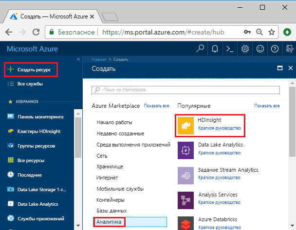
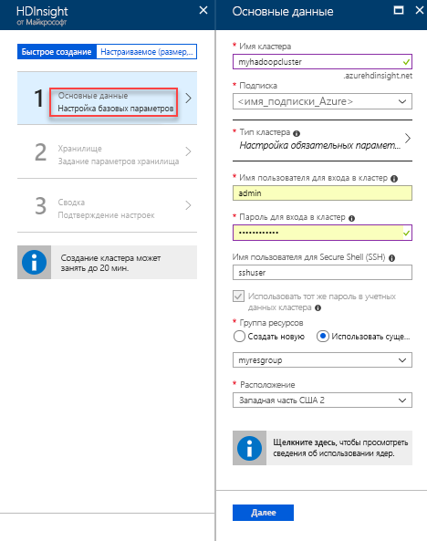
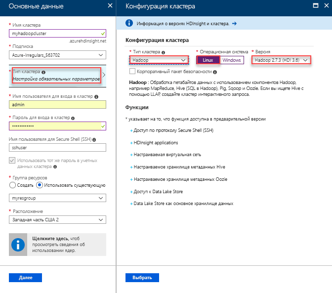
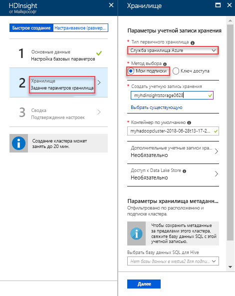
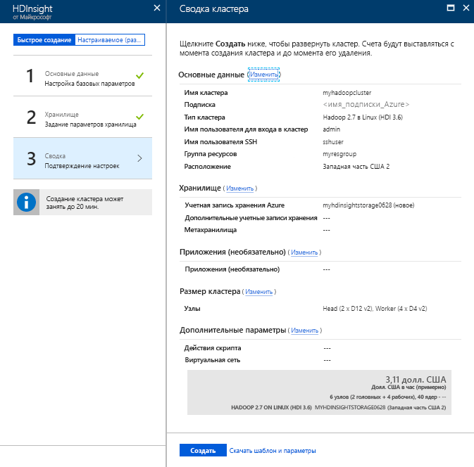
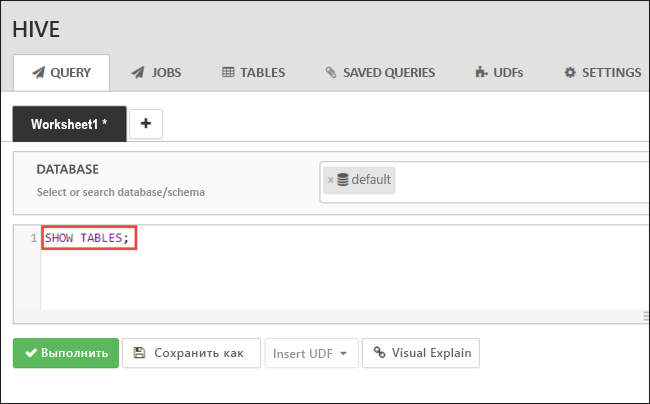
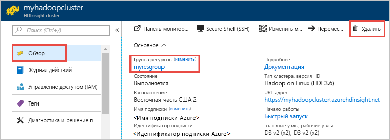

# Краткое руководство. Начало работы с Apache Hadoop и Apache Hive в Azure HDInsight с помощью портала Azure

Из этой статьи вы узнаете, как создать кластеры [Apache Hadoop](https://hadoop.apache.org/) в HDInsight с помощью портала Azure, а затем запустить задания Apache Hive в HDInsight. Большинство заданий Hadoop — пакетные. Вы создаете кластер, выполняете несколько заданий, а затем удаляете кластер. В этой статье будут выполнены все три задачи.

В этом кратком руководстве для создания кластера Hadoop в HDInsight используется портал Azure. Создать кластер можно также с помощью [шаблона Azure Resource Manager](apache-hadoop-linux-tutorial-get-started.md).

В настоящее время в HDInsight доступно [семь типов кластеров](./apache-hadoop-introduction.md#cluster-types-in-hdinsight). Каждый тип кластера поддерживает свой набор компонентов. Все типы кластеров поддерживают инфраструктуру Hive. Дополнительные сведения о поддерживаемых компонентах в HDInsight см. в статье [Что представляют собой компоненты и версии Apache Hadoop, доступные в HDInsight?](../hdinsight-component-versioning.md)  

Если у вас еще нет подписки Azure, [создайте бесплатную учетную запись Azure](https://azure.microsoft.com/free/), прежде чем начинать работу.

## Создание кластера Apache Hadoop

В этом разделе вы создадите кластер Hadoop в HDInsight, используя портал Azure. 

1. Войдите на [портал Azure](https://portal.azure.com).

1. На портале Azure выберите **Создать ресурс** > **Данные и аналитика** > **HDInsight**. 

    

2. Выбрав **HDInsight** > **Быстрое создание** > **Основы**, укажите значения, как предложено на следующем снимке экрана.

    

    Введите или выберите следующие значения:
    
    |Свойство  |ОПИСАНИЕ  |
    |---------|---------|
    |**Имя кластера**     | Введите имя кластера Hadoop. Так как все кластеры в HDInsight используют одно пространство имен DNS, это имя должно быть уникальным. Имя может содержать до 59 символов, включая буквы, цифры и дефисы. Первый и последний знаки в имени не могут быть дефисами. |
    |**Подписка**     |  Выберите подписку Azure. |
    |**Тип кластера**     | Пока что пропустите этот параметр. Вы укажите его на следующем шаге процедуры.|
    |**Cluster login username and password** (Имя для входа и пароль для кластера)     | Имя для входа по умолчанию — **admin**. Длина пароля должна составлять не менее 10 символов. Пароль должен содержать по меньшей мере одну цифру, одну прописную и одну строчную буквы, а также один специальный символ (кроме ' " ` \)). Ни в коем случае **не вводите** распространенные пароли, например Pass@word1.|
    |**Имя пользователя SSH** | Имя пользователя по умолчанию — **sshuser**.  Можно указать другое имя пользователя SSH. |
    | **Использовать тот же пароль в учетных данных кластера** | Установите этот флажок, чтобы использовать одинаковый пароль для пользователя SSH и имени для входа для кластера.|
    |**Группа ресурсов**     | Создайте новую группу ресурсов или выберите имеющуюся группу ресурсов.  Группа ресурсов — это контейнер компонентов Azure.  В данном случае группа ресурсов содержит кластер HDInsight и зависимую учетную запись хранения Azure. |
    |**Местоположение.**     | Выберите расположение Azure для создания кластера.  Выберите ближайшее к себе расположение для повышения производительности. |
        
3. Выберите **тип кластера** и укажите значения параметров, как показано на снимке экрана ниже.

    

    Выберите следующие значения:
    
    |Свойство  |ОПИСАНИЕ  |
    |---------|---------|
    |**Тип кластера**     | Выберите **Hadoop**. |
    |**Операционная система**     | Выберите **Linux**. |
    |**Версия**     | Выберите **Hadoop 2.7.3 (HDI 3.6)**.|

    Щелкните **Выбрать** и нажмите кнопку **Далее**.

4. На вкладке **Хранилище** укажите значения параметров, как показано на снимке экрана ниже.

    

    Выберите следующие значения:
    
    |Свойство  |ОПИСАНИЕ  |
    |---------|---------|
    |**Тип первичного хранилища**     | В рамках этой статьи выберите **службу хранилища Azure**, чтобы использовать Azure Storage Blob в качестве учетной записи хранения по умолчанию. Можно также указать Azure Data Lake Storage в качестве хранилища по умолчанию. |
    |**Метод выбора**     |  В рамках этой статьи выберите **Мои подписки**, чтобы использовать учетную запись хранения из своей подписки Azure. Чтобы использовать учетную запись хранения из другой подписки, выберите **Ключ доступа** и укажите ключ доступа этой учетной записи. |
    |**Создание учетной записи хранения**     | Укажите имя учетной записи хранения.|

    Примите значения по умолчанию для остальных параметров и нажмите кнопку **Далее**.

5. На вкладке **Сводка** проверьте все значения, выбранные ранее.

    
      
4. Нажмите кнопку **Создать**. Вы увидите новый элемент **Submitting deployment for HDInsight** (Отправляется развертывание для HDInsight) на панели мониторинга портала. Процесс создания кластера занимает около 20 минут.

    

4. После создания кластера на портале Azure отобразится страница с общими сведениями об этом кластере.
   
        
    
    У каждого кластера есть зависимость [учетной записи хранения Azure](../hdinsight-hadoop-use-blob-storage.md) или [учетной записи Azure Data Lake](../hdinsight-hadoop-use-data-lake-store.md). Она называется учетной записью хранения по умолчанию. Кластер HDInsight должен находиться в том же регионе Azure, что и его учетная запись хранения, используемая по умолчанию. Удаление кластеров не приведет к удалению учетной записи хранения.

    > [!NOTE]  
    > Сведения о других способах создания кластеров, а также о свойствах, используемых в этом руководстве, см. в статье [Создание кластеров HDInsight](../hdinsight-hadoop-provision-linux-clusters.md).       

## Выполнение запросов Apache Hive

[Apache Hive](hdinsight-use-hive.md) — это самый популярный компонент службы HDInsight. Существует множество способов выполнения заданий Hive в HDInsight. В этом руководстве используется представление Hive Ambari на портале. Другие способы отправки заданий Hive описаны в статье [Использование Hive в HDInsight](hdinsight-use-hive.md).

1. Чтобы открыть Ambari, на предыдущем экране выберите **Панель мониторинга кластера**.  Вы можете также перейти по ссылке **https://&lt;ClusterName>.azurehdinsight.net**, где &lt;ClusterName> — это кластер, созданный в предыдущем разделе.

    

2. Введите имя пользователя Hadoop и пароль, указанные при создании кластера. Имя пользователя по умолчанию — **admin**.

3. Откройте **представление Hive**, как показано на снимке экрана ниже:
   
    

4. На вкладке **Запрос** вставьте следующие инструкции HiveQL:
   
        SHOW TABLES;

    
   
   > [!NOTE]  
   > В Hive необходимо использовать точки с запятой.       

5. Нажмите кнопку **Выполнить**. Под вкладкой **Запрос** появится вкладка **Результаты** с информацией о задании. 
   
    Когда запрос будет выполнен, на вкладке **Запрос** появятся результаты этой операции. Вы увидите одну таблицу с именем **hivesampletable**. Этот пример таблицы Hive входит в состав всех кластеров HDInsight.
   
    

6. Повторите шаги 4 и 5 и выполните следующий запрос:
   
        SELECT * FROM hivesampletable;
   
7. Вы также можете сохранить результаты запроса. Нажмите кнопку меню справа и укажите, как это следует сделать: скачать результаты в качестве CSF-файла или сохранить их в учетной записи хранения, связанной с кластером.

    

Когда задание Hive будет завершено, вы сможете [экспортировать результаты в базу данных SQL Azure или базу данных SQL Server](apache-hadoop-use-sqoop-mac-linux.md) либо [визуализировать их с помощью Excel](apache-hadoop-connect-excel-power-query.md). Дополнительные сведения об использовании Hive в HDInsight см. в руководстве по [Apache Hive и HiveQL в Azure HDInsight](hdinsight-use-hive.md).

## Устранение неполадок

Если при создании кластеров HDInsight возникли проблемы, см. раздел [Создание кластеров](../hdinsight-hadoop-create-linux-clusters-portal.md).

## Очистка ресурсов
После завершения работы с этим руководством кластер можно удалить. В случае с HDInsight ваши данные хранятся в службе хранилища Azure, что позволяет безопасно удалить неиспользуемый кластер. Плата за кластеры HDInsight взимается, даже когда они не используются. Поскольку стоимость кластера во много раз превышает стоимость хранилища, экономически целесообразно удалять неиспользуемые кластеры. 

> [!NOTE]  
> Если вы *сразу же* перейдете к следующему руководству, чтобы узнать, как выполнять операции извлечения, преобразования и загрузки, то можете не прерывать работу кластера. Дело в том, что в этом руководстве вам придется повторно создать кластер. Но если вы не собираетесь немедленно приступать к изучению следующего руководства, то нужно удалить кластер.
> 
>  

**Удаление кластера и (или) учетной записи хранения по умолчанию**

1. Вернитесь на вкладку браузера, на которой открыт портал Azure. Откройте страницу обзора кластера. Если требуется удалить кластер и сохранить учетную запись хранения по умолчанию, щелкните **Удалить**.

    

2. Если вам нужно удалить кластер и учетную запись хранения по умолчанию, выберите имя группы ресурсов (выделено на предыдущем снимке экрана), чтобы открыть страницу группы ресурсов.

3. Выберите **Удалить группу ресурсов**, чтобы удалить группу ресурсов, которая содержит кластер и учетную запись хранения по умолчанию. Обратите внимание, что удаление группы ресурсов приводит к удалению учетной записи хранения. Если вы хотите сохранить учетную запись хранения, удалите только кластер.

## Дополнительная информация
В этом руководстве вы узнали, как с помощью шаблона Resource Manager создать кластер HDInsight под управлением Linux и как выполнять базовые запросы Hive. В следующей статье вы узнаете, как выполнять операции извлечения, преобразования и загрузки с помощью Hadoop в HDInsight.

> [!div class="nextstepaction"]
>[Извлечение, преобразование и загрузка данных с помощью Apache Hive в HDInsight](../hdinsight-analyze-flight-delay-data-linux.md)

Если вы готовы приступить к работе с собственными данными и хотите узнать больше о том, как HDInsight сохраняет данные или как получать данные в HDInsight, обратитесь к следующим статьям:

* Сведения о том, как HDInsight использует службу хранилища Azure, см. в статье [Использование службы хранилища Azure в HDInsight](../hdinsight-hadoop-use-blob-storage.md).
* Сведения о том, как создать кластер HDInsight с Data Lake Storage, см. в руководстве по [ настройке кластеров в HDInsight](../../storage/data-lake-storage/quickstart-create-connect-hdi-cluster.md).
* Сведения об отправке данных в HDInsight см. в статье [Отправка данных в HDInsight](../hdinsight-upload-data.md).
* [Использование Azure Data Lake Storage Gen2 с кластерами Azure HDInsight](../hdinsight-hadoop-use-data-lake-storage-gen2.md)

Дополнительные сведения об анализе данных с помощью HDInsight см. в следующих статьях:

* Дополнительные сведения об использовании Hive с HDInsight, включая выполнение запросов Hive из Visual Studio, см. в статье [Обзор Apache Hive и HiveQL в Azure HDInsight](hdinsight-use-hive.md).
* Дополнительные сведения о языке Pig, который используется для преобразования данных, см. в статье [Использование Apache Pig с Apache Hadoop в HDInsight](hdinsight-use-pig.md).
* Дополнительные сведения о MapReduce — способе написания программ, которые обрабатывают данные в Hadoop, — см. в статье [Использование MapReduce в Hadoop в HDInsight](hdinsight-use-mapreduce.md).
* Дополнительные сведения об анализе данных в HDInsight с помощью средств HDInsight для Visual Studio см. в статье [Приступая к работе с инструментами Hadoop в Visual Studio для HDInsight](apache-hadoop-visual-studio-tools-get-started.md).

Дополнительные сведения о создании кластера HDInsight и управлении этим кластером см. в следующих статьях:

* Сведения об управлении кластером HDInsight под управлением Linux см. в руководстве по [управлению кластерами HDInsight с помощью Apache Ambari](../hdinsight-hadoop-manage-ambari.md).
* Дополнительные сведения о параметрах, которые можно выбрать при создании кластера HDInsight, см. в статье [Создание кластеров HDInsight в Linux с пользовательскими параметрами](../hdinsight-hadoop-provision-linux-clusters.md).

[1]: ../HDInsight/apache-hadoop-visual-studio-tools-get-started.md

[hdinsight-provision]: hdinsight-provision-linux-clusters.md
[hdinsight-upload-data]: hdinsight-upload-data.md
[hdinsight-use-hive]: hdinsight-use-hive.md
[hdinsight-use-pig]: hdinsight-use-pig.md

