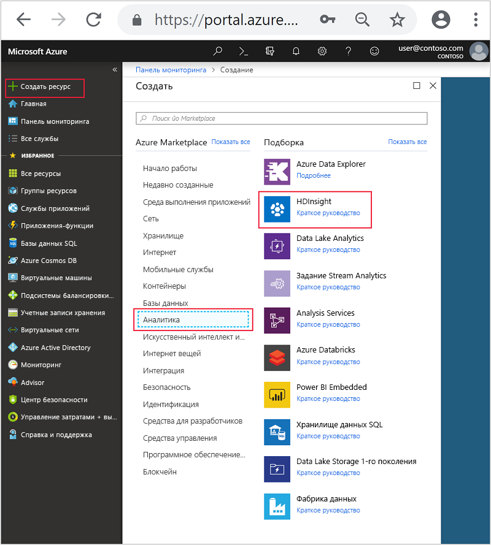
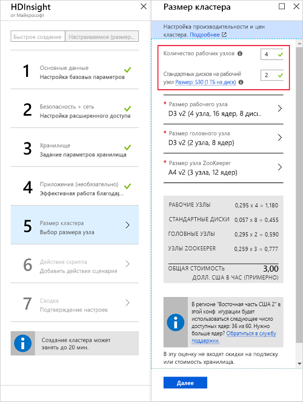

# <a name="start-with-apache-kafka-on-hdinsight"></a>Приступая к работе с Apache Kafka в HDInsight

Узнайте, как создать кластер [Apache Kafka](https://kafka.apache.org) и использовать его в Azure HDInsight. Kafka — это распределенная платформа потоковой передачи с открытым кодом, которая доступна в HDInsight. Она часто используется как брокер сообщений, предоставляя такие же функциональные возможности, как и очередь сообщений типа "публикация-подписка". Kafka часто используется с Apache Spark и Apache Storm для обмена сообщениями, отслеживания действий, агрегирования потоков и преобразования данных.

[!INCLUDE [delete-cluster-warning](../../../includes/hdinsight-delete-cluster-warning.md)]

## <a name="create-a-kafka-cluster"></a>Создание кластера Kafka

Чтобы создать Kafka в кластере HDInsight, сделайте следующее:

1. На [портале Azure](https://portal.azure.com) последовательно выберите **+Создать ресурс**, **Данные и аналитика** и **HDInsight**.
   
    

2. В колонке **Основные сведения** задайте следующие параметры:

    * **Имя кластера.** Имя кластера HDInsight. Это имя должно быть уникальным.
    * **Подписка.** Выберите нужную подписку.
    * **Тип кластера.** Выберите эту запись и в колонке **Конфигурация кластера** задайте следующие значения:

        * **Тип кластера**: Kafka.
        * **Версия**: Kafka 0.10.0 (HDI 3.6).

        Нажмите кнопку **Выбрать**, чтобы сохранить эти параметры.

        

    * **Имя пользователя для входа в кластер** и **Пароль для входа в кластер**. Имя для входа в кластер по протоколу HTTPS. Эти учетные данные используются для доступа к таким службам, как веб-интерфейс Ambari или REST API.
    * **Secure Shell (SSH) username** (Имя пользователя Secure Shell (SSH)). Имя для доступа к кластеру по протоколу SSH. По умолчанию пароль совпадает с паролем для входа в кластер.
    * **Группа ресурсов.** Группа ресурсов, в которой будет создан кластер.
    * **Расположение.** Регион Azure, в котором будет создан кластер.

        > [!IMPORTANT]
        > Для обеспечения высокой доступности данных рекомендуется выбрать расположение (регион), содержащий __три домена сбоя__. Дополнительные сведения см. в разделе [Высокая доступность данных](#data-high-availability).
   
 

3. Нажмите кнопку __Далее__, чтобы завершить настройку основных параметров.

4. В колонке **Хранилище** выберите или создайте учетную запись хранения. Для действий, описанных в этом документе, в других полях этой колонки оставьте значения по умолчанию. Нажмите кнопку __Далее__, чтобы сохранить конфигурацию хранилища.

    

5. Чтобы продолжить, в колонке __Приложения (необязательно)__ щелкните __Далее__. Для этого примера приложения не требуются.

6. Чтобы продолжить, в колонке __Размер кластера__ щелкните __Далее__.

    > [!WARNING]
    > Чтобы обеспечить доступность Kafka в HDInsight, кластер должен содержать не менее трех рабочих узлов. Дополнительные сведения см. в разделе [Высокая доступность данных](#data-high-availability).

    

    > [!IMPORTANT]
    > **Число дисков для каждой записи рабочего узла** определяет степень масштабируемости Kafka в HDInsight. Kafka в HDInsight использует локальный диск для виртуальных машин в кластере. Kafka обрабатывает большое количество операций ввода-вывода, поэтому используются [управляемые диски Azure](../../virtual-machines/windows/managed-disks-overview.md), чтобы обеспечить высокую пропускную способность и предоставить дополнительное хранилище для каждого узла. Управляемый диск может быть двух типов: __Стандартный__ (HDD) или __Премиум__ (SSD). Диски категории "Премиум" используются с виртуальными машинами серий DS и GS. Для всех остальных виртуальных машин используются стандартные управляемые диски.

7. Чтобы продолжить, в колонке __Дополнительные параметры__ щелкните __Далее__.

8. В колонке **Сводка** проверьте конфигурацию для кластера. Используйте ссылки __Изменить__, чтобы изменить неправильные параметры. Наконец, нажмите кнопку "Создать" для создания кластера.
   
    
   
    > [!NOTE]
    > Операция создания кластера может занять до 20 минут.

## <a name="connect-to-the-cluster"></a>Подключение к кластеру

> [!IMPORTANT]
> При выполнении следующих шагов необходимо использовать клиент SSH. Дополнительные сведения см. в статье [Подключение к HDInsight (Hadoop) с помощью SSH](../hdinsight-hadoop-linux-use-ssh-unix.md).

Чтобы подключиться к кластеру с помощью SSH, необходимо указать имя учетной записи пользователя SSH и имя кластера. В следующем примере вместо `sshuser` и `clustername` используйте данные вашей учетной записи и имя кластера.

```ssh sshuser@clustername-ssh.azurehdinsight.net```

При появлении запроса введите пароль, который используется для учетной записи SSH.

См. дополнительные сведения об [использовании SSH в HDInsight](../hdinsight-hadoop-linux-use-ssh-unix.md).

## <a id="getkafkainfo"></a>Получение сведений об узлах Zookeeper и брокера

Для работы с Kafka вам нужно предоставить данные об узлах *Zookeeper* и *брокера*. Эти узлы используются Kafka API и многими другими служебными программами, поставляемыми с платформой Kafka.

Ниже описано, как создать переменные среды, которые содержат сведения об узле.

1. Используя SSH-подключение к кластеру, выполните следующую команду, чтобы установить служебную программу `jq`. Эта служебная программа используется для синтаксического анализа документов JSON. С ее помощью также удобно получать сведения об узле брокера.
   
    ```bash
    sudo apt -y install jq
    ```

2. Чтобы задать переменную среды с именем кластера, выполните следующую команду.

    ```bash
    read -p "Enter the HDInsight cluster name: " CLUSTERNAME
    ```

3. Чтобы задать переменную среды со сведениями об узле Zookeeper, выполните следующую команду.

    ```bash
    export KAFKAZKHOSTS=`curl -sS -u admin -G https://$CLUSTERNAME.azurehdinsight.net/api/v1/clusters/$CLUSTERNAME/services/ZOOKEEPER/components/ZOOKEEPER_SERVER | jq -r '["\(.host_components[].HostRoles.host_name):2181"] | join(",")' | cut -d',' -f1,2`
    ```

    При появлении запроса введите пароль для входа в учетную запись кластера (администратор).

4. Чтобы убедиться, что переменную среды задано верно, выполните следующую команду.

    ```bash
     echo '$KAFKAZKHOSTS='$KAFKAZKHOSTS
    ```

    Эта команда возвращает сведения аналогичные следующим:

    `zk0-kafka.eahjefxxp1netdbyklgqj5y1ud.ex.internal.cloudapp.net:2181,zk2-kafka.eahjefxxp1netdbyklgqj5y1ud.ex.internal.cloudapp.net:2181`

5. Чтобы задать переменную среды со сведениями об узле брокера Kafka, выполните следующую команду.

    ```bash
    export KAFKABROKERS=`curl -sS -u admin -G https://$CLUSTERNAME.azurehdinsight.net/api/v1/clusters/$CLUSTERNAME/services/KAFKA/components/KAFKA_BROKER | jq -r '["\(.host_components[].HostRoles.host_name):9092"] | join(",")' | cut -d',' -f1,2`
    ```

    При появлении запроса введите пароль для входа в учетную запись кластера (администратор).

6. Чтобы убедиться, что переменную среды задано верно, выполните следующую команду.

    ```bash   
    echo '$KAFKABROKERS='$KAFKABROKERS
    ```

    Эта команда возвращает сведения аналогичные следующим:
   
    `wn1-kafka.eahjefxxp1netdbyklgqj5y1ud.cx.internal.cloudapp.net:9092,wn0-kafka.eahjefxxp1netdbyklgqj5y1ud.cx.internal.cloudapp.net:9092`
   
> [!WARNING]
> Учтите, что данные, возвращаемые этим сеансом, могут быть неточными. Обычно при масштабировании кластера добавляются или удаляются брокеры. Если происходит сбой, и узел заменяется, имя узла также может измениться.
>
> Чтобы получить допустимые значения, всегда следует извлекать сведения об узлах Zookeeper и брокера непосредственно перед их использованием.

## <a name="create-a-topic"></a>Создание раздела

Kafka хранит потоки данных в категориях, называемых *разделами*. Чтобы создать такой раздел, запустите скрипт, который поставляется с Kafka, используя SSH-подключение к головному узлу кластера:

```bash
/usr/hdp/current/kafka-broker/bin/kafka-topics.sh --create --replication-factor 3 --partitions 8 --topic test --zookeeper $KAFKAZKHOSTS
```

Эта команда создает подключение к Zookeeper, используя хранящиеся в `$KAFKAZKHOSTS` сведения об узле. Затем она создает раздел Kafka с именем **test**. Чтобы убедиться, что раздел создан, используйте следующий скрипт, который отображает список разделов.

```bash
/usr/hdp/current/kafka-broker/bin/kafka-topics.sh --list --zookeeper $KAFKAZKHOSTS
```

В выходных данных этой команды перечислены разделы Kafka в кластере.

## <a name="produce-and-consume-records"></a>Создание и использование записей

Kafka хранит *записи* в разделах. Записи создаются *производителями*, а используются *потребителями*. Производители создают записи для *брокеров* Kafka. Каждый рабочий узел в кластере HDInsight — это брокер Kafka.

Чтобы сохранить записи в созданный ранее раздел test, а затем считать их с помощью потребителя, сделайте следующее:

1. Запустите сеанс SSH и выполните скрипт, предоставленный службой Kafka для сохранения записей в раздел:
   
    ```bash
    /usr/hdp/current/kafka-broker/bin/kafka-console-producer.sh --broker-list $KAFKABROKERS --topic test
    ```
   
    После выполнения этой команды вы перейдете к пустой строке.

2. Введите текстовое сообщение в эту строку и нажмите клавишу ВВОД. Введите несколько таких сообщений, а затем нажмите клавиши **CTRL+C**, чтобы вернуться к обычной командной строке. Каждая строка отправляется в раздел Kafka как отдельная запись.

3. Используйте скрипт, поставляемый с платформой Kafka, чтобы считать записи из раздела:
   
    ```bash
    /usr/hdp/current/kafka-broker/bin/kafka-console-consumer.sh --bootstrap-server $KAFKABROKERS --topic test --from-beginning
    ```
   
    Эта команда извлекает записи из раздела, а затем отображает их. Параметр `--from-beginning` указывает потребителю считывать данные с самого начала потока, поэтому будут извлечены все записи.

    > [!NOTE]
    > Если вы используете более раннюю версию Kafka, замените `--bootstrap-server $KAFKABROKERS` на `--zookeeper $KAFKAZKHOSTS`.

4. Нажмите клавиши __Ctrl+C__, чтобы остановить потребитель.

Вы также можете создать отправители и получатели программными средствами. Пример использования этого API см. в документе [Apache Kafka Producer and Consumer APIs](apache-kafka-producer-consumer-api.md) (API-интерфейсы отправителя и получателя Apache Kafka).

## <a name="data-high-availability"></a>Высокая доступность данных

В каждом регионе Azure (расположении) предоставляются _домены сбоя_. Домен сбоя — это логическое объединение базового оборудования в центре обработки данных Azure. Все домены сбоя используют общий источник питания и сетевой коммутатор. Виртуальные машины и управляемые диски, на которых реализуются узлы в кластере HDInsight, распределяются по этим доменам сбоя. Такая архитектура ограничивает потенциальное влияние сбоев физического оборудования.

Дополнительные сведения о количестве доменов сбоя в регионе см. в разделе [Использование управляемых дисков для виртуальных машин в группе доступности](../../virtual-machines/windows/manage-availability.md#use-managed-disks-for-vms-in-an-availability-set).

> [!IMPORTANT]
> По возможности используйте регион Azure с тремя доменами сбоя и создайте разделы с коэффициентом репликации 3.

Если вы указали регион с двумя доменами сбоя, используйте коэффициент репликации 4, чтобы равномерно распределить реплики на этих доменах.

### <a name="kafka-and-fault-domains"></a>Kafka и домены сбоя

В Kafka нет сведений о доменах сбоя. При создании реплик секций для разделов реплики могут быть неправильно распределены с точки зрения высокой доступности. Для обеспечения высокой доступности используйте [средство перераспределения секций Kafka](https://github.com/hdinsight/hdinsight-kafka-tools). Это средство следует запускать из сеанса SSH на главном узле кластера Kafka.

Чтобы обеспечить максимально высокий уровень доступности данных Kafka, следует перераспределять реплики секций для раздела в следующих случаях:

* при создании раздела или секции;

* при масштабировании кластера.

## <a name="delete-the-cluster"></a>Удаление кластера

[!INCLUDE [delete-cluster-warning](../../../includes/hdinsight-delete-cluster-warning.md)]

## <a name="troubleshoot"></a>Устранение неполадок

Если при создании кластеров HDInsight возникли проблемы, см. раздел [Создание кластеров](../hdinsight-administer-use-portal-linux.md#create-clusters).

## <a name="next-steps"></a>Дополнительная информация

В этой статье описаны основные принципы работы с Apache Kafka в HDInsight. Дополнительные сведения о работе с Kafka см. в следующих материалах.

* [Анализ журналов Kafka](apache-kafka-log-analytics-operations-management.md)
* [Репликация разделов Apache Kafka с помощью Kafka в HDInsight (предварительная версия) и MirrorMaker](apache-kafka-mirroring.md)
* [Apache Kafka Producer and Consumer APIs](apache-kafka-producer-consumer-api.md) (API-интерфейсы отправителя и объекта-получателя Apache Kafka)
* [API потоков Kafka в HDInsight](apache-kafka-streams-api.md)
* [Пример потоковой передачи Apache Spark (DStream) с использованием Kafka (предварительная версия) в HDInsight](../hdinsight-apache-spark-with-kafka.md)
* [Использование структурированной потоковой передачи Spark с Kafka (предварительная версия) в HDInsight](../hdinsight-apache-kafka-spark-structured-streaming.md)
* [Использование структурированной потоковой передачи Apache Spark из Kafka HDInsight в Azure Cosmos DB](../apache-kafka-spark-structured-streaming-cosmosdb.md)
* [Совместное использование Apache Kafka (предварительная версия) и Storm в HDInsight](../hdinsight-apache-storm-with-kafka.md)
* [Подключение к Kafka через виртуальную сеть Azure](apache-kafka-connect-vpn-gateway.md)
* [Использование Kafka со Службой контейнеров Azure](apache-kafka-azure-container-services.md)
* [Использование Kafka с приложениями-функциями Azure](apache-kafka-azure-functions.md)
